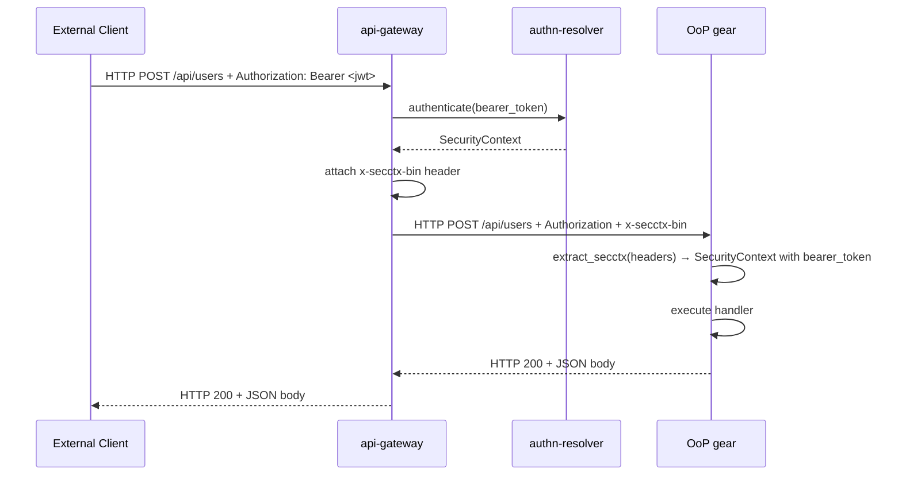
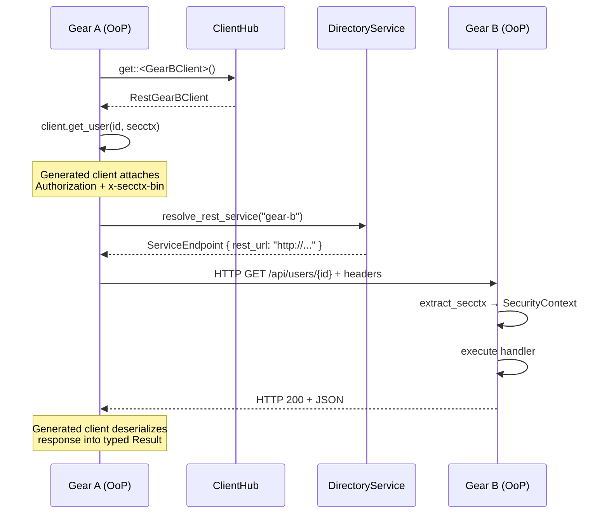
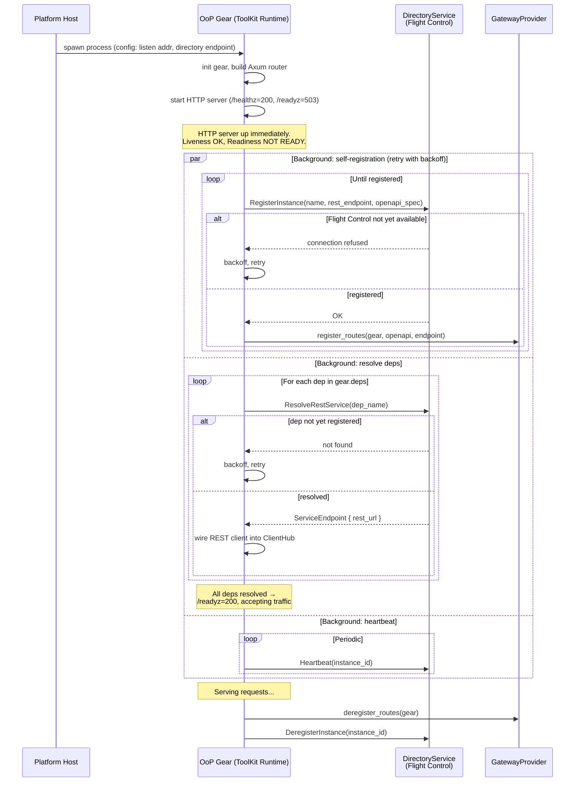
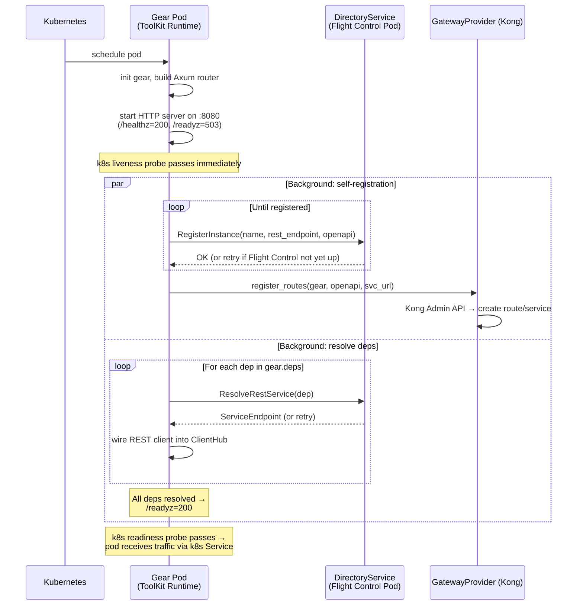
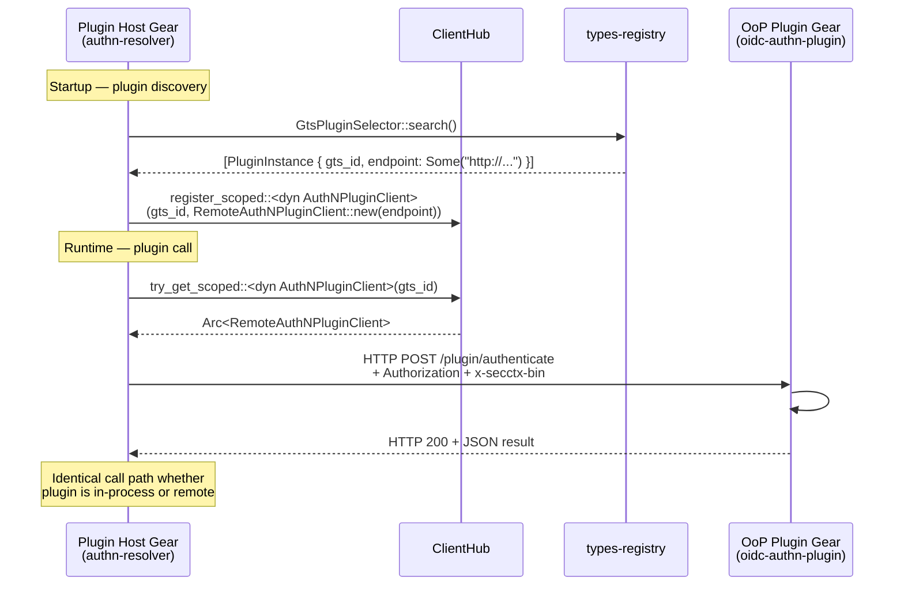
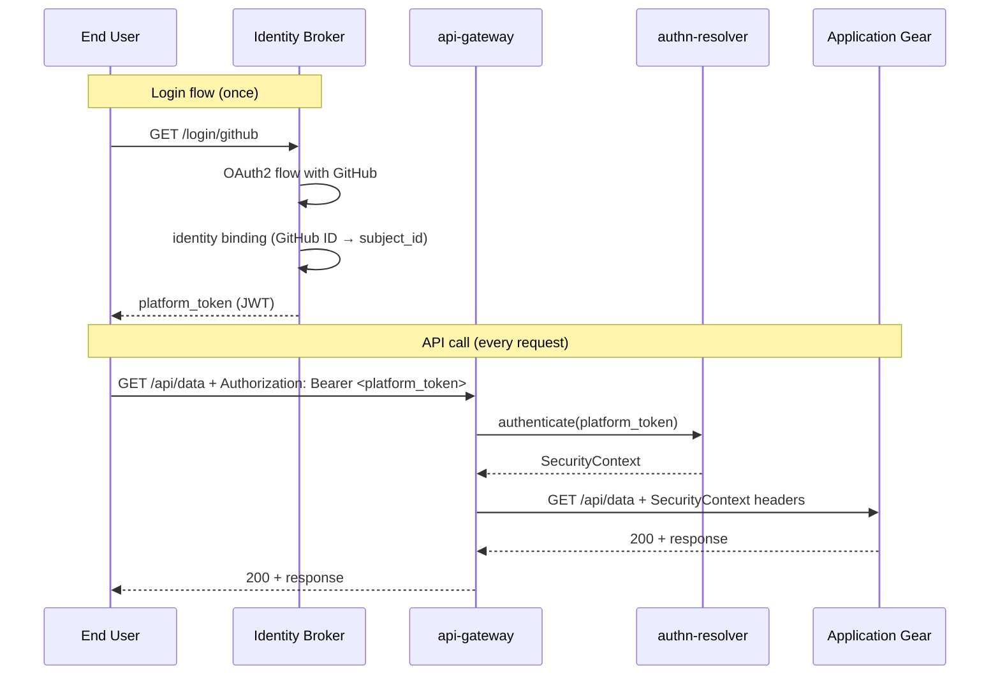
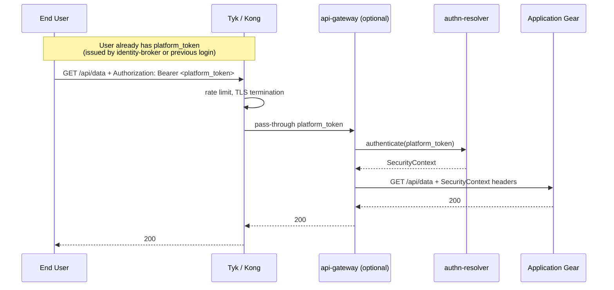
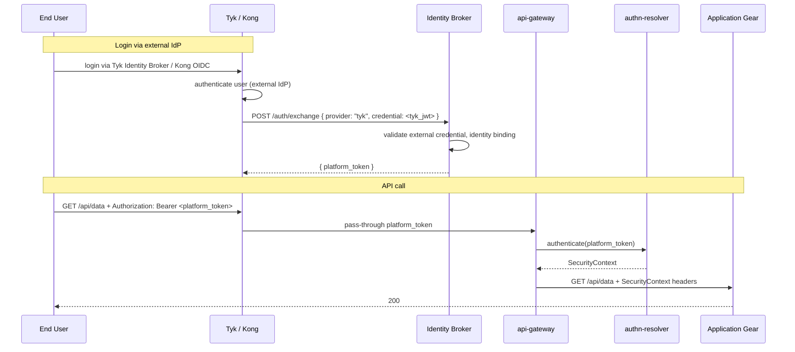

# Technical Design — ToolKit Distributed Gears

<!--
=============================================================================
TECHNICAL DESIGN DOCUMENT
=============================================================================
PURPOSE: Define HOW the system is built — architecture, components, APIs,
data models, and technical decisions that realize the requirements.

STANDARDS ALIGNMENT:

- IEEE 1016-2009 (Software Design Description)
- IEEE 42010 (Architecture Description — viewpoints, views, concerns)
- ISO/IEC 15288 / 12207 (Architecture & Design Definition processes)
  =============================================================================
  -->

- [ ] `p1` - **ID**: `cpt-cf-design-cyber-flight-control`

## Table of Contents

<!-- generated by `cypilot toc` -->

## 1. Architecture Overview

### 1.1 Architectural Vision

This design extends the ToolKit gear system to support out-of-process deployment. The core principle is **deployment
transparency**: the same Rust trait, OperationBuilder routes, and ClientHub wiring work across all three deployment
profiles without source changes. The **Flight Control** system gear manages the Platform Host process — orchestrating
OoP gear lifecycle, discovery coordination, and gateway registration. The architecture is built on four pillars:

1. **OoP gears run their own HTTP server** using the same ToolKit middleware stack (OperationBuilder, error handling,
   OpenAPI generation) as in-process gears. The gear's `register_rest()` builds routes on a local Axum router
   regardless of where the process runs.

2. **REST clients are generated from OpenAPI specs** at build time. SDK crates include a `build.rs` that reads the
   gear's `openapi.json` and emits a `RestXxxClient` implementing the SDK trait. The generated client uses
   `toolkit-http` for transport and propagates SecurityContext automatically.

3. **A gateway abstraction** routes public APIs regardless of the backing implementation. On-premise, the built-in
   `ToolKitGatewayProvider` adds reverse-proxy routes to `api-gateway`. In Kubernetes, a `KongGatewayProvider` (or
   similar) registers routes via the gateway's admin API or CRDs.

4. **SecurityContext propagates across process boundaries** via two HTTP headers: the original JWT in `Authorization`
   and the pre-parsed context in `x-secctx-bin`. Auth validation happens exactly once at the gateway edge.

### 1.2 Architecture Drivers

#### Functional Drivers

| Requirement                        | Design Response                                                                                                                                                                          |
|------------------------------------|------------------------------------------------------------------------------------------------------------------------------------------------------------------------------------------|
| `cpt-cf-fr-developer-transparency` | Same `register_rest()` / OperationBuilder code produces a local Axum router in all profiles. OoP bootstrap wraps it in an HTTP server; embedded bootstrap wires it into the host router. |
| `cpt-cf-fr-client-transparency`    | ClientHub returns in-process impl or generated `RestXxxClient` based on DirectoryService resolution. Callers use the same SDK trait.                                                     |
| `cpt-cf-fr-rest-primary`           | Each OoP gear runs Axum with full ToolKit middleware. No gRPC bridge or transcoding layer.                                                                                              |
| `cpt-cf-fr-direct-communication`   | Generated REST clients resolve target endpoints via DirectoryService (or k8s DNS) and call directly. Gateway is not in the inter-gear path.                                            |
| `cpt-cf-fr-secctx-propagation`     | `toolkit-http` middleware attaches `Authorization` + `x-secctx-bin` headers. OoP gear middleware reconstructs SecurityContext.                                                          |
| `cpt-cf-fr-gateway-registration`   | OoP bootstrap calls `GatewayProvider::register_routes()` after HTTP server starts.                                                                                                       |
| `cpt-cf-fr-gateway-abstraction`    | `GatewayProvider` trait with `ToolKitGatewayProvider` as first implementation.                                                                                                            |
| `cpt-cf-fr-rest-client-gen`        | `build.rs` codegen from `openapi.json` produces `RestXxxClient` structs.                                                                                                                 |
| `cpt-cf-fr-k8s-native`             | K8s profile uses k8s DNS for discovery. DirectoryService is optional. GatewayProvider handles external gateway registration.                                                             |

#### NFR Allocation

| NFR ID                            | NFR Summary                  | Allocated To                                               | Design Response                                                                           | Verification Approach                                            |
|-----------------------------------|------------------------------|------------------------------------------------------------|-------------------------------------------------------------------------------------------|------------------------------------------------------------------|
| `cpt-cf-nfr-oop-latency`          | OoP call overhead < 5 ms p95 | `toolkit-http`, OoP HTTP server                             | Connection pooling in `toolkit-http`; Axum's zero-copy routing; UDS transport on same-host | Automated benchmark: 1000 echo requests, measure p95             |
| `cpt-cf-nfr-no-double-auth`       | JWT validated once at edge   | `api-gateway` authn middleware, `x-secctx-bin` propagation | Gateway runs `authn-resolver`; OoP gears trust the propagated SecurityContext           | Integration test: count `authn-resolver` calls per request chain |
| `cpt-cf-nfr-graceful-degradation` | Unavailable OoP → 503        | Generated REST client, `toolkit-http`                       | `toolkit-http` timeout + connection error → mapped to 503 Problem response                 | Integration test: stop target, assert 503                        |

#### Key ADRs

| ADR ID                              | Decision Summary                                                                                       |
|-------------------------------------|--------------------------------------------------------------------------------------------------------|
| `cpt-cf-adr-deployment-profiles`    | Three named deployment profiles (Embedded, Host+Workers, K8s Native) instead of arbitrary combinations |
| `cpt-cf-adr-auth-edge-only`         | JWT validation at gateway edge only; OoP gears trust SecurityContext                                 |
| `cpt-cf-adr-rest-first-oop`         | REST as primary OoP protocol; each gear runs its own HTTP server                                     |
| `cpt-cf-adr-rest-client-generation` | Build-time REST client generation from OpenAPI specs                                                   |
| `cpt-cf-adr-gateway-abstraction`    | GatewayProvider trait abstracts built-in and external gateways                                         |

### 1.3 Architecture Layers

```
┌───────────────────────────────────────────────────────────────┐
│                     External Clients                          │
└──────────────────────────┬────────────────────────────────────┘
                           │ HTTPS + JWT
                           ▼
┌───────────────────────────────────────────────────────────────┐
│  Gateway Layer  (api-gateway / Kong / Tyk / Envoy)            │
│  - TLS termination (optional)                                 │
│  - JWT validation → SecurityContext                           │
│  - Route to target gear (reverse-proxy or k8s Service)        │
└──────────────────────────┬────────────────────────────────────┘
                           │ HTTP + Authorization + x-secctx-bin
                           ▼
┌───────────────────────────────────────────────────────────────┐
│  Gear HTTP Layer  (per-gear Axum server)                      │
│  - SecurityContext reconstruction from headers                │
│  - OperationBuilder routes                                    │
│  - OpenAPI serving                                            │
└──────────────────────────┬────────────────────────────────────┘
                           │ In-process calls
                           ▼
┌───────────────────────────────────────────────────────────────┐
│  Gear Domain Layer  (business logic)                          │
│  - Same code for in-proc and OoP                              │
│  - Uses ClientHub to call other gears                         │
└──────────────────────────┬────────────────────────────────────┘
                           │ ClientHub → REST client or in-proc
                           ▼
┌───────────────────────────────────────────────────────────────┐
│  Transport Layer                                              │
│  - toolkit-http (REST clients, connection pooling, retry)     │
│  - tonic (optional gRPC for perf-critical paths)              │
│  - UDS / TCP / k8s DNS resolution                             │
└───────────────────────────────────────────────────────────────┘
```

- [ ] `p1` - **ID**: `cpt-cf-tech-layers`

| Layer                 | Responsibility                                                                  | Technology                                                      |
|-----------------------|---------------------------------------------------------------------------------|-----------------------------------------------------------------|
| Edge (§ 3.10)         | Edge mode selection: Embedded (Mode A) or External (Mode B) gateway + identity  | api-gateway, identity-broker, GatewayProvider adapters          |
| Gateway               | TLS termination, JWT auth, public API routing                                   | Axum (built-in) / Kong / Tyk / Envoy                            |
| Gear HTTP           | Per-gear HTTP server, SecurityContext reconstruction, OperationBuilder routes | Axum, Tower middleware                                          |
| Gear Domain         | Business logic, ClientHub calls, plugin resolution via scoped ClientHub         | Pure Rust, ToolKit traits                                        |
| Plugin Transport (P2) | Generated remote plugin clients + server endpoints from `#[toolkit::plugin]`     | toolkit-http / tonic, proc-macro codegen                         |
| Transport             | HTTP client, connection management, SecurityContext header injection            | toolkit-http (reqwest + Tower), tonic (gRPC)                     |
| Discovery             | Service endpoint resolution, plugin endpoint resolution                         | DirectoryService (gRPC) / Kubernetes DNS / types-registry (GTS) |

## 2. Principles & Constraints

### 2.1 Design Principles

#### Deployment Transparency

- [ ] `p1` - **ID**: `cpt-cf-principle-deploy-transparency`

Gear code MUST be agnostic to the deployment profile. The framework (bootstrap, ClientHub wiring, gateway
registration) handles all topology differences. Gear developers never import profile-specific code.

**ADRs**: `cpt-cf-adr-deployment-profiles`

#### REST-First Communication

- [ ] `p1` - **ID**: `cpt-cf-principle-rest-first`

REST is the default and primary protocol for OoP gear APIs. gRPC is available as an opt-in for performance-critical
internal paths but MUST NOT be required for standard gear communication.

**ADRs**: `cpt-cf-adr-rest-first-oop`

#### Auth at the Edge

- [ ] `p1` - **ID**: `cpt-cf-principle-auth-edge`

Authentication (JWT validation) happens exactly once at the network edge. All downstream gears trust the
SecurityContext propagated via headers from the gateway or the calling gear.

**ADRs**: `cpt-cf-adr-auth-edge-only`

#### Minimal Abstraction Surface

- [ ] `p2` - **ID**: `cpt-cf-principle-minimal-abstraction`

Abstractions (GatewayProvider, REST codegen) expose the smallest viable trait surface. New implementations (Kong, Tyk)
should require implementing 2-3 methods, not dozens.

**ADRs**: `cpt-cf-adr-gateway-abstraction`

#### Gateway Minimal

- [ ] `p1` - **ID**: `cpt-cf-principle-gateway-minimal`

The built-in api-gateway handles HTTP edge basics only: routing, CORS, rate limiting, auth delegation, SecurityContext
propagation. It MUST NOT implement login orchestration, social provider integration, token issuance, or advanced API
management features. Login boundary is a separate subsystem (identity broker).

**ADRs**: `cpt-cf-adr-edge-architecture`

#### Vendor-Independent Internal Contract

- [ ] `p1` - **ID**: `cpt-cf-principle-vendor-independent-contract`

`SecurityContext` is the canonical internal identity representation. No Tyk/Kong/GitHub/Keycloak-specific claims may
appear in the SecurityContext or be required by any internal gear. External identity providers integrate via the
identity broker, which maps external identities into platform-internal tokens before they reach the auth pipeline.

**ADRs**: `cpt-cf-adr-edge-architecture`, `cpt-cf-adr-auth-edge-only`

### 2.2 Constraints

#### Backward Compatibility with Embedded Profile

- [ ] `p1` - **ID**: `cpt-cf-constraint-backward-compat`

All changes MUST preserve the existing Embedded profile (Profile 1) behavior. Existing gears that do not opt into OoP
MUST continue to work without modification.

**ADRs**: `cpt-cf-adr-deployment-profiles`

#### SecurityContext Serialization Constraint

- [ ] `p1` - **ID**: `cpt-cf-constraint-secctx-serde`

The `bearer_token` field on SecurityContext is `#[serde(skip)]` and MUST NOT be included in the `x-secctx-bin` payload.
The original token MUST be carried separately in the `Authorization` header. The receiving side reconstructs the full
SecurityContext by merging both.

**ADRs**: `cpt-cf-adr-auth-edge-only`

## 3. Technical Architecture

### 3.1 Domain Model

**Technology**: Rust structs

**Core Entities**:

| Entity                   | Description                                                                                       |
|--------------------------|---------------------------------------------------------------------------------------------------|
| DeploymentProfile        | Enum: `Embedded`, `HostWorkers`, `K8sNative`. Determines bootstrap behavior.                      |
| OopWorkerConfig          | Configuration for an OoP gear: gear list, listen address, DirectoryService endpoint, profile. |
| ServiceEndpoint          | Extended with `rest_url` field. Represents a discovered gear's HTTP endpoint.                   |
| RegisterInstanceInfo     | Extended with `rest_endpoint` and `openapi_spec` fields for REST service registration.            |
| GatewayRouteRegistration | Struct carrying gear name, OpenAPI spec, and target endpoint for gateway registration.          |
| SecurityContextHeaders   | Helper struct encapsulating the two-header propagation (Authorization + x-secctx-bin).            |

### 3.2 Component Model

```
┌────────────────────────────────────────────────────────────────┐
│                       Platform Host                            │
│  ┌──────────────┐  ┌──────────────┐  ┌────────────────────┐    │
│  │  gear-       │  │  grpc-hub    │  │  api-gateway       │    │
│  │  orchestrator│  │              │  │  (GatewayProvider) │    │
│  │  (Directory  │  │              │  │                    │    │
│  │   Service)   │  │              │  │                    │    │
│  └──────┬───────┘  └──────────────┘  └─────────┬──────────┘    │
│         │  gRPC                         reverse-proxy          │
│         │                                       │              │
│  ┌──────┴───────────────────────────────────────┴──────────┐   │
│  │              Embedded Gears (Profile 1)                 │   │
│  │         (wired directly into host Axum router)          │   │
│  └─────────────────────────────────────────────────────────┘   │
└─────────┬──────────────────────────────────────┬───────────────┘
          │ UDS / TCP                            │ UDS / TCP
          ▼                                      ▼
┌──────────────────┐                  ┌──────────────────┐
│   OoP gear A     │                  │   OoP gear B     │
│  ┌────────────┐  │                  │  ┌────────────┐  │
│  │ Gear X     │  │                  │  │ Gear Y     │  │
│  │ (Axum HTTP)│  │                  │  │ (Axum HTTP)│  │
│  └────────────┘  │                  │  └────────────┘  │
└──────────────────┘                  └──────────────────┘
```

#### OoP Bootstrap

- [ ] `p1` - **ID**: `cpt-cf-component-oop-bootstrap`

##### Why this component exists

Provides the entry point for running a gear as an OoP gear. Bridges the gap between a standard ToolKit gear and a
standalone HTTP-serving process.

##### Current state

The existing implementation (`libs/toolkit/src/bootstrap/oop.rs`, `OopRunOptions` / `run_oop_with_options`) already
handles:

- Configuration loading and merging (master-rendered config via `TOOLKIT_MODULE_CONFIG` env var, merged with local config
  field-by-field for DB, key-by-key for logging).
- Logging initialization with OpenTelemetry support (tracing config from master).
- gRPC connection to DirectoryService (via `DirectoryGrpcClient::connect`).
- Heartbeat loop using a child `CancellationToken`.
- Gear lifecycle execution via `run(RunOptions { ... })`.
- Graceful shutdown driven by a root `CancellationToken` hooked to OS signals.

The host side (`libs/toolkit/src/runtime/host_runtime.rs`, `run_oop_spawn_phase`) spawns OoP processes using
`OopBackend.spawn(OopSpawnConfig)` after grpc-hub is ready, passing `TOOLKIT_DIRECTORY_ENDPOINT` and
`TOOLKIT_MODULE_CONFIG` env vars.

What is **missing** and needs to be added:

- Starting an Axum HTTP server from the gear's OperationBuilder routes.
- Framework-managed `/healthz` (liveness) and `/readyz` (readiness) probe endpoints.
- Background self-registration with Flight Control (DirectoryService) — retry with exponential backoff, re-register on
  connection loss.
- Background dependency resolution — poll DirectoryService for each `deps` entry, wire REST clients into ClientHub as
  they become available, gate readiness on all critical deps resolved.
- Registering REST endpoint and OpenAPI spec with DirectoryService (currently only `grpc_services` are registered via
  `RegisterInstanceInfo`).
- SecurityContext reconstruction middleware on the HTTP server.
- Deregistration from DirectoryService on shutdown (the doc comment says it happens, but the code does not call
  `deregister_instance` after `run()` returns).
- GatewayProvider integration (register/deregister public routes).

##### Responsibility scope

- Start an Axum HTTP server from the gear's OperationBuilder routes.
- **Provide `/healthz` and `/readyz` probe endpoints** (framework-level, not gear code):
    - `/healthz` → `200` as soon as HTTP server is listening (process alive).
    - `/readyz` → `503` with unresolved deps list until all `deps` are resolved AND every registered custom check
      returns `Ready`; then `200`.
    - **Probes MAY be exposed on a separate bind address** via `probe_bind_addr` config (default: same as main
      HTTP server). Operators typically route `/healthz`, `/readyz`, `/metrics` to a sidecar port that is NOT
      mapped through the k8s Service so external traffic cannot reach them.
- **Custom readiness checks**: gears MAY register additional checks via the runtime API:

    ```rust
    ctx.runtime().register_readiness_check("cache_warm", Arc::new(MyCacheCheck));
    ctx.runtime().register_readiness_check("indexer_bootstrapped", Arc::new(MyIndexerCheck));

    #[async_trait]
    pub trait ReadinessCheck: Send + Sync {
        async fn check(&self) -> CheckResult; // Ready / NotReady { reason } / Degraded { reason }
    }
    ```

    Registered checks are evaluated on every `/readyz` request (cached for 1s to avoid storm). `NotReady` from any
    check forces `/readyz → 503` and lists the failing check name + reason. `Degraded` is reported in the JSON body
    but still returns `200` — distinguishes "can serve traffic but with reduced functionality" from "can't serve
    traffic at all" (Spring Boot-style health groups).
- **Background self-registration** with Flight Control (DirectoryService):
    - Retry `RegisterInstance()` with exponential backoff (100ms → 200ms → ... → 30s cap).
    - Re-register on connection loss or Flight Control restart.
    - Gear does not block on registration — HTTP server is up and serving probes immediately.
- **Background dependency resolution** from `deps` metadata:
    - For each dep: poll `DirectoryService.ResolveRestService(dep)`.
    - On resolved: generate/wire REST client into ClientHub.
    - When all critical deps resolved: set readiness = true.
    - In Profile 1: no-op (topo-sort guarantees deps are already in-process).
- Register the gear's REST endpoint and OpenAPI spec with DirectoryService.
- **Initialize `InternalCredential`** from configuration (bootstrap token from env, SA token from projected volume) and
  attach to all system-level outgoing calls automatically.
- **Install `InternalAuthMiddleware`** on the HTTP server to validate incoming system calls.
- Attach SecurityContext reconstruction middleware to the HTTP server.
- Send heartbeats to DirectoryService (already implemented).
- Deregister from DirectoryService on graceful shutdown.
- Call GatewayProvider to register/deregister public routes.

##### Drain order on graceful shutdown

When `SIGTERM` arrives, the OoP runtime executes a drain sequence that respects inter-gear dependencies. The rule
mirrors `HostRuntime`'s in-process behavior (`libs/toolkit/src/runtime/host_runtime.rs` — reverse-topo STOP phase),
extended for the cross-process case:

1. **Readiness flip** — set `/readyz` to `503` immediately so kubernetes / gateway upstream pulls the instance out of
   the load-balancer pool. Do NOT close the HTTP listener yet — in-flight requests must finish.
2. **Stop accepting new work** — refuse new requests with `503 Service Unavailable + Retry-After`. Background tasks
   (queue consumers, schedulers) stop pulling new work but keep processing what they hold.
3. **Drain in-flight requests** — wait up to `drain_timeout` (config, default 30s) for active handlers to complete.
   Track them via the existing `tower::limit::ConcurrencyLimitLayer` counter (or an explicit `Arc<AtomicUsize>` if the
   handler stack does not provide one).
4. **Deregister from DirectoryService** — this informs *consumer* gears that the instance is going away, so they
   stop routing new traffic to it. Only after the local drain has completed so consumers don't have stale "ready"
   state.
5. **Reverse-dependency wait** — if `Gear A` declares `deps = ["B"]`, B MUST drain *after* A. Within a single
   process this is the in-process `HostRuntime` topo order; across processes it relies on (4) — the orchestrator /
   k8s preStop hook is responsible for ordering pod termination via dependency-aware shutdown, NOT via simultaneous
   `SIGTERM` blasts.
6. **Stop runtime services** — heartbeat task, registration retry task, internal-auth refresh task.
7. **Close HTTP listener and exit.**

In Profile 1 (in-process), steps 1-3 are no-ops (no LB to flip); the reverse-topo STOP loop in `HostRuntime` handles
ordering directly. In Profile 2/3 the orchestrator (Platform Host or k8s controller) MUST issue `SIGTERM`s in
reverse-dependency order; this is documented as an operator requirement, not enforced by ToolKit runtime.

##### Responsibility boundaries

- Does NOT validate JWTs (that is the gateway's job).
- Does NOT manage gear business logic (delegates to the Gear trait).
- Does NOT implement service discovery (delegates to DirectoryService).
- Does NOT require gear developers to write any retry, probe, registration, or internal auth code — all handled by the
  runtime.

##### Related components (by ID)

- `cpt-cf-component-directory-rest` — calls to register/resolve REST endpoints
- `cpt-cf-component-gateway-provider` — calls to register/deregister public routes
- `cpt-cf-component-secctx-http` — uses SecurityContext HTTP middleware
- `cpt-cf-component-internal-auth` — initializes internal credential, attaches to system calls
- `cpt-cf-component-edge-architecture` — edge mode determines how api-gateway is deployed and used

#### DirectoryService REST Extension

- [ ] `p1` - **ID**: `cpt-cf-component-directory-rest`

##### Why this component exists

The existing DirectoryService and DirectoryClient lack REST endpoint awareness. OoP gears need to register their HTTP
endpoints, and callers need to resolve them.

##### Current state

The existing `DirectoryClient` trait (`libs/system-sdks/sdks/directory/src/api.rs`) defines:

- `resolve_grpc_service(service_name) -> Result<ServiceEndpoint>` — gRPC only
- `register_instance(RegisterInstanceInfo) -> Result<()>` — registration
- `deregister_instance(gear, instance_id) -> Result<()>` — deregistration
- `send_heartbeat(gear, instance_id) -> Result<()>` — health

`RegisterInstanceInfo` currently has:

- `gear: String`, `instance_id: String`, `version: Option<String>`
- `grpc_services: Vec<(String, ServiceEndpoint)>` — **gRPC services only, no REST**

`ServiceEndpoint` has `uri: String` with constructors for `http()`, `https()`, `uds()`.

##### Responsibility scope

- Extend `RegisterInstanceInfo` with `rest_endpoint: Option<ServiceEndpoint>` (the gear's HTTP base URL) and
  `openapi_spec: Option<String>` (the gear's OpenAPI JSON).
- Add `resolve_rest_service(gear_name) -> Result<ServiceEndpoint>` to the `DirectoryClient` trait for REST URL
  resolution.
- Store and serve per-gear OpenAPI specs for aggregation by api-gateway.

##### Responsibility boundaries

- Does NOT perform HTTP proxying (that is the gateway's job).
- Does NOT generate REST clients (that is the codegen's job).

##### Related components (by ID)

- `cpt-cf-component-oop-bootstrap` — OoP gears call this to register
- `cpt-cf-component-rest-client-gen` — codegen may query this at runtime for endpoint resolution
- `cpt-cf-component-gateway-provider` — gateway queries this for available gears

#### GatewayProvider

- [ ] `p1` - **ID**: `cpt-cf-component-gateway-provider`

##### Why this component exists

Decouples route registration from the specific gateway implementation. On-premise uses the built-in api-gateway; k8s
uses external gateways (Kong, Tyk, Envoy).

##### Current state

The existing `api-gateway` gear (`gears/system/api-gateway/src/gear.rs`) implements:

- `ApiGatewayCapability` trait (`rest_prepare` / `rest_finalize`) which directly wires in-process gear routes into the
  shared Axum router.
- `OpenApiRegistry` trait for collecting `OperationSpec` entries and building OpenAPI docs.
- Auth middleware that validates JWT via `AuthNResolverClient` and inserts `SecurityContext` into request extensions.
- An HTTP server (`serve` lifecycle method) that binds to a socket and serves the finalized router.
- The `OperationSpec` already has `is_public: bool` which can drive which routes are registered in the gateway for
  external access.

**No reverse-proxy capability exists.** All routes are served directly from the shared in-process router. For OoP
gears, the gateway needs to reverse-proxy requests to remote OoP gears.

##### Responsibility scope

- Define the `GatewayProvider` trait using typed inputs so call sites cannot accidentally swap arguments and the
  compiler enforces well-formed values:

  ```rust
  /// Logical name of the gear providing the routes (must match
  /// `#[toolkit::gear(name = "...")]`).
  #[derive(Debug, Clone, PartialEq, Eq, Hash)]
  pub struct GearName(String);

  /// The OpenAPI 3.1 spec as a self-describing blob — either a borrowed
  /// `&utoipa::openapi::OpenApi` or a pre-serialized `Bytes` body. The
  /// provider decides which form it prefers to consume.
  pub enum OpenApiSpec<'a> {
      Owned(Box<utoipa::openapi::OpenApi>),
      Borrowed(&'a utoipa::openapi::OpenApi),
      SerializedJson(bytes::Bytes),
  }

  /// Network endpoint where the gear's HTTP server is reachable.
  /// Constructed via `Endpoint::parse(uri)` which validates the shape.
  #[derive(Debug, Clone)]
  pub struct Endpoint { scheme: Scheme, authority: http::uri::Authority }

  #[async_trait]
  pub trait GatewayProvider: Send + Sync {
      async fn register_routes(
          &self,
          gear: &GearName,
          spec: OpenApiSpec<'_>,
          endpoint: &Endpoint,
      ) -> Result<(), GatewayError>;

      async fn deregister_routes(&self, gear: &GearName) -> Result<(), GatewayError>;
  }
  ```

  Rationale: three `&str` arguments make `register_routes(spec, name, endpoint)` and similar argument swaps a
  compile-time pass. With typed wrappers the compiler rejects the misuse, the error type is explicit instead of an
  opaque `anyhow::Error`, and the `OpenApiSpec` enum lets callers choose serialization without forcing every
  implementation to re-parse a string.
- Provide `ToolKitGatewayProvider`: parses the OpenAPI spec to extract public route paths (where
  `OperationSpec.is_public == true`), adds reverse-proxy routes to the built-in api-gateway using
  `toolkit-http::HttpClient` to forward requests to OoP gears. Must propagate SecurityContext headers (
  `Authorization` + `x-secctx-bin`) on the proxied request.
- Future: `KongGatewayProvider`, `TykGatewayProvider`.

##### Responsibility boundaries

- Does NOT serve HTTP traffic (the gateway itself does that).
- Does NOT decide which routes are public (the gear declares that via `OperationSpec.is_public`).

##### Related components (by ID)

- `cpt-cf-component-oop-bootstrap` — calls `register_routes` / `deregister_routes`
- `cpt-cf-component-directory-rest` — may query for gear endpoints

#### REST Client Codegen

- [ ] `p1` - **ID**: `cpt-cf-component-rest-client-gen`

##### Why this component exists

Eliminates hand-written HTTP boilerplate for calling OoP gears. Ensures type-safe, always-in-sync clients that follow
ToolKit conventions (SecurityContext propagation, Problem error mapping).

##### Current state (implemented — `libs/toolkit-contract*`)

The codegen is **trait-first**, not `openapi.json`-first. The SDK author declares one Rust trait; three proc-macros
(`#[toolkit::contract]`, `#[toolkit::rest_contract]`, `#[toolkit::grpc_contract]`) derive the wire-level surface from it.
`openapi.json` is a *consumer-facing artifact* published by the server gear, NOT an input to the consumer's codegen.

Pipeline:

1. **Trait declaration** (in `<gear>-sdk/src/contract.rs`):

   ```rust
   #[toolkit::contract(gear = "payments", version = "v1")]
   pub trait PaymentApi: Send + Sync {
       #[idempotency(NonIdempotentWrite)]
       async fn charge(&self, ctx: SecurityContext, req: ChargeRequest)
           -> Result<ChargeResponse, CanonicalError>;

       #[idempotency(SafeRead)]
       #[streaming]
       fn list_payments(&self, ctx: SecurityContext, filter: ListPaymentsFilter)
           -> Result<PaymentSummary, CanonicalError>;
   }
   ```

   `#[contract]` emits a `payment_api_ir()` constructor returning `ContractIr` — the transport-neutral IR every
   downstream macro consumes. SecurityContext-typed parameters are flagged with `FieldRole::SecurityContext` in the IR
   so transport projections skip them.

2. **REST projection** (in `<gear>-sdk/src/rest.rs`):

   ```rust
   #[toolkit::rest_contract(base_path = "/api/payments/v1")]
   pub trait PaymentApiRest: PaymentApi {
       #[post("/charge")]                       async fn charge(...);
       #[get("/invoices/{invoice_id}")]         async fn get_invoice(...);
       #[get("/payments")] #[streaming]         fn list_payments(...);
   }
   ```

   `#[rest_contract]` emits:
   - The cleaned projection trait (HTTP attributes stripped, methods default-delegate to the base trait).
   - A `payment_api_rest_http_binding() -> HttpBindingIr` for IR validation.
   - A `PaymentApiRestClient` struct (gated on `rest-client` feature) implementing the base trait — each method body is
     a `toolkit-http::HttpClient` call with percent-encoded path/query, JSON body, retry-aware idempotency, SSE handling
     for `#[streaming]`, and `TransportError → CanonicalError` mapping via the canonical-errors bridge.
   - Constructor `Self::new(ClientConfig) -> Result<Self, HttpError>` (fallible — see ADR for FIPS/TLS rationale).

3. **gRPC projection** (in `<gear>-sdk/src/grpc.rs`):

   ```rust
   #[toolkit::grpc_contract(package = "payments.v1", stubs_module = "crate::grpc::stubs")]
   pub trait PaymentApiGrpc: PaymentApi { /* ... */ }
   ```

   `#[grpc_contract]` emits binding IR plus `PaymentApiGrpcClient` (gated on `grpc-client`). The `.proto` file is
   produced by `toolkit-contract-protogen` from the same `ContractIr` plus schemars-derived schemas; a TOML lockfile
   (`proto.lock.toml`) guarantees stable field numbers across regenerations.

4. **Server-side**: hand-written tonic server impl + axum `OperationBuilder` handlers; both call into the same domain
   service. `RestApiCapability::register_rest` wires the OperationBuilder routes; `try_from_proto` (fallible variant of
   the proto bridge) is used on the server to avoid remote-DoS via malformed `via_string` fields.

5. **Consumer wiring**: `ctx.client_hub().register::<dyn PaymentApi>(client)` registers whichever transport variant the
   deployment profile chose (in-process, REST, or gRPC). Consumers depend only on `<gear>-sdk` and the trait — they
   never see transport types.

##### Responsibility scope

- `toolkit-contract` (lib): transport-neutral IR (`ContractIr`, `HttpBindingIr`, `GrpcBindingIr`), runtime helpers
  (`http::dispatch`, `runtime::client`, `runtime::sse`, `runtime::retry`, `runtime::transport_error`,
  `policy::PolicyStack`, `canonical` bridge), and IR validation (`validate_contract`, `validate_http_binding`).
- `toolkit-contract-macros` (proc-macro): `#[contract]`, `#[rest_contract]`, `#[grpc_contract]`, `#[derive(ProtoBridge)]`,
  `#[derive(ContractError)]`.
- `toolkit-contract-protogen`: `generate_proto_file(contract_ir, grpc_binding, schemas, lockfile)` — produces `.proto`
  from the IR + JSON-schemas, with TOML lockfile for wire-stable field numbers.
- `cargo xtask proto-regen [--check]`: bulk-regenerate `.proto` files across all workspace SDK crates; the `--check`
  mode fails CI if regen produces drift against committed files.

##### Responsibility boundaries

- The codegen pipeline does NOT consume `openapi.json` — the Rust trait is the single source of truth. The published
  `openapi.json` is an *output* for non-Rust consumers (web frontends, third-party integrators); Rust consumers depend
  on the SDK crate directly and pick up the typed client through `#[rest_contract]`/`#[grpc_contract]` expansion.
- Does NOT decide which client implementation ClientHub returns — the gear's `init` picks the transport
  (in-process / REST / gRPC) based on `ApiContractsConfig.remote_endpoints` / `remote_grpc_endpoints`, then registers
  the chosen `Arc<dyn FooApi>` in ClientHub.
- Does NOT replace `OperationBuilder` — server-side handler registration still goes through `OperationBuilder` so the
  OpenAPI spec, auth posture, license features, and `standard_errors` envelope flow through one path.

##### Related components (by ID)

- `cpt-cf-component-oop-bootstrap` — wires the generated client into ClientHub
- `cpt-cf-component-secctx-http` — generated clients use SecurityContext propagation helpers
- `cpt-cf-component-directory-rest` — generated clients resolve target endpoints

#### SecurityContext HTTP Propagation

- [ ] `p1` - **ID**: `cpt-cf-component-secctx-http`

##### Why this component exists

SecurityContext must cross process boundaries with the original bearer token intact. The existing `#[serde(skip)]` on
`bearer_token` means standard serialization loses it.

##### Current state

- `SecurityContext` (`libs/toolkit-security/src/context.rs`) uses `SecretString` (from `secrecy` crate) for
  `bearer_token`, with `#[serde(skip)]`.
- `toolkit-security/src/bin_codec.rs` already provides `encode_bin(ctx) -> Vec<u8>` and
  `decode_bin(bytes) -> SecurityContext` using postcard with a version byte prefix (`SECCTX_BIN_VERSION = 1`). Since
  postcard respects serde attributes, `bearer_token` is excluded from the binary encoding.
- `toolkit-transport-grpc` already provides `attach_secctx(meta, ctx)` and `extract_secctx(meta)` for gRPC binary
  metadata using the key `"x-secctx-bin"`. This works because gRPC binary metadata (keys ending in `-bin`) carries raw
  bytes.
- For HTTP, raw binary cannot be used in headers — base64 encoding is required.
- `toolkit-http` (`libs/toolkit-http/src/security.rs`) currently contains only `ERROR_BODY_PREVIEW_LIMIT` — no
  SecurityContext propagation helpers.
- The `api-gateway` auth middleware (`authn_middleware`) validates the JWT and inserts SecurityContext into Axum
  extensions, but does NOT propagate SecurityContext or the original token to downstream calls.

##### Responsibility scope

- Define the two-header HTTP propagation contract:
    - `Authorization: Bearer <original_jwt>` — carries the original token.
    - `x-secctx-bin: <base64(encode_bin(SecurityContext))>` — carries the binary-encoded context (version byte +
      postcard, base64-wrapped for HTTP header transport). `bearer_token` is excluded by `#[serde(skip)]`.
- Provide `attach_secctx_http(request, secctx)` — adds both headers to an outgoing HTTP request. Extracts the bearer
  token from `secctx.bearer_token()` (which returns `Option<&SecretString>`), calls `toolkit_security::encode_bin()` for
  the context body, and base64-encodes it.
- Provide `extract_secctx_http(headers) -> Result<SecurityContext>` — base64-decodes the `x-secctx-bin` header, calls
  `toolkit_security::decode_bin()`, then merges the bearer token from the `Authorization` header to reconstruct the full
  SecurityContext.
- Provide Axum middleware (`secctx_middleware`) that runs `extract_secctx_http` and inserts the result into request
  extensions.

##### Responsibility boundaries

- Does NOT validate the JWT (the gateway already did that).
- Does NOT decide whether to propagate (callers decide by including SecurityContext in the call context).

##### Related components (by ID)

- `cpt-cf-component-oop-bootstrap` — installs the Axum middleware
- `cpt-cf-component-rest-client-gen` — generated clients call `attach_secctx_http`

#### Internal Gear Authentication

- [ ] `p1` - **ID**: `cpt-cf-component-internal-auth`

##### Why this component exists

ADR-0002 covers user-initiated traffic (JWT → SecurityContext). But system-level calls — registration with
DirectoryService, heartbeats, background inter-gear calls — have no user context. Without authentication, any process
that can reach DirectoryService can register as a gear or deregister others.

##### Current state

No internal authentication exists. The OoP bootstrap connects to DirectoryService via gRPC without any credential. In
Profile 1 (Embedded), this is not a problem (same process). In Profiles 2 and 3, it is an open attack surface.

##### Design

The component provides a profile-specific credential abstraction:

```rust
pub enum InternalCredential {
    /// Profile 1: no auth needed (in-process)
    None,
    /// Profile 2 single-node: ephemeral random token from Platform Host
    BootstrapToken(SecretString),
    /// Profile 3: k8s ServiceAccount JWT (auto-mounted, auto-rotated)
    KubeServiceAccountToken { token_path: PathBuf, audience: String },
    /// Profile 2 multi-node (P2): mTLS client certificate
    MtlsIdentity { cert: PathBuf, key: PathBuf, ca: PathBuf },
}
```

**Profile 2 (single-node)** — Bootstrap Token:

1. Platform Host generates a cryptographically random 256-bit token at startup (in-memory only).
2. Passes it to spawned workers via `TOOLKIT_INTERNAL_TOKEN` env var.
3. Workers attach it to all system calls: gRPC metadata `x-toolkit-internal-token`, HTTP header
   `X-ToolKit-Internal-Token`.
4. Flight Control validates: known token → accept; unknown → `UNAUTHENTICATED`.

**Profile 3 (K8s)** — ServiceAccount Tokens:

1. Each gear pod has a projected SA token with audience `toolkit-internal` (auto-mounted by kubelet).
2. Gear reads the token from the projected volume at startup and on rotation.
3. Attaches it to system calls as `Authorization: Bearer <sa-token>`.
4. Flight Control validates via k8s TokenReview API (cached, configurable TTL).
5. Response includes gear identity: `{namespace, serviceAccountName, podName}`.

**Dual-layer requests**: a single request may carry both SecurityContext (user identity) and internal credential (gear
identity). They serve different purposes and travel in different headers.

| Call type                            | Auth layer          | Header                                                    |
|--------------------------------------|---------------------|-----------------------------------------------------------|
| User-propagated (gear → gear)    | SecurityContext     | `Authorization` + `x-secctx-bin`                          |
| System (gear → Flight Control)     | Internal credential | `x-toolkit-internal-token` or `Authorization: Bearer <sa>` |
| Both (system call on behalf of user) | Both layers         | All headers present                                       |

###### Validation order (mandatory)

The receiving gear's middleware MUST validate the two auth layers in this strict order, rejecting the request before
the next step on any failure:

1. **Internal credential first** — `InternalAuthMiddleware` validates `x-toolkit-internal-token` /
   `Authorization: Bearer <sa>`. On failure: respond `401 Unauthenticated` and do NOT inspect any other auth header.
2. **SecurityContext second** — only after internal auth establishes that the caller is a trusted ToolKit peer, the
   `secctx_middleware` MAY decode `x-secctx-bin` and install it on the request extension. On failure: respond
   `401 Unauthenticated`.

The order is hard-required because `x-secctx-bin` is a deserialization of caller-supplied bytes; trusting it before the
peer is authenticated would let any TCP-reachable process forge arbitrary `SecurityContext` values (`subject_id`,
`roles`, tenant). The reverse order is a documented anti-pattern.

##### Responsibility scope

- Define the `InternalCredential` enum and `attach_internal_auth` / `validate_internal_auth` helpers.
- Profile 2: generate bootstrap token in Platform Host, pass via env, validate in Flight Control.
- Profile 3: read projected SA token, attach to calls, validate via TokenReview in Flight Control.
- Provide `InternalAuthMiddleware` for both gRPC (tonic interceptor) and HTTP (Axum middleware) that validates incoming
  system calls.
- All logic lives in ToolKit runtime — gear developers do not interact with internal auth.

##### Responsibility boundaries

- Does NOT replace SecurityContext propagation (ADR-0002) — those are complementary layers.
- Does NOT manage k8s ServiceAccount creation (that's the Helm chart / operator's job).
- Does NOT implement mTLS (P2 scope for multi-node Profile 2).

##### Related components (by ID)

- `cpt-cf-component-oop-bootstrap` — initializes `InternalCredential` at startup, attaches to all system calls
- `cpt-cf-component-secctx-http` — coexists on the same requests (different headers, different purpose)
- `cpt-cf-component-k8s-packaging` — Helm charts configure SA token projection and `TOOLKIT_INTERNAL_TOKEN` env

#### Plugin Transport Abstraction (P2)

- [ ] `p2` - **ID**: `cpt-cf-component-plugin-transport`

##### Why this component exists

Plugins (authn-resolver plugins, authz-resolver plugins, mini-chat policy/audit plugins) currently work only in-process:
the plugin gear registers `Arc<dyn PluginTrait>` on ClientHub scoped by GTS instance ID, and the host gear resolves
it via `try_get_scoped`. When a plugin runs OoP, there is no mechanism to bridge the plugin trait across the process
boundary.

##### Current state

The existing plugin pattern (uniform across authn-resolver, authz-resolver, mini-chat):

1. **SDK crate** defines a plugin trait (e.g., `AuthNResolverPluginClient`) and a GTS spec type (e.g.,
   `AuthNResolverPluginSpecV1`).
2. **Plugin gear** registers itself with types-registry via `BaseToolkitPluginV1<SpecV1>` (vendor, priority,
   properties) and registers `Arc<dyn PluginTrait>` on ClientHub via
   `register_scoped(ClientScope::gts_id(&instance_id), ...)`.
3. **Host gear** discovers plugins via `GtsPluginSelector` + `choose_plugin_instance` (filter by vendor, select by
   lowest priority) and resolves the trait from ClientHub via `try_get_scoped::<dyn PluginTrait>(gts_id)`.

This is entirely in-process. Plugins are standard ToolKit gears (`#[toolkit::gear(...)]`) with no special macro
support.

##### Design: Path C — Hybrid Transport Abstraction

The approach makes ClientHub scoped resolution transport-transparent:

```
┌──────────────────────────┐     ┌──────────────────────────┐
│   Plugin Host Gear       │     │   OoP Plugin Gear        │
│   (authn-resolver)       │     │   (oidc-authn-plugin)    │
│                          │     │                          │
│  try_get_scoped::<       │     │  #[toolkit::plugin]      │
│    dyn AuthNPlugin       │     │  impl AuthNPluginClient  │
│  >(gts_id)               │     │    for OidcPlugin { .. } │
│       │                  │     │                          │
│       ▼                  │     │  Serves plugin trait as  │
│  RemoteAuthNPlugin       │     │  REST/gRPC endpoints     │
│  (generated client)      │     │                          │
│       │                  │     │  Registers:              │
│       │  HTTP + secctx   │     │  - types-registry (GTS)  │
│       └──────────────────┼────►│  - DirectoryService      │
│                          │     │    (plugin endpoint)     │
└──────────────────────────┘     └──────────────────────────┘
```

Key design decisions:

1. **`#[toolkit::plugin(trait = AuthNResolverPluginClient)]` macro** generates:
    - **Server side**: REST (or gRPC) endpoints for each trait method. Plugin author implements the trait; the macro
      wraps it with HTTP handlers.
    - **Client side**: `RemoteAuthNResolverPluginClient` struct implementing `AuthNResolverPluginClient` that calls the
      remote endpoints via `toolkit-http`, with SecurityContext propagation.
    - **Wiring**: `wire_plugin_client(hub, gts_id, endpoint)` that registers the remote client on ClientHub scoped.

2. **Discovery remains unchanged**: plugins register in types-registry with `BaseToolkitPluginV1` as today. The GTS
   instance record gains an optional `endpoint` field indicating the plugin's REST/gRPC URL. When present, the bootstrap
   wires the remote client; when absent, the in-process `Arc<dyn Trait>` is used.

3. **Host gear code is unchanged**: `GtsPluginSelector` + `try_get_scoped` works identically — it gets either an
   in-process impl or a remote client, both implementing the same trait.

4. **Transport choice**: REST by default (consistent with ToolKit's REST-first principle for OoP). gRPC opt-in for
   latency-sensitive plugin traits (e.g., authz evaluation in the hot path).

##### Responsibility scope

- Define the `#[toolkit::plugin]` proc-macro that generates server endpoints and remote client from a plugin trait.
- Extend the OoP bootstrap to detect plugin gears (vs. regular gears) and register plugin endpoints with
  DirectoryService.
- Extend `BaseToolkitPluginV1` GTS record with an optional `endpoint` field for remote plugins.
- Provide wiring logic that registers remote plugin clients on ClientHub scoped when the plugin is OoP.

##### Responsibility boundaries

- Does NOT change the types-registry or GTS discovery pattern.
- Does NOT change how host gears resolve plugins (same `try_get_scoped` call).
- Does NOT require host gears to know whether a plugin is in-process or remote.

##### Related components (by ID)

- `cpt-cf-component-oop-bootstrap` — extended to handle plugin gears
- `cpt-cf-component-secctx-http` — remote plugin clients propagate SecurityContext
- `cpt-cf-component-directory-rest` — plugin endpoints registered here
- `cpt-cf-component-rest-client-gen` — plugin codegen reuses the same transport patterns

### 3.3 API Contracts

#### OoP gear HTTP API

- [ ] `p1` - **ID**: `cpt-cf-interface-oop-http`

- **Contracts**: Each gear's REST API as defined by its OperationBuilder routes
- **Technology**: REST/OpenAPI 3.x
- **Location**: Per-gear, generated by OperationBuilder + utoipa

**Standard Endpoints (all OoP gears, provided by ToolKit runtime)**:

| Method | Path               | Description                                  | Response                                                             | Stability |
|--------|--------------------|----------------------------------------------|----------------------------------------------------------------------|-----------|
| `GET`  | `/healthz`         | Liveness probe — process alive               | `200` always (once HTTP server up)                                   | stable    |
| `GET`  | `/readyz`          | Readiness probe — deps resolved              | `200` when all `deps` resolved; `503` with unresolved list otherwise | stable    |
| `GET`  | `/openapi.json`    | Gear's OpenAPI spec                        | `200` + JSON                                                         | stable    |
| `*`    | `/{gear-routes}` | Gear-specific routes from OperationBuilder | per-gear                                                           |

#### DirectoryService gRPC Extensions

- [ ] `p1` - **ID**: `cpt-cf-interface-directory-grpc`

- **Technology**: gRPC (tonic)
- **Location**: `libs/system-sdks/sdks/directory/`

**New RPC methods**:

| Method               | Request                           | Response                            | Description                                  |
|----------------------|-----------------------------------|-------------------------------------|----------------------------------------------|
| `RegisterInstance`   | `RegisterInstanceInfo` (extended) | `RegisterResult`                    | Register gear with REST endpoint + OpenAPI |
| `ResolveRestService` | `ResolveRequest { gear_name }`  | `ServiceEndpoint` (with `rest_url`) | Resolve a gear's REST base URL             |
| `GetOpenApiSpec`     | `SpecRequest { gear_name }`     | `SpecResponse { openapi_json }`     | Retrieve a gear's OpenAPI spec             |

#### GatewayProvider Trait

- [ ] `p1` - **ID**: `cpt-cf-interface-gateway-trait`

- **Technology**: Rust async trait
- **Location**: `libs/toolkit/src/gateway/`

```rust
#[async_trait]
pub trait GatewayProvider: Send + Sync {
    /// Register a gear's public routes in the gateway.
    /// `openapi` is the gear's OpenAPI JSON spec.
    /// `endpoint` is the gear's HTTP base URL.
    async fn register_routes(
        &self,
        gear: &str,
        openapi: &str,
        endpoint: &str,
    ) -> Result<()>;

    /// Remove a gear's routes from the gateway.
    async fn deregister_routes(&self, gear: &str) -> Result<()>;

    /// Check if the gateway is healthy and accepting registrations.
    async fn health_check(&self) -> Result<()>;
}
```

### 3.4 Internal Dependencies

| Dependency Gear     | Interface Used                   | Purpose                                                |
|-----------------------|----------------------------------|--------------------------------------------------------|
| gear-orchestrator   | DirectoryClient SDK              | Service registration and discovery for OoP gears     |
| grpc-hub              | gRPC server hosting              | Hosts DirectoryService gRPC endpoint                   |
| api-gateway           | ToolKitGatewayProvider (internal) | Reverse-proxy routes for OoP gear public APIs        |
| authn-resolver        | AuthNResolverClient SDK          | JWT validation at gateway edge                         |
| toolkit-http           | HttpClient                       | Transport for generated REST clients and gateway proxy |
| toolkit-security       | SecurityContext                  | Auth context propagation                               |
| toolkit-transport-grpc | gRPC metadata helpers            | SecurityContext gRPC propagation (existing)            |

### 3.5 External Dependencies

#### Kubernetes API

- **Contract**: `cpt-cf-contract-k8s-discovery`

| Dependency     | Interface Used                            | Purpose                                 |
|----------------|-------------------------------------------|-----------------------------------------|
| Kubernetes DNS | `{service}.{namespace}.svc.cluster.local` | Service discovery in K8s Native profile |
| Kubernetes API | Deployment + Service manifests            | Gear deployment lifecycle             |

#### External API Gateways

- **Contract**: `cpt-cf-contract-external-gw-admin`

| Dependency | Interface Used         | Purpose                                  |
|------------|------------------------|------------------------------------------|
| Kong       | Kong Admin API (REST)  | Route registration in K8s Native profile |
| Tyk        | Tyk Gateway API (REST) | Route registration (alternative to Kong) |

### 3.6 Interactions & Sequences

#### External Request → OoP Gear (On-Premise)

**ID**: `cpt-cf-seq-external-request-onprem`

**Use cases**: `cpt-cf-usecase-deploy-oop-onprem`

**Actors**: `cpt-cf-actor-platform-host`, `cpt-cf-actor-oop-worker`



**Description**: An external request enters through api-gateway, which validates the JWT via authn-resolver, serializes
the SecurityContext into headers, and reverse-proxies to the target OoP gear. The worker reconstructs SecurityContext
and executes the handler.

#### Inter-Gear Call (OoP → OoP)

**ID**: `cpt-cf-seq-intergear-oop`

**Use cases**: `cpt-cf-usecase-intergear-oop`

**Actors**: `cpt-cf-actor-oop-worker`



**Description**: Gear A obtains a generated REST client from ClientHub, which resolves Gear B's endpoint via
DirectoryService. The generated client handles serialization, SecurityContext propagation, and response deserialization
transparently.

#### OoP gear Startup (On-Premise)

**ID**: `cpt-cf-seq-oop-startup`

**Use cases**: `cpt-cf-usecase-deploy-oop-onprem`

**Actors**: `cpt-cf-actor-platform-host`, `cpt-cf-actor-oop-worker`



**Description**: The Platform Host spawns an OoP gear. The ToolKit runtime starts the HTTP server immediately (liveness
OK), then runs three background tasks managed entirely by the runtime: (1) self-registration with Flight Control via
retry with exponential backoff, (2) dependency resolution by polling DirectoryService for each `deps` entry and wiring
REST clients into ClientHub as they appear, (3) heartbeat. Readiness becomes OK only when all deps are resolved. Gear
code does not participate in any of this — the developer only declares `deps` in the macro.

#### OoP gear Startup (K8s)

**ID**: `cpt-cf-seq-oop-startup-k8s`

**Use cases**: `cpt-cf-usecase-deploy-k8s`

**Actors**: `cpt-cf-actor-oop-worker`, `cpt-cf-actor-external-gw`



**Description**: In K8s, the pod starts its HTTP server immediately — liveness probe passes, but readiness probe returns
503 until all `deps` are resolved. The ToolKit runtime handles self-registration with Flight Control and dependency
resolution in the background. K8s DNS provides base service discovery; DirectoryService adds gear metadata (REST
endpoints, OpenAPI specs). The pod starts receiving traffic only after readiness passes. No init containers, no
deployment ordering — all pods can be scheduled simultaneously.

#### OoP Plugin Call (P2)

**ID**: `cpt-cf-seq-oop-plugin-call`

**Use cases**: `cpt-cf-fr-plugin-transparency`

**Actors**: `cpt-cf-actor-oop-worker`



**Description**: The plugin host gear discovers plugins via types-registry (GTS). For OoP plugins, the GTS instance
record contains an `endpoint` field. The bootstrap wires a generated remote client (`RemoteAuthNPluginClient`) into
ClientHub scoped by GTS instance ID. At runtime, `try_get_scoped` returns the remote client, which is indistinguishable
from an in-process implementation — the host gear code is unchanged.

### 3.7 Database schemas & tables

No new database tables. The Flight Control gear uses DirectoryService (gRPC, in-memory registry) for service discovery
state. Persistent state (if needed for multi-host P2) will be addressed in a future ADR.

### 3.8 Deployment Topology

- [ ] `p1` - **ID**: `cpt-cf-topology-profiles`

#### Profile 1: Embedded

```
┌──────────────────────────────────────────┐
│            Single Process                │
│  ┌─────────────┐  ┌──────────────┐       │
│  │ api-gateway  │  │ gear-orch   │       │
│  └──────┬──────┘  └──────────────┘       │
│         │                                │
│  ┌──────┴──────────────────────────┐     │
│  │     Gear A   Gear B   ...       │     │
│  │     (in-process Axum routes)    │     │
│  └─────────────────────────────────┘     │
└──────────────────────────────────────────┘
```

- All gears in one process. Current behavior, unchanged.
- No network calls between gears.
- api-gateway serves all routes directly from the shared Axum router.

#### Profile 2: Host + Workers (On-Premise)

```
┌──────────────────────────────┐
│       Platform Host          │
│  ┌───────────┐ ┌───────────┐ │
│  │api-gateway│ │gear-orch  │ │
│  │(reverse   │ │(Directory │ │
│  │ proxy)    │ │ Service)  │ │
│  └─────┬─────┘ └───────────┘ │
│        │                     │
│  ┌─────┴─────┐  (embedded)   │
│  │ Gear A    │               │
│  └───────────┘               │
└────────┬──────────────┬──────┘
   UDS/TCP│              │UDS/TCP
         ▼              ▼
┌────────────┐  ┌────────────┐
│ OoP gear   │  │ OoP gear   │
│ Gear B     │  │ Gear C     │
│ (Axum HTTP)│  │ (Axum HTTP)│
└────────────┘  └────────────┘
```

- Platform Host runs system gears and optionally some application gears.
- OoP gears are separate processes on the same host (UDS) or remote hosts (TCP, P2: mTLS).
- api-gateway reverse-proxies public OoP routes via `ToolKitGatewayProvider`.
- DirectoryService tracks all gear endpoints.

#### Profile 3: K8s Native

```
┌─────────────────────────────────────────────────────┐
│                  Kubernetes Cluster                 │
│                                                     │
│  ┌──────────────┐   ┌──────────────┐                │
│  │ External GW  │   │ Platform     │                │
│  │ (Kong/Tyk)   │   │ Services Pod │                │
│  │              │   │ - gear-orch  │                │
│  │              │   │ - grpc-hub   │                │
│  │              │   │ - types-reg  │                │
│  └───────┬──────┘   └──────────────┘                │
│          │                                          │
│    ┌─────┴──────┬────────────┐                      │
│    ▼            ▼            ▼                      │
│ ┌─────────┐ ┌─────────┐ ┌─────────┐                 │
│ │Gear A   │ │Gear B   │ │Gear C   │                 │
│ │  Pod    │ │  Pod    │ │  Pod    │                 │
│ │(Service)│ │(Service)│ │(Service)│                 │
│ └─────────┘ └─────────┘ └─────────┘                 │
│                                                     │
│  Discovery: k8s DNS ({gear}.{ns}.svc.cluster.local) │
└─────────────────────────────────────────────────────┘
```

- Each gear is an independent k8s Deployment + Service.
- External gateway (Kong, Tyk, Envoy) handles public API ingress.
- k8s DNS provides service discovery; DirectoryService is optional for metadata.
- Platform services (orchestrator, types-registry) run as separate pods.
- No built-in api-gateway in this profile.

### 3.9 K8s Packaging (Helm Charts)

- [ ] `p1` - **ID**: `cpt-cf-component-k8s-packaging`

#### Directory Layout

```
deploy/
  helm/
    toolkit-common/                    # Library chart (type: library)
      Chart.yaml
      templates/
        _helpers.tpl                  # Labels, names, selectors
        _deployment.tpl               # Standard ToolKit Deployment
        _service.tpl                  # ClusterIP Service
        _configmap.tpl                # Gear config as ConfigMap
        _ingress.tpl                  # Optional Ingress resource
        _hpa.tpl                      # Optional HorizontalPodAutoscaler
        _pdb.tpl                      # Optional PodDisruptionBudget
        _networkpolicy.tpl            # Optional NetworkPolicy
        _serviceaccount.tpl           # Optional ServiceAccount
    toolkit-platform/                  # Umbrella chart (type: application)
      Chart.yaml                      # Dependencies: all gear charts (conditional)
      values.yaml                     # Global defaults
      values-minimal.yaml             # Flight Control + api-gateway + authn-resolver
      values-production.yaml          # All gears, resource limits, HPA, PDB
      values-dev.yaml                 # All gears, minimal resources, debug logging
      templates/
        NOTES.txt                     # Post-install instructions

gears/<group>/<name>/
  chart/
    Chart.yaml                        # type: application, depends on toolkit-common
    values.yaml                       # Gear-specific defaults
    values.schema.json                # JSON Schema for values validation
    templates/
      deployment.yaml                 # {{ include "toolkit-common.deployment" . }}
      service.yaml                    # {{ include "toolkit-common.service" . }}
      configmap.yaml                  # {{ include "toolkit-common.configmap" . }}
      ingress.yaml                    # {{ include "toolkit-common.ingress" . }}
      _gear-specific.yaml           # Any gear-specific resources (CRDs, Jobs, etc.)
```

#### Library Chart — `toolkit-common`

All ToolKit gears share the same process structure: an HTTP server on a configurable port, `/healthz` and `/readyz`
probe endpoints (provided by ToolKit runtime), optional gRPC port, config via `TOOLKIT_MODULE_CONFIG` env var, and Flight
Control's `TOOLKIT_DIRECTORY_ENDPOINT` for service registration. The `toolkit-common` library chart codifies these
conventions into reusable named templates.

**Standard Deployment template** provisions:

| Aspect             | Library chart handles                                                     | Overridable via `values.yaml`                     |
|--------------------|---------------------------------------------------------------------------|---------------------------------------------------|
| Container image    | `image.registry/image.repository:image.tag` pattern                       | `image.registry`, `image.repository`, `image.tag` |
| HTTP port          | Named `http` port on container and Service                                | `service.port` (default: `8080`)                  |
| gRPC port          | Conditional named `grpc` port                                             | `grpc.enabled`, `grpc.port` (default: `50051`)    |
| Health probes      | `/healthz` (liveness), `/readyz` (readiness) — provided by ToolKit runtime | `health.liveness.*`, `health.readiness.*`         |
| Gear config      | `TOOLKIT_MODULE_CONFIG` from ConfigMap                                     | `gearConfig` (arbitrary map → JSON)             |
| Directory endpoint | `TOOLKIT_DIRECTORY_ENDPOINT` env var                                       | `global.directoryEndpoint`                        |
| Internal auth      | Projected SA token volume (audience: `toolkit-internal`) for Profile 3     | `internalAuth.audience`, `internalAuth.tokenPath` |
| Resources          | requests/limits block                                                     | `resources.requests.*`, `resources.limits.*`      |
| Labels             | `app.kubernetes.io/*` standard labels                                     | Automatic from chart metadata                     |
| Image pull secrets | Global pull secrets for private registries                                | `global.imagePullSecrets`                         |

#### Umbrella Chart — `toolkit-platform`

The umbrella chart declares all gear charts as conditional dependencies:

```yaml
# deploy/helm/toolkit-platform/Chart.yaml
dependencies:
  - name: flight-control
    version: "0.1.x"
    repository: "file://../../gears/system/flight-control/chart"
    condition: flight-control.enabled
  - name: api-gateway
    version: "0.1.x"
    repository: "file://../../gears/system/api-gateway/chart"
    condition: api-gateway.enabled
  # ... per gear
```

**Preset values files** provide tested combinations:

| Preset                   | Enabled gears                             | Resources        | Autoscaling | Use case                   |
|--------------------------|---------------------------------------------|------------------|-------------|----------------------------|
| `values-minimal.yaml`    | flight-control, api-gateway, authn-resolver | Low              | Off         | Quick start, CI, demo      |
| `values-production.yaml` | All                                         | Tuned per gear | HPA + PDB   | Production deployment      |
| `values-dev.yaml`        | All                                         | Minimal          | Off         | Local k8s (minikube, kind) |

**User installation**:

```bash
# Minimal platform
helm install my-platform oci://ghcr.io/cyberfabric/charts/toolkit-platform \
  -f values-minimal.yaml

# Custom overrides
helm install my-platform oci://ghcr.io/cyberfabric/charts/toolkit-platform \
  --set global.imageRegistry=my-registry.corp.com \
  --set mini-chat.enabled=true \
  --set mini-chat.replicaCount=3

# Single gear standalone
helm install mini-chat oci://ghcr.io/cyberfabric/charts/mini-chat \
  --set global.directoryEndpoint=dns:///flight-control.default.svc:50051
```

#### Gear Chart `values.yaml` Conventions

Every gear chart follows this `values.yaml` structure:

```yaml
replicaCount: 1

image:
  registry: ghcr.io/cyberfabric    # overridable by global.imageRegistry
  repository: <gear-name>
  tag: ""                           # defaults to .Chart.AppVersion

service:
  type: ClusterIP
  port: 8080

grpc:
  enabled: false
  port: 50051

health:
  liveness:
    initialDelaySeconds: 5
    periodSeconds: 10
  readiness:
    initialDelaySeconds: 3
    periodSeconds: 5

resources:
  requests:
    cpu: 100m
    memory: 128Mi
  limits:
    cpu: 500m
    memory: 512Mi

gearConfig: { }                    # passed as JSON to TOOLKIT_MODULE_CONFIG

ingress:
  enabled: false
  className: ""
  annotations: { }
  hosts: [ ]
  tls: [ ]

autoscaling:
  enabled: false
  minReplicas: 1
  maxReplicas: 5
  targetCPUUtilization: 80

podDisruptionBudget:
  enabled: false
  minAvailable: 1

networkPolicy:
  enabled: false

serviceAccount:
  create: true
  name: ""
  annotations: { }
```

Every parameter is documented with `# --` comment annotations (compatible with `helm-docs` for auto-generated README).

#### CI/CD Pipeline

```
chart change detected
  → helm dependency build (resolve toolkit-common)
  → helm lint
  → helm template (dry-run render)
  → helm package → push to OCI registry (ghcr.io/cyberfabric/charts/<name>)
```

Published charts include the resolved `toolkit-common` library, so users install from the OCI registry without needing
the monorepo.

### 3.10 Edge Architecture

- [ ] `p1` (Mode A), `p2` (Mode B) - **ID**: `cpt-cf-component-edge-architecture`

#### Edge Modes

The platform supports two edge configurations. Internal gears see the same `SecurityContext` in both — the edge mode
is transparent to application code.

**Mode A — Embedded Edge** (on-prem baseline, P1):

```
┌─────────────────────────────────────────────────────────────┐
│                    Platform (self-contained)                │
│                                                             │
│  External Client                                            │
│       │                                                     │
│       ▼                                                     │
│  ┌──────────────┐    Bearer    ┌───────────────┐            │
│  │  api-gateway  │────────────►│authn-resolver │            │
│  │  (minimal)    │             │  (plugins)    │            │
│  │               │◄────────────│               │            │
│  │  routing      │ SecurityCtx └───────────────┘            │
│  │  CORS         │                                          │
│  │  rate limit   │    ┌───────────────────────┐             │
│  │  auth deleg.  │    │  identity-broker (P2) │             │
│  └───────┬───────┘    │  login flows, social  │             │
│          │            │  token issuance       │             │
│          ▼            └───────────────────────┘             │
│  ┌──────────────┐                                           │
│  │  Gears       │  ← see only SecurityContext               │
│  └──────────────┘                                           │
└─────────────────────────────────────────────────────────────┘
```

**Mode B — External Edge** (enterprise / k8s, P2):

```
  External Client
       │
       ▼
┌───────────────────┐
│  Tyk / Kong /     │  external gateway
│  Envoy / Ingress  │  (TLS, rate limit, IdP integration)
└──────┬────────────┘
       │
       ├── B1: pass-through (platform token already present)
       │
       └── B2: token exchange
           │  POST /auth/exchange { external_credential }
           │       → { platform_token }
           │
       ▼
┌─────────────────────────────────────────────────┐
│                    Platform                     │
│                                                 │
│  ┌───────────────┐         ┌──────────────┐     │
│  │  api-gateway  │────────►│authn-resolver│     │
│  │  (optional in │         │              │     │
│  │   Mode B)     │         └──────────────┘     │
│  └───────┬───────┘                              │
│          ▼                                      │
│  ┌──────────────┐                               │
│  │  Gears       │  ← same SecurityContext as A  │
│  └──────────────┘                               │
└─────────────────────────────────────────────────┘
```

#### Component Boundaries

| Concern                                                          | Component                           | Scope                                          |
|------------------------------------------------------------------|-------------------------------------|------------------------------------------------|
| HTTP routing, CORS, rate limiting                                | api-gateway                         | Minimal HTTP edge basics                       |
| Bearer extraction, SecurityContext propagation                   | api-gateway (auth middleware)       | Delegates to authn-resolver                    |
| Token validation                                                 | authn-resolver (plugins)            | Platform tokens + configurable trusted issuers |
| Authorization (ABAC/RBAC)                                        | authz-resolver (plugins)            | Policy evaluation                              |
| Login orchestration (OAuth2/OIDC flows, social login, callbacks) | identity-broker (P2, future gear) | Separate from gateway and authn                |
| Identity binding (external ID → `subject_id`)                    | identity-broker (P2)                | External-to-internal identity mapping          |
| Tenant resolution (`subject_id` → `tenant_id`, membership)       | identity-broker (P2)                | Tenant lifecycle                               |
| Platform token issuance                                          | identity-broker (P2)                | Issues tokens that authn-resolver validates    |
| Token exchange (external credential → platform token)            | identity-broker (P2)                | Mode B2 integration endpoint                   |
| External gateway route registration                              | GatewayProvider adapters (ADR-0005) | Kong/Tyk admin API calls                       |

#### api-gateway — Explicit Scope Constraint

The built-in api-gateway handles **HTTP edge basics only**:

| Does                                                        | Does NOT                                                 |
|-------------------------------------------------------------|----------------------------------------------------------|
| HTTP routing (OperationBuilder routes)                      | Login orchestration (OAuth2 callbacks, redirect flows)   |
| CORS configuration                                          | Social provider integration (GitHub, Google, etc.)       |
| Basic rate limiting                                         | Token issuance or signing                                |
| Auth middleware (Bearer → authn-resolver → SecurityContext) | Account linking or user provisioning                     |
| SecurityContext propagation to gears                      | API analytics or usage metering                          |
| OpenAPI aggregation and serving                             | Advanced traffic policies (circuit breaker, canary, A/B) |
| Reverse-proxy to OoP gears (Profile 2)                    | External IdP-specific protocol handling                  |

This constraint is **architectural, not temporary**. The platform is not building a Tyk/Kong competitor.

#### Identity Broker / Login Service (P2)

- [ ] `p2` - **ID**: `cpt-cf-component-identity-broker`

##### Why this component exists

Login orchestration (OAuth2 authorization code flow, PKCE, social login callbacks, account linking, session management)
is a fundamentally different concern from HTTP routing or token validation. Today authn-resolver validates tokens but
does not manage interactive login flows. api-gateway routes traffic but should not orchestrate multi-step auth flows. A
dedicated subsystem is needed.

##### Responsibility scope

- **External auth boundary**: handle login via multiple backends — built-in social login (GitHub, Google),
  Keycloak-backed login, external broker exchange (Tyk Identity Broker, Kong OIDC plugin output).
- **Identity binding**: map external identity (GitHub user ID, OIDC subject) to platform `subject_id`. Handle
  first-login provisioning and account linking.
- **Tenant resolution**: resolve `subject_id` to `tenant_id`, manage tenant membership and invites.
- **Platform credential issuance**: issue platform-internal tokens that authn-resolver can validate. This is the only
  component that creates tokens — api-gateway and authn-resolver do not.
- **Token exchange endpoint** (for Mode B2): accept an externally-authenticated credential (e.g., Tyk-validated JWT) and
  return a platform token. This allows external gateways to integrate without the platform parsing vendor-specific
  claims.

##### Responsibility boundaries

- Does NOT handle HTTP routing (that's api-gateway).
- Does NOT validate tokens on every request (that's authn-resolver).
- Does NOT evaluate authorization policies (that's authz-resolver).
- Does NOT replace external IdPs — it integrates with them.

#### Sequence: Mode A — Embedded Edge (Login + API Call)



#### Sequence: Mode B1 — External Edge, Pass-Through



#### Sequence: Mode B2 — External Edge, Token Exchange



#### The Invariant

Regardless of edge mode, the following is always true:

- `authn-resolver` validates **only** platform tokens (+ explicitly configured trusted issuers)
- Gears receive `SecurityContext` with `subject_id`, `tenant_id`, scopes — **never** raw external provider tokens
- No Tyk/Kong/GitHub-specific claims appear in `SecurityContext`
- Switching from Mode A to Mode B (or vice versa) requires **zero changes** to application gears

## 4. Additional context

### REST Client Generation — Build Flow

The build-time codegen flow for REST clients works as follows:

1. **Gear exports OpenAPI**: During CI or a dedicated build step, the gear's `register_rest()` is called on a mock
   registry that captures routes and generates `openapi.json` via utoipa. The resulting spec is committed to the
   gear's SDK crate (e.g., `sdks/users/openapi.json`).

2. **SDK crate's `build.rs`**: Reads `openapi.json` and generates Rust source:
    - A `RestUsersClient` struct with a `toolkit_http::HttpClient` field.
    - `impl UsersClient for RestUsersClient` — each method maps to an HTTP call.
    - SecurityContext propagation via `attach_secctx()`.
    - Problem Details error mapping from non-2xx responses.
    - A `wire_rest_client(hub: &mut ClientHub, base_url: &str)` helper.

3. **ClientHub wiring**: At startup, the bootstrap layer checks the deployment profile:
    - **Embedded**: wires the in-process implementation directly.
    - **OoP**: resolves the target gear's base URL via DirectoryService and calls `wire_rest_client(hub, base_url)`.

### SecurityContext Reconstruction

The reconstruction function uses the existing `toolkit_security::decode_bin` (which handles the version byte + postcard
deserialization) and merges the bearer token from the `Authorization` header. Note that `bearer_token` is
`Option<SecretString>` (from `secrecy` crate), not a plain `String`.

```rust
use base64::Engine as _;
use toolkit_security::{SecurityContext, decode_bin};
use secrecy::SecretString;

fn extract_secctx_http(headers: &HeaderMap) -> Result<SecurityContext> {
    let secctx_b64 = headers
        .get("x-secctx-bin")
        .ok_or(Error::MissingSecCtx)?
        .to_str()?;
    let secctx_bytes = base64::engine::general_purpose::STANDARD.decode(secctx_b64)?;
    // decode_bin handles version byte check + postcard deserialization
    // bearer_token will be None (excluded by #[serde(skip)])
    let mut secctx: SecurityContext = decode_bin(&secctx_bytes)?;

    // Merge the original bearer token from the Authorization header
    if let Some(auth_header) = headers.get("authorization") {
        let token = auth_header
            .to_str()?
            .strip_prefix("Bearer ")
            .ok_or(Error::InvalidAuthHeader)?;
        secctx.set_bearer_token(SecretString::from(token.to_owned()));
    }

    Ok(secctx)
}

fn attach_secctx_http(request: &mut Request, secctx: &SecurityContext) -> Result<()> {
    // Encode SecurityContext (without bearer_token) to binary
    let bin = toolkit_security::encode_bin(secctx)?;
    let b64 = base64::engine::general_purpose::STANDARD.encode(&bin);
    request.headers_mut().insert("x-secctx-bin", b64.parse()?);

    // Propagate original bearer token in Authorization header
    if let Some(token) = secctx.bearer_token() {
        use secrecy::ExposeSecret;
        let header_val = format!("Bearer {}", token.expose_secret());
        request.headers_mut().insert("authorization", header_val.parse()?);
    }

    Ok(())
}
```

### SecurityContext API Gap

The current `SecurityContext` struct has private fields and exposes `bearer_token()` as a getter only. There is no
`set_bearer_token()` setter — the only way to set it is via `SecurityContextBuilder::bearer_token()` during initial
construction. The reconstruction flow in `extract_secctx_http` needs to merge the bearer token after deserialization.
This requires either:

1. Adding a `pub fn set_bearer_token(&mut self, token: SecretString)` method to `SecurityContext`, or
2. Reconstructing via the builder (deserialize fields individually, then build with bearer_token), which is more
   invasive.

Option 1 is the minimal change. The method should be added to `toolkit-security`.

### Platform Host Composition

The Platform Host process contains at minimum:

| Component                              | Required          | Purpose                                                                        |
|----------------------------------------|-------------------|--------------------------------------------------------------------------------|
| gear-orchestrator (DirectoryService) | Yes               | Service discovery for all profiles                                             |
| grpc-hub                               | Yes               | Hosts gRPC services                                                            |
| api-gateway                            | Profile 1, 2 only | Built-in HTTP gateway; not used in K8s Native                                  |
| types-registry                         | Yes               | Shared type definitions                                                        |
| authn-resolver                         | Profile 1, 2 only | JWT validation (in K8s, this moves to the external gateway or a dedicated pod) |

## 5. Traceability

| PRD Requirement                    | Design Component                                                          | Priority |
|------------------------------------|---------------------------------------------------------------------------|----------|
| `cpt-cf-fr-developer-transparency` | `cpt-cf-component-oop-bootstrap`                                          | P1       |
| `cpt-cf-fr-eventual-readiness`     | `cpt-cf-component-oop-bootstrap`                                          | P1       |
| `cpt-cf-fr-client-transparency`    | `cpt-cf-component-rest-client-gen`, `cpt-cf-component-directory-rest`     | P1       |
| `cpt-cf-fr-rest-primary`           | `cpt-cf-component-oop-bootstrap`                                          | P1       |
| `cpt-cf-fr-direct-communication`   | `cpt-cf-component-directory-rest`, `cpt-cf-component-rest-client-gen`     | P1       |
| `cpt-cf-fr-secctx-propagation`     | `cpt-cf-component-secctx-http`                                            | P1       |
| `cpt-cf-fr-api-visibility`         | `cpt-cf-component-gateway-provider`                                       | P1       |
| `cpt-cf-fr-plugin-transparency`    | `cpt-cf-component-plugin-transport`                                       | P2       |
| `cpt-cf-fr-plugin-macro`           | `cpt-cf-component-plugin-transport`                                       | P2       |
| Profile 3 (K8s Native)             | `cpt-cf-component-k8s-packaging`                                          | P1       |
| `cpt-cf-fr-internal-auth`          | `cpt-cf-component-internal-auth`, `cpt-cf-component-oop-bootstrap`        | P1       |
| `cpt-cf-fr-edge-modes`             | `cpt-cf-component-edge-architecture`, `cpt-cf-component-gateway-provider` | P1/P2    |
| `cpt-cf-fr-gateway-minimal`        | `cpt-cf-component-edge-architecture`                                      | P1       |
| `cpt-cf-fr-identity-broker`        | `cpt-cf-component-identity-broker`                                        | P2       |
| `cpt-cf-fr-token-exchange`         | `cpt-cf-component-identity-broker`                                        | P2       |

- **PRD**: [PRD.md](./PRD.md)
- **ADRs**: [ADR/](./ADR/)
