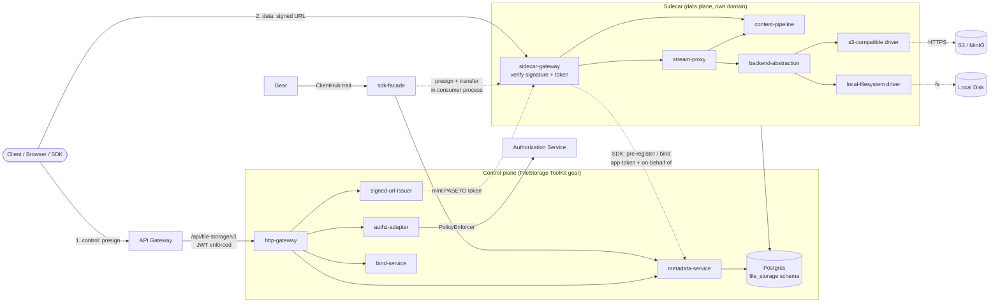
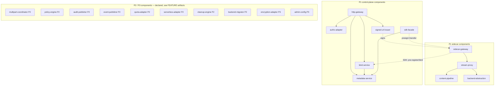
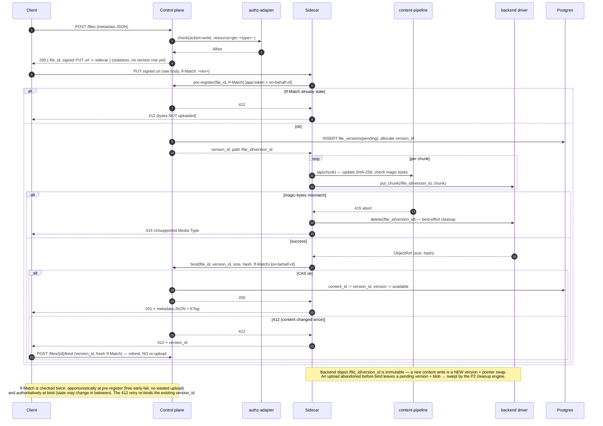
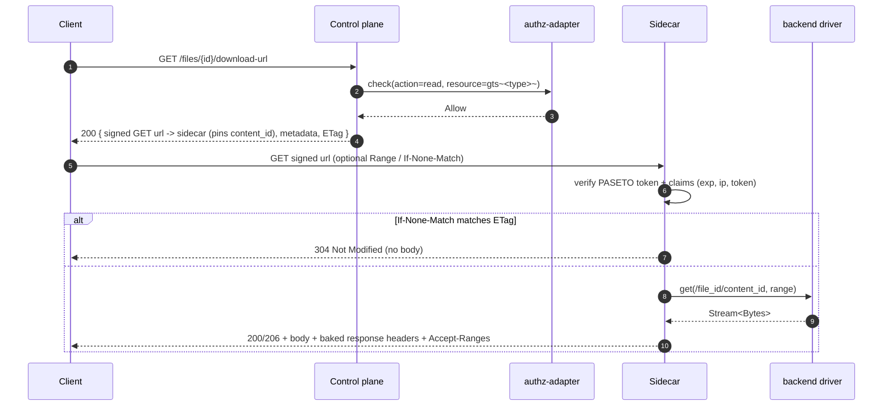
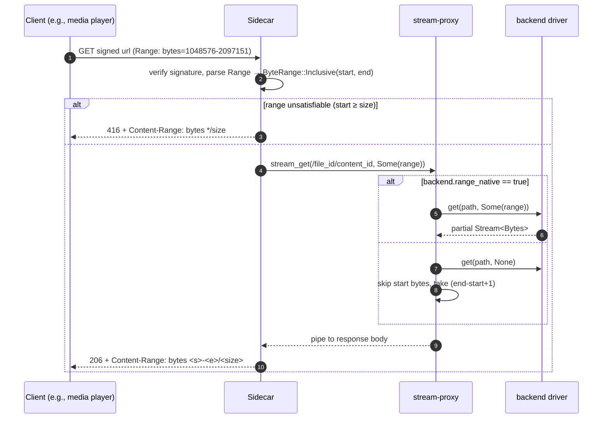
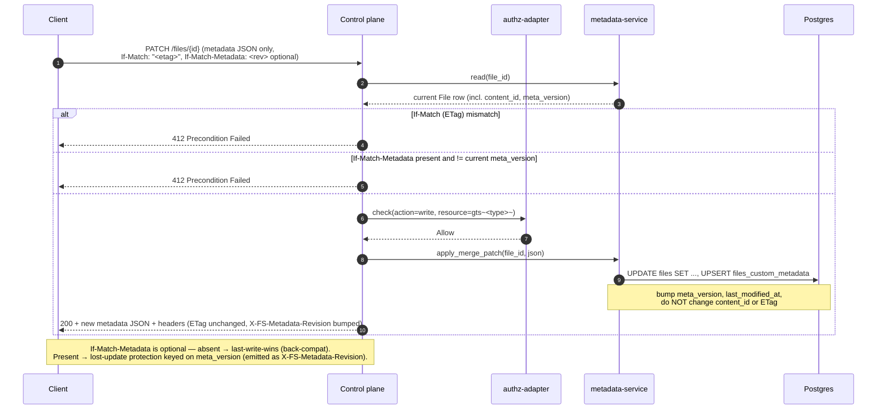
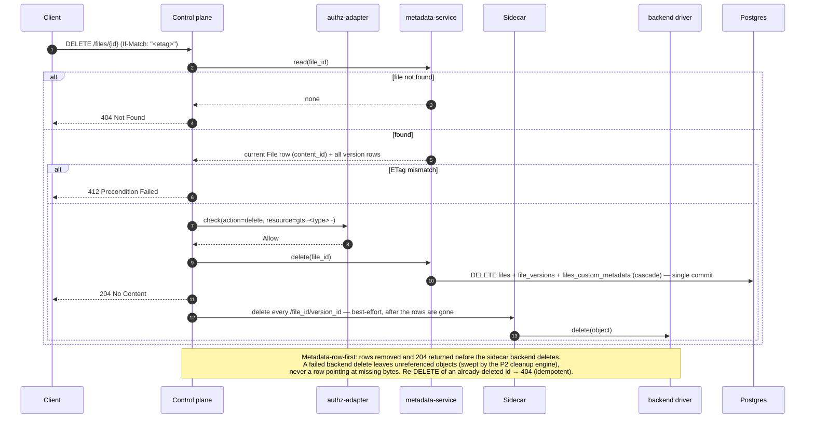
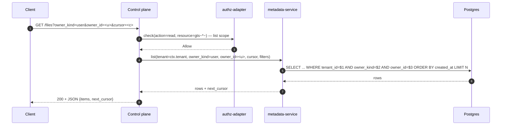

# Technical Design — FileStorage


<!-- toc -->

- [1. Architecture Overview](#1-architecture-overview)
  - [1.1 Architectural Vision](#11-architectural-vision)
  - [1.2 Architecture Drivers](#12-architecture-drivers)
  - [1.3 Architecture Layers](#13-architecture-layers)
- [2. Principles & Constraints](#2-principles--constraints)
  - [2.1 Design Principles](#21-design-principles)
  - [2.2 Constraints](#22-constraints)
- [3. Technical Architecture](#3-technical-architecture)
  - [3.1 Domain Model](#31-domain-model)
  - [3.2 Component Model](#32-component-model)
  - [3.3 API Contracts](#33-api-contracts)
  - [3.4 Internal Dependencies](#34-internal-dependencies)
  - [3.5 External Dependencies](#35-external-dependencies)
  - [3.6 Interactions & Sequences](#36-interactions--sequences)
  - [3.7 Database Schemas & Tables](#37-database-schemas--tables)
  - [3.8 Deployment Topology](#38-deployment-topology)
- [4. Additional Context](#4-additional-context)
  - [4.1 Random Read Access](#41-random-read-access)
  - [4.2 Hash & ETag Pipeline](#42-hash--etag-pipeline)
  - [4.3 Concurrency & Streaming Backpressure](#43-concurrency--streaming-backpressure)
  - [4.4 Quality Attribute Coverage](#44-quality-attribute-coverage)
  - [4.5 Signed-URL signature](#45-signed-url-signature)
  - [4.6 Worked example (LMS image upload and display)](#46-worked-example-lms-image-upload-and-display)
  - [4.7 Worked example (multipart upload and resume)](#47-worked-example-multipart-upload-and-resume)
- [5. Traceability](#5-traceability)

<!-- /toc -->

- [ ] `p1` - **ID**: `cpt-cf-file-storage-design-overview`
## 1. Architecture Overview

### 1.1 Architectural Vision

FileStorage is a tenant-aware, owner-aware file storage service for Gears, split into two cooperating planes (see
[ADR-0003](./ADR/0003-cpt-cf-file-storage-adr-sidecar-data-plane.md)):

- a **control plane** (the FileStorage API/SDK) that owns metadata, authorization, versioning, and conditional-request
  semantics, and whose REST surface **never carries file content** — it issues short-lived signed URLs instead;
- a **data-plane sidecar** that is the only component to move user bytes; it sits in front of a pluggable layer of
  backend drivers (local filesystem, S3-compatible object storage; more in later phases) and serves content only
  through those signed URLs.

Consumers never address backends directly — the signed URL always points at the sidecar — so backend opacity,
centralized per-byte metering, and uniform audit/policy coverage are preserved while the byte-moving data plane scales
independently of the control plane. Every content operation is therefore at least two requests: a control request to
mint a signed URL, then one or more data requests against the sidecar.

The P1 architecture is deliberately narrow:

- A control-plane ToolKit gear (in-process, consumed by other Gears through ClientHub) plus a sidecar data plane on
  its own domain; both share the metadata DB (the sidecar reaches it via the FS SDK)
- The control-plane HTTP namespace is auth-required (`/api/file-storage/v1`), platform-JWT-enforced, no anonymous
  surface in P1; content moves only over signed URLs against the sidecar
- Streaming I/O on the sidecar path; no full-file buffering regardless of file size
- One hash algorithm — SHA-256, computed on the sidecar's streaming upload path (see
  [ADR-0002](./ADR/0002-cpt-cf-file-storage-adr-content-hash-selection.md)); the full configurable hash-policy surface
  is exposed from P1 with a locked allow-list of `["SHA-256"]`
- Static TOML backend configuration; runtime/DB configuration is P3
- Content is an **immutable blob per version** at `/{file_id}/{version_id}`; a file's live content is the `content_id`
  pointer, swapped under optimistic CAS. Backend objects are **never mutated in place**
- Signed URLs carry an opaque **PASETO `v4.public`** token (Ed25519), stateless, pointing only at the sidecar. FileStorage issues no anonymous, per-recipient,
  or sharing links in P1 — that is the deferred sharing surface (see "Sharing boundary (P3)" below)

**Sharing boundary (P3).** Anonymous/public access, time-bounded URLs, named recipients, group targeting, per-link
download counters, and any other sharing primitives are out of P1/P2 scope and deferred to P3. The working name
for this future capability is "FileShare"; whether it ships as a separate Gear or as an extension of
FileStorage itself is **not decided here** and will be settled by a future ADR at the time the functionality is
implemented. FileStorage P1/P2 stores no sharing-related state, exposes no anonymous URL namespace, has no JWT-bypass
paths, and has no endpoints tied to that future decision.

Versioning itself is **P1** (FileStorage-level, backend-agnostic: each version is a distinct immutable object plus a
`content_id` pointer — see §3.1). P2 introduces multipart upload (server-authoritative parts plan with the
tree-/streaming-hash work-out from ADR-0002), audit + events + quota + usage outbound flows, backend migration
(relocating bytes between backends without rotating URLs), the policy engine, and the **cleanup engine** (version
retention + orphan reconciliation). P3 adds runtime BYOS backend configuration, server-side encryption, read audit,
signed-URL key rotation, and the sharing capability described above. These phases are declared in the component model
below with forward references to future FEATURE artifacts; their detailed designs are deliberately out of scope for
this document.

### 1.2 Architecture Drivers

#### Product Requirements

See [PRD.md](./PRD.md) §1 "Overview" and §1.3 "Goals":

- Unified storage for all Gears and platform users
- Tenant-scoped + principal-scoped ownership (`owner_kind ∈ {user, app}`, `tenant_id` mandatory)
- Persistent URLs that outlive provider-issued URLs (e.g., LLM Gateway media outputs)
- Pluggable backends without service rebuild

#### Functional Drivers (P1)

| PRD FR ID                                              | Design Response                                                                                                                                                          |
|--------------------------------------------------------|--------------------------------------------------------------------------------------------------------------------------------------------------------------------------|
| `cpt-cf-file-storage-fr-upload-file`                   | Control `POST /files` (authz) → signed PUT URL to the sidecar; sidecar streams bytes through `content-pipeline` (hash + magic-bytes) to the backend object `/{file_id}/{version_id}`, then binds the new version (`content_id`) via the SDK                                                |
| `cpt-cf-file-storage-fr-download-file`                 | Control presign (authz) → signed GET URL to the sidecar; the sidecar streams the current `content_id` blob from its `backend-abstraction` driver                                                                                 |
| `cpt-cf-file-storage-fr-delete-file`                   | Control `DELETE /files/{id}` (requires `If-Match`): **metadata-row-first** — the `files` row and **all** its version rows are deleted in a committed transaction and `204` is returned, *then* the sidecar deletes the backend objects best-effort; a failed backend delete leaves only unreferenced objects swept by the P2 cleanup engine (never a row pointing at missing bytes). Idempotent: re-deleting returns `404`. Sequence in §3.6 |
| `cpt-cf-file-storage-fr-get-metadata`                  | Control `GET /files/{id}` (metadata JSON) and `HEAD /files/{id}` (headers) read `files` + `files_custom_metadata` via `metadata-service` — no content on this surface                                          |
| `cpt-cf-file-storage-fr-list-files`                    | `GET /files` with mandatory `owner_kind` filter; tenant-scoped DB query through `metadata-service`                                                                       |
| `cpt-cf-file-storage-fr-content-type-validation`       | First ~64 bytes of the upload tapped by the **sidecar** `content-pipeline` magic-bytes detector; mismatch aborts the stream with `415`                                                       |
| `cpt-cf-file-storage-fr-file-ownership`                | Columns `tenant_id`, `owner_kind`, `owner_id` on `files`; immutable except via P2 ownership transfer                                                                     |
| `cpt-cf-file-storage-fr-authorization`                 | Control `authz-adapter` calls PolicyEnforcer with `gts.cf.fstorage.file.type.v1~<gts_file_type>~` on presign/bind; the signed URL carries the decision to the sidecar; the sidecar binds under app-token + on-behalf-of user                             |
| `cpt-cf-file-storage-fr-tenant-boundary`               | DB queries scoped by `SecurityContext.tenant_id` via SecureConn; cross-tenant rows are invisible                                                                         |
| `cpt-cf-file-storage-fr-data-classification`           | No-op — FileStorage stores opaque bytes; classification is consumer concern                                                                                              |
| `cpt-cf-file-storage-fr-file-type-classification`      | `gts_file_type` column on `files`; format-validated on upload; included as resource attribute in every `authz-adapter` call                                              |
| `cpt-cf-file-storage-fr-metadata-storage`              | System columns + `files_custom_metadata` table; exposed as JSON on `GET` body and as `X-FS-*` headers on every response                                                  |
| `cpt-cf-file-storage-fr-update-metadata`               | Control `PATCH /files/{id}` JSON Merge Patch on metadata; bumps `meta_version`/`last_modified_at` and leaves `content_id`/ETag intact |
| `cpt-cf-file-storage-fr-retention-indefinite`          | No background purge in P1; files live until owner deletes                                                                                                                |
| `cpt-cf-file-storage-fr-backend-abstraction`           | `StorageBackend` async trait (in the **sidecar**) with capability sub-traits; P1 drivers: `local-filesystem`, `s3-compatible`                                                                 |
| `cpt-cf-file-storage-fr-backend-capabilities`          | `BackendCapabilities` struct per driver, exposed via `GET /storages`; **no `versioning_native`** (versioning is FileStorage-level); P1 optional capabilities inactive                     |
| `cpt-cf-file-storage-fr-backend-config-source`         | TOML file loaded at gear startup → in-memory `BackendRegistry`; surfaced read-only via `/storages`                                                                     |
| `cpt-cf-file-storage-fr-rest-api`                      | Control-plane Axum router under `/api/file-storage/v1`: metadata, listing, version bind, and signed-URL issuance via OperationBuilder — **no content endpoints** (content lives on the sidecar)                                                   |
| `cpt-cf-file-storage-fr-range-requests`                | See §4.1 Random Read Access for the full mechanics                                                                                                                       |
| `cpt-cf-file-storage-fr-conditional-requests`          | Content-only `ETag` derived from `(file_id, content_id)`; `If-None-Match`/`If-Match` enforced on the sidecar for reads, on the control plane for bind/delete |
| `cpt-cf-file-storage-fr-signed-urls`                   | Control plane mints a **PASETO `v4.public`** token (sole issuer, Ed25519); sidecar verifies with the public key; AND-combined claims (`op`, `exp`, `ip`, token-claim predicates, upload size/hash, baked response-headers) carried in the query (`?fs-token=`) or a header — see §4.5 |
| `cpt-cf-file-storage-fr-file-versioning`               | `file_versions` table (P1); each version a distinct immutable object `/{file_id}/{version_id}`; current = `content_id` pointer; restore = re-bind a prior `version_id`; backend-agnostic |

#### NFR Allocation

| NFR ID                                          | Summary                                                              | Allocated To                                                                                                                              | Design Response                                                                                                                                                                                                                                                | Verification                                                                                                                                          |
|-------------------------------------------------|----------------------------------------------------------------------|-------------------------------------------------------------------------------------------------------------------------------------------|----------------------------------------------------------------------------------------------------------------------------------------------------------------------------------------------------------------------------------------------------------------|-------------------------------------------------------------------------------------------------------------------------------------------------------|
| `cpt-cf-file-storage-nfr-metadata-latency`      | `<25 ms` p95 metadata queries                                        | `cpt-cf-file-storage-component-metadata-service`, `cpt-cf-file-storage-component-http-gateway`                                            | Single-row Postgres lookup on PK; covering index on `(tenant_id, owner_kind, owner_id, created_at)`. No backend round-trip on `HEAD`/`GET /files/{id}` metadata path                                                                                            | Load test driving `HEAD /files/{id}` at expected p95 traffic; p95 latency captured by OpenTelemetry histogram on `http-gateway`                       |
| `cpt-cf-file-storage-nfr-transfer-latency`      | `<50 ms` fixed overhead p95 on content transfer                      | `cpt-cf-file-storage-component-stream-proxy`, `cpt-cf-file-storage-component-backend-abstraction`                                         | Streaming I/O end-to-end (axum `Body` ↔ `Stream<Bytes>` ↔ backend client); no full-file buffering. Range translated to backend-native range where supported                                                                                                    | Measure fixed delta between request arrival at the sidecar and first byte returned by backend; histogram per backend driver                           |
| `cpt-cf-file-storage-nfr-url-availability`      | URLs available for retention duration matching platform SLA          | `cpt-cf-file-storage-component-metadata-service`, `cpt-cf-file-storage-component-backend-abstraction`                                     | URLs are derived from `file_id` and remain valid as long as the file row exists; deleted files return `404`; ETag changes do not invalidate URLs (only their cached representations)                                                                            | Long-running soak: re-fetch a set of `file_id`s over the SLA window; verify no transient `5xx`/`404` for live files                                  |
| `cpt-cf-file-storage-nfr-durability`            | RPO=0 for committed writes; RTO ≤ 15 min                              | `cpt-cf-file-storage-component-metadata-service`, `cpt-cf-file-storage-component-backend-abstraction`                                     | DB row committed *after* backend `put()` returns success; backend durability is inherited from the chosen driver. A request-scoped **best-effort cleanup guard** fires `backend.delete(backend_path)` on any error between a successful `put()` and the committed `INSERT` (DB blip, client drop, panic), so the only residual leak is a hard process kill in that window — bounded and swept by the P2 `orphan-reconciler`. RTO covered by Postgres HA + gear restart procedures                                                                                       | Chaos test: kill gear mid-upload — partial uploads MUST NOT leave a committed row pointing to missing content; inject a post-`put()` DB failure and assert the backend object is cleaned up (no orphan)                                       |
| `cpt-cf-file-storage-nfr-scalability`           | ≥1000 concurrent operations/instance; linear horizontal scaling      | All P1 components — they are stateless except for the metadata DB                                                                         | No instance-local state in the request path; every instance can serve any file given the shared metadata DB and backend driver. Streaming I/O keeps **CPU and memory** bounded per request. The **bandwidth** dimension — the cost consciously accepted by `cpt-cf-file-storage-adr-sidecar-data-plane`, and confined to the sidecar — is modeled separately in `cpt-cf-file-storage-nfr-bandwidth`                                                                  | Load test: scale N → 2N instances, verify near-2× throughput; per-instance concurrency target measured at saturation                                  |
| `cpt-cf-file-storage-nfr-bandwidth`             | Per-sidecar-instance ingress+egress budget; full content traffic transits the sidecar | `cpt-cf-file-storage-component-stream-proxy`, `cpt-cf-file-storage-component-backend-abstraction`, deployment topology                    | `cpt-cf-file-storage-adr-sidecar-data-plane` routes every uploaded and downloaded byte through the sidecar, so per-sidecar-instance bandwidth — not CPU/memory, and not the control plane — is the binding constraint. P1 deployment budget: **target ≥ 2.5 GiB/s combined ingress+egress per instance** (≈ 1.25 GiB/s each way on a 25 GbE NIC, sized so the ≥1000 concurrent-ops target is bandwidth- rather than CPU-bound at typical media object sizes). Capacity = `ceil(peak aggregate transfer rate / per-instance budget)` instances; transfer load scales horizontally with the stateless replicas. Download caching is offloaded to the API-Gateway / CDN layer using the content-only `ETag`, `Cache-Control`, and `Vary` response headers the sidecar emits, so repeat-read egress need not re-transit the sidecar | Load test: saturate a single sidecar instance's NIC with concurrent downloads, confirm it sustains the per-instance budget before CPU saturates; verify CDN/proxy serves conditional re-reads from cache (no FileStorage egress on `304`/cache hit) |

#### Key ADRs

| ADR ID                                                | Decision Summary                                                                                                                                                                                       |
|-------------------------------------------------------|--------------------------------------------------------------------------------------------------------------------------------------------------------------------------------------------------------|
| `cpt-cf-file-storage-adr-sidecar-data-plane`          | Control/data-plane split: the control plane issues signed URLs; the **sidecar** moves all bytes; backends never addressed directly by clients (supersedes the prior proxy-all monolith design)          |
| `cpt-cf-file-storage-adr-signed-url-transport`        | The signed-URL credential is a single **opaque PASETO `v4.public` token**, carried in the query (`?fs-token=`) or a header; its format is private to control + sidecar (others treat it as opaque bytes)      |
| `cpt-cf-file-storage-adr-content-hash-selection`      | P1 ships the full hash-selection API with allow-list locked to `["SHA-256"]`; P2 expands the allow-list to BLAKE3 + XXH3 alongside multipart upload                                                    |

### 1.3 Architecture Layers



| Layer          | Plane    | Responsibility                                                                                                  | Technology                                                                       |
|----------------|----------|-----------------------------------------------------------------------------------------------------------------|----------------------------------------------------------------------------------|
| API            | control  | Metadata routing, conditional-request semantics, signed-URL issuance, version bind; **no content**              | axum, hyper, tower middleware, OperationBuilder                                  |
| Data plane     | sidecar  | Signature + token verification, streaming upload/download, Range, hash + magic-bytes, response-header echo       | axum/hyper streaming, `aws-sdk-s3`, `tokio::fs`                                  |
| Application    | both     | Orchestration: presign, bind/CAS, metadata CRUD, capability discovery (control); byte pipeline (sidecar)        | Rust async services (tokio)                                                      |
| Domain         | control  | File identity, ownership, `content_id`/`meta_version`, ETag derivation, versions                                | Rust structs + SeaORM entities                                                   |
| Infrastructure | both     | Postgres metadata (control + sidecar via SDK); backend drivers (sidecar); PolicyEnforcer; TOML config; PASETO/Ed25519 keys | SeaORM + SecureORM + SecureConn; `aws-sdk-s3`; `tokio::fs`; a PASETO v4 lib (`ed25519-dalek`)      |

## 2. Principles & Constraints

### 2.1 Design Principles

#### Backend opacity

- [ ] `p1` - **ID**: `cpt-cf-file-storage-principle-backend-opacity`

Backends are an internal implementation detail. No public API surface — control REST, signed URL, SDK, or otherwise —
exposes backend-addressable URLs, backend-native identifiers, or backend-specific error shapes. Even the signed URL
points at the sidecar, not a backend. Clients learn at most that a backend has certain *capabilities*, never *which*
backend they are talking to.

**ADRs**: `cpt-cf-file-storage-adr-sidecar-data-plane`

#### Control plane carries no content

- [ ] `p1` - **ID**: `cpt-cf-file-storage-principle-control-no-content`

The control-plane REST surface accepts and returns only metadata and signed URLs — never file bytes. All content is
moved by the sidecar over signed URLs. The single exception is the in-process SDK proxy mode, which streams in the
*consumer gear's* process (not the control-plane service). This is what lets the bandwidth-bound data plane scale
independently of the control plane.

**ADRs**: `cpt-cf-file-storage-adr-sidecar-data-plane`

#### Signed URLs, control-minted

- [ ] `p1` - **ID**: `cpt-cf-file-storage-principle-signed-urls`

Content access is authorized by a short-lived, opaque **PASETO `v4.public`** token (Ed25519) that the **control plane
alone mints** (holds the private key); the **sidecar only verifies** (holds the public key) and can never forge one.
The token carries AND-combined claims (`op`, `exp`, optional `ip`, optional token-claim predicates, upload size/hash,
baked response headers) under one signature; it is carried in the URL query (`?fs-token=`) or a header. Its **format is
private to control + sidecar** — everyone else treats it as opaque bytes and must not parse it (ADR-0004 "Token Opacity
Contract"). Stateless: no DB lookup to verify, no per-token revocation (revocation is the auth module's token
revocation). See §4.5.

**ADRs**: `cpt-cf-file-storage-adr-sidecar-data-plane`, `cpt-cf-file-storage-adr-signed-url-transport`

#### Immutable blob + pointer

- [ ] `p1` - **ID**: `cpt-cf-file-storage-principle-immutable-blob`

A backend object `/{file_id}/{version_id}` is written once and never mutated. A file's live content is the `content_id`
pointer; replacing content writes a **new** version and swaps the pointer under optimistic CAS (`If-Match`). This makes
versioning backend-agnostic, makes a concurrent-write conflict cheap to recover (re-bind, never re-upload), and keeps
the content-only ETag stable per version.

**ADRs**: `cpt-cf-file-storage-adr-sidecar-data-plane`

#### Streaming over buffering

- [ ] `p1` - **ID**: `cpt-cf-file-storage-principle-streaming`

The sidecar's byte path moves bytes in chunks (axum `Body`/`Stream<Bytes>`) without holding whole files in memory.
This applies to uploads, downloads, and range requests. Magic-bytes detection and SHA-256 hashing are tap-like
operations that update on each chunk; they never block the chunk from continuing downstream.

**ADRs**: `cpt-cf-file-storage-adr-sidecar-data-plane`

#### Content-only content ETag

- [ ] `p1` - **ID**: `cpt-cf-file-storage-principle-content-only-etag`

ETag is a function of `(file_id, content_id)` and hash is a function of the bytes only. Metadata updates change
`meta_version` and `last_modified_at` but not ETag or hash — keeping ETag a pure content cache-validator (so CDNs do
not invalidate cached bytes on a metadata-only change). Because ETag is deliberately content-only, `If-Match` on a
metadata-only update protects against concurrent **content** writes but cannot detect concurrent **metadata** writes.

Rather than leave metadata writes silently last-write-wins, P1 exposes the metadata revision as its own conditional
validator: the `meta_version` is already on the wire as `X-FS-Metadata-Revision: <u64>`, and a metadata-only update
MAY carry **`If-Match-Metadata: <u64>`**, matched against the current `meta_version` (mismatch → `412`). The header is
optional: absent, the write falls back to last-write-wins for back-compatibility; clients that store real state in
custom metadata (billing tags, classification, policy labels) opt in to lost-update protection. This keeps the wire
contract locked in P1 without composing it into ETag (which would defeat CDN caching on metadata-only changes).

**ADRs**: `cpt-cf-file-storage-adr-content-hash-selection`

#### Capability discovery, not feature flags

- [ ] `p2` - **ID**: `cpt-cf-file-storage-principle-capabilities`

Optional backend features (multipart, encryption) are declared per backend as capabilities, not bolted on as runtime
flags. Clients query `/storages` and adapt. P1 declares the shape of capabilities but leaves all optional capabilities
inactive. Versioning is **not** among them — it is FileStorage-level (§3.1), not a backend capability.

**ADRs**: `cpt-cf-file-storage-adr-content-hash-selection`

### 2.2 Constraints

#### ToolKit in-process control gear

- [ ] `p1` - **ID**: `cpt-cf-file-storage-constraint-toolkit-gear`

The **control plane** runs as an in-process ToolKit gear, registered via `#[toolkit::gear]`. Inter-gear callers use
the generated SDK trait via ClientHub. There is no out-of-process gRPC variant of the control plane in P1; the OoP
SDK path is reserved as a P3 escape hatch (it hands callers a signed URL rather than streaming through the control
plane).

#### Sidecar is a separate deployable over the shared DB

- [ ] `p1` - **ID**: `cpt-cf-file-storage-constraint-sidecar`

The **sidecar** is a separate deployable on its own domain, scaled independently of the control plane. It holds no
authoritative state of its own: it reaches the **shared** `file_storage` metadata DB through the FS SDK (direct-DB or
REST) and verifies signed URLs with a control-distributed public key. This is what makes it a full FileStorage data
plane that can be relocated/co-located without a wire-contract change (see §3.8).

#### Postgres as the metadata store

- [ ] `p1` - **ID**: `cpt-cf-file-storage-constraint-postgres`

File metadata, custom metadata, and (P3) backend configurations are persisted in Postgres via SeaORM + SecureORM.
Tenant scoping happens through SecureConn — there is no direct un-scoped DB access from request handlers.

#### Configuration via static TOML in P1

- [ ] `p1` - **ID**: `cpt-cf-file-storage-constraint-toml-config`

Backend definitions in P1 are loaded from a static TOML file at gear startup. Changing the set of backends or
their credentials requires a restart. Runtime/DB-driven configuration with admin tooling is a P3 deliverable
(`cpt-cf-file-storage-fr-runtime-backends`).

## 3. Technical Architecture

### 3.1 Domain Model

**Technology**: Rust structs (`file-storage-sdk` crate) backed by SeaORM entities (`file-storage-infra` crate) per the
[ToolKit SDK layering guide](../../../docs/toolkit_unified_system/02_gear_layout_and_sdk_pattern.md).

**Location**: `gears/file-storage/file-storage-sdk/src/types.rs` (intended) for public types;
`gears/file-storage/file-storage/src/infra/entities/*.rs` for SeaORM entities.

**Core Entities**:

| Entity                | Description                                                                                                                                |
|-----------------------|--------------------------------------------------------------------------------------------------------------------------------------------|
| `File`                | Logical file: identity (`file_id`), tenant, owner, gts type, current content pointer (`content_id`), `meta_version`, timestamps. Holds **no** bytes |
| `Version`             | An immutable content blob of a file: `(file_id, version_id, size, hash_algorithm, hash_value, status, is_current, created_at)`; backend object at `/{file_id}/{version_id}` |
| `CustomMetadata`      | User-defined key-value pairs attached to a `File`; one row per `(file_id, key)`                                                            |
| `OwnerPrincipal`      | Tagged union `{User(UserId), App(GearId)}`; carried as `(owner_kind, owner_id)` on `File`                                                |
| `VersionState`        | Enum `{Pending, Available}`; a version is `Pending` from pre-register until bind, then `Available`                                          |
| `ContentId`           | The `version_id` currently bound as the file's live content (`File.content_id`); changing it is a pointer swap                              |
| `ETag`                | Opaque `String` (HTTP-quoted, base64url payload); derived from `(file_id, content_id)`; **MUST NOT** equal `hash_value`                     |
| `SignedUrl`           | A control-minted **PASETO `v4.public`** token (Ed25519) carrying claims `(op, file_id, content_id/version_id, exp, constraints, response-headers; kid in footer)`; **opaque** to all but control+sidecar; carried as `?fs-token=` query or `X-FS-Token` header (§4.5) |
| `ByteRange`           | Parsed `Range` request: `Inclusive(start, end)`, `OpenEnded(start)`, `Suffix(length)`                                                       |
| `HashPolicy`          | Per-backend hash configuration: `default_algorithm`, `allowed_algorithms`, `selection_rules`. P1: locked to `["SHA-256"]`                   |
| `BackendCapabilities` | Per-backend feature flags: `multipart_native`, `encryption_native`, `range_native`, `presigned_url_internal` (no `versioning_native` — versioning is FS-level) |
| `BackendConfig`       | Declared instance: `id`, `kind`, `endpoint`, `credentials`, `capabilities`, `hash_policy`. Loaded from TOML in P1                          |

**Relationships**:

- `File` → `OwnerPrincipal` (composition; immutable except via P2 ownership transfer)
- `File` → `Version` (1:N; all cascade-deleted with the file). `File.content_id` references the current `Version`
- `File` → `CustomMetadata` (1:N; cascade-deleted with the file)
- `Version` → `BackendConfig` (reference by `backend_id`; immutable per version. A new content write creates a new
  `Version` — possibly on a different backend — rather than mutating an existing one; the P2 `backend-migrator`
  relocates a version's bytes without rotating the `file_id`/`version_id`)
- `ETag` ← derived from `(file_id, File.content_id)`
- `BackendCapabilities` ← embedded in `BackendConfig`; surfaced read-only via `GET /storages`

### 3.2 Component Model



#### `http-gateway`

- [ ] `p1` - **ID**: `cpt-cf-file-storage-component-http-gateway`

##### Why this component exists

The **control-plane** HTTP entry point. Owns route registration, security middleware, conditional-request semantics,
and error mapping to RFC 7807 Problem+JSON. It carries **no file content** — content moves over signed URLs against
the sidecar.

##### Responsibility scope

- Register the auth-required router `/api/file-storage/v1/*` with the platform `security_context_layer`; **all
  endpoints are JSON** via OperationBuilder (metadata CRUD, listing, `GET /storages`, presign, bind)
- Parse and validate conditional headers and enforce conditional-request semantics (return `304`, `412` as defined in
  `cpt-cf-file-storage-fr-conditional-requests`), including the optional `If-Match-Metadata` precondition on
  metadata-only updates (matched against `meta_version`)
- Dispatch presign requests to `signed-url-issuer` (upload / download / multipart-part) and bind/rebind requests to
  `bind-service`; metadata reads/writes to `metadata-service`
- Map domain errors to status codes + Problem+JSON bodies per `docs/toolkit_unified_system/05_errors_rfc9457.md`
- Populate **metadata** response headers (`ETag`, `Last-Modified`, all `X-FS-*` system metadata, `X-FS-Meta-<key>`
  with RFC 8187 encoding for non-ASCII). Content-transfer headers (`Accept-Ranges`, `Content-Range`) are the sidecar's

##### Responsibility boundaries

Does not perform authorization decisions itself — delegates to `authz-adapter`. Does not stream or buffer file bytes
— that is the sidecar (`sidecar-gateway` / `stream-proxy`). Does not sign URLs itself — delegates to
`signed-url-issuer`.

##### Related components

- `cpt-cf-file-storage-component-authz-adapter` — calls before every auth-required handler
- `cpt-cf-file-storage-component-metadata-service` — calls for metadata read/write
- `cpt-cf-file-storage-component-signed-url-issuer` — mints signed URLs for content operations
- `cpt-cf-file-storage-component-bind-service` — pre-register / bind / rebind under CAS

#### `signed-url-issuer`

- [ ] `p1` - **ID**: `cpt-cf-file-storage-component-signed-url-issuer`

##### Why this component exists

Mints the PASETO `v4.public` tokens that authorize a content operation against the sidecar. The control plane is the **sole
minter** (holds the private key).

##### Responsibility scope

- Mint a **PASETO `v4.public`** token carrying the claims `(op, file_id, content_id/version_id, exp, constraints,
  response-headers; kid in footer)`, signed with the control-plane Ed25519 private key (§4.5). It is returned as a
  `?fs-token=<token>` URL or to be sent as an `X-FS-Token` header; `backend_id`/path are not in the token (resolved from the
  version row)
- Resolve the target: for download, the file's current `content_id` (or an explicit `version_id`); for upload, allocate
  nothing here (the version is pre-registered by the sidecar at transfer time — see `bind-service`)
- Attach AND-combined constraints (`exp` required; optional `ip`/CIDR; optional token-claim predicates) and any
  response-header overrides the caller requested
- Never emit a backend-addressable URL — the URL host is always the sidecar

##### Responsibility boundaries

Does not verify signatures (that is the sidecar). Does not touch bytes. Does not write metadata.

##### Related components

- `cpt-cf-file-storage-component-http-gateway` — caller
- `cpt-cf-file-storage-component-sidecar-gateway` — verifier of what this issues

#### `bind-service`

- [ ] `p1` - **ID**: `cpt-cf-file-storage-component-bind-service`

##### Why this component exists

Owns the version lifecycle on the control side: **pre-register** a `pending` version (called by the sidecar before it
writes bytes) and **bind** a version as the file's current `content_id` under optimistic CAS.

##### Responsibility scope

- **Pre-register**: `INSERT` a `pending` `file_versions` row, allocate `version_id`, and check the caller's `If-Match`
  in the same operation (free early-fail — reject before bytes are uploaded if the file already moved on)
- **Bind** (`content_id := version_id`, version → `available`): optimistic CAS on the current `content_id`/ETag via
  `If-Match`; on mismatch return `412`. Invoked by the sidecar (auto-bind, on-behalf-of) or directly by the client
  (rebind after a `412`)
- Validate a client rebind against the DB: the target `version_id` must exist with status `available`
- Bump nothing else — content writes do not bump `meta_version`

##### Responsibility boundaries

Does not stream bytes. Trusts a sidecar-reported `size`/`hash` (the upload URL was control-signed and the sidecar owns
its backend); does not re-`stat` the backend on bind.

##### Related components

- `cpt-cf-file-storage-component-metadata-service` — persists the version rows + pointer swap
- `cpt-cf-file-storage-component-sidecar-gateway` — calls pre-register / bind under app-token + on-behalf-of

#### `sidecar-gateway`

- [ ] `p1` - **ID**: `cpt-cf-file-storage-component-sidecar-gateway`

##### Why this component exists

The **sidecar's** HTTP entry point on its own domain. Verifies the signed URL and (when a token-claim predicate is
present) the platform token, then drives the byte path. The only component clients hit for content.

##### Responsibility scope

- Verify the **PASETO `v4.public`** token (Ed25519) with the control-distributed public key; check `exp`, `ip`, and token-claim predicates
  (validating a real platform JWT when a predicate references a claim); reject with `403` on any failure
- Parse the `Range` header (to `ByteRange`) and conditional headers; serve `200`/`206`/`304`/`412`/`416` for downloads
- On upload: call control `bind-service` **pre-register** (app-token + on-behalf-of) before writing, then stream the
  body through `stream-proxy` to the backend, then call **bind**; on a bind `412` return the `version_id` to the client
- Echo verbatim the response headers baked into the token; advertise `Accept-Ranges: bytes`
- Own the **best-effort cleanup**: on the `415` magic-bytes abort (or any error after `put()` started), delete the
  partially-written object; a hard crash leaves an orphan swept by the P2 cleanup engine

##### Responsibility boundaries

Makes no authorization *decision* — it enforces the decision already encoded in the signed URL and the token
predicates. Does not own metadata authority — it calls control `bind-service` via the SDK.

##### Related components

- `cpt-cf-file-storage-component-stream-proxy` — the byte path it drives
- `cpt-cf-file-storage-component-bind-service` — pre-register / bind via SDK
- `cpt-cf-file-storage-component-signed-url-issuer` — issuer of the URLs it verifies

#### `stream-proxy`

- [ ] `p1` - **ID**: `cpt-cf-file-storage-component-stream-proxy`

##### Why this component exists

The data plane. Wires the byte path from HTTP body ↔ `content-pipeline` ↔ backend driver, in both upload and download
directions, without buffering the whole file at any point.

##### Responsibility scope

- **Upload path**: receive the raw `axum::body::Body` of the signed `PUT` (or one multipart part); tee chunks through
  `content-pipeline` (which updates SHA-256 and runs magic-bytes detection on the first chunks); forward chunks to the
  selected backend driver via `StorageBackend::put()` at `/{file_id}/{version_id}`. On stream completion, emit final
  hash and the persisted `ObjectRef` from the driver
- **Download path**: invoke `StorageBackend::get(backend_path, range)` and pipe the returned `Stream<Bytes>` into
  the HTTP response body. Pass `ByteRange` through to backends that declare `range_native = true`; otherwise the
  driver's own range adapter applies (see §4.1)
- **Backpressure**: respect the slowest of (client, backend) by holding flow control on the stream; no internal
  queueing beyond the natural one-chunk lookahead
- **Cancellation**: if the client drops, the upstream backend operation is aborted (S3 SDK abort / fs handle drop)

##### Responsibility boundaries

Does not perform authorization, validation, or metadata persistence. Does not know about HTTP semantics — only `Body`
in and `Body` out. Does not decide which backend to use — the target `/{file_id}/{version_id}` and its `backend_id`
come from the pre-registered version carried in the signed-URL context.

##### Related components

- `cpt-cf-file-storage-component-content-pipeline` — taps the upload stream
- `cpt-cf-file-storage-component-backend-abstraction` — calls drivers for put/get/delete/stat
- `cpt-cf-file-storage-component-sidecar-gateway` — its byte-source and byte-sink

#### `content-pipeline`

- [ ] `p1` - **ID**: `cpt-cf-file-storage-component-content-pipeline`

##### Why this component exists

Centralizes the two streaming taps that *must* run on every upload: SHA-256 hashing and mime detection from magic
bytes. Implementing them as a single composable tap on a `Stream<Bytes>` avoids re-reading the body.

##### Responsibility scope

- **SHA-256 hasher**: `sha2::Sha256` updated on every chunk; finalized hash returned at end-of-stream. Algorithm tag
  is `"SHA-256"` per the locked P1 allow-list (`cpt-cf-file-storage-adr-content-hash-selection`)
- **Magic-bytes detector**: accumulates a bounded prefix buffer (default 64 bytes — comfortable headroom over the
  longest currently-known magic-byte sequence). When the buffer is large enough, runs a synchronous mime sniff (e.g.,
  `infer` crate or hand-rolled lookup) and compares against the declared `mime_type` from the pre-register context.
  Mismatch → abort the stream with `415 Unsupported Media Type` (returned via the `stream-proxy` to the
  `sidecar-gateway`)
- **No buffering of subsequent bytes**: once the magic-bytes check passes, chunks pass through unchanged

##### Responsibility boundaries

Does not maintain state across requests. Does not own backend selection. Does not transform bytes — only inspects.

##### Related components

- `cpt-cf-file-storage-component-stream-proxy` — invokes the pipeline per chunk (in the sidecar)

#### `metadata-service`

- [ ] `p1` - **ID**: `cpt-cf-file-storage-component-metadata-service`

##### Why this component exists

Owns the `files`, `file_versions`, and `files_custom_metadata` tables. Every request that needs to know "does this
file exist, who owns it, which version is current?" goes through here. Owns ETag derivation, the `content_id` pointer,
and `meta_version`. (The pointer-swap CAS itself is driven by `bind-service`; this component is its persistence layer.)

##### Responsibility scope

- CRUD on `files` rows (create, read, metadata update, delete-with-all-versions) and on `file_versions`
  (`pending`/`available`, `is_current`, per-version `size`/`hash`)
- CRUD on `files_custom_metadata` (JSON Merge Patch applied row-by-row)
- Derive the opaque `ETag` on the fly from `(file_id, content_id)` per §4.2 — there is no persisted ETag column;
  `content_id` (the current `version_id`) is the only stored input
- Persist the bind: set `File.content_id := version_id` and flip that version to `is_current`/`available`. Content
  writes do **not** bump `meta_version`; metadata-only updates bump `meta_version` and `last_modified_at`
- Enforce tenant boundary via SecureConn — every query/mutation passes through the request's `SecurityContext`
- Tenant + owner filter on `GET /files`; pagination with stable cursor; index-backed by
  `(tenant_id, owner_kind, owner_id, created_at)`. List a file's versions ordered by `created_at`
- Reject PRD-defined constraints at this layer when they are not enforceable as DB constraints (e.g., GTS format
  validation regex, tenant policy delta in P2)

##### Responsibility boundaries

Does not call backend drivers itself. Does not perform authorization checks. Does not stream content.

##### Related components

- `cpt-cf-file-storage-component-http-gateway` — primary caller
- `cpt-cf-file-storage-component-sdk-facade` — exposes the same operations to in-process gear consumers

#### `backend-abstraction`

- [ ] `p1` - **ID**: `cpt-cf-file-storage-component-backend-abstraction`

##### Why this component exists

The single seam (in the **sidecar**) between FileStorage and any concrete storage technology. The trait surface is
small and async; each optional capability (multipart, encryption) is a separate sub-trait that drivers opt into.
Versioning is **not** a backend capability — FileStorage versions via distinct immutable objects
`/{file_id}/{version_id}`.

##### Responsibility scope

- Define the `StorageBackend` async trait: `put`, `get(range)`, `delete`, `stat`, `capabilities`
- Define capability sub-traits: `MultipartCapable`, `EncryptionCapable` (both P2/P3 use, but the trait shapes are
  declared from P1 so consumers can downcast/probe)
- Maintain the `BackendRegistry` — in-sidecar map of `backend_id → Arc<dyn StorageBackend>` populated at startup from
  the TOML config (the same backend registry the control plane is configured with)
- P1 drivers:
  - `local-filesystem` — `tokio::fs` reads/writes under a configured root directory; native Range via `seek + take`
  - `s3-compatible` — `aws-sdk-s3` (works against AWS S3, MinIO, Backblaze B2, Wasabi, etc.); native Range via
    backend `GetObject` Range header
- Reject any operation that depends on a capability the configured backend has not declared (`409 Conflict` /
  `501 Not Implemented` depending on context)

##### Responsibility boundaries

Drivers never see HTTP, never see `SecurityContext`. The trait works in bytes and paths only — domain knowledge stays
above the trait. Drivers MAY use internal-only capabilities (`presigned_url_internal`) for backend-to-backend
replication or migration tooling, but those capabilities are **never** surfaced through the public capability
discovery endpoint and are unreachable from the SDK-facing call site.

##### Related components

- `cpt-cf-file-storage-component-stream-proxy` — main caller for content I/O
- `cpt-cf-file-storage-component-metadata-service` — calls `stat` during reconciliation paths

#### `authz-adapter`

- [ ] `p1` - **ID**: `cpt-cf-file-storage-component-authz-adapter`

##### Why this component exists

Wraps the platform PolicyEnforcer with FileStorage-specific request shaping: every check carries the file's GTS type
in the resource context so that the Authorization Service can apply per-type policies.

##### Responsibility scope

- For each auth-required operation, build a `PolicyRequest` with:
  - `subject = SecurityContext.principal` — the user; or, when the sidecar calls under app-token + **on-behalf-of**,
    the delegated user (the decision is made against that user, never the sidecar app identity)
  - `action ∈ {read, write, delete, ownership.transfer}` mapped from the endpoint
  - `resource = gts.cf.fstorage.file.type.v1~<gts_file_type>~<file_id>`
- For **content** operations the read/write check runs at **presign** time (control plane); the resulting
  authorization is then carried to the sidecar inside the signed URL — the sidecar makes no fresh AuthZ call
- Call `PolicyEnforcer::check` (in-process via ClientHub)
- Convert `Deny` decisions to `403 Forbidden` Problem+JSON; `Allow` decisions are silent

##### Responsibility boundaries

Does not cache decisions in P1 (each request is checked fresh). Does not implement role-based shortcuts — it asks the
AuthZ service every time.

##### Related components

- `cpt-cf-file-storage-component-http-gateway` — calls before dispatch on auth-required routes
- `cpt-cf-file-storage-component-metadata-service` — provides `gts_file_type` for the resource context

#### `sdk-facade`

- [ ] `p1` - **ID**: `cpt-cf-file-storage-component-sdk-facade`

##### Why this component exists

In-process SDK trait for other Gears (LLM Gateway, Reporting, etc.). Mirrors the control API one-to-one in domain
types, and **proxies the two-step (presign + sidecar transfer) inside the consumer gear's process** so a caller sees a
normal file read/write — including **random access** — without learning about signed URLs or the sidecar. The
control-plane service never streams bytes for it.

##### Responsibility scope

- Expose a Rust trait (`FileStorageClient`) in `file-storage-sdk` covering: `create_file`, `open_read` (a **seekable**
  reader supporting reads at an arbitrary offset/length), `download_file` (whole-object `Stream<Bytes>`), `head_file`,
  `update_metadata`, `delete_file`, `list_files`, `list_versions`, `restore_version`, `list_storages`, `get_storage`
- For content: call control `metadata-service`/`signed-url-issuer` directly (in-process, no HTTP), obtain a signed URL,
  then transfer to/from the sidecar over HTTP from the consumer's process. `open_read` presigns once (URL pins
  `content_id`) and issues many `Range` GETs to the sidecar, re-presigning on `exp`
- For write: presign → `PUT` to the sidecar → bind; surface a bind `412` so the caller can retry without re-upload
- Carry `SecurityContext` from the calling gear's request context; authorization runs through the same `authz-adapter`

##### Responsibility boundaries

Does not stream bytes through the control-plane service. Does not expose backend types or the signed-URL format — only
the same domain types as the control API.

##### Related components

- `cpt-cf-file-storage-component-metadata-service`
- `cpt-cf-file-storage-component-signed-url-issuer`
- `cpt-cf-file-storage-component-sidecar-gateway`
- `cpt-cf-file-storage-component-authz-adapter`

#### P2 / P3 components — declared only

The following components are declared so that traceability from PRD FRs is preserved, and so that callers can see the
intended decomposition. Their detailed designs live in P2/P3 FEATURE artifacts (not yet authored).

| Component (`cpt-cf-file-storage-component-…`)         | Phase | One-line responsibility                                                                                                  | Forward reference                                                                              |
|-------------------------------------------------------|-------|--------------------------------------------------------------------------------------------------------------------------|------------------------------------------------------------------------------------------------|
| `multipart-coordinator`                               | P2    | Owns the multipart-upload lifecycle (initiate / part / complete / abort) and the per-part hash combiner from ADR-0002    | PRD `cpt-cf-file-storage-fr-multipart-upload`                                                  |
| `policy-engine`                                       | P2    | Evaluates tenant/user policies (allowed types, size limits, custom-metadata limits)                                      | PRD `cpt-cf-file-storage-fr-allowed-types-policy`, `…fr-size-limits-policy`                    |
| `cleanup-engine`                                      | P2    | Unified background process: version-retention pruning (≤ X / age T) + orphan reconciliation; deletes version rows + backend objects via the sidecar; internal-only, audited | PRD `cpt-cf-file-storage-fr-retention-policies`, `…fr-orphan-reconciliation`                   |
| `audit-publisher`                                     | P2    | Transactional outbox writer + async worker that drains to the platform audit sink                                        | PRD `cpt-cf-file-storage-fr-audit-trail`                                                       |
| `event-publisher`                                     | P2    | EventBroker emitter for upload/update/delete events, gated by owner policy                                               | PRD `cpt-cf-file-storage-fr-file-events`                                                       |
| `quota-adapter`                                       | P2    | Synchronous quota check before storage-consuming operations; usage reports asynchronously                                | PRD `cpt-cf-file-storage-fr-storage-quota`, `…fr-usage-reporting`                              |
| `serverless-adapter`                                  | P2    | Subscribes to owner-deletion events; invokes the configured Serverless Runtime workflow per owner                        | PRD `cpt-cf-file-storage-fr-owner-deletion`                                                    |
| `backend-migrator`                                    | P2    | Relocates a version's bytes between backends (cost-tier moves, deprecation, residency, rebalancing, DR) without rotating `file_id`/`version_id`; updates the version's `backend_id` after a verified copy | PRD `cpt-cf-file-storage-fr-backend-migration`                                                 |
| `encryption-adapter`                                  | P3    | Manages server-side encryption parameters and key handles per backend                                                    | PRD `cpt-cf-file-storage-fr-file-encryption`                                                   |
| `admin-config`                                        | P3    | DB-backed runtime backend management (CRUD on backend configs) with credential rotation                                  | PRD `cpt-cf-file-storage-fr-runtime-backends`                                                  |

##### Multipart upload — P2 (server-authoritative parts plan)

The detailed multipart contract is **owned by the P2 FEATURE for `multipart-coordinator`**
(`cpt-cf-file-storage-fr-multipart-upload`); only its shape is fixed here. Multipart is **server-authoritative**: the
client sends its desired parameters (total size, preferred part size, concurrency) and the control plane returns the
**exact** plan — part sizes/offsets plus a **signed URL per part** pointing at the sidecar. (This reverses an earlier
draft that rejected a server-authoritative plan in favour of a client-driven `.../parts/{n}` model; in the sidecar
architecture the server owns the plan, and server-chosen part boundaries can be aligned to the BLAKE3 tree.)

- For a `multipart_native` backend the sidecar drives the backend's multipart API (`CreateMultipartUpload` → `PutPart`
  → `CompleteMultipartUpload`); for a non-native backend the sidecar offset-writes each part into the single
  new-version object `/{file_id}/{version_id}` (still never mutating an existing object)
- Each part's **BLAKE3 subtree hash** is persisted by the sidecar (via SDK) in `multipart_upload_parts.part_hash` in
  the shared DB — durable so an upload is resumable and survives a sidecar crash; combined into the root at `complete`
- `complete` binds the new version exactly like single-shot (CAS on `content_id`, `412` → rebind)
- the effective hash algorithm is bounded by the backend's `allowed_algorithms`
  (`cpt-cf-file-storage-adr-content-hash-selection`); P1 leaves `capabilities.multipart_native` declared on
  `GET /storages` but inactive

Concrete request/response shapes (envelope fields, error codes, idempotency) are left to the P2 FEATURE so reviewers
approving this PR are not implicitly ratifying them.

### 3.3 API Contracts

- [ ] `p1` - **ID**: `cpt-cf-file-storage-interface-api-contracts`

The full HTTP surface — endpoint list, multipart envelope shape, conditional headers, Range semantics, response header
schema, status codes — is documented in **[api.md](./api.md)**. The summary:

- **Technology**: control-plane REST (axum + OperationBuilder for JSON), no GraphQL, no gRPC; the sidecar serves a
  signed-URL HTTP content surface. Versioned per `cpt-cf-file-storage-interface-rest-api`
- **Control-plane base** (`/api/file-storage/v1`, JSON only, no content): `POST /files` (create + return upload signed
  URL), `POST /files/{id}/versions` (presign a new-version upload), `POST /files/{id}/bind` (bind/rebind under
  `If-Match`), `GET /files/{id}/download-url` (presign a download), `PATCH /files/{id}` (metadata only),
  `GET/HEAD /files/{id}` (metadata), `DELETE /files/{id}`, `GET /files`, `GET /files/{id}/versions`,
  `GET /storages`, `GET /storages/{storage_id}`. No anonymous surface
- **Sidecar content surface**: `PUT`/`GET`/`HEAD` (+ multipart `part` in P2) addressed **only** by a control-issued
  signed URL on the sidecar's own domain. Raw body — **no `multipart/form-data`**; the declared mime travels in the
  pre-register context, not a form part
- **No `?replace_content` flag**: content replacement is structural — a new version is uploaded and **bound** under
  CAS, never an in-place mutation of an existing object — so the old "explicit replace intent" flag is gone
- **Conditional headers**: `If-Match` required on **bind** and `DELETE`; `If-Match`/`If-None-Match` optional on reads
  (sidecar for downloads, control for metadata). ETag is `(file_id, content_id)`-derived and content-only.
  `If-Match-Metadata: <u64>` is an optional metadata-concurrency validator on metadata-only updates, matched against
  `meta_version` (mismatch → `412`); absent → last-write-wins (see `cpt-cf-file-storage-principle-content-only-etag`)
- **Range** (sidecar): full `bytes=` syntax; `Accept-Ranges: bytes` on every download response; `HEAD` ignores `Range`.
  One signed URL serves many ranges (random access). See §4.1
- **Signed URLs**: an opaque **PASETO `v4.public`** token (Ed25519) carrying AND-combined claims + baked response headers, in the query (`?fs-token=`) or a header — see §4.5
- **Custom metadata in headers**: one `X-FS-Meta-<key>` per pair; non-ASCII values use RFC 8187
  `*=UTF-8''<percent-encoded>` form

### 3.4 Internal Dependencies

| Dependency Gear                     | Interface Used                                                              | Purpose                                                                                                   |
|---------------------------------------|-----------------------------------------------------------------------------|-----------------------------------------------------------------------------------------------------------|
| ToolKit Framework                      | `#[toolkit::gear]` lifecycle; ClientHub typed registry                     | Gear registration; in-process SDK distribution                                                          |
| Platform Security                     | `security_context_layer` middleware + `SecurityContext` extractor           | Tenant + principal resolution on auth-required routes                                                     |
| Platform Authorization (PolicyEnforcer)| In-process SDK trait                                                       | Per-operation access decisions on `gts.cf.fstorage.file.type.v1~` resources                                |
| SecureORM / SecureConn (`db-runner`)  | SeaORM with tenant-scoped connection wrapper                                | Tenant-isolated DB access; all queries scoped by `SecurityContext.tenant_id`                              |
| Platform Errors (RFC 9457)            | `DomainError → Problem` mapping (`05_errors_rfc9457.md`)                    | Uniform Problem+JSON responses                                                                            |
| Types Registry SDK (P2)               | SDK trait (forward-ref)                                                     | Validate that the supplied `gts_file_type` is a real registered type (P1 falls back to format-regex only) |

**Dependency Rules**:
- No circular dependencies (FileStorage has no upstream Gear dependencies in P1)
- All inter-gear communication is via SDK traits, not internal types
- `SecurityContext` is propagated on every in-process call

### 3.5 External Dependencies

#### PostgreSQL

- **Contract**: implicit; uses platform DB connection pool — not a tracked external contract
- **Purpose**: Persist `files`, `files_custom_metadata`, and (P3) `storage_backends_runtime`. Schema-isolated under
  `file_storage` schema in the shared cluster
- **Interaction**: SeaORM + SecureORM through `db-runner` per `docs/toolkit_unified_system/11_database_patterns.md`.
  All connections are `SecureConn` and carry `tenant_id` for row-level scoping

#### Storage backends (drivers)

- **Local Filesystem**
  - **Purpose**: P1 reference driver and test fixture; serves files from a configured root
  - **Interaction**: `tokio::fs` async file I/O; native range reads via `AsyncSeekExt::seek` + `AsyncReadExt::take`
- **S3-Compatible Object Storage** (AWS S3, MinIO, Backblaze B2, Wasabi, etc.)
  - **Purpose**: P1 reference driver for production deployments
  - **Interaction**: `aws-sdk-s3`; native multipart (P2), native Range, optional server-side encryption (P3).
    Backend-native versioning is **not** used — versioning is FileStorage-level (distinct objects + pointer, §3.1)

### 3.6 Interactions & Sequences

#### Upload (P1, single-shot)

**ID**: `cpt-cf-file-storage-seq-upload-single-shot`

**Use cases**: `cpt-cf-file-storage-usecase-upload`

**Actors**: `cpt-cf-file-storage-actor-platform-user`, `cpt-cf-file-storage-actor-cf-gears`



#### Download — full file (P1)

**ID**: `cpt-cf-file-storage-seq-download-full`

**Use cases**: `cpt-cf-file-storage-usecase-fetch-media`



#### Download — range (P1)

**ID**: `cpt-cf-file-storage-seq-download-range`

**Use cases**: `cpt-cf-file-storage-usecase-fetch-media`

The client presigns once (as in the full-download flow above) and then issues `Range` requests directly to the sidecar
— the `Range` header is **not** part of the signature, so one signed URL serves many ranges (random access).



#### Metadata-only PATCH (P1)

**ID**: `cpt-cf-file-storage-seq-metadata-patch`



#### Delete (P1)

**ID**: `cpt-cf-file-storage-seq-delete`

**Use cases**: `cpt-cf-file-storage-usecase-delete-file`



#### List files (P1)

**ID**: `cpt-cf-file-storage-seq-list-files`



### 3.7 Database Schemas & Tables

- [ ] `p1` - **ID**: `cpt-cf-file-storage-db-overview`

**Schema**: `file_storage` in the shared Postgres cluster. SeaORM entities under
`gears/file-storage/file-storage/src/infra/entities/`. Migrations run through `db-runner` per
`docs/toolkit_unified_system/11_database_patterns.md`.

#### Table: `files`

**ID**: `cpt-cf-file-storage-dbtable-files`

**Schema**:

| Column                   | Type                                       | Description                                                                  |
|--------------------------|--------------------------------------------|------------------------------------------------------------------------------|
| `file_id`                | `uuid`                                     | Primary key — the stable logical identity                                    |
| `tenant_id`              | `uuid`                                     | Tenant scope; immutable                                                      |
| `owner_kind`             | `text` (`'user'` \| `'app'`)               | Owner principal kind                                                         |
| `owner_id`               | `uuid`                                     | Owner principal identifier                                                   |
| `name`                   | `text`                                     | Original upload name                                                         |
| `gts_file_type`          | `text`                                     | GTS file-type classifier; immutable                                          |
| `content_id`             | `uuid` (nullable)                          | The current version's `version_id` (the content pointer); NULL until the first bind |
| `meta_version`           | `bigint`                                   | Monotonic; bumped on metadata-only writes                                    |
| `created_at`             | `timestamptz`                              | Creation time; immutable                                                     |
| `last_modified_at`       | `timestamptz`                              | Last successful write (content bind or metadata)                             |

The file row holds **no bytes and no per-content fields** (mime, size, hash, backend) — those live on the current
`file_versions` row pointed at by `content_id`.

**PK**: `file_id`

**Constraints**:
- `NOT NULL` on every column except `content_id`
- `tenant_id` immutable (enforced at the service layer; no DB trigger)
- `(owner_kind, owner_id)` immutable except by ownership transfer (P2) and `serverless-adapter` (P2)
- `content_id` references the current `file_versions(file_id, version_id)` (the row with `is_current = true`); the
  pointer swap (bind) is an optimistic CAS in `bind-service`

**Indexes**:
- `PRIMARY KEY (file_id)`
- `(tenant_id, owner_kind, owner_id, created_at DESC)` — covers `GET /files` listing
- `(tenant_id, gts_file_type)` — supports per-type queries

#### Table: `file_versions`

**ID**: `cpt-cf-file-storage-dbtable-file-versions`

P1 (FileStorage-level versioning). One row per content version; the backend object lives at `/{file_id}/{version_id}`
and is immutable.

| Column            | Type                                  | Description                                                                  |
|-------------------|---------------------------------------|------------------------------------------------------------------------------|
| `file_id`         | `uuid`                                | FK → `files(file_id)` ON DELETE CASCADE                                       |
| `version_id`      | `uuid`                                | FileStorage-assigned version identity; backend object key suffix             |
| `mime_type`       | `text`                                | Declared & validated mime of this version                                    |
| `size`            | `bigint`                              | Content size in bytes                                                        |
| `hash_algorithm`  | `text`                                | P1: `'SHA-256'` only                                                          |
| `hash_value`      | `bytea`                               | Content digest (32 bytes for SHA-256)                                        |
| `status`          | `text` (`'pending'` \| `'available'`) | `'pending'` from pre-register until bind, then `'available'`                 |
| `is_current`      | `boolean`                             | Whether this version is the file's current content (matches `files.content_id`) |
| `backend_id`      | `text`                                | `BackendConfig` that holds the bytes (TOML in P1)                            |
| `backend_path`    | `text`                                | Opaque per-driver path (`/{file_id}/{version_id}` convention)                |
| `created_at`      | `timestamptz`                         | Version creation time                                                        |

**PK**: `(file_id, version_id)`

**Indexes**:
- unique partial index on `(file_id) WHERE is_current` — at most one current version per file
- partial index on `(file_id) WHERE status = 'pending'` — supports cleanup of abandoned pre-registered versions (P2)

**Constraints**: `backend_id`/`backend_path` immutable per version (a content write makes a **new** version; the P2
`backend-migrator` may relocate a version's bytes after a verified copy). The ETag is derived from
`(file_id, content_id)` and is never stored.

**Additional info**: `ON DELETE CASCADE` from `files` removes all versions; the sidecar deletes the backend objects
best-effort afterwards. No automatic pruning in P1 — versions accumulate (the P2 cleanup engine prunes by retention).

#### Table: `files_custom_metadata`

**ID**: `cpt-cf-file-storage-dbtable-files-custom-metadata`

**Schema**:

| Column     | Type            | Description                                          |
|------------|-----------------|------------------------------------------------------|
| `file_id`  | `uuid`          | FK → `files(file_id)` ON DELETE CASCADE              |
| `key`      | `text`          | Custom metadata key                                  |
| `value`    | `text`          | Custom metadata value (UTF-8)                        |
| `set_at`   | `timestamptz`   | Last set timestamp; updated on UPSERT                |

**PK**: `(file_id, key)`

**Constraints**: `NOT NULL` on all columns; `value` length and per-file count limits are enforced at the service layer
in P2 (`cpt-cf-file-storage-fr-metadata-limits`); in P1 only sanity limits apply

**Additional info**: `ON DELETE CASCADE` so that deleting a `files` row removes its custom metadata automatically.

#### P2 / P3 tables — declared only

| Table                              | Phase | Purpose                                                                                  | Forward reference                                                |
|------------------------------------|-------|------------------------------------------------------------------------------------------|------------------------------------------------------------------|
| `multipart_uploads`                | P2    | In-flight multipart sessions: `upload_id`, `file_id`, parts list with per-part hashes    | `cpt-cf-file-storage-fr-multipart-upload`                        |
| `multipart_upload_parts`           | P2    | One row per uploaded part: `backend_etag`/offset, `size`, `part_hash` (BLAKE3 subtree)    | `cpt-cf-file-storage-fr-multipart-upload`                        |
| `idempotency_keys`                 | P2    | Owner-scoped idempotency for uploads                                                      | `cpt-cf-file-storage-fr-upload-idempotency`                      |
| `audit_outbox`                     | P2    | Transactional-outbox rows drained by `audit-publisher` to the audit sink                 | `cpt-cf-file-storage-fr-audit-trail`                             |
| `events_outbox`                    | P2    | Outbox for EventBroker file-write events                                                 | `cpt-cf-file-storage-fr-file-events`                             |
| `policies`                         | P2    | Tenant + user policy definitions                                                         | `cpt-cf-file-storage-fr-allowed-types-policy`, etc.              |
| `retention_rules`                  | P2    | Auto-expiration definitions                                                              | `cpt-cf-file-storage-fr-retention-policies`                      |
| `storage_backends_runtime`         | P3    | DB-resident backend configuration that supersedes the P1 TOML file                       | `cpt-cf-file-storage-fr-runtime-backends`                        |

### 3.8 Deployment Topology

- [ ] `p1` - **ID**: `cpt-cf-file-storage-topology-overview`

FileStorage deploys as **two units**: the control plane (an in-process ToolKit gear inside the Gears modular monolith)
and the sidecar (a separate data-plane deployable on its own domain). The relevant deployment-time arrangements:

- **Control plane**: in-process with other ToolKit gears in `gears-example-server` (or the production server crate).
  Stateless except for the shared metadata DB; carries no content; bandwidth-light. Scales horizontally with the
  platform replicas
- **Sidecar**: a separate deployable on its own domain, scaled **independently** by adding stateless replicas — this is
  where the bandwidth budget (`cpt-cf-file-storage-nfr-bandwidth`) is spent. Holds no authoritative state; reads/writes
  the shared metadata DB via the FS SDK and verifies signed URLs with the control-distributed Ed25519 public key. Can
  be co-located with a heavy consumer or pushed to the edge with **no wire-contract change** (it is a full FileStorage
  data plane, not an extracted byte-mover) and, in future, run its own cache
- **API Gateway routing**:
  - `/api/file-storage/v1/*` → JWT-enforced → forwarded to a control-plane instance (metadata + signed URLs)
  - the sidecar domain → forwarded to a sidecar instance (signed-URL-authorized content); the sidecar verifies the
    signature/token itself. Rate limiting and abuse protection (CIDR / fingerprinting) remain the API Gateway's job
- **Backend reachability**: every **sidecar** replica must reach every configured backend (S3 endpoint / local
  filesystem mount). For `local-filesystem`, the same physical (or networked) filesystem MUST be mounted on every
  sidecar replica; for `s3-compatible`, every sidecar replica must have network access and credentials. The control
  plane needs the backend **registry/capabilities** (to resolve `backend_id` and build signed URLs) but not the
  content credentials. Credentials live in environment variables / mounted secret files referenced from the TOML config
- **Signing keys**: the control plane holds the Ed25519 **private** key; the sidecar holds the **public** key. P1 uses
  one static keypair distributed by configuration (no rotation; key rotation + keyset is P2)
- **Metadata DB**: shared Postgres cluster with the platform; `file_storage` schema; migrations applied at startup by
  one elected replica (`db-runner` handles election). Connection pooling per replica via SeaORM defaults
- **CDN offload**: download egress, the dominant cost, is offloaded to the API-Gateway/CDN layer via the content-only
  `ETag`/`Cache-Control`/`Vary` headers the sidecar emits (`cpt-cf-file-storage-nfr-bandwidth`), so conditional
  re-reads need not re-transit the sidecar
- **Inter-gear callers** reach content via the in-process SDK (which presigns and transfers in the consumer's process);
  the P3 out-of-process gRPC SDK variant hands the caller a signed URL instead of streaming through the control plane

## 4. Additional Context

### 4.1 Random Read Access

- [ ] `p1` - **ID**: `cpt-cf-file-storage-design-random-read-access`

This section is the technical realization of PRD's `cpt-cf-file-storage-fr-range-requests`. The PRD requires that any
download channel must support arbitrary byte-range access. Range is served entirely by the **sidecar**: parsing +
response shape in `sidecar-gateway`, translation to backend in `stream-proxy`, and the backend drivers (native range
or fallback). Because the `Range` header is not part of the signed-URL signature, one signed URL serves many ranges.

**Range parsing (in the sidecar).** On every signed `GET` the sidecar inspects the `Range` header. Supported forms (RFC 7233 §2.1):

- `bytes=<start>-<end>` → `ByteRange::Inclusive(start, end)`
- `bytes=<start>-` → `ByteRange::OpenEnded(start)` — to end of file
- `bytes=-<suffix-length>` → `ByteRange::Suffix(suffix_length)` — last N bytes

**Unparseable `Range` headers.** A syntactically invalid / unparseable `Range` header (garbage value, unknown unit,
malformed range-set) is **ignored** per RFC 7233 §3.1: the sidecar serves `200 OK` with the full body, exactly as if no
`Range` had been sent. The `416` path is reserved for headers that parse cleanly but cannot be satisfied against the
file's `size` (see below). This avoids surfacing an unexpected `416` to clients (browsers, `curl`, `aria2`) that never
intended a range request.

**Multiple ranges.** RFC 7233 §4.1 permits only two responses to a multi-range request (`bytes=0-99,200-299`): the full
representation (`200`), or a `multipart/byteranges` document. P1 chooses `200` (full body, no `Content-Range`) for
simplicity — it is spec-compliant, trivial to implement, and never mislabels the payload. (A "coalesced `206`" spanning
the union of the ranges is **not** RFC-conformant — it returns bytes the client did not request under an incorrect
`Content-Range` — and is explicitly not used.) `multipart/byteranges` is deferred; if introduced later it is a
backward-compatible upgrade from the `200` fallback.

**Satisfiability check (single range).** Once the sidecar has the version's `size` (read from the version row it
resolved by `(file_id, content_id)`), it computes the resolved range:

- `Inclusive(s, e)`: unsatisfiable if `s ≥ size`. End is clamped to `size - 1`
- `OpenEnded(s)`: unsatisfiable if `s ≥ size`. End is `size - 1`
- `Suffix(n)`: unsatisfiable if `n == 0`. Start is `max(0, size - n)`, end is `size - 1`

A **well-formed but unsatisfiable** range → `416 Range Not Satisfiable` with `Content-Range: bytes */<size>`.

Satisfiable → `206 Partial Content` with `Content-Range: bytes <start>-<end>/<size>`,
`Content-Length: <end - start + 1>`, and the body containing exactly those bytes.

**Backend translation (in `stream-proxy` and drivers).** The resolved `ByteRange` is passed to the backend driver.
Each driver has a different translation strategy:

| Driver               | Native range? | Translation                                                                                                            |
|----------------------|---------------|------------------------------------------------------------------------------------------------------------------------|
| `local-filesystem`   | Yes           | `tokio::fs::File::seek(SeekFrom::Start(start))` + `AsyncReadExt::take(length)`                                         |
| `s3-compatible`      | Yes           | Pass through as `Range: bytes=<s>-<e>` on the backend `GetObject` request; backend responds with `206`                  |
| Hypothetical FTP/SMB | No            | Read full object, skip `start` bytes, take `length` bytes. Memory bounded by chunk size (e.g., 64 KiB), not file size  |

Drivers without native range MUST stream their fallback without buffering the whole object in memory; the driver's
range adapter wraps the backend stream in `Skip + Take` style adapters operating on `Stream<Bytes>`.

**`Accept-Ranges: bytes` advertising.** Every response from the sidecar for both `GET` (200/206) and `HEAD` (200)
includes `Accept-Ranges: bytes`. This is independent of whether the request had a `Range` header — it advertises that
the **endpoint** supports range, so a media player loading the file via a `GET` without `Range` knows it can issue
follow-up range requests for seeks.

**`HEAD` semantics.** A signed `HEAD` on the sidecar ignores any `Range` header and always returns full-file metadata with
`Content-Length: <size>` (the size of the body that a no-range `GET` would return), `200 OK`, and `Accept-Ranges:
bytes`. This is the conservative HTTP behavior — some servers return `405` for `HEAD` with `Range`, but RFC 7233 does
not require this and several caches behave incorrectly if `HEAD` returns range-shaped responses. We pick "ignore" for
clarity.

**Conditional + Range interaction.** `If-None-Match` applies before range. If the ETag matches, the response is `304`
regardless of `Range`. `If-Match` mismatch returns `412` regardless of `Range`. If both checks pass, range is applied
and the response is `200`/`206`/`416`. This matches RFC 7232 §6.

**Caching contract.** `206` responses are cacheable per RFC 7234 if they include `Content-Range` and a strong validator
(`ETag`) — which they do. Downstream caches (browsers, CDN, reverse proxies) may cache range responses keyed by
`(URL, ETag, range)`.

### 4.2 Hash & ETag Pipeline

- [ ] `p1` - **ID**: `cpt-cf-file-storage-design-hash-etag-pipeline`

The hash and ETag share a derivation path but mean different things and live in different headers.

**Hash computation (on upload).** In the **sidecar**, `content-pipeline` wraps the upload byte stream with a
`sha2::Sha256` updater implementing `Stream<Item = Bytes>` as a tap: every chunk that flows through is fed into the
hasher and then forwarded unchanged. At end-of-stream the digest is finalized to a 32-byte value and reported to the
control plane on bind, stored in `file_versions.hash_value` alongside the algorithm tag (`'SHA-256'`).

Per ADR-0002 the wire-protocol shape for hash policy already exists in P1 (per-backend `default_algorithm`,
`allowed_algorithms`, `selection_rules`, client preference parameter on requests), but the `allowed_algorithms` set is
locked to `["SHA-256"]` by configuration-schema validation. P2 expands the allow-list to include BLAKE3 and XXH3
without any wire-format change.

**ETag derivation.** The ETag is opaque and content-derived from the current version pointer:

```text
etag_payload = file_id_bytes (16 bytes) || content_id_bytes (16 bytes)   # 32 bytes total (both UUIDs)
etag_header  = '"' || base64url(etag_payload) || '"'
```

Properties:

- Deterministic across both planes — the same `(file_id, content_id)` yields the same string everywhere (control plane
  on metadata, sidecar on downloads). No shared secret, no clock dependency
- Changes **only** when `content_id` changes — i.e., only on a content (re)bind. A metadata-only update does not change
  it. Restoring a prior version re-binds its `content_id`, so the ETag returns to that version's value (content-addressed)
- **Never** equal to `hash_value` — `hash_value` is the digest of the bytes; the ETag is a `(file_id, content_id)`
  UUID pair. Different domains, sizes, encodings
- Opaque to clients: the format is internal to FileStorage. Clients **MUST** treat ETag as an arbitrary string and
  compare byte-for-byte

**Why not HMAC over a server secret?** Considered. The plain `(file_id, content_id)` form is fine because the ETag is
not a capability — a forged ETag grants no access; conditional-request checks compare against the current DB value,
and `content_id` is an unguessable random UUID. HMAC adds key-rotation complexity for no gain.

**Why ETag ≠ hash?** Per ADR-0002 the content hash is a separate concern (P2 introduces algorithm choice; some
algorithms — XXH3 — explicitly are not cryptographic; S3 facade integrations would break if clients assumed
`ETag = MD5(content)`). Keeping the ETag opaque and pointer-derived isolates the cache-validator surface from the
hash-algorithm surface.

### 4.3 Concurrency & Streaming Backpressure

- [ ] `p1` - **ID**: `cpt-cf-file-storage-design-concurrency`

Every request flows through async tokio tasks; no thread-pool style blocking. The two design rules:

- **No request-scoped buffering.** Upload and download paths use `axum::body::Body` and `futures::Stream<Bytes>` end
  to end. Chunks flow through `content-pipeline`'s SHA-256 updater and magic-bytes detector synchronously (negligible
  CPU per chunk), then onward. The `Stream<Bytes>` from a backend `get()` is plumbed directly into the response body
  without `.collect()`
- **Backpressure propagates.** A slow client makes the response stream block; that blocks `stream-proxy` from
  consuming more chunks from the backend; that blocks the backend driver from reading more bytes; that throttles the
  backend connection. The same applies in the upload direction. There is no internal queue that can grow without
  bound

Concurrency caps:

- Per-**sidecar**-instance soft cap on simultaneous in-flight content operations (uploads + downloads + ranges) sized
  for memory budget (target: ≥1000 per `cpt-cf-file-storage-nfr-scalability`). Each operation has a fixed memory
  footprint (≤ one chunk buffer + state) so the cap is well-defined. (The control plane has no streaming path.)
- Per-tenant rate limiting is **not** implemented in FileStorage — it is an API Gateway concern
- Idempotency-Key (P2) deduplicates concurrent retries of the same upload; in P1 the header is accepted but ignored

### 4.4 Quality Attribute Coverage

| NFR ID                                          | Coverage status (P1) | Notes                                                                                                                                                |
|-------------------------------------------------|-----------------------|------------------------------------------------------------------------------------------------------------------------------------------------------|
| `cpt-cf-file-storage-nfr-metadata-latency`      | Designed              | Single-row Postgres lookup; expected p95 well within budget under target load                                                                        |
| `cpt-cf-file-storage-nfr-transfer-latency`      | Designed              | Sidecar streams end-to-end; no full-file buffering; range translated to backend-native where supported. The extra control round-trip (presign) is a small metadata call, off the byte path |
| `cpt-cf-file-storage-nfr-url-availability`      | Designed              | File identity (`file_id`) is stable for the file's lifetime; access is via re-presignable signed URLs; deleted files return `404`                    |
| `cpt-cf-file-storage-nfr-durability`            | Designed              | Bind-after model: the version is `pending` at pre-register and flips to `available` only after a successful sidecar `put()` + bind, so `content_id` never points at missing bytes. A `pending` version whose bind never completes, plus its blob, is an orphan: the sidecar best-effort deletes the partial object on the `415`/error path, and the P2 cleanup engine sweeps the residue (hard sidecar crash between `put()` and bind). The `files` row never points at a non-`available` version |
| `cpt-cf-file-storage-nfr-scalability`           | Designed              | Stateless request path on both planes; shared metadata DB; the control plane is bandwidth-light, the sidecar scales independently on bandwidth; streaming I/O bounds per-request CPU and memory |
| `cpt-cf-file-storage-nfr-bandwidth`             | Designed              | Per-**sidecar**-instance ingress+egress budget (≥ 2.5 GiB/s combined on 25 GbE) sized so the concurrency target is bandwidth- not CPU-bound; sidecar capacity scales horizontally with stateless replicas; conditional re-reads offloaded to API-Gateway/CDN via `ETag`/`Cache-Control`/`Vary`. Models the cost accepted by `cpt-cf-file-storage-adr-sidecar-data-plane`, confined to the sidecar |
| `cpt-cf-file-storage-nfr-audit-completeness`    | Deferred to P2        | P1 has no audit emission; the seam is reserved in `metadata-service` and `audit-publisher` is declared as P2                                         |

### 4.5 Signed-URL signature

- [ ] `p1` - **ID**: `cpt-cf-file-storage-design-signed-urls`

The technical realization of PRD `cpt-cf-file-storage-fr-signed-urls` and principle
`cpt-cf-file-storage-principle-signed-urls`. The credential is a **single opaque token** — a **PASETO `v4.public`**
token — minted by the control plane and verified by the sidecar. It is carried either in the URL query (`?fs-token=<token>`,
for bare embeddable URLs) or in the `X-FS-Token` request header (for programmatic/batch; the token is **never** in
`Authorization`, which always carries the platform JWT); **the token bytes are identical** in both. Per [ADR-0004](./ADR/0004-cpt-cf-file-storage-adr-signed-url-transport.md), the token's
**format is private to the control plane and the sidecar** — every other participant treats it as opaque bytes and
**MUST NOT** parse it (the claim-set and crypto can and will change). Verification is a pure, DB-free signature check;
resolving the object to serve is a separate step.

**Token format.** **PASETO `v4.public`** — Ed25519, asymmetric, **not JWT** (no `alg` field → no algorithm-confusion).
The control plane signs with the private key and is the **sole minter**; the sidecar verifies with the public key and
can never forge a token. The whole claim-set is covered by **one signature**. The PASETO **footer** carries a key id
(`kid`) for **P2** rotation (the sidecar selects the key by `kid` when present, else its single P1 key — backward
compatible). P1 uses one static keypair (private in control config, public in sidecar config). There is no per-token
revocation — emergency revocation is the platform auth module's token revocation, not this layer.

**Claims (inside the token).** `op` (`GET`/`PUT`/part), the resource (`file_id`, and the version pin
`content_id`/`version_id` for download), `exp`, the constraints (below), and the **baked response-header set** the
sidecar echoes. The `file_id` is **also** the URL path (`/files/{file_id}`); the sidecar resolves the **backend, object
path, and size from the version row** (download: by `(file_id, content_id)`; upload: from control at pre-register) — these
are never carried in the token, both to keep it small and to avoid pinning internal backend identifiers into the
credential. (Object resolution is an indexed PK read, **not** a control-plane hop, separate from signature verification.)

**Bound by the signature:** the whole claim-set (op, resource, `exp`, constraints, response headers) — one composite
signature, so nothing can be added, removed, or weakened. The sidecar additionally checks the **HTTP method matches the
`op` claim**, so a download token cannot drive an upload (or vice versa). **Not in the token:** the `Range` header
(varies per request — free for random access), conditional headers, and the `PUT` body (byte integrity is verified by
the size/hash claims during the stream and by the hash at bind). Consequence: a `PUT` token can be replayed with
different bytes until `exp` → only an orphan version/blob (swept by the P2 cleanup engine); acceptable.

**Constraints.** All are AND-combined inside the signed token (tamper-evident as a whole). Every token carries **`exp`**;
everything else is optional.

| Constraint | Claim | Required | Phase | Applies to | Violation |
|---|---|---|---|---|---|
| Expiry | `exp` | **yes** | P1 | all | `403` — past `exp` |
| Operation | `op` (+ method check) | **yes** | P1 | all | `403` |
| Client address | `ip` (addr/CIDR) | no | P1 | all | `403` |
| Token-claim predicate | `tok.<claim>` | no | P1 | all (requires JWT) | `403` |
| Max size | `max_size` | no | P1 | upload | `413` (mid-stream) |
| Exact size | `exact_size` | no | P1 | upload | `413` over / `400` under |
| Expected hash | `expected_hash` (`<alg>:<hex>`) | no | P1 | upload | `422` |
| Max rate | `max_rate` (bytes/s) | no | **P2** | up/down | throttled to ≤ rate |
| Max connections | `max_conns` | no | **P2** | up/down | `429` |

- **`exp` is mandatory and capped.** It MUST NOT be further out than the configured `max_url_ttl` (recommended **7
  days**); the cap is enforced by the **control plane at signing** (it refuses to mint a longer token). The sidecar
  rejects when `now > exp`. "Available to everyone for 5 minutes" = only `exp`, no token-claim predicate.
- **`max_size` and `exact_size` are mutually exclusive** — both present is a contradiction the control plane refuses to
  mint (`400` at presign) and the sidecar rejects (`403`).
- **`expected_hash`**: `<alg>` MUST be in the backend's allow-list (P1: `SHA-256`), lowercase hex; baked by the control
  plane (may carry a client-supplied value from the presign request).
- **`max_rate` / `max_conns` are P2.** The claim shape exists from P1 (forward-compat) but enforcement is P2. Both are
  scoped to **a single `(file_id, op)`**; cross-instance coordination across the sidecar fleet (global counter/shaper,
  per-backend sharding, …) is an open P2 design point, deferred to the P2 FEATURE.

**Verification (sidecar).** On each request the sidecar:

1. extracts the token from the `fs-token` query param **or** the `X-FS-Token` header (never `Authorization` — that is
   the platform JWT), and **verifies the PASETO `v4.public` signature** with its public key (P2: selected by the footer
   `kid`); `403` on failure;
2. checks the operation: the HTTP method matches the `op` claim; `403` otherwise;
3. checks expiry: `now ≤ exp`; `403` otherwise (the `max_url_ttl` cap was already enforced at signing);
4. checks the `ip`/CIDR claim if present; `403` on mismatch;
5. **token-claim predicates** — *if and only if* the token carries one or more `tok.<claim>` predicates, requires a valid
   platform JWT, validates it the standard way, and matches each `claim == value` (all AND); `403` on any miss;
6. **resolves the target object** from the version row — download: `(file_id from path, content_id)` → backend, path,
   size; upload: the backend/path returned by control at pre-register (`404` if the version is gone);
7. **on upload**, enforces the content claims on the streaming pass (alongside SHA-256 + magic-bytes): `max_size` → abort
   `413` the moment the cap is exceeded; `exact_size` → abort `413` if exceeded, or `400` if the final length is short;
   `expected_hash` → compare the computed digest at end-of-stream, `422` on mismatch. Any failure aborts before bind and
   best-effort deletes the partial object.

Verifying the token is DB-free; only object resolution (step 6) touches the DB. Authorization decisions stay on the
control plane (made at presign, baked into the token); the sidecar is a pure enforcer of what the token asserts.

**No policy or quota in the data plane.** Every limit scoped to a **backend, tenant, or user** — storage quota,
allowed-types / size policy, retention, per-owner caps — lives in the **control plane** (P2) and is evaluated **at
presign**; if a request violates such a policy the control plane simply does not mint a URL (or bakes a tighter
constraint, e.g. `MaxSize`, into it). The sidecar holds **none** of this state and makes **no** tenant/user/backend
decision: it accepts anything that is validly signed and not expired, and enforces only the **per-URL** constraints the
signature carries. The sole runtime limits it computes itself are the **per-URL connection/rate caps** (`MaxConns` /
`MaxRate`, P2) scoped to a single `(file_id, op)`. This keeps the data plane stateless and policy-free, and concentrates
all governance where the authoritative tenant/user/backend data already is.

**Token opacity (recap).** Only the control plane (minter) and the sidecar (verifier) know the token's claim-set and
crypto; everyone else forwards it as opaque bytes and never parses it, so the format may evolve without touching
intermediaries (ADR-0004 "Token Opacity Contract"). Observability is sanitized server-side logging by control/sidecar,
never by decoding the token at the edge.

**Keys = the control↔sidecar sync.** Distributing the **PASETO verification public key** (and, in P2, the `kid` set)
plus the backend registry/config is the only state the control plane "synchronizes" to the sidecar; metadata is not
replicated — the sidecar reads the shared DB via SDK.

**Signing locality & cost.** Minting a token requires the **private key**, which only the control plane holds. A PASETO
`v4.public` sign (Ed25519) is a CPU-only operation of tens of microseconds — no DB hit, no network in the signing step.
Two cases:

- **SDK in-process (private key local to the caller's control instance):** signing is a direct local call, so a caller
  can mint **many URLs at once essentially for free** — e.g. 100 presigned URLs in single-digit milliseconds, no
  round-trips. Useful for listing/galleries that need a signed download URL per item.
- **Control plane as an external service (SDK over REST):** each presign is a control request, so to mint many URLs
  the caller **batches** them into a single request (the control plane signs them all in one in-memory pass and
  returns the set). That keeps bulk presigning to one round-trip — still fast.

### 4.6 Worked example (LMS image upload and display)

- [ ] `p1` - **ID**: `cpt-cf-file-storage-design-worked-example`

A concrete end-to-end walkthrough tying together presign, the sidecar transfer, pre-register, bind, and a later
download — a student uploading a screenshot into an LMS assessment, then that image rendering in a browser. Example
hosts: control plane `https://api.example.com/api/file-storage/v1`, sidecar `https://fs-data.example.com`. IDs are
shortened for readability.

**Who talks to whom.** The student / browser **never calls the FileStorage control plane (FSCP) directly.** For every
control operation it goes through the **LMS API**, which runs its own business logic and validation first — e.g. the
assessment is open, the attempt belongs to this student, attempt/upload limits are not exceeded, the file type and size
are allowed for *this* question — and only then **proxies** the request into FSCP via the FileStorage SDK
(server-to-server, on behalf of the student). FSCP authorizes independently on the GTS type; the LMS checks are an
additional, domain-specific layer on top. The **only** FileStorage endpoint the browser touches directly is the
**sidecar**, and only with a signed URL the LMS handed back — so the byte transfer is direct (no LMS in the data path)
while every control decision stays mediated by the LMS.

#### Phase 1 — Upload

1. The student picks `answer.png` in the LMS assessment UI. The LMS frontend asks the LMS backend (a gear) for an
   upload target, passing the file's `name`, `mime_type`, and `gts_file_type` (**required**) plus, **optionally**, the
   `size` and content `hash` it already knows. The optional values let the control plane tighten the token: a declared
   `size` is baked as the `exact_size` claim (otherwise a policy-driven `max_size` applies), and a declared `hash` is
   baked as `expected_hash` — so the sidecar verifies the upload against exactly what the client committed up front.
   (`mime_type` is always required because the sidecar validates it against the content's magic bytes.)
2. The LMS backend runs its own business checks first (assessment open, attempt ownership, limits, allowed type/size
   for this question), then **proxies** to FSCP via the FileStorage **SDK** (on behalf of the student). The control
   plane runs its own authz (`write` on `gts.cf.fstorage.file.type.v1~x.lms.assessment.image.v1~`), creates the
   `files` row (`content_id = NULL`), and mints a **signed PUT token** (PASETO `v4.public`) for the sidecar with claims
   baked in (15-min `exp`, 10 MiB `max_size`, `expected_hash`, owner-token predicate), returned as an `?fs-token=<token>` URL:

   ```http
   POST https://api.example.com/api/file-storage/v1/files
   Authorization: Bearer <LMS app token, on-behalf-of stu_91a2>
   Content-Type: application/json

   { "name": "answer.png", "gts_file_type": "gts.cf.fstorage.file.type.v1~x.lms.assessment.image.v1~",
     "owner_kind": "user", "owner_id": "stu_91a2", "mime_type": "image/png" }
   ```
   ```json
   201 Created
   { "file_id": "3b1e8c4a",
     "upload_url": "https://fs-data.example.com/files/3b1e8c4a?fs-token=v4.public.eyJvcCI6IlBVVCIsImV4cCI6MTc1MDAwMDkwMCwibWF4X3NpemUiOjEwNDg1NzYwLCJleHBlY3RlZF9oYXNoIjoiU0hBLTI1NjpiOTRkMjcuLi4iLCJ0b2siOnsidHlwIjoidXNlciIsInN1YiI6InN0dV85MWEyIn19.Q2l0eV9zaWduYXR1cmU.eyJraWQiOiJmcy0yMDI2LTA2In0" }
   ```

   On the wire it is **one opaque `fs=` token** (`file_id` is the path). The control plane and the sidecar — and **no
   one else** — read the claims it carries (per the Token Opacity Contract); decoded, they are:

   | Claim | Value | Meaning |
   |---|---|---|
   | `op` | `PUT` | bound operation (also checked against the HTTP method) |
   | `exp` | `1750000900` | +15 min (the `max_url_ttl` cap is enforced at signing) |
   | `max_size` | `10485760` | upload constraint — ≤ 10 MiB (policy default; no client-declared size) |
   | `expected_hash` | `SHA-256:b94d27...` | upload constraint — content must hash to this (client-committed) |
   | `tok.typ` | `user` | token-claim predicate — caller's `typ` must equal `user` |
   | `tok.sub` | `stu_91a2` | token-claim predicate — caller's `sub` must equal the student |
   | *(footer)* `kid` | `fs-2026-06` | key id (P2 rotation; single key in P1) |

   No `backend_id` in the token — control picks the backend and returns it to the sidecar at pre-register. A
   programmatic caller could instead receive the token to send as an `X-FS-Token` header (same bytes).

3. The LMS hands `upload_url` to the browser, which uploads the bytes straight to the **sidecar** (no extra headers
   needed beyond the platform JWT the predicate requires):

   ```http
   PUT https://fs-data.example.com/files/3b1e8c4a?fs-token=v4.public.eyJvcCI6IlBVVC...fX0.Q2l0eV... HTTP/1.1
   Authorization: Bearer <student JWT>
   Content-Type: image/png
   <binary image bytes>
   ```
4. The sidecar **verifies the PASETO token** with its public key, then checks the claims: `exp` not passed, the `op`
   claim matches the HTTP method (`PUT`), the JWT is valid and `tok.typ=user`, `tok.sub=stu_91a2`. (It applies no
   tenant/user/backend quota or policy — those were already checked by the LMS and the control plane at presign; see
   §4.5 "No policy or quota in the data plane".)
5. Before writing bytes, the sidecar **pre-registers** the version via the SDK (on-behalf-of `stu_91a2`); the control
   plane inserts a `pending` `file_versions` row and allocates `version_id = 7d9f2b10`, object path
   `/3b1e8c4a/7d9f2b10`.
6. The sidecar **starts accepting data**, streaming to the backend while it (a) counts bytes against `max_size`
   (aborts `413` if exceeded), (b) sniffs magic bytes vs `image/png` (aborts `415` on mismatch), (c) runs SHA-256.
7. At end-of-stream the sidecar checks the digest against `expected_hash` (`422` on mismatch), then **binds**:
   `POST /files/3b1e8c4a/bind` (on-behalf-of) sets `content_id := 7d9f2b10`, flips the version to `available`
   under optimistic CAS. (First content, so no `If-Match` precondition.)
8. The sidecar returns `201` to the browser; the LMS stores `file_id = 3b1e8c4a` on the assessment answer. Total: one
   control request + one data request.

> If a concurrent write had moved `content_id` between pre-register and bind, step 7 returns `412` with `version_id =
> 7d9f2b10`; the client replays `POST /files/3b1e8c4a/bind` with the fresh `If-Match` — no re-upload.

#### Phase 2 — Display in the browser

9. The grader opens the assessment. The LMS backend asks the control plane for a download URL (authz `read`,
   on-behalf-of the grader), pinning the current `content_id` and baking the response headers it wants the sidecar to
   echo (inline `image/png`, week-long cache):

   ```http
   GET https://api.example.com/api/file-storage/v1/files/3b1e8c4a/download-url
   Authorization: Bearer <LMS app token, on-behalf-of grader>
   ```
   ```json
   200 OK
   { "etag": "\"Ox...c4a7d9f\"",
     "download_url": "https://fs-data.example.com/files/3b1e8c4a?fs-token=v4.public.eyJvcCI6IkdFVCIsImV4cCI6MTc1MDYwODQwMCwiY29udGVudF9pZCI6IjdkOWYyYjEwIiwicmgiOnsiQ29udGVudC1UeXBlIjoiaW1hZ2UvcG5nIiwiQ29udGVudC1EaXNwb3NpdGlvbiI6ImlubGluZSIsIkNhY2hlLUNvbnRyb2wiOiJwcml2YXRlLCBtYXgtYWdlPTYwNDgwMCJ9fQ.bDc4Z2lnbg.eyJraWQiOiJmcy0yMDI2LTA2In0" }
   ```

   One opaque `fs=` token (`file_id` is the path). Decoded by control/sidecar only, its claims are:

   | Claim | Value | Meaning |
   |---|---|---|
   | `op` | `GET` | bound operation (checked against the HTTP method) |
   | `exp` | `1750608400` | +7 days (the `max_url_ttl` cap is enforced at signing) |
   | `content_id` | `7d9f2b10` | **pins this version** — stable, cacheable; "latest" = re-presign. The sidecar resolves backend/path/size from this version row |
   | `rh.Content-Type` | `image/png` | response header echoed verbatim |
   | `rh.Content-Disposition` | `inline` | response header — render in page (vs `attachment`) |
   | `rh.Cache-Control` | `private, max-age=604800` | response header — week-long client/CDN cache |
   | *(footer)* `kid` | `fs-2026-06` | key id (P2 rotation) |

   No upload-only claims here (`max_size`/`exact_size`/`expected_hash` are PUT-only); this token also carries no `ip` or
   token-claim predicate, so it is usable by anyone who holds it until `exp` — see the domain/auth note below.

10. The LMS drops that URL straight into the page — it is a **bare, shareable URL** (ADR-0004), so no JS/header glue:

    ```html
    
    ```
11. The browser `GET`s the sidecar URL directly. The sidecar verifies the token, streams the bytes from
    `/3b1e8c4a/7d9f2b10`, and emits the baked headers: `Content-Type: image/png`, `Content-Disposition: inline`,
    `Cache-Control: private, max-age=604800`, plus `ETag`, `Accept-Ranges: bytes`. The image **renders inline** in the
    browser; the CDN may cache it for the URL's lifetime.
12. **Automatic download** is the same call with the baked `Content-Disposition` claim set to
    `attachment; filename="answer.png"` instead of `inline` — so the browser saves the file instead of rendering it.
13. **Large media (random access).** If the object were a large video instead of a PNG, the same single signed URL
    serves **arbitrary-offset reads**: a `<video>` element (or a downloader) seeks by issuing `Range` requests against
    it, and the sidecar answers each with `206 Partial Content` (§4.1). Because the `Range` header is not part of the
    signature, one presigned URL covers the whole scrub/resume session until `exp` — no re-presign per seek.

**Sidecar domain placement & auth (deployment choice).** Where the sidecar lives relative to the app determines how the
browser authenticates to it:

- **Same site as the app** — the sidecar is a **subdomain** (`fs-data.app.example.com`) or even a **sub-path**
  (`app.example.com/fs-data/...`) of the app's domain. Then the platform **cookies / tokens are sent automatically** by
  the browser, so a token-claim predicate (`tok.*`) can be enforced on plain ``/`<video>`/navigation with no
  extra glue. Recommended where possible.
- **Different domain** — the browser will **not** auto-attach the app's cookies/token. Two options, chosen by the
  operator/configurator: **(a)** authenticate the user on the sidecar domain first (so it obtains a token) and keep the
  token-claim predicates; or **(b)** issue **short-lived URLs with no token predicate** (signature + `exp` + optional
  `ip` only), accepting that whoever holds the URL can use it until it expires. The example above uses (b).

This is purely a deployment/configuration decision; the signed-URL contract is identical either way.

### 4.7 Worked example (multipart upload and resume)

- [ ] `p2` - **ID**: `cpt-cf-file-storage-design-worked-example-multipart`

Multipart is **P2** (`cpt-cf-file-storage-fr-multipart-upload`); this walks the same scenario style as §4.6 for a large
file, then the interesting case: the user uploads a few parts, **gets logged out, hours pass, logs back in, and
resumes** without re-uploading what already landed. Same hosts as §4.6. The student is uploading a 320 MiB
`lecture.mp4` recording into the LMS.

#### Phase A — Initiate (server-authoritative plan)

1. The browser tells the LMS it wants to upload a 320 MiB video. The LMS runs its business checks and **proxies** to
   FSCP via the SDK (on behalf of the student), passing the desired parameters (total size, preferred part size,
   concurrency):

   ```http
   POST https://api.example.com/api/file-storage/v1/files/9c2a4f10/multipart
   Authorization: Bearer <LMS app token, on-behalf-of stu_91a2>

   { "total_size": 335544320, "preferred_part_size": 67108864, "concurrency": 4, "mime_type": "video/mp4" }
   ```
2. The control plane authorizes (`write`), allocates `version_id = 5e0db7a2`, **pre-registers** a `pending` version,
   and asks the sidecar to begin the multipart session — which (on a `multipart_native` backend) calls
   `CreateMultipartUpload` and records `upload_id = u7f1b2c3` with a backend handle. The control plane returns the
   **exact, server-authoritative parts plan** plus one **signed PUT URL per part**:

   ```json
   200 OK
   { "file_id": "9c2a4f10", "version_id": "5e0db7a2", "upload_id": "u7f1b2c3",
     "part_size": 67108864, "parts": [
       { "part": 1, "offset": 0,         "size": 67108864, "url": "https://fs-data.example.com/files/9c2a4f10/multipart/u7f1b2c3/parts/1?fs-token=v4.public.eyJvcCI6InBhcnQi...fX0.cccp1A" },
       { "part": 2, "offset": 67108864,  "size": 67108864, "url": ".../parts/2?fs-token=v4.public...cccp2B" },
       { "part": 3, "offset": 134217728, "size": 67108864, "url": ".../parts/3?fs-token=v4.public...cccp3C" },
       { "part": 4, "offset": 201326592, "size": 67108864, "url": ".../parts/4?fs-token=v4.public...cccp4D" },
       { "part": 5, "offset": 268435456, "size": 67108864, "url": ".../parts/5?fs-token=v4.public...cccp5E" } ] }
   ```
   Each part URL carries a PASETO token exactly like §4.5: an `op=part` claim, the `file_id`/`upload_id`/part number in
   the **path** (`/files/9c2a4f10/multipart/u7f1b2c3/parts/3`), and a short `exp` (here ~1 hour). Server-chosen part
   boundaries are aligned to the BLAKE3 tree so the subtree hashes combine cleanly at completion.

#### Phase B — Upload parts (with durable per-part state)

3. The browser uploads parts in parallel (up to the `concurrency` hint), each straight to the **sidecar**:
   `PUT .../parts/1`, `PUT .../parts/2`, `PUT .../parts/3`. For each part the sidecar verifies the signature, streams
   the bytes to the backend (`PutPart` on a native backend, or an offset-write into the single new-version object
   otherwise), computes the part's **BLAKE3 subtree hash**, validates magic bytes on **part 1** (`video/mp4`), and
   **persists the part state in the shared DB** (`multipart_upload_parts`: `backend_etag`/offset, `size`, `part_hash`).
4. Say parts **1, 3, 4** land successfully (rows written) but parts **2 and 5** fail mid-flight, then the student's
   session breaks — they are logged out and walk away. Note the gap is **non-contiguous** (a middle part and the last
   part are missing). Crucially, the durable part rows for 1, 3, 4 survive in the DB, and the `multipart_uploads` row
   stays `in_progress` with its own `expires_at` (a server-side grace window, e.g. 24 h — independent of the per-part
   URL `exp`).

#### Phase C — Hours later: re-login and resume

5. Hours pass. **Two clocks matter**, and they are different:
   - the per-part **signed-URL `exp`** (~1 h) — now expired, so the old part URLs are unusable;
   - the **multipart session `expires_at`** (~24 h grace) — *not* yet reached, so the session and parts 1, 3, 4 are intact.
6. The student logs back in (fresh platform JWT). The LMS re-runs its business checks (is the assessment still open, is
   this still the student's attempt) and, if still allowed, asks FSCP to **resume** by introspecting the session:

   ```http
   GET https://api.example.com/api/file-storage/v1/files/9c2a4f10/multipart/u7f1b2c3
   Authorization: Bearer <LMS app token, on-behalf-of stu_91a2>
   ```
   ```json
   200 OK
   { "upload_id": "u7f1b2c3", "state": "in_progress", "part_size": 67108864,
     "uploaded": [ { "part": 1, "size": 67108864 }, { "part": 3, "size": 67108864 }, { "part": 4, "size": 67108864 } ],
     "missing": [
       { "part": 2, "offset": 67108864,  "size": 67108864, "url": "https://fs-data.example.com/files/9c2a4f10/multipart/u7f1b2c3/parts/2?fs-token=v4.public.eyJvcCI6InBhcnQi...fX0.rEsuM2" },
       { "part": 5, "offset": 268435456, "size": 67108864, "url": ".../parts/5?fs-token=v4.public...rEsuM5" } ] }
   ```
   The control plane reads `multipart_upload_parts`, reports parts **1, 3, 4 as already uploaded**, and mints **fresh
   signed URLs only for the missing parts 2 and 5** (new `exp`) — the missing set can be any subset, not just a
   trailing range. Parts 1, 3, 4 are **not** re-uploaded — that is the resumability guarantee
   (`cpt-cf-file-storage-fr-multipart-upload`).
7. The browser uploads only parts 2 and 5 with the fresh URLs (same durable-state path as Phase B).

#### Phase D — Complete

8. The client finalizes:

   ```http
   POST https://api.example.com/api/file-storage/v1/files/9c2a4f10/multipart/u7f1b2c3/complete
   If-Match: *
   ```
   The control plane reads all five `part_hash` rows and **combines them into the BLAKE3 root**, the sidecar runs the
   backend `CompleteMultipartUpload`, and the control plane **binds** the version (`content_id := 5e0db7a2`,
   `status = available`) under optimistic CAS — identical to single-shot completion. A bind `412` is retried the same
   way (re-bind, no re-upload). The `multipart_uploads` row flips to `completed`.

#### The other branch — session already reaped

9. If the student had stayed away **longer than the session `expires_at`** (e.g. > 24 h), the P2 **cleanup engine**
   would have already reaped the abandoned session: `AbortMultipartUpload` at the backend, the uploaded parts
   discarded, and the `pending` version + `multipart_upload_parts` rows removed (`cpt-cf-file-storage-fr-orphan-reconciliation`).
   The resume `GET` then returns `404` (no such upload) — the client must **re-initiate from scratch** (Phase A) and
   re-upload everything. So the session `expires_at` is exactly the knob that bounds how long a half-finished upload
   remains resumable; the short per-part URL `exp` only controls how often the client must re-presign, never whether
   progress is lost.

## 5. Traceability

- **PRD**: [PRD.md](./PRD.md)
- **API surface**: [api.md](./api.md)
- **ADRs**:
  - [ADR-0003: Split the Data Plane into a Signed-URL Sidecar](./ADR/0003-cpt-cf-file-storage-adr-sidecar-data-plane.md) — the active architecture
  - [ADR-0004: Signed-URL Token Format & Transport](./ADR/0004-cpt-cf-file-storage-adr-signed-url-transport.md) — opaque PASETO `v4.public` token, query or header
  - [ADR-0002: Content Integrity Hash — SHA-256 in P1, Configurable in P2](./ADR/0002-cpt-cf-file-storage-adr-content-hash-selection.md)
- **Features**: [features/](./features/) (to be created in P2/P3 phases for each declared-only component)
