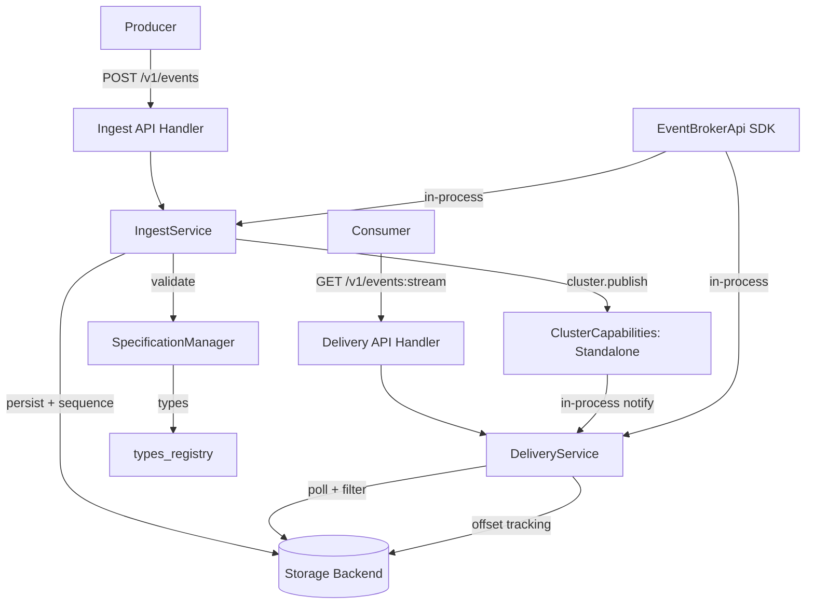
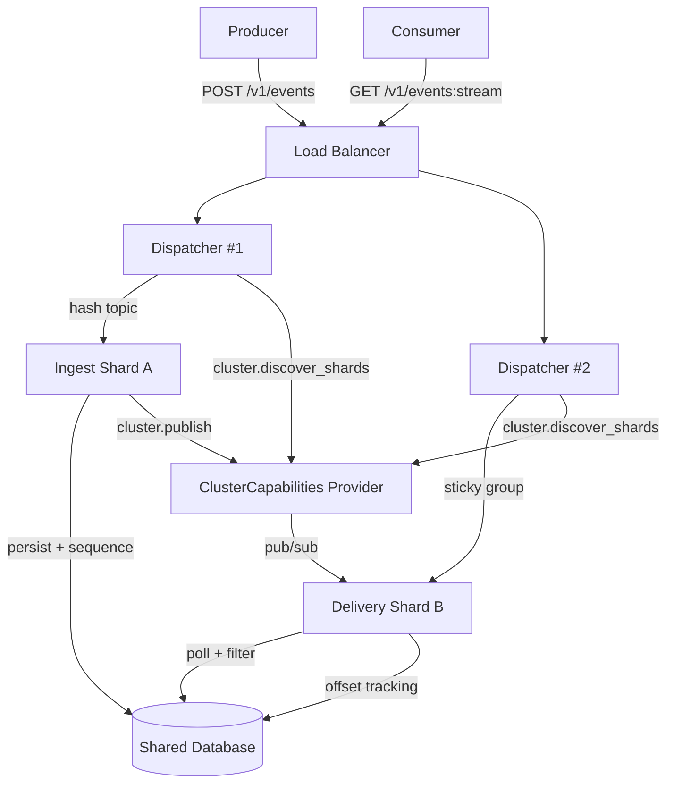
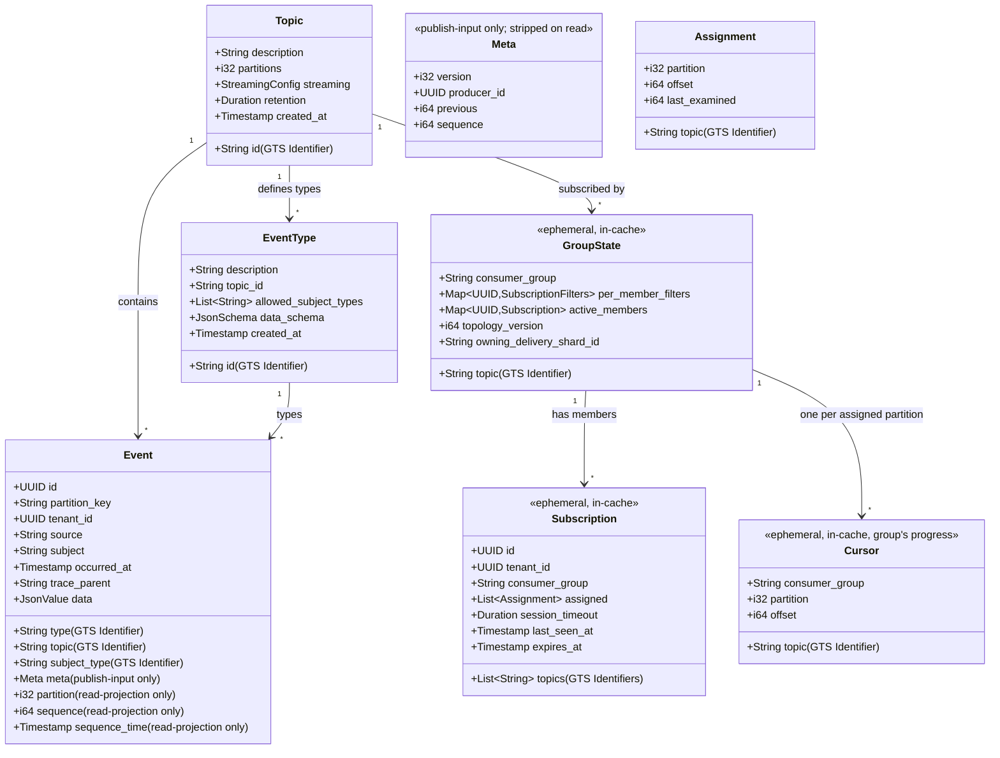
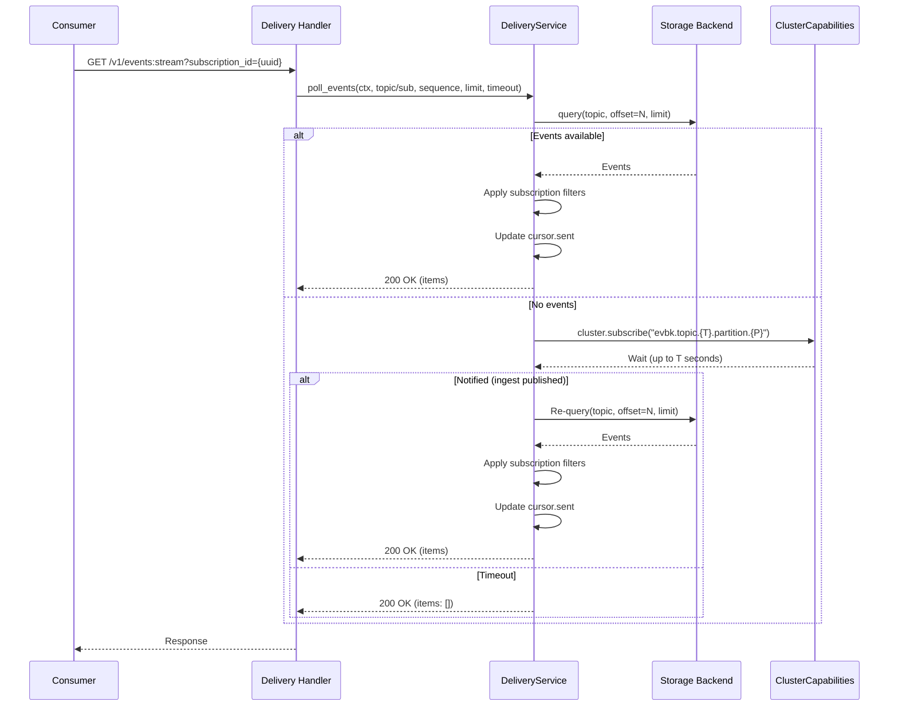

# Technical Design — Event Broker

<!-- toc -->

- [1. Architecture Overview](#1-architecture-overview)
  - [1.1 Architectural Vision](#11-architectural-vision)
  - [1.2 Architecture Drivers](#12-architecture-drivers)
  - [1.3 Architecture Layers](#13-architecture-layers)
  - [1.4 High-Level Architecture Diagram](#14-high-level-architecture-diagram)
- [2. Principles & Constraints](#2-principles--constraints)
  - [2.1 Design Principles](#21-design-principles)
  - [2.2 Constraints](#22-constraints)
- [3. Technical Architecture](#3-technical-architecture)
  - [3.1 Domain Model](#31-domain-model)
  - [3.2 Component Model](#32-component-model)
  - [3.3 API Contracts](#33-api-contracts)
  - [3.4 Internal Dependencies](#34-internal-dependencies)
  - [3.5 External Dependencies](#35-external-dependencies)
  - [3.6 Interactions & Sequences](#36-interactions--sequences)
  - [3.7 Database schemas & tables](#37-database-schemas--tables)
  - [3.8 Deployment Topology](#38-deployment-topology)
- [4. Additional Context](#4-additional-context)
  - [4.1 Deployment Modes](#41-deployment-modes)
  - [4.2 Caching Strategy](#42-caching-strategy)
  - [4.3 Metrics and Observability](#43-metrics-and-observability)
  - [4.4 Audit Logging](#44-audit-logging)
  - [4.5 Security Considerations](#45-security-considerations)
  - [4.6 Out of Scope](#46-out-of-scope)
  - [4.7 Open Questions](#47-open-questions)
  - [4.8 Future Developments](#48-future-developments)
- [5. Traceability](#5-traceability)
  - [5.1 PRD ↔ DESIGN Traceability](#51-prd--design-traceability)
  - [5.2 ADRs](#52-adrs)
  - [5.3 Standards & External References](#53-standards--external-references)
  - [5.4 Companion Documents](#54-companion-documents)

<!-- /toc -->

## 1. Architecture Overview

### 1.1 Architectural Vision

The Event Broker is a composite, tenant-scoped event streaming module for Gears. It provides an append-only, GTS-typed event log with monotonic per-`(topic, partition)` sequences, enabling decoupled inter-module communication and reliable replay.

**This design is an MVP.** The consumption surface is intentionally narrow — a single subscription-based long-poll endpoint — and several non-essential capabilities are explicitly deferred to post-MVP. Every endpoint, table, and trait is shaped so that planned extensions (`GET /v1/events:sse`, anonymous offset-based reads, gRPC consumption, sticky-Kafka rebalancing, cluster ClusterCapabilities providers, etc.) are **additive non-breaking changes** when delivered. See §4.6 Out of Scope and §4.8 Future Developments for the full deferred list.

The architecture follows a **multi-service decomposition** with four internal services:

- **Ingest Service**: Producer-facing. Accepts events, validates against GTS schemas, assigns sequences, persists, and broadcasts to delivery. In cluster mode, ingest is **sharded by topic** — each ingest instance owns a subset of topics for write affinity and sequence contention elimination.
- **Delivery Service**: Consumer-facing. Manages subscriptions, serves polling requests, tracks consumer offsets, handles acknowledgment. In cluster mode, delivery is **sharded by consumer group** — the dispatcher uses sticky sessions to route all instances of a consumer group to the same delivery shard.
- **Dispatcher Service**: HTTP gateway that routes requests between ingest and delivery services. In cluster mode, the dispatcher performs **topic-based routing** for producers (directing writes to the ingest shard owning the topic) and **consumer-group sticky routing** for consumers (directing polls to the delivery shard owning the consumer group). Optional — not needed in standalone mode.
- **Storage Backend**: Pluggable persistence layer following the ModKit plugin pattern. Backend implementations (in-memory, database, file-based, remote archive) register themselves via GTS instance discovery, provide a JSON Schema for their configuration, and are resolved at runtime by the event broker module — `types_registry` for discovery, `ClientHub` scoped clients for resolution.

All four services are implemented as **domain traits within a single `event_broker` crate**, using DDD-Light layering. In standalone mode they run in-process, communicating directly via trait calls. In cluster mode, a **ClusterCapabilities** platform abstraction provides the coordination primitives (pub/sub, leader election, distributed locks, service discovery) needed for ingest and delivery to scale independently.

The dispatcher is a **stateless HTTP router** — it performs topic-based and consumer-group-based routing using consistent hashing, but does **not** relay notifications. Event notifications flow directly from ingest to delivery shards via `ClusterCapabilities.publish()`, bypassing the dispatcher entirely. This means multiple dispatcher instances can run behind a load balancer without coordination.

Storage backends are separate crates (potentially separate modules) that implement the `StorageBackend` trait and register themselves with the event broker at init time. This allows third-party or deployment-specific backends without modifying the core event broker code.

The **producer client library** (`cf-gears-event-broker-sdk`) is built on top of `toolkit-db`'s transactional outbox. Producers enqueue events within their business transaction via the outbox; the outbox pipeline (sequencer → processor) then delivers them to the ingest service. This gives producers **transactional guarantees** — events are only published if the business transaction commits — and **exactly-once semantics** via the idempotent producer protocol. The same outbox machinery also powers the ingest service itself: ingested events flow through a per-topic outbox partition before being persisted to the storage backend and broadcast to delivery.

### 1.2 Architecture Drivers

**ID**: `cpt-cf-evbk-design-drivers`

| Driver | Source | Influence |
|---|---|---|
| Decoupled inter-module communication | Platform need | Append-only event log with per-topic ordering |
| GTS-typed events | `cpt-cf-evbk-fr-event-type-registration` | Events validated against JSON Schema registered per event type |
| Reliable replay | FR: replay | Monotonic per-topic sequences, offset-based consumption |
| Long-poll consumption | `cpt-cf-evbk-fr-streaming-delivery` | Event-driven notification with configurable timeout |
| Consumer group support | `cpt-cf-evbk-fr-subscription-join` | Subscription resources with filters and session management |
| Batch production | `cpt-cf-evbk-fr-publish-batch` | Atomic per-topic batch writes up to 100 events |
| Idempotent publishing | `cpt-cf-evbk-fr-producer-modes` | Deduplication via composite key with configurable retention |
| Multi-tenant isolation | Gears platform | All data tenant-scoped via SecureConn |
| Flexible deployment topology | NFR: deployment modes | Standalone (all-in-one) and cluster (ingest + delivery + dispatcher) |
| Gears integration | Gears platform | Single-executable deployment, trait-based DI, secure ORM |

**Architecture Decision Records**:

- future ADR (service-decomposition) — Multi-service composite (ingest, delivery, dispatcher, storage backends)
- future ADR (storage-backend-plugin) — Storage backends as ModKit plugins with GTS discovery and self-describing config schemas
- `cpt-cf-evbk-design-sequence-assignment` — Three-sequence model: producer chain (`previous`, `sequence`) for ingest-side dedup (chained / monotonic / stateless modes); outbox sequence (toolkit-db) for in-pipeline order preservation; offset (backend) for consumer-visible ordering
- future ADR (idempotent-producers) — Idempotent producers via Producer-Id + per-`(producer_id, topic, partition)` sequence tracking. No epoch fencing — sequence ordering itself acts as the fence.
- future ADR (consumer-lifecycle) — Subscription-based consumers with session timeout and offset tracking
- future ADR (outbox-ingest) — Outbox-based producer library and ingest pipeline built on `toolkit-db` outbox
- future ADR (cluster-capabilities) — Platform-level cluster coordination abstraction (pub/sub, leader election, locks, discovery) with pluggable providers
- future ADR (long-polling) — Notification-based long-poll via ClusterCapabilities pub/sub
- future ADR (topic-sharding) — Topic-sharded ingest and consumer-group-sharded delivery in cluster mode
- future ADR (dispatcher) — Stateless HTTP router with topic-based and consumer-group sticky-session routing
- `cpt-cf-evbk-adr-offset-semantics` — Consumer-visible broker sequences start at 1 and backend adapters translate native offsets into the broker-logical sequence space. See [`ADR/0001-offset-semantics.md`](ADR/0001-offset-semantics.md).
- `cpt-cf-evbk-adr-partition-selection` — Broker-authoritative partition selection from `partition_key` when present, otherwise `tenant_id`; producers do not provide a top-level partition. See [`ADR/0002-partition-selection.md`](ADR/0002-partition-selection.md).
- `cpt-cf-evbk-adr-event-schema` — Single canonical event schema with read/write field markers, `meta` write-only producer protocol fields, and consumer-visible `sequence` naming. See [`ADR/0003-event-schema.md`](ADR/0003-event-schema.md).
- `cpt-cf-evbk-adr-idempotent-producer-protocol` — Producer mode is declared at registration and enforced per request, with broker-side chain state for idempotent publishing. See [`ADR/0004-idempotent-producer-protocol.md`](ADR/0004-idempotent-producer-protocol.md).
- `cpt-cf-evbk-adr-subscription-filter-typing` — JOIN uses topic-anchored `interests[]` with typed filter engines and topic-scoped type-pattern resolution. See [`ADR/0005-subscription-filter-typing.md`](ADR/0005-subscription-filter-typing.md).
- `cpt-cf-evbk-adr-offset-authority` — Consumer progress durability belongs to the consumer; the broker owns only runtime cursors seeded by SEEK. See [`ADR/0006-offset-authority.md`](ADR/0006-offset-authority.md).

The consumption transport surface (`/events:stream` for `multipart/mixed`, `/events:sse` for `text/event-stream`) is documented as a feature. See [`features/0004-consumption-transport.md`](features/0004-consumption-transport.md).

### 1.3 Architecture Layers

**ID**: `cpt-cf-evbk-design-layers`

| Layer | Responsibility | Key Components |
|---|---|---|
| **Transport** (`api/rest/`) | HTTP handling, request parsing, response serialization | Axum handlers, DTOs, extractors, OperationBuilder route registration |
| **Domain** (`domain/`) | Business logic, service traits, repository contracts | `IngestService`, `DeliveryService`, `SpecificationManager`, domain models, repository traits |
| **Infrastructure** (`infra/`) | Persistence, cluster coordination, GTS provisioning | Storage backends, ClusterCapabilities integration, type provisioning |
| **SDK** (`event-broker-sdk/`) | Public API for inter-module communication | `EventBrokerApi` trait (unified), `IngestApi` / `DeliveryApi` (split), SDK models, error types |

**ID**: `cpt-cf-evbk-tech-dependencies`

| Technology | Purpose |
|---|---|
| Rust / Axum | HTTP transport, async runtime |
| SeaORM + `toolkit-db` | Database persistence (PostgreSQL, MySQL, SQLite) |
| `ClusterCapabilities` (Gears platform) | Cluster coordination: pub/sub, leader election, distributed locks, service discovery. Pluggable providers (K8s, Redis, NATS, DB-only, standalone/in-process) |
| `toolkit-security` | Bearer token authentication & authorization |
| `types_registry` | GTS schema/instance registration |

### 1.4 High-Level Architecture Diagram

**ID**: `cpt-cf-evbk-design-overview`

#### Standalone Mode



#### Cluster Mode



## 2. Principles & Constraints

### 2.1 Design Principles

**ID**: `cpt-cf-evbk-principle-immutable-log`

**Immutable log**: Events are append-only. Once written, events are never modified or reordered. Retention may remove older segments.

**ID**: `cpt-cf-evbk-principle-per-topic-ordering`

**Per-topic ordering**: Sequence numbers are monotonically increasing within a topic. No ordering guarantees across topics.

**ID**: `cpt-cf-evbk-principle-tenant-scope`

**Tenant scoping**: All database reads/writes use secure ORM with tenant scoping. Topics, events, subscriptions, and cursors are strictly isolated per tenant.

**ID**: `cpt-cf-evbk-principle-no-auto-retry`

**No automatic retries**: The broker does not retry failed writes or consumption. Retry logic is the client's responsibility.

**ID**: `cpt-cf-evbk-principle-rfc9457`

**RFC 9457 Problem Details**: All broker errors use `application/problem+json` format with GTS type identifiers.

**ID**: `cpt-cf-evbk-principle-typed-events`

**Typed events**: Events are identified by GTS type identifiers and validated against JSON Schema associated with the event type at publish time.

**ID**: `cpt-cf-evbk-principle-abi-registration`

**ABI-only registration**: Topics and event types are registered through the local Rust SDK (in-process) and specification configuration. The REST API does not expose topic/event-type creation — these are infrastructure concerns managed by module code, not end users.

**ID**: `cpt-cf-evbk-principle-topology-transparent`

**Topology-transparent**: Business logic is identical regardless of deployment mode. The `ClusterCapabilities` abstraction hides whether services communicate in-process (standalone) or via external coordination (cluster). Service traits call `cluster.publish()` / `cluster.subscribe()` without knowing the underlying transport.

**ID**: `cpt-cf-evbk-principle-tenant-on-event`

**Tenant is on the event, not on the group.** Every event carries a `tenant_id`. Every event read is tenant-scoped via API-level filtering (`SecureConn` applies `WHERE tenant_id = $ctx.tenant_id`). But tenant is **NOT** part of routing, group identity, or the cursor key — group identity is the `consumer_group` GTS identifier (globally unique by namespacing for named instances, by UUID for anonymous), and multiple tenants picking the same anonymous (UUID-backed) identifier or both being authorized to use the same named instance are intentionally in the same group, cooperatively consuming with per-tenant filtering applied at read time.

Inter-service traffic uses a well-known `ROOT_TENANT_ID` constant for the event's `tenant_id` field, so platform-internal events are tenant-tagged like any others. `ROOT_TENANT_ID` is exposed by the platform's `tenant-resolver` SDK.

This separation has consequences: see R52 (cross-tenant cooperative consumption can leave a tenant with empty assigned partitions) and R57 (filter-saturation requires offset adviser to avoid re-scanning). Both are documented as known design properties with mitigations.

### 2.2 Constraints

**ID**: `cpt-cf-evbk-constraint-modkit-deploy`

Single-executable deployment via Gears framework. Standalone mode is the default.

**ID**: `cpt-cf-evbk-constraint-multi-sql`

Multi-SQL backend portability: PostgreSQL, MySQL, SQLite. `toolkit-db` requirement; avoid backend-specific features. Sequence generation must work correctly across all backends.

**ID**: `cpt-cf-evbk-constraint-event-size`

Per-event hard size limit: **64 KiB total** — combined headers + payload (`data` field plus `trace_parent` and any other event fields). Enforced at the ingest path before validation. Larger events MUST be split or referenced (a referenced-payload mechanism is post-MVP).

**ID**: `cpt-cf-evbk-constraint-batch-limit`

Batch size hard limit: 100 events per request, 1 MiB total payload. Prevent resource exhaustion on the ingest path. Per-event size limit (64 KiB) applies independently — a max batch fits ~16 max-sized events.

**ID**: `cpt-cf-evbk-constraint-poll-timeout`

Long-poll max timeout: 30 seconds. Prevents connection hoarding and balances responsiveness with resource usage.

## 3. Technical Architecture

### 3.1 Domain Model

**ID**: `cpt-cf-evbk-design-domain-model`



**Key Domain Entities**:

- **Topic** (`gts.cf.core.events.topic.v1~`): A named logical event stream identified by a GTS topic identifier. A topic is divided into a fixed number of **partitions** declared at topic creation. All sequencing, offsets, and ordering semantics are scoped to a single `(topic, partition)`. Persistence properties are determined by the chosen storage backend (e.g., the memory backend is non-persistent; the postgres / kafka backends are durable). Registered via ABI/specification, not REST.
- **Event Type** (`gts.cf.core.events.event_type.v1~`): Defines the schema and constraints for a category of events within a topic. Includes allowed subject types and a JSON Schema for payload validation. Registered via ABI/specification, not REST.
- **Event** (`gts.cf.core.events.event.v1~`): An immutable record in a `(topic, partition)` log. The `partition` is **broker-derived** at ingest (MurmurHash3-32 over the optional `partition_key` body field, falling back to `tenant_id` — so a tenant's events are totally ordered by default; see [`ADR/0002-partition-selection.md`](ADR/0002-partition-selection.md)); producers do not set `partition` on publish input. The `sequence` (formerly `offset`) is the **broker-logical, consumer-visible ordering key** returned by the storage backend boundary, monotonic within `(topic, partition)` and starting from 1 on a fresh partition (see [§ Offset Semantics](#offset-semantics) and [ADR-0001](ADR/0001-offset-semantics.md)). Backends may use native positions internally (Kafka offset / DB row sequence / file segment offset / etc.) but MUST translate them before exposing `sequence`. `sequence_time` records when the backend assigned the public sequence. The producer chain `meta.producer_id` / `meta.previous` / `meta.sequence` lives inside the publish-input `meta` block (chained / monotonic modes; absent in stateless), is used for ingest-side dedup, and is stripped from the consumer read projection. See §3.2 "Producer Modes" and §3.6 "Two Sequences".
- **Subscription** (`gts.cf.core.events.subscription.v1~`): An **ephemeral** resource representing a single consumer instance. Lives in the cache (ClusterCapabilities-backed), not in the broker's database. Has a UUID identity, a TTL (`session_timeout`), and a list of assigned `(topic, partition)` pairs across one or more topics. When session expires, the subscription is removed from its group automatically. Subscriptions never outlive the consumer process.
- **ConsumerGroup** (`gts.cf.core.events.consumer_group.v1~`): A GTS-typed consumer group identifier. **Persistent broker resource** stored in `evbk_consumer_group` (one row per registered group). Two creation paths, one table — but each path is exclusive to one of the two GTS-instance shapes:
  - **Anonymous** (UUID-backed): `gts.cf.core.events.consumer_group.v1~{uuid}`. Created **only** via `POST /v1/consumer-groups`. The UUID is **broker-minted** at create time; the caller's request carries no `id` and the broker returns the composed GTS identifier in both the response body and the `Location` header. Caller's `tenant_id` and principal become the row's owner. The caller then distributes the returned identifier to its consumer fleet via its own coordination mechanism (DB, ConfigMap, env var). Use case: a single tenant's private consumer pool — disposable, not shared.
  - **Named** (well-known): `gts.cf.core.events.consumer_group.v1~vendor.audit-processor.v1`. Provisioned **only** via `types_registry` — the registering module's principal owns the row. The broker reads `types_registry` at startup and upserts each named consumer-group instance into `evbk_consumer_group` (idempotent). Use case: shared platform groups intended for cross-tenant or cross-module consumption with explicit `:consume` grants on the concrete GTS instance.
  
  `POST /v1/consumer-groups` always produces an anonymous identifier — there is no way for the caller to request a named shape via this endpoint. Named groups MUST be registered via `types_registry`. Each shape has one provisioning path; no overlap.
  
  **JOIN authorization** (`POST /v1/subscriptions`):
  - The row MUST exist in `evbk_consumer_group` → `404 ConsumerGroupNotFound` otherwise.
  - **Anonymous groups**: caller's `tenant_id` must equal the row's `owner_tenant_id` (`403 ConsumerGroupNotOwned` otherwise) — cross-tenant sharing of anonymous groups is post-MVP via a `shared_with` mechanism (§4.8).
  - **Named groups**: caller MUST hold an explicit `consume` permission on the concrete GTS instance via the `authz-resolver` PEP (e.g., `gts.cf.core.events.consumer_group.v1~vendor.audit-processor.v1:consume`). No tenant-equality short-circuit — named groups are first-class platform resources gated by explicit grants. This is the path for legitimate cross-tenant or cross-module shared consumption: the platform / operator grants `consume` to specific principals, and they can JOIN.
  
  This structurally eliminates the cross-tenant accidental-collision bug R52 flagged: anonymous groups are tenant-bound at creation; named groups require explicit permission. The "first JOIN claims it" race condition is gone.
- **GroupState**: The runtime state of a consumer group. **Ephemeral**, lives in the cache, keyed by the consumer_group GTS identifier (the string alone — no topic, no tenant). Holds active subscriptions and their per-member topic lists and filters, partition assignments per `(topic, partition)`, topology version, and the owning delivery instance endpoint. **Each member can have its own topic subset and filter set** — there is no canonical topic list or canonical filter at the group level (see "Per-Member Subscriptions" below). The group's TTL is the max `last_seen_at + session_timeout` across active members; an empty group is reaped.
- **Cursor**: Group-scoped offset tracking, held in cache. Keyed by `(consumer_group, topic, partition)`. Stores `offset` (session cursor set by SEEK; broker emits from offset+1) and `last_examined` (offset adviser, see R57). Survives subscription churn, delivery instance failover, and group emptiness. **`topic` is in the key for partition disambiguation only** (a partition number is meaningless without saying "of which topic") — `topic` is NOT part of group identity.

**Sequence scope** is `(topic, partition)` — sequence numbers are globally unique within `(topic, partition)`, regardless of tenant. Topic GTS identifiers are globally unique by construction (vendor-namespaced).

**Group identity** is the `consumer_group` GTS identifier — a full GTS string, globally unique by construction (vendor namespacing for named instances; UUID uniqueness for anonymous instances). Multiple tenants picking the same anonymous UUID-backed identifier (intentionally shared via out-of-band coordination) end up in the same group, cooperatively consuming with API-level tenant filtering applied at read time. Cross-tenant collision via accidentally-matching named instances is prevented by GTS namespace ownership (vendor.foo.v1 is registered and owned).

**Per-member subscriptions** (Kafka shared-subscription model with per-member parameters): A consumer group can include members with **different topic lists** and **different filters**. There is no canonical topic list and no canonical filter at the group level. Each JOIN's `topics` and `filters` apply to that member alone:
- The group's effective topic set is the **union** of all active members' topic lists
- A `(topic, partition)` pair can only be assigned to a member that subscribes to that topic
- Each member's filter is applied to events delivered to it
- Cursor is shared per `(consumer_group, topic, partition)` regardless of which member processed events at any given moment
- During a rolling deploy where v1 (filters F1) and v2 (filters F2) coexist, partitions migrate organically; the **single-consumer-per-partition invariant** ensures no partition is ever processed by two filters simultaneously, but at the moment of partition handover the cursor reflects the previous owner's processing position. This is documented as accepted rollout behavior (see R60).
- Operators wanting strict atomic semantics (no overlap of filter generations) use a hard-stop deploy (drain v1, deploy v2 — orchestrated via k8s or similar)

**Why subscription/group state is ephemeral**: subscription columns (`last_seen_at`, `expires_at`, `id`, `session_timeout`, plus per-member `topics` and `filters`) are session-lifetime data; nothing about a subscription needs to outlive the consumer process. Keeping this state in the DB would create write churn on every JOIN/POLL/expire for no persistence value. Cache-based state makes JOIN/POLL/ACK primarily in-memory operations and keeps the cursor (the only persistent piece) correctly group-scoped.

#### Topic Schema

A named, partitioned log of events identified by a GTS topic identifier. See [`schemas/topic.v1.schema.json`](schemas/topic.v1.schema.json).

**Base type**: `gts.cf.core.events.topic.v1~`

Key fields:
- `id` (String, GTS Identifier): Unique topic identifier (e.g., `gts.cf.core.events.topic.v1~vendor.users.v1`)
- `description` (String, optional): Human-readable description
- `partitions` (i32, **required**): Number of partitions. Fixed at topic creation. See "Partition Count" below.
- `streaming` (Object): Backend configuration. Opaque to the event broker; validated against the chosen backend type's `config_schema` at topic registration. The well-known sub-field `backend_selector` (with `type` + `metadata` filters) is used by the broker to resolve the backend instance via `cluster.discover_shards()`; everything else inside `streaming` is passed through to the backend (retention, compaction, replication, segment size, etc. — the backend's concern).
- `retention` (Object): Duration-based retention policy
- `retention` (String, ISO 8601 Duration): TTL for the producer-state idempotency-deduplication window (e.g., `PT24H`). Capped at `P14D`; values above the cap are rejected with `400 RetentionExceedsMaxSpan`.
- `created_at` (String, ISO 8601): Creation timestamp

**Partition Count** (`partitions`): Required field, no default. The number of partitions a topic is divided into. Each partition is an independent ordered log; events with the same partition see total order, events across partitions have no ordering guarantee.

Reasons partition count is required (no default):

1. **It's a one-way decision.** Re-partitioning is essentially impossible in any log-based system without breaking per-key ordering for every key already published. Kafka, Kinesis, Pulsar all have this constraint. A default invites the operator to skip the choice and pay later.
2. **Hidden defaults for one-way decisions are an anti-pattern.** Every other topic knob (retention, idempotency window, session timeout) can be tweaked freely. Partition count cannot. Defaults are appropriate for things that are easy to change; they are wrong for things that are hard to undo.
3. **Kafka community consensus.** Kafka's broker-level `num.partitions=1` default is widely considered a footgun — operational guidance is universally "always specify explicitly." We learn from their pain.

Operators must declare partition count at topic registration. There is no v1 mechanism to grow or shrink partitions on a live topic; the migration path is "create new topic, dual-write, cut consumers over."

**Producer chain vs. consumer sequence**: there are two distinct numbering spaces. The producer chain (`meta.previous`, `meta.sequence`) is producer-assigned per `(producer_id, topic, partition)` for ingest dedup and is publish-input-only — stripped on the read projection. The consumer-visible `sequence` (formerly `offset`) is backend-assigned per `(topic, partition)` and appears only on the read projection. See §3.2 "Producer Modes" and §3.6 "Two Sequences".

#### Event Type Schema

A registration record describing one kind of event: its parent topic, allowed subject types, and per-type `data_schema` (a JSON Schema that validates `event.data` at ingest). See [`schemas/event_type.v1.schema.json`](schemas/event_type.v1.schema.json).

**Base type**: `gts.cf.core.events.event_type.v1~`

Key fields:
- `id` (String, GTS Identifier): Unique event type identifier
- `topic_id` (String, GTS Identifier): Parent topic
- `description` (String): Human-readable description
- `allowed_subject_types` (Array of GTS Patterns): Subject types this event can reference. Each entry is a valid GTS pattern — a concrete instance (e.g., `gts.cf.core.acm.user.v1~`), a wildcard suffix (e.g., `gts.cf.core.acm.*`), or a bare base type — letting a single entry cover a family. Enforced as a schema constraint at publish time, complementary to the `subject_type:produce` authorization check (see §3.3 — the two are independent dimensions: authz is *capability*, schema is *correctness*).
- `data_schema` (JSON Schema): Validation schema for event payload
- `created_at` (String, ISO 8601): Creation timestamp

#### Event Schema

**Base type**: `gts.cf.core.events.event.v1~`

A single canonical JSON Schema (`schemas/event.v1.schema.json`) describes the event resource for both publish input (`POST /v1/events`, `POST /v1/events:batch`) and read responses (poll / query). Per-direction semantics are encoded via JSON Schema field-level markers: `writeOnly` fields are accepted on publish and stripped on read; `readOnly` fields are server-stamped on read and rejected if supplied on publish. See [`ADR/0003-event-schema.md`](ADR/0003-event-schema.md).

Round-trip fields (present in both directions):

- `id` (UUID): Client-provided unique event identifier.
- `type` (String, GTS Identifier, ASCII): Event type reference.
- `topic` (String, GTS Identifier, ASCII): Target topic.
- `tenant_id` (UUID): Tenant the event belongs to. **Producer-supplied**; ingest validates the producer's principal is authorized to publish to this tenant via the platform's authz resolver. First-party producers default it from the authenticated security context; explicit user-derived overrides must be canonical and authorized rather than copied from unchecked request input.
- `source` (String, ASCII): Origin of the event (e.g., service name).
- `subject` (String, ASCII): Subject entity identifier. Required. Used for event correlation, filtering, and consumer semantics. Producers that need subject-level ordering set `partition_key` to the subject value.
- `subject_type` (String, GTS Identifier, ASCII): Subject-type reference — the type of entity the event is about. Required and NOT derivable from `type` (event types may be generic across multiple subject kinds; body-less events have no `data` to introspect).
- `partition_key` (String, optional, ASCII, ≤ 1024 bytes): Optional producer-supplied routing key. When present, partition = `(murmur3_32(ascii_bytes(partition_key)) & 0x7FFFFFFF) % topic.partitions`; when absent, the same masked hash is applied to `tenant_id` (per-tenant ordering by default). Use a stable identifier whose canonical representation is controlled by the producer. User-derived identifiers are valid after authentication and normalization, but raw attacker-controlled free-form values are unsupported because Murmur3 permits deliberate partition hot-spotting. There is no explicit producer-set partition. See [`ADR/0002-partition-selection.md`](ADR/0002-partition-selection.md).
- `occurred_at` (Timestamp, ISO 8601): When the event occurred (producer-stamped).
- `trace_parent` (String, optional): W3C Trace Context parent. Validated at ingest against the W3C tracecontext format (`^[0-9a-f]{2}-[0-9a-f]{32}-[0-9a-f]{16}-[0-9a-f]{2}$`); malformed values are rejected with `400 InvalidTraceParent`. Carried on read for consumer-side trace correlation.
- `data` (Object, optional): Event payload, validated against the event type's `data_schema`. May be absent for body-less events. **The only field where UTF-8 is permitted**; all other event string fields are ASCII per platform convention.

`writeOnly` fields (publish-only; stripped on read):

- `meta` (Object, optional): Publish-time transport-metadata block carrying producer-protocol fields. Versioned (`meta.version`), per-event. Carries `producer_id`, `previous`, `sequence` per the registered producer mode. Omit entirely for stateless publish. See [`ADR/0003-event-schema.md`](ADR/0003-event-schema.md) and [`ADR/0004-idempotent-producer-protocol.md`](ADR/0004-idempotent-producer-protocol.md).

`readOnly` fields (server-stamped; rejected with `400 BadRequest` if supplied on publish):

- `partition` (i32, readOnly): Broker-derived topic partition for the event. Producers MUST NOT supply it on publish; publish bodies that contain `partition` are rejected as read-only field violations. The broker stamps it on read-side events for consumers, where it identifies the `(topic, partition)` ordering, cursor, and assignment scope.
- `sequence` (i64): Server-assigned monotonic ordering key per `(topic, partition)`. **Consumer-visible ordering key** — same value space as `cursor.max_sequence` / `received` / `sent` / `offset`. Distinct from `meta.sequence` (publish-only producer-side chain field).
- `sequence_time` (Timestamp): When the server assigned `sequence`.

The `required` array is the union of publish-required and read-required fields; producers using strict validators that don't honor `readOnly` MUST filter `partition`/`sequence`/`sequence_time` before submission. The broker enforces per-direction semantics at the wire regardless of the producer's validator behavior: `partition` is never producer authority and is only stamped on read-side events.

The producer chain (`meta.producer_id`, `meta.previous`, `meta.sequence`) is publish-only and never surfaces to consumers. See §3.6 "Two Sequences".

#### Subscription Schema (Ephemeral, In-Cache)

An ephemeral session a consumer instance opens against a consumer group; carries its `interests[]`, `assigned` partitions, and session liveness state. Lives in cache only, not in the broker's database. See [`schemas/subscription.v1.schema.json`](schemas/subscription.v1.schema.json) and [`ADR/0005-subscription-filter-typing.md`](ADR/0005-subscription-filter-typing.md).

**Base type**: `gts.cf.core.events.subscription.v1~`

The schema is the wire shape returned by `POST /v1/subscriptions` and the cache record's data. The consumer declares one or more topic-anchored typed-filter `interests[]`, each with optional paired engine-typed filter expression:

- `id` (UUID): Server-generated subscription identifier (created at JOIN, expires when session does).
- `consumer_group` (String, GTS Identifier): The consumer group this subscription belongs to. Required.
- `client_agent` (String): RFC 9110 User-Agent grammar; ASCII; 1–256 bytes. Informational hint, logs-only.
- `interests` (Array of `Interest`, ≥1, ≤64): Topic-anchored typed-filter selections. Each `Interest` carries:
  - `topic` (String, GTS identifier) — required; the partition/rebalance/authz unit.
  - `tenant_id` (UUID) — required; tenant scope, authz-validated at JOIN.
  - `max_depth` (Integer ≥ 0 | null, default 0) — descendant traversal depth relative to `tenant_id`. `0` = current tenant only; `1` = direct children; `null` = unlimited, bounded by `barrier_mode`. Aligned with `tenant_resolver_sdk::GetDescendantsOptions::max_depth`.
  - `barrier_mode` (String enum `"respect"` | `"ignore"`, default `"respect"`) — how to handle `self_managed = true` tenant boundaries during hierarchy traversal. `"respect"` stops at barriers (default); `"ignore"` traverses through them (platform services only). Mirrors `tenant_resolver_sdk::BarrierMode`.
  - `types` (Array of String, ≥1, ≤32) — GTS event-type-instance patterns; wildcards per GTS spec §10.
  - `filter` (Object optional) — consolidated per-interest filter with required `engine` (GTS identifier of filter engine) and `expression` (engine-specific source string, ≤4096 bytes). Absent means no filter. Replaces the former flat paired-optional `expression_type` + `expression` fields.
  Per ADR-0005. Different members of the same group MAY declare different `interests[]` sets (rolling-deploy preserved by construction).
- `assigned` (Array of `{topic, partition}` pairs): Subset of the group's `(topic, partition)` pairs assigned to this subscription by the rebalance algorithm. Computed at JOIN and updated on every topology change. Topic-centric; matches the existing seek mechanics. The topic set is the union of `interest.topic` values across all interests (broker doesn't derive topics — they're explicit on the wire).
- `session_timeout` (String, ISO 8601 Duration): TTL refreshed on every poll/seek (default: `PT30S`).
- `last_seen_at` (String, ISO 8601): Last poll/seek activity timestamp.
- `expires_at` (String, ISO 8601): Current expiry timestamp (= `last_seen_at + session_timeout`).
- (cache-internal, not on the wire) `compiled_interests` — for each interest, the resolved concrete-type-set and the optional compiled `FilterEngine` handle. Lifetime = subscription. Evicted with the subscription on `session_timeout`.

#### GroupState Schema (Ephemeral, In-Cache)

The cache record describing a running consumer group. The group identity (its GTS) is in the cache key, not in the schema fields.

Cache key: `evbk.group.{consumer_group_gts}` — the full GTS identifier.

Fields:
- `consumer_group` (String, GTS Identifier): Identity (the GTS string — globally unique by namespacing or UUID)
- `active_members` (Map<UUID, Subscription>): Currently active subscriptions in the group, each with its own `topics` list and filter set
- `assignments` (Map<`(topic, partition)`, subscription_id>): Which subscription owns each `(topic, partition)`. Each member is only assigned partitions for topics it subscribes to.
- `topology_version` (i64): Monotonically increased on every membership/assignment change
- `owning_endpoint` (String): Endpoint of the delivery instance that owns this group's state (claimed via `cluster.distributed_lock` on first JOIN; published to the routing cache `evbk.group.endpoint:{consumer_group_gts}`)
- `created_at`, `updated_at` (Timestamps)

**No canonical topic list, no canonical filter at the group level.** Each member's `topics` and `filters` apply to that member alone. The group's effective topic set is the union across active members; partition assignment respects per-member topic subscriptions. See "Per-Member Subscriptions" in §3.1 entity descriptions.

TTL: `max(member.expires_at)` across active members. An empty group is reaped immediately. Cursor state lives in the runtime cache for active subscription sessions (see "Cursor Schema" below).

#### Cursor Schema (Ephemeral, In-Cache, Group-Scoped)

Cursors live in the **ClusterCapabilities-backed runtime cache**. Keyed by `(consumer_group, topic, partition)`. Stores `offset` (session cursor set by SEEK; broker emits from offset+1) and `last_examined` (highest offset the broker has scanned for this group on that `(topic, partition)`, used by the offset-adviser feature — see R57). Cache providers may preserve this runtime state across shard transitions. Consumers that need durable progress track offsets in their own store and initialize each new subscription session from that store.

`topic` is in the cursor key for **partition disambiguation only** — partition `0` of `topic_A` and partition `0` of `topic_B` are distinct cursors. `topic` is NOT part of group identity (which is `consumer_group` alone).

Per-subscription progress (the `sent` position concept — "delivered but not yet confirmed") lives in cache as part of subscription state — purely advisory. Topic-level positions (`received`, `max_offset`) are derivable from `backend.segments` / `backend.query` (the storage backend's own `MAX(offset)`) and don't need cache entries.

#### Offset Semantics

**ID**: `cpt-cf-evbk-design-offset-semantics`

Authoritative reference for offset vocabulary across the entire design. See [ADR-0001](ADR/0001-offset-semantics.md) for the full rationale.

Two boundary values govern the readable window of a `(topic, partition)`:

- **Retention floor (RF)** — sequence number of the oldest event still available on the partition. Events with sequence < RF have been purged by the backend's retention policy. RF ≥ 1 always (see below).
- **High-water mark (HWM)** — sequence number of the next event to be admitted (one past the last persisted sequence).

**Sequence floor**: storage backends MUST assign sequences starting from 1. Sequence 0 is never assigned. This is a hard backend conformance contract (see [ADR-0001](ADR/0001-offset-semantics.md)). As a result, RF ≥ 1 always on any partition that has ever had an event written to it.

**Cursor semantics** (last-processed-offset model): the cursor stored per `(consumer_group, topic, partition)` represents the sequence of the last event successfully processed by the group. The broker delivers the next event from `cursor + 1`.

| Cursor value | Meaning | Broker emits from |
|---|---|---|
| `0` | Nothing processed yet — start of stream | `1` (= RF on a fresh topic where RF = 1) |
| `N` (≥ 1) | Last processed event had sequence `N` | `N + 1` |

**Valid cursor range**: `[RF − 1, HWM]`

Since RF ≥ 1, it follows that RF − 1 ≥ 0. The minimum valid cursor is therefore always `0` — no negative values are reachable on the wire, in the database, or in SDK types. The cursor type is `u64`-compatible (implementations may also use `i64` with a guaranteed ≥ 0 invariant).

**SEEK sentinel resolution** (`POST /v1/subscriptions/{id}:seek`):

| Sentinel | Resolves to | Broker emits from |
|---|---|---|
| `"earliest"` | `RF − 1` (= `0` on a fresh topic; ≥ 0 always) | RF (oldest retained event) |
| `"latest"` | HWM | Next event admitted after this SEEK |
| `"at:<ISO-8601>"` | Offset of first event with `occurred_at ≥ timestamp`, minus 1 | That event (or the next admitted if timestamp is beyond HWM) |
| Integer `N` | `N` (validated: must be in `[RF − 1, HWM]`) | `N + 1` |

A SEEK value outside `[RF − 1, HWM]` is rejected with `400 InvalidInitialPosition`.

#### GTS Base-Type Quick Reference

The broker owns the following GTS base types. Concrete types extend each base with vendor-specific extensions (registered via `types_registry`):

| Base type | Concept | Source |
|---|---|---|
| `gts.cf.core.events.topic.v1~` | Topic resource | [`schemas/topic.v1.schema.json`](schemas/topic.v1.schema.json) |
| `gts.cf.core.events.event.v1~` | Event (single schema, `readOnly` / `writeOnly` markers per direction) | [`schemas/event.v1.schema.json`](schemas/event.v1.schema.json), [`ADR/0003-event-schema.md`](ADR/0003-event-schema.md) |
| `gts.cf.core.events.event_type.v1~` | Event type registration record | [`schemas/event_type.v1.schema.json`](schemas/event_type.v1.schema.json) |
| `gts.cf.core.events.consumer_group.v1~` | Consumer group resource | [`schemas/consumer_group.v1.schema.json`](schemas/consumer_group.v1.schema.json) |
| `gts.cf.core.events.subscription.v1~` | Subscription resource (ephemeral, in-cache) | [`schemas/subscription.v1.schema.json`](schemas/subscription.v1.schema.json), [`ADR/0005-subscription-filter-typing.md`](ADR/0005-subscription-filter-typing.md) |
| `gts.cf.core.events.backend.v1~` | Storage backend plugin contract | DESIGN.md §3.2 (Storage Backend Plugin System) |
| `gts.cf.core.events.filter.v1~` | Filter engine plugin contract | [`ADR/0005-subscription-filter-typing.md`](ADR/0005-subscription-filter-typing.md) |

`gts.cf.core.events.subject_type.v1~` appears in the broker design as an *authz-scope* resource type only (in `<gts_pattern>:<action>` permission grammar). The broker does not own a schema file for subject types — subject types are owned by the modules that emit events about them.

#### Validation Pipeline

End-to-end flow when a producer publishes an event:

1. **Authentication / authorization** at the API edge. `toolkit-security` populates `SecurityContext`; `authz-resolver` enforces `event_type:produce` and `tenant_id`-related scopes via the platform tenant resolver. Rejected publishes return `403`.
2. **Schema-level validation** against `event.v1.schema.json` (per [`ADR/0003-event-schema.md`](ADR/0003-event-schema.md)): structural conformance, ASCII encoding of event-field strings, per-field length caps, `trace_parent` format. Violations return `400 InvalidEventFieldEncoding`, `400 EventFieldTooLong`, `400 InvalidTraceParent`, etc.
3. **Read-only field rejection.** If the publish body contains any `readOnly` field (`partition`, `sequence`, `sequence_time`), the broker rejects with `400 BadRequest` naming the offending field.
4. **Event-type lookup.** The broker reads `event.type` (a GTS event-type identifier) and resolves it via `types_registry.get(event.type)`. Unknown event types are rejected with `404 EventTypeNotFound`.
5. **Subject-type membership.** The event's `subject_type` MUST match one of the patterns in `event_type.allowed_subject_types`. Violations return `422 SubjectTypeNotAllowed`.
6. **Per-type `data_schema` validation.** The broker fetches `event_type.data_schema` (a JSON Schema embedded in the event-type registration record) and validates `event.data` against it. Validation failure returns `422 PayloadValidationFailed` with the JSON Schema error path. Events declared as body-less (no `data` allowed by the `data_schema`) reject publishes carrying `data`.
7. **Partition derivation.** Per [`ADR/0002-partition-selection.md`](ADR/0002-partition-selection.md): `partition = murmur3_32(ascii_bytes(partition_key ?? tenant_id)) % topic.partitions`. The broker stamps `partition` server-side.
8. **Producer-mode shape check.** If `meta` is present, the broker validates `meta.version`, `meta.producer_id`, and the chained / monotonic / stateless mode-shape per [`ADR/0004-idempotent-producer-protocol.md`](ADR/0004-idempotent-producer-protocol.md).
9. **Ingest enqueue and outbox handoff.** The event passes to the toolkit-db outbox; backend persist assigns `sequence` and `sequence_time` later. See §3.6 "Event Publish Flow."

Read-side delivery applies a smaller surface: the broker strips `writeOnly` `meta` from query / poll responses; `readOnly` `partition`/`sequence`/`sequence_time` fields are populated from storage. No re-validation against `data_schema` on read — the data was validated at ingest.

### 3.2 Component Model

**ID**: `cpt-cf-evbk-component-model`

#### Module Structure

```text
modules/system/event-broker/
├── event-broker-sdk/              # Public API: traits, models, errors, producer client
│   └── src/
│       ├── lib.rs                 # Re-exports
│       ├── api.rs                 # EventBrokerApi (unified), IngestApi, DeliveryApi traits
│       ├── models.rs              # SDK types (Topic, EventType, Event, Subscription, Cursor)
│       ├── producer.rs            # Outbox-based producer client (wraps toolkit-db outbox)
│       └── error.rs               # EventBrokerError
│
└── event-broker/                  # Single module crate with internal service isolation
    └── src/
        ├── lib.rs                 # Public exports
        ├── module.rs              # ModKit module wiring & deployment mode selection
        ├── config.rs              # EventBrokerConfig
        ├── api/rest/              # Transport layer
        │   ├── handlers/
        │   │   ├── ingest.rs      # POST /v1/events, POST /v1/events:batch
        │   │   ├── producers.rs   # POST /v1/producers, GET cursors, POST :reset
        │   │   ├── delivery.rs    # GET /v1/events:stream, GET /v1/events:sse
        │   │   ├── topics.rs      # GET /v1/topics, GET /v1/topics/segments
        │   │   ├── event_types.rs # GET /v1/event-types
        │   │   ├── consumer_groups.rs # CRUD for consumer groups
        │   │   └── subscriptions.rs # JOIN, list, read, leave, seek
        │   ├── routes/            # OperationBuilder route registration
        │   ├── dto.rs             # REST DTOs (serde + utoipa)
        │   ├── error.rs           # Error response mapping
        │   └── extractors.rs      # Custom Axum extractors
        ├── domain/                # Business logic (no infra dependencies)
        │   ├── ingest.rs          # IngestService trait + impl
        │   ├── delivery.rs        # DeliveryService trait + impl
        │   ├── specification.rs   # SpecificationManager: topic/type registration & cache
        │   ├── model.rs           # Domain entities (Topic, EventType, Event, Subscription, Cursor)
        │   ├── repo.rs            # Repository traits (EventRepo, TopicRepo, SubscriptionRepo, CursorRepo)
        │   ├── cluster.rs          # ClusterCapabilities usage (pub/sub, leader election)
        │   ├── idempotency.rs     # Idempotency key computation and checking
        │   └── error.rs           # DomainError
        ├── infra/                 # Infrastructure implementations
        │   ├── storage/           # Storage backend plugin resolution
        │   │   ├── registry.rs    # StorageBackendRegistry (GTS discovery + resolution)
        │   │   └── builtin/      # Built-in backend (in-memory for dev/test)
        │   │       └── memory.rs  # InMemoryStorageBackend
        │   ├── cluster/           # ClusterCapabilities integration
        │   │   └── notifications.rs # Event notification via cluster.publish/subscribe
        │   ├── workers/           # Background workers
        │   │   ├── cleaner.rs     # Fully-consumed event cleanup
        │   │   ├── retention.rs   # Retention policy enforcement
        │   │   └── reaper.rs      # Expired subscription + idempotency cleanup
        │   ├── dispatcher/        # Optional HTTP gateway
        │   │   ├── proxy.rs       # Proxy handler (routes to ingest service)
        │   │   └── router.rs      # Router handler (routes to delivery service)
        │   └── type_provisioning.rs  # GTS type registration
        └── test_support/          # Test utilities
```

**Crate Naming**: Directory names hyphenated (`event-broker-sdk`), package names `cf-gears-` prefixed (`cf-gears-event-broker-sdk`), library names underscored (`event_broker_sdk`).

#### Internal Services

**ID**: `cpt-cf-evbk-component-services`

##### IngestService (`domain/ingest.rs`)

Producer-facing. Owns the write path. Built on the `toolkit-db` transactional outbox.

Responsibilities:
- Accept single and batch event submissions
- Validate events against topic specification and event type JSON Schema (via SpecificationManager)
- Derive the broker topic `partition` from the publish body: hash `partition_key` if present, else `tenant_id`. Reject any top-level `partition` field on publish input with `400 BadRequest`. Treat any SDK/internal partition hint as non-authoritative validation metadata and reject mismatches with `400 PartitionHashMismatch`. See [`ADR/0002-partition-selection.md`](ADR/0002-partition-selection.md)
- Enqueue validated events into the per-topic outbox partition (atomic with validation)
- Enforce idempotent producer guarantees — track per-producer sequence state, detect and reject out-of-order or duplicate submissions
- Assign broker-managed monotonic sequences within the topic (via outbox processor)
- Persist events via storage backend (via outbox processor)
- Notify delivery shards via `cluster.publish("evbk.topic.{T}.partition.{P}")` (via outbox processor)

Key methods:
- `publish_event(ctx, event_dto) → Result<Event>`
- `publish_batch(ctx, events) → Result<BatchResult>`

##### DeliveryService (`domain/delivery.rs`)

Consumer-facing. Owns the read path and subscription lifecycle.

Responsibilities:
- Manage subscription lifecycle in cache (JOIN creates, DELETE removes, TTL expires)
- Manage GroupState in cache (claim ownership on first JOIN, release on last LEAVE)
- Serve long-poll requests with server-side cursor tracking
- Apply each member's filters (per-member, declared at JOIN; no canonical group filter)
- **Apply defense-in-depth authz filter**: every event returned by `backend.query` is filtered through the subscription's cached `AccessScope` constraints (tenant boundaries, owner predicates, etc.) before being sent to the consumer — regardless of what the backend returned. A misbehaving or malicious backend cannot leak cross-(tenant, scope) data through this layer. (Resolves R16.)
- **Tolerate sparse offsets**: backends may delete events anytime per their retention. `query` returns events in `offset` order but consecutive offsets are not guaranteed; cursor advances by the highest offset seen, not by `+1`. (Resolves R09.)
- Refresh subscription TTL on each poll

Key methods:
- `join(ctx, dto) → Result<Subscription>` — creates subscription in cache, claims/joins group
- `leave(ctx, subscription_id) → Result<()>` — removes from group, triggers rebalance
- `poll(ctx, subscription_id, timeout) → Result<PollResponse>` — long-poll with topology-version-aware response
- `seek(ctx, subscription_id, partition_positions: HashMap<i32, i64>) → Result<()>` — sets the cursor position for each assigned `(topic, partition)` before or during streaming

##### Subscription Resolution Cache

**ID**: `cpt-cf-evbk-component-subscription-resolution`

The dispatcher routes requests with `subscription_id` only — no `consumer_group` or `topic` in the URL. Routing is two cache lookups: first to find the group, then to find the instance owning it.

```
Cache 1 — Subscription Resolution:
  Key:    evbk.subscription:{subscription_id}
  Value:  { consumer_group, ...meta (topology_version, etc.) }
  TTL:    session_timeout (refreshed on every poll/seek)

Cache 2 — Group Endpoint:
  Key:    evbk.group.endpoint:{consumer_group}
  Value:  delivery_instance_endpoint (e.g., "http://delivery-7:8080")
  TTL:    refreshed by the owning instance via heartbeat
```

Dispatcher request handling for any request other than JOIN:

```
GET /v1/events:stream?subscription_id={S}      (or :seek, /subscriptions/{S}, DELETE)
  ↓
1. cache.get("evbk.subscription:{S}") → { consumer_group }
   (cache miss → 404 SubscriptionNotFound; consumer SDK re-JOINs)
2. cache.get("evbk.group.endpoint:{consumer_group}") → endpoint
   (cache miss or stale → trigger new-group placement; see "New-Group Placement" below)
3. forward request to endpoint
4. on forward failure: dispatcher's circuit breaker opens for endpoint, cache entry treated stale,
   request triggers re-placement
```

`POST /v1/subscriptions` (JOIN) is the only endpoint that doesn't start with subscription_id resolution — the consumer provides `consumer_group` and `interests[]` directly in the body (per [ADR-0005](ADR/0005-subscription-filter-typing.md)). The JOIN response creates both cache entries (subscription resolution and, if first member, the group endpoint mapping), plus the compiled-filter handles for each interest's optional `filter: {engine, expression}` object.

The exact value shape of the subscription resolution cache is an implementation detail (may include `topology_version` for early stale-detection, owning_endpoint, etc.). The dispatcher only needs `consumer_group` to forward.

##### GroupState Cache

**ID**: `cpt-cf-evbk-component-group-state`

Holds active members (each with their own topic list and filters), partition assignments, topology version, owning delivery instance endpoint. Manipulated only by the owning delivery instance, under `cluster.distributed_lock` for mutating operations:

```
Cache key:    evbk.group.{consumer_group}
Value:        GroupState (see §3.1 schema)
TTL:          max(member.expires_at) across active_members; auto-reaped when empty
Lock:         evbk.group.{consumer_group}.rebalance
```

The cache is replicated/shared via ClusterCapabilities (concrete provider varies — Redis, K8s ConfigMap+watch, Postgres LISTEN+UNLISTEN, NATS KV, in-memory for standalone). Required primitives:

| Primitive | Used for |
|---|---|
| `cache.get(key)` | Resolution cache lookup, group state read |
| `cache.put(key, value, ttl)` | Refresh subscription TTL on poll, update group state |
| `cache.put_if_absent(key, value, ttl)` | CAS create-on-first-JOIN |
| `cache.delete(key)` | Explicit DELETE / LEAVE |
| `cache.watch(key)` | Topology change notifications (alternative to `cluster.publish`) |
| `cluster.distributed_lock(key, ttl)` | Group rebalance serialization |
| `cluster.publish/subscribe` | Per-`(topic, partition)` event notifications, per-group topology change notifications |

##### SpecificationManager (`domain/specification.rs`)

Shared by both ingest and delivery. Owns topic/event-type metadata.

Responsibilities:
- Load and cache topic and event type specifications
- Validate specification state transitions (topics and types are append-only — no deletions of active specs)
- Provide indexed lookups by GTS identifier, UUID, or internal ID
- Hash-based change detection for cache invalidation
- Compile and cache JSON Schemas for event type validation

Key methods:
- `register_topic(spec) → Result<Topic>`
- `register_event_type(spec) → Result<EventType>`
- `get_topic(gts_id) → Option<Topic>`
- `get_event_type(gts_id) → Option<EventType>`
- `validate_event_data(event_type, data) → Result<()>`

##### ClusterCapabilities (Platform Dependency)

**ID**: `cpt-cf-evbk-component-cluster-capabilities`

The event broker consumes the platform-level cluster system module (see `modules/system/cluster/docs/DESIGN.md`). The module exposes four independent primitives, each as a versioned facade struct:

- **`ClusterCacheV1`** — KV with TTL, version-based CAS, and watch notifications. Methods: `get`, `put`, `delete`, `contains`, `put_if_absent`, `compare_and_swap`, `watch`, `watch_prefix`.
- **`LeaderElectionV1`** — leader election with TTL and renewal config.
- **`DistributedLockV1`** — TTL-bounded distributed locks with explicit async release.
- **`ServiceDiscoveryV1`** — register / discover / watch service instances.

There is **no separate pub/sub primitive**. The cluster module deliberately keeps reliable messaging out of scope (per its DESIGN.md §"Reliable messaging belongs in the event broker"). The broker realizes its own pub/sub semantics on top of `ClusterCacheV1::put` + `ClusterCacheV1::watch` — a publisher does `cache.put(notif_key, marker, ttl=short)` to trigger watchers; subscribers do `cache.watch(notif_key)` and act on the `Changed` event (the watch event carries only the key, no payload — consumers consult their local data structures or `cache.get` if they need state).

**How the event broker uses each primitive**:

| Use Case | Primitive | Concrete API | When |
|---|---|---|---|
| Event notifications (per `(topic, partition)`) | `ClusterCacheV1` | `cache.put("evbk.notif:{T}:{P}", marker, ttl=short)` → watchers wake | Ingest, after each successful persist (via outbox processor) |
| Long-poll wake-up | `ClusterCacheV1` | `cache.watch("evbk.notif:{T}:{P}")` | Delivery, when long-poll has no events to return immediately |
| Topology change notifications (per consumer group) | `ClusterCacheV1` | `cache.put("evbk.topology:{group}", version, ttl=long)` → watchers wake on `Changed` | When group rebalance happens or ownership migrates |
| Subscription / GroupState / Cursor cache | `ClusterCacheV1` | `cache.get / put / put_if_absent / compare_and_swap` | Across delivery shard's request handling |
| Group rebalance serialization | `DistributedLockV1` | `lock.try_lock("evbk.group.{group}.rebalance", ttl)` | Per-group rebalance critical section |
| Worker singleton (Reaper) | `LeaderElectionV1` | `election.elect("evbk.worker.reaper")` | Ensures one Reaper runner across the cluster |
| Shard discovery | `ServiceDiscoveryV1` | `sd.discover(role: ingest \| delivery)` | Dispatcher, to build its routing table; delivery shard, to consult instance liveness on circuit-breaker open |
| Shard registration | `ServiceDiscoveryV1` | `sd.register(info)` / `sd.deregister()` | Ingest and Delivery instances at startup / graceful shutdown |
| Topic rebalancing across ingest shards | `DistributedLockV1` | `lock.try_lock("evbk.rebalance:{T}", ttl)` | When topic ownership transfers between ingest shards (drain outbox before handoff) |

Throughout the design, prose phrasings like *"ingest publishes a notification"* / *"delivery subscribes"* are shorthand for the `cache.put` + `cache.watch` realization above. The high-level abstraction-level pseudo-code (`cluster.publish(...)` / `cluster.subscribe(...)`) preserves readability; implementation maps it to the cache primitive.

The event broker does not care which provider backs the cluster module (`standalone`, Redis, NATS, K8s, Postgres-via-`db-only`, etc.) — the platform layer handles that. In standalone mode, the standalone provider's in-process implementation makes all of the above effectively no-op or local-mutex, with zero external dependencies.

#### Storage Backend Plugin System

**ID**: `cpt-cf-evbk-component-storage-backend-plugin`

Storage backends follow the **ModKit plugin pattern**: each backend is a GTS type extending a common base type, registered in `types_registry` at startup, and resolved at runtime through `ClientHub` scoped clients. Per-instance configuration is validated against the backend's own JSON Schema, declared as part of its GTS type definition.

##### Plugin Trait

The event broker SDK defines the storage backend contract following the `Backend` contract type semantics from [PR #1536](https://github.com/cyberfabric/cyberfabric-core/pull/1536) — remote-capable, independent failure domain, errors as RFC 9457 Problem Details, `SecurityContext` as first argument on every method.

The trait is deliberately minimal — **four async data methods**. Per-call metadata (config schema, capability flags) lives in the GTS type registration, not on the trait. The backend knows nothing about cluster coordination, notifications, idempotency, or subscriptions. It is pure storage.

```rust
/// Storage backend contract. Implemented by built-in or third-party backend crates,
/// resolved by the event broker module via GTS type discovery + ClientHub.
/// Follows the Backend contract type — remote-capable, independent failure domain.
#[async_trait]
pub trait StorageBackend: Send + Sync {
    /// Persist events. The backend ASSIGNS the broker-logical consumer-visible
    /// `offset`/`sequence` at its boundary. It may use a native write position
    /// internally (Kafka offset, DB row sequence, file segment offset, etc.),
    /// but native positions are translated before consumers observe them.
    /// Consumers learn offsets via `query` after persist commits.
    ///
    /// Events arrive with `previous` and `sequence` populated by the ingest
    /// service (the producer's chain, or null in stateless mode). Per-(topic,
    /// partition) ordering is the OUTBOX's responsibility, not the backend's:
    /// by the time persist is called, events for a (topic, partition) arrive in
    /// the order the outbox sequencer ordered them. The backend MUST preserve
    /// this order when assigning broker-logical offsets.
    ///
    /// **Outbox-retry idempotency**: the outbox processor may retry the same
    /// persist call after a network timeout. The backend MUST be idempotent on
    /// retry. It tracks its own `last_sequence` per `(topic, partition)` (where
    /// `sequence` is the producer-set chain field on the event). On retry, if
    /// every incoming event's `sequence` is `<=` the stored `last_sequence`,
    /// the call is a duplicate and the backend returns `Ok(())` without
    /// writing. Mismatched chain (e.g., the first new event's `previous` does
    /// not match stored `last_sequence`) surfaces as `SequenceViolation`.
    ///
    /// Producer-level dedup (across producer client retries) is the
    /// IngestService's responsibility via `evbk_producer_state` and is already
    /// resolved before `persist` is called.
    async fn persist(
        &self, ctx: &SecurityContext, topic: &Topic,
        partition: i32,
        events: &[Event],
    ) -> Result<(), StorageError>;

    /// Read events where broker-logical sequence > offset, ordered by sequence,
    /// up to limit. `offset` and returned `event.sequence` values are in the
    /// broker-logical consumer-visible sequence space. The backend translates
    /// them to/from native positions internally when needed.
    async fn query(
        &self, ctx: &SecurityContext, topic: &Topic,
        offset: i64, limit: i32,
    ) -> Result<Vec<Event>, StorageError>;

    /// Delete events with sequence ≤ threshold. Idempotent.
    async fn truncate(
        &self, ctx: &SecurityContext, topic: &Topic, up_to: i64,
    ) -> Result<u64, StorageError>;

    /// Topic storage metadata (segments, offsets, sizes).
    async fn segments(
        &self, ctx: &SecurityContext, topic: &Topic,
    ) -> Result<Vec<Segment>, StorageError>;
}

/// Storage errors round-trip across the boundary as RFC 9457 Problem Details.
/// `error_domain = "cf.event_broker.storage"`. Variants generate stable
/// UPPER_SNAKE_CASE `error_code` values for machine-readable error handling.
#[derive(Debug, Clone, ContractError)]
#[contract_error(domain = "cf.event_broker.storage")]
pub enum StorageError {
    #[error(status = 404, problem_type = "topic-not-found")]
    TopicNotFound { topic: String },

    #[error(status = 400, problem_type = "sequence-conflict")]
    SequenceConflict { topic: String, sequence: i64 },

    #[error(status = 400, problem_type = "sequence-violation")]
    SequenceViolation {
        topic: String,
        partition: i32,
        expected_prev: i64,    // backend's stored last_sequence
        received_prev: i64,    // what the incoming event claimed
        detail: String,
    },

    #[error(status = 503, problem_type = "backend-unavailable")]
    BackendUnavailable { detail: String, retry_after_seconds: Option<u64> },

    #[error(status = 500, problem_type = "internal")]
    Internal { description: String },
    // ... extended as backends declare specific failure modes
}
```

##### Backend Metadata (Registration-Time, Not Per-Call)

Backend metadata is needed by the event broker but is **not a per-request method** — it would not survive a remote boundary as a synchronous reference-returning call. It is queried once at registration and cached by the contract proxy:

| Metadata | Purpose | Source |
|---|---|---|
| `config_schema` (JSON Schema) | Validates a topic's `streaming` config block at topic registration | GTS type registration `properties.config_schema` |

The GTS instance for a backend type carries this metadata in its `properties` block, registered when the backend plugin crate loads. The event broker reads it once at type discovery time.

```text
GTS instance properties for a storage backend type:
{
  "config_schema": { /* JSON Schema for streaming config */ },
  "vendor": "x.core.event_broker",
  ...
}
```

**Design rationale** — what the backend does NOT own:

| Concern | Owner | Why not backend? |
|---|---|---|
| Sequence assignment | IngestService | Kafka can do it; file/S3/DB cannot without distributed coordination. Keep simple backends simple. |
| Event notifications | ClusterCapabilities | Broadcasting requires P2P knowledge (who to notify). Backends like file/S3 have no pub/sub capability. |
| Idempotency tracking | IngestService | Producer state is a cross-cutting concern independent of storage medium. |
| Subscription/cursor management | DeliveryService | Consumer state has its own lifecycle (expiry, acknowledgment) unrelated to event storage. |

##### Backend Type vs. Backend Instance

Two separate concerns are involved in resolving "which backend stores this topic":

| Concept | Identity | Registered Via | Example |
|---|---|---|---|
| **Backend Type** | GTS type extending the base storage-backend type | `types_registry` (compile-time per backend plugin crate) | `gts.cf.core.events.backend.v1~cf.core.backend.postgres.v1` — the *kind* of storage |
| **Backend Instance** | Service entry with metadata | `ClusterCapabilities.register_shard()` at runtime | A running postgres deployment in `us-east-1` — the *specific* deployment |

A single backend type (say `postgres`) may have many running instances across regions, environments, capacity tiers, etc.

##### Backend Type Registration (GTS Type Extension)

Storage backends are GTS types that **extend a common base type**. The event broker registers the base type at `init()`:

```text
Base type (registered by event broker):
  gts.cf.core.events.backend.v1~

Concrete types (each registered by its plugin crate):
  gts.cf.core.events.backend.v1~cf.core.backend.memory.v1
  gts.cf.core.events.backend.v1~cf.core.backend.postgres.v1
  gts.cf.core.events.backend.v1~vendor.events.backend.kafka.v1
  gts.cf.core.events.backend.v1~vendor.events.backend.s3.v1
```

The base type defines the contract; concrete types extend it with backend-specific schemas (e.g., `gts.cf.core.events.backend.v1~cf.core.backend.postgres.v1`).

Each backend plugin crate, when loaded:
1. Registers its concrete GTS type extending `backend.v1~` in `types_registry`
2. Registers its `dyn StorageBackend` trait implementation in `ClientHub` scoped by the GTS type id
3. Provides its `config_schema()` for validating instance configuration

##### Backend Instance Registration (ClusterCapabilities)

Backend **instances** are runtime deployments registered through `ClusterCapabilities.register_shard()` with metadata. Operators register them at platform startup or via deployment configuration:

```yaml
# Platform-level backend instance registration
backends:
  - type: "gts.cf.core.events.backend.v1~cf.core.backend.postgres.v1"
    metadata:
      region: "us-east-1"
      tier: "primary"
      capacity: "high"
      environment: "production"
    config:
      connection_url: "postgresql://..."
      pool_size: 20

  - type: "gts.cf.core.events.backend.v1~cf.core.backend.postgres.v1"
    metadata:
      region: "eu-west-1"
      tier: "primary"
      capacity: "medium"
      environment: "production"
    config:
      connection_url: "postgresql://..."
      pool_size: 10

  - type: "gts.cf.core.events.backend.v1~vendor.events.backend.kafka.v1"
    metadata:
      region: "us-east-1"
      environment: "production"
    config:
      brokers: ["kafka-1:9092", "kafka-2:9092"]
```

The `config` block is validated against the backend type's `config_schema()`. The `metadata` block is free-form key/value used for selection.

##### Topic → Backend Selection (Selector-Only)

Topic specifications **never reference backend instances by id** — selection is always via a metadata selector. This decouples topic specs from operator-specific deployment naming and lets ops change the underlying instances (failover, migration, scale-up) without touching topic configurations.

```yaml
topics:
  - id: "gts.cf.core.events.topic.v1~vendor.users.v1"
    streaming:
      backend_selector:
        type: "gts.cf.core.events.backend.v1~cf.core.backend.postgres.v1"
        metadata:
          region: "us-east-1"
          tier: "primary"
      retention: "P30D"

  - id: "gts.cf.core.events.topic.v1~vendor.audit.v1"
    streaming:
      backend_selector:
        type: "gts.cf.core.events.backend.v1~cf.core.backend.postgres.v1"
        metadata:
          region: "eu-west-1"
          environment: "production"
      retention: "P90D"
```

At topic registration:
1. The event broker queries `cluster.discover_shards()` for instances matching the selector's `type` filtered by `metadata` predicates
2. **Exactly one instance must match** — zero matches rejects the topic spec; multiple matches reject the topic spec (selector ambiguity error). Operators must make selectors specific enough to identify exactly one instance.
3. The resolved instance becomes the topic's bound backend; the binding is persisted so reads/writes stay consistent even if matching instances change later
4. If the bound instance becomes unavailable (deregistered), writes fail with `BackendUnavailable` until the instance is restored or the topic is re-bound through ops tooling

##### Built-in Backend Types

| Type GTS | Description |
|---|---|
| `gts.cf.core.events.backend.v1~cf.core.backend.memory.v1` | In-memory. Dev/test only. No persistence across restarts. |
| `gts.cf.core.events.backend.v1~cf.core.backend.postgres.v1` | SeaORM-based. PostgreSQL primary, also supports MySQL/SQLite. Production default. |

Additional backend types (Kafka, S3, file-based, remote archive) are separate plugin crates — operators install them as needed without modifying the event broker core.

#### Background Workers

**ID**: `cpt-cf-evbk-component-workers`

Workers run as background tasks managed by the module lifecycle. Each worker acquires a distributed lock (PostgreSQL advisory lock in cluster mode, no-op in standalone) before processing to prevent duplicate work across nodes.

| Worker | Responsibility | Trigger |
|---|---|---|
| **Reaper** | Cleans up expired subscriptions (`expires_at < now()`), stale `evbk_producer_state` records (no activity within the topic's `retention`), and stale `evbk_producer` rows (no activity within the platform-wide producer-registration TTL). Cascade-purges state rows when a registration row is reaped. | Periodic (default: 60s) |

**Event-level retention is the backend's responsibility.** The event broker has no `Cleaner` or `RetentionWorker`. Retention, compaction, and event deletion are entirely owned by the storage backend (configured via the backend's own `streaming` config block at topic registration). Backends MAY delete events at any time — including mid-stream gaps — and consumers / the delivery service treat the offset stream as a sparse log: `query` returns events ordered by `offset` but consecutive offsets are not guaranteed. The ingest outbox auto-vacuums its own messages once `backend.persist` acknowledges them; that's the only event-related cleanup the broker performs, and it's part of standard `toolkit-db` outbox behavior.

#### Request Routing

| Path Pattern | Service | Purpose |
|---|---|---|
| `POST /v1/events` | Ingest | Publish single event |
| `POST /v1/events:batch` | Ingest | Publish batch of events |
| `POST /v1/producers` | Ingest | Register a producer (mint `producer_id`) |
| `GET /v1/producers/{id}/cursors` | Ingest | Read per-`(topic,partition)` last_sequence for desync recovery |
| `POST /v1/producers/{id}:reset` | Ingest | Operator-driven chain reset (preserves `producer_id`) |
| `POST /v1/consumer-groups` | Delivery | Create anonymous consumer group (broker-minted id) |
| `GET /v1/consumer-groups` | Delivery | List consumer groups |
| `GET /v1/consumer-groups/{id}` | Delivery | Read a consumer group |
| `DELETE /v1/consumer-groups/{id}` | Delivery | Delete a consumer group (only if no active members) |
| `POST /v1/subscriptions` | Delivery | JOIN — create subscription against a consumer group |
| `GET /v1/subscriptions` | Delivery | List active subscriptions (OData: `$filter`, `limit`, `cursor`) |
| `GET /v1/subscriptions/{id}` | Delivery | Read a single subscription |
| `DELETE /v1/subscriptions/{id}` | Delivery | LEAVE — terminate a subscription |
| `GET /v1/events:stream` | Delivery | Multipart event stream (long-lived, one event per part) |
| `GET /v1/events:sse` | Delivery | SSE event stream (opt-in, browser-native) |
| `POST /v1/subscriptions/{id}:seek` | Delivery | SEEK — set per-partition starting cursor; accepts integer offsets and sentinels including `"at:<timestamp>"` |
| `GET /v1/topics` | Shared | List topics (OData: `$filter`, `limit`, `cursor`) |
| `GET /v1/topics/segments` | Shared | Get topic segment manifest for a `(topic, partition)` |
| `GET /v1/event-types` | Shared | List event types (OData: `$filter`, `limit`, `cursor`; read-only) |

#### Long-Poll Mechanism

**ID**: `cpt-cf-evbk-component-streaming-delivery`

> **Transport surface**: `/events:stream` is the default v1 consumption transport — long-lived `multipart/mixed` over `Transfer-Encoding: chunked`, emitting one event per multipart part with heartbeats at a 5 s default cadence to keep idle connections alive. `/events:sse` is an opt-in additive endpoint (`text/event-stream`) for browser-direct consumers. Both share the frame schema (`event` / `heartbeat` / `topology` / `control`) — see [`features/0004-consumption-transport.md`](features/0004-consumption-transport.md). The previous `/events:poll` endpoint is retired; long-poll semantics are covered by reading from `/events:stream` and disconnecting voluntarily.

Streaming delivery uses `ClusterCapabilities` pub/sub for event notifications, plus a per-partition in-memory event cache to bound notification fan-out:

1. Consumer sends `GET /v1/events:stream?subscription_id={uuid}` and holds the response open.
2. DeliveryService reads from the **per-partition in-memory cache** (an append-only linked list of recent batches; one cache instance per `(topic, partition)` owned by this delivery shard). The stream holds an iterator into the list at the consumer's `cursor.offset` position.
3. If the iterator has unread events → apply per-member filters and emit one multipart part per matching event, immediately.
4. If the iterator is at the tail → wait on the cache's condvar; emit a `heartbeat` frame every 5 s of idle.
5. On `cluster.subscribe("evbk.topic.{T}.partition.{P}")` notification (ingest published new events) → the cache is updated, condvar is signaled, all waiting iterators wake, advance, filter, and emit their respective events.
6. On subscription termination or consumer disconnect → close the response gracefully.

**Why the per-partition cache** (resolves R39): without it, every event publish triggers N independent `query + filter + respond` cycles for N consumer groups subscribed to the topic. The append-only cache + iterator pattern means each new event batch is queried/loaded **once** by the partition's owner, and N iterators advance over the same memory — no per-group backend re-query, no fan-out amplification at the storage layer.

The notification path bypasses the dispatcher entirely — ingest shards publish directly to the cluster pub/sub channel, delivery shards subscribe. In standalone mode (standalone `ClusterCapabilities` provider), this is an in-process Tokio channel. In cluster mode, it's whatever the provider implements (Redis Pub/Sub, NATS, K8s events, DB polling, etc.).

> **Note**: this section will be revisited and tightened in a follow-up pass once outstanding feedback is closed (cache eviction policy, backfill paths for consumers behind the cache window, iterator-vs-cursor reconciliation, condvar / notification ordering details). Tracked in §4.7.

#### Producer Modes (Chained / Monotonic / Stateless)

**ID**: `cpt-cf-evbk-component-idempotent-producers`

The broker supports three producer modes — **chained**, **monotonic**, **stateless** — for ingest-side idempotent publishing. **Mode is declared once at producer registration** (`POST /v1/producers { "mode": "chained" | "monotonic" }`) and enforced per request. Stateless publish does not register; the producer omits the `meta` block entirely and the broker performs no dedup. Producer-protocol fields (`producer_id`, `previous`, `sequence`) live inside the publish-time `meta` block on the event (marked `writeOnly` per [ADR-0003](ADR/0003-event-schema.md)) and are stripped on the consumer-visible read response.

Per-event chain state lives in `evbk_producer_state` keyed by `(producer_id, topic, partition)`. Producer registration lives in `evbk_producer` with a `last_seen_at` timestamp. Both rows are reaped by the Reaper worker — state rows per the topic-level `retention` (capped at `P14D`); registration rows per the platform-wide producer-registration TTL (default `P30D`). When a producer registration is reaped, its state rows are cascade-deleted; next publish referencing the aged-out `producer_id` returns `400 UnknownProducer`.

Operator-driven chain reset is available via `POST /v1/producers/{id}:reset` (preserves `producer_id`; principal-bound; audited).

Batch publishes are single-`(topic, partition)`, contiguous-chain for chained mode, and all-or-nothing (a single mode-shape or chain violation rejects the entire batch).

For the full normative surface — wire shapes, registration ergonomics, mode-shape enforcement, error catalog, atomicity contract, principal binding, desync recovery flows, reset semantics, producer-registration TTL, acceptance criteria, and test plan — see [`docs/features/0001-idempotent-producers.md`](features/0001-idempotent-producers.md), [`ADR/0004-idempotent-producer-protocol.md`](ADR/0004-idempotent-producer-protocol.md), and [`ADR/0003-event-schema.md`](ADR/0003-event-schema.md).

#### Subscription Lifecycle

**ID**: `cpt-cf-evbk-component-subscription-lifecycle`

Subscriptions are session-lifetime resources with session-timeout-based expiry:

1. `POST /v1/subscriptions` creates a subscription with `interests[]` (topic-anchored typed-filter selections per [ADR-0005](ADR/0005-subscription-filter-typing.md)) and `session_timeout`. JOIN validation is all-or-nothing — see ADR-0005 § JOIN Validation Order.
2. `expires_at = now() + session_timeout` set on creation.
3. Each poll with `subscription_id` refreshes: `last_seen_at = now()`, `expires_at = now() + session_timeout`.
4. Subscriptions not polled within `session_timeout` become eligible for cleanup by the Reaper worker (which also evicts the compiled-filter handles).

Consumer progress is tracked by the consumer via SEEK (`POST /v1/subscriptions/{id}:seek`), not by a broker-side ACK. See [ADR-0006](ADR/0006-offset-authority.md).

`interests[]` and the compiled filter handles are immutable after creation. To update interests, create a new subscription and retire the old one. This avoids race conditions between filter updates and in-flight poll requests.

#### Offset Tracking (Cursor)

**ID**: `cpt-cf-evbk-component-cursor`

Each subscription tracks three positions within the topic. The broker does not durably store consumer-confirmed progress — see [ADR-0006](ADR/0006-offset-authority.md).

```text
                  cursor    sent     received    max_sequence
                    │        │          │            │
                    ▼        ▼          ▼            ▼
Events: ─────[1]──[2]──[3]──[4]──[5]──[6]──[7]──[8]──[9]──→
              ▲              ▲                        ▲
              │              │                        │
          SEEK sets      delivered to            ingested
          start point    consumer                into topic
```

| Position | Meaning | Updated By |
|---|---|---|
| `max_sequence` | Highest sequence assigned in the topic | IngestService (on publish) |
| `received` | Highest sequence persisted and broadcast | IngestService (after persistence + broadcast) |
| `sent` | Highest sequence delivered to this consumer in the current session | DeliveryService (on poll response) |
| `cursor` | Starting offset set via SEEK; broker emits from `cursor + 1` | Consumer via `POST /v1/subscriptions/{id}:seek` |

`cursor` is ephemeral — cache-backed, valid for the lifetime of the subscription session. On reconnect the consumer re-SEEKs from its own persistent store. The gap between `cursor` and `sent` is events delivered but not yet processed client-side. The gap between `sent` and `received` is available for the next delivery cycle. `cursor ∈ [0, HWM]` — always non-negative since sequences start at 1 (see [§ Offset Semantics](#offset-semantics)).

#### Outbox-Based Producer and Ingest Pipeline

**ID**: `cpt-cf-evbk-component-outbox-ingest`

The `toolkit-db` transactional outbox is the foundation for both the **producer client library** (SDK-side) and the **ingest service** (server-side). This reuses proven infrastructure — the outbox's four-stage pipeline (enqueue → sequencer → processor → vacuum), per-partition ordering, and transactional guarantees — rather than building a parallel mechanism.

##### Producer Client (SDK)

Modules that produce events use the SDK's `EventProducer`, which wraps the outbox:

```rust
// Inside a business transaction:
let producer = hub.get::<dyn EventBrokerApi>()?.producer();
producer.enqueue(&txn, "gts.cf.core.events.topic.v1~vendor.users.v1", Event {
    id: Uuid::new_v4(),
    event_type: "gts.cf.core.events.event_type.v1~vendor.users.user_created.v1",
    subject: user_id.to_string(),
    subject_type: "gts.vendor.users.user.v1~",
    data: serde_json::to_value(&payload)?,
    ..Default::default()
}).await?;
// Event is only published if the business transaction commits.
```

Under the hood, `EventProducer.enqueue()` calls `outbox.enqueue()` with the topic as the outbox queue name and a hash-based partition key. The outbox handler then delivers the event to the ingest service (in-process call in standalone mode, HTTP/gRPC in cluster mode).

This gives producers:
- **Transactional safety** — events are only visible if the business transaction commits
- **At-least-once delivery** — the outbox retries until the ingest acknowledges
- **Exactly-once via idempotent producer** — the ingest deduplicates using PID + producer sequence from the outbox message metadata

##### Ingest Pipeline

The ingest service uses the toolkit-db outbox internally to **preserve per-(topic, partition) order** between event arrival and backend persist. The outbox does NOT assign the broker sequence — the backend does that, on persist. The outbox's role is order preservation only. See §3.6 "Two Sequences" for the full story.

```text
HTTP POST /v1/events
    → IngestService.publish_event()
        → Validate (SpecificationManager)
        → Chain check (using meta.previous + meta.sequence; not the consumer-visible sequence)
        → outbox.enqueue(&txn, topic, partition, event)
            // atomic with producer_state.last_sequence update
            // outbox sequencer assigns its OWN per-partition sequence (internal,
            //   never exposed) for the queue ordering guarantee
    → Default response: 202 Accepted { event_id, accepted_at } (broker sequence
      not yet assigned; see "Sync vs Async Persist Modes" in §3.6)
    → Sync mode (opt-in): wait for outbox processor → backend.persist completion;
      respond 201 Created { event_id, partition, ... }

Asynchronously, in the outbox processor:
    → backend.persist(events without broker sequence)
        → Backend ASSIGNS broker-logical sequence at its boundary
          (native positions stay internal; Kafka offset N → sequence N + 1)
        → Returns events with broker-logical sequence populated
    → Notify delivery via cluster.publish("evbk.topic.{T}.partition.{P}")
    → Ack outbox message
```

The outbox queues within the ingest map to topics — each topic is an outbox queue with configurable partition count. This gives the ingest service:
- **Per-(topic, partition) order preservation** — the outbox sequencer guarantees order from enqueue to backend.persist
- **Crash recovery** — unprocessed outbox messages are retried on restart; backend's idempotency on `event.id` handles retries safely
- **Backpressure** — the outbox's configurable concurrency and pacing controls ingest throughput
- **Decoupled persist latency** — slow backends (Kafka with `acks=all`, S3, etc.) don't block producer's ack; the producer gets 202 in milliseconds (single outbox enqueue), and backend persist completes asynchronously

**The outbox's internal per-partition sequence number** assigned by its sequencer stage is NOT the broker sequence — it's an internal queue ordering number, used only to guarantee in-order processor delivery, never exposed in the API or stored by the backend.

**The vacuum stage** (last of the outbox's four stages) is implemented entirely by `toolkit-db`'s outbox library — not by the broker. Vacuum's cluster ownership, failure recovery, leader election, and any tuning live in `toolkit-db`. The broker contributes nothing beyond using the outbox.

##### Two outboxes — intentional layering

The producer SDK has its own outbox, and the ingest service has its own outbox. **Both exist in standalone mode**, and both live in the same DB process. This is intentional, not redundant. They solve different problems:

| Outbox | Problem solved | Boundary it guarantees |
|---|---|---|
| Producer outbox (toolkit-db, in producer module's DB schema) | Transactional write integrity — if the producer's business transaction commits, the event WILL reach the broker, even if the broker is unreachable right now | At-least-once delivery from producer to broker, atomic with business state |
| Ingest outbox (toolkit-db, in event-broker module's DB schema) | In-pipeline order preservation + decoupling backend latency from HTTP latency | At-least-once persistence to backend, per-`(topic, partition)` order |

**No table-name collision in standalone**: every Gears module owns its own DB schema (platform invariant), so `producer_outbox` in the producer module's schema and `ingest_outbox` in the event-broker's schema are distinct tables in the same database. The producer SDK never names the ingest's outbox table — it talks to its own module's outbox and lets `IngestService` (in-process trait call in standalone, HTTP in cluster) handle the rest.

##### Ack Semantics

Each outbox layer has an independent retry / durability boundary:

- **Producer outbox** considers an event delivered when the ingest API returns `202 Accepted` — i.e., the event is durably enqueued in the ingest outbox AND `evbk_producer_state.last_sequence` has advanced atomically. The producer outbox does NOT wait for `backend.persist`; that's the ingest outbox's job.
- **Ingest outbox** considers an event delivered when `backend.persist` returns `Ok(())` — backend has stored the event and assigned the offset.
- **Sync mode (`Sync-Wait: true`)** extends the HTTP response timing: the ingest holds the request open until `backend.persist` returns, then responds `201 Created`. The producer outbox still acks on the same response — sync mode just delays it. The two-layer ack model is unchanged.

This layering means a slow backend never blocks the producer outbox; a misconfigured ingest never silently drops producer commits.

#### Dispatcher Routing

**ID**: `cpt-cf-evbk-component-dispatcher-routing`

In cluster mode, the dispatcher routes producer requests (ingest path) and consumer requests (delivery path) using two independent strategies. Neither relies on exclusive `(topic, partition)` ownership for correctness — the toolkit-db outbox handles ingest serialization at row granularity (see R03), and delivery uses cache-based instance lookup (R04 / R58).

##### Ingest Routing (Two Modes)

Ingest routing picks which ingest instance handles a producer's `POST /v1/events` for a given `topic`. Two modes, configurable per deployment:

**Mode H — Hetero (default for MVP)**: every ingest instance serves every topic. Dispatcher load-balances HTTP requests across all healthy ingest instances (round-robin, least-loaded — implementation choice). Any instance can publish to any topic; the toolkit-db outbox handles per-`(topic, partition)` serialization across all of them via claim-based locking.

**Mode S — Sharded**: ingest instances are specialized — each is configured to serve a subset of topics matching declared patterns. Dispatcher uses `cluster.discover_shards(role: ingest)` + per-instance topic-pattern metadata to pick a matching ingest. Specialized shards isolate workload (high-volume topics, tenant grouping, hardware affinity); a default shard provides a fallback.

Both modes are correct. The choice is operational — workload isolation vs single-pool simplicity.

##### Pattern Syntax (`serves_topic_patterns`)

Each ingest instance declares the topics it serves via static config:

```yaml
ingest:
  serves_topic_patterns: ["gts.cf.vendor.audit.*", "gts.cf.vendor.security.*"]
```

Or for the default catch-all:

```yaml
ingest:
  serves_topic_patterns: ["*"]
```

Pattern syntax — minimal and unambiguous:

| Pattern shape | Meaning | Example |
|---|---|---|
| `*` (alone) | Match any topic | catch-all default |
| `<prefix>.*` | Match any topic GTS string starting with `<prefix>.` | `gts.cf.vendor.audit.*` matches `gts.cf.vendor.audit.topic.v1~users` |
| Exact string | Match only this exact topic GTS | `gts.cf.vendor.users.v1` |

Rules:
- The wildcard `*` is allowed **only as a complete suffix segment**: it must follow a literal `.` (or be the entire pattern as a catch-all).
- No mid-string wildcards (`gts.cf.*.audit.*` is invalid).
- No prefix wildcards (`*.users.v1` is invalid).
- Pattern is matched against the full topic GTS string.
- Multiple patterns per instance: matched if any pattern matches.

##### Dispatcher Matching Algorithm (Sharded Mode)

For an incoming publish to topic `T`:

```
1. Discover candidates:
   instances = cluster.discover_shards(role: ingest)
              .filter(i => i.is_healthy())
              .filter(i => any pattern in i.serves_topic_patterns matches T)

2. Tie-break by specificity (most-specific wins):
   Compute specificity for each matched pattern:
     - Exact match (no `*`):           specificity = pattern.length + ∞
     - Wildcard pattern <prefix>.*:    specificity = prefix.length + 1
     - Catch-all `*`:                  specificity = 0
   Group instances by their best-matching pattern's specificity.
   Keep only instances at the highest specificity tier.

3. Load-balance within the tier:
   Among the highest-specificity matches, pick one (round-robin /
   least-loaded — implementation choice).

4. No match:
   instances.is_empty() → return 503 NoIngestForTopic.
```

In hetero mode, all instances declare `serves_topic_patterns: ["*"]`, so step 2 always converges to the same tier and step 3 is the load-balance.

##### Why no exclusive ownership

Earlier drafts of this design framed ingest as "topic-sharded with a single owner per `(topic, partition)`" — that framing is wrong (see R03). The outbox's claim-based locking serializes per-`(topic, partition)` at row granularity inside the toolkit-db outbox, regardless of how many ingest instances exist or how the dispatcher routes. The dispatcher's routing is a **load-distribution choice**, not a correctness invariant:

- In hetero mode, the dispatcher could send the same `(topic, partition)` to two different ingest instances at the same time — the outbox queue serializes them.
- In sharded mode, only specialized instances see traffic for matching topics — but if two instances share a pattern (e.g., a 2-instance specialized shard), the outbox still serializes correctly.

The benefit of sharded mode is **resource isolation** (a misbehaving topic doesn't starve other topics' workers; tenant or workload grouping by shard) — not correctness or sequence safety.

Hot-topic concerns (R30) are addressable in either mode: in hetero, multiple workers can drain a hot partition's outbox queue concurrently subject to the per-partition serialization claim; in sharded mode, dedicate a shard to the hot topic.

##### Delivery Routing (Cache-Based, Not Hash-Based)

A `consumer_group` is owned by exactly one delivery instance at a time. The mapping is held in the cluster cache (ClusterCapabilities KV) and looked up on every request — there is **no consistent-hash routing**.

```
Cache (ClusterCapabilities, TTL'd):
  evbk.group.endpoint:{consumer_group} → delivery_instance_endpoint
  
  Refreshed by the owning instance via heartbeat (write-with-TTL).
```

Dispatcher per-request flow:
1. Resolve `subscription_id → consumer_group` (subscription resolution cache)
2. Look up `evbk.group.endpoint:{consumer_group}` → owning endpoint
3. Forward request to that endpoint
4. On forward failure: dispatcher's circuit breaker trips for that endpoint; cache entry is treated as stale; request triggers re-placement

This ensures:
- **Cursor consistency** — a single instance manages each group's in-cache state, avoiding split-brain offset tracking (cursor itself is in the DB, but the in-memory `assignments` and `last_examined` write-back path is single-writer)
- **Efficient state caching** — the owning instance can hold subscription filters and recent events for its groups
- **Ordered delivery within a group** — no cross-node coordination needed

##### New-Group Placement

When a JOIN arrives for a `consumer_group` with no cache entry (= new group):

1. **Look for an instance already serving this group's topic(s)** — query a topic-instance metadata source (cache `evbk.topic.serving:{topic}` or `cluster.discover_shards()` results with topic metadata). Among matches, pick one **under cap** — `max_groups_per_delivery_instance` (default `1000`, configurable per deployment).
2. **Fallback: cluster-level "who can take it?"** — broadcast via KV watch / queue / leader election (mechanism deferred to ClusterCapabilities provider). First instance under cap claims ownership atomically (CAS create on `evbk.group.endpoint:{consumer_group}`).
3. **All instances at cap → 503 with `Retry-After`**. Operator's signal to scale out delivery shards.
4. The chosen instance writes the cache entry, runs the JOIN, and starts owning the group.

**Why cap on groups, not on long-polls**: a group is the durable unit of state held by a delivery instance (cursor sticky, GroupState in cache, partition assignments). Number of long-poll connections varies with consumer-instance count and polling cadence; capping that directly is fragile. Capping groups gives operators a predictable scale-out trigger and bounds total long-poll count transitively (1000 groups × ~3 members average = ~3000 active long-polls per shard, well within tokio's comfort zone).

##### Failover

If a delivery instance B becomes unavailable, the broker uses **service-discovery as the source of truth for liveness** — never any single dispatcher's local view. This prevents one dispatcher's connectivity blip from causing cluster-wide ownership thrashing.

**Cache invalidation under partial connectivity**: when a dispatcher A's circuit-breaker opens against delivery instance B, A MUST consult `ServiceDiscoveryV1::discover` to check B's liveness **before** invalidating the shared `evbk.group.endpoint:{...}` cache entry:

1. **A circuit-breaks on B** — local outbound failures (HTTP timeout, connection refused) trip A's per-endpoint circuit-breaker.
2. **A consults SD**: `sd.discover(role: delivery, instance: B)`.
3. **If B is alive in SD** → only A's local circuit-breaker engages. The shared `evbk.group.endpoint:{...}` cache is untouched. Other dispatchers continue routing to B normally. A retries with backoff; if A's network recovers, normal routing resumes. If A's local breaker stays open past a configured budget, A surfaces a 503 to incoming requests for groups it can't reach (operator's signal that A is partitioned).
4. **If B is deregistered** (heartbeat lapsed, SD evicted B) — the dispatcher invalidates the shared cache entry; subsequent JOINs trigger new-group placement. Convergence on B's actual death is bounded by SD's heartbeat-loss detection (typically 10–30s).
5. **If SD itself is unreachable** from A — A assumes worst-case (B alive); local-only circuit-breaker; no shared-cache invalidation. Pessimizes the rare "B is actually dead AND SD is unreachable from A" case but avoids the much worse "A causes split-brain when B is fine."

**Why the SD check is structural** (not optional): without it, A's local connectivity loss would invalidate the shared cache → other dispatchers re-place the group on a different shard C via CAS → C claims ownership while B is still alive with active long-polls → split-brain (two delivery instances owning the same group). The SD check is the bridge between A's local view and consensus-truth liveness.

**After cache invalidation, group recovery**:
- Affected groups go through new-group placement on next request.
- Subscription state is gone (was in B's pod memory or in cache TTL'd against B's lease) — consumer SDKs see `410 Gone` (graceful) or `404 SubscriptionNotFound` (ungraceful) and re-JOIN cleanly.
- Group cursor: cache entry survives if the cache provider is persistent (Redis-with-disk, etcd) and not bound to B's lease. New owner reads `evbk.cursor:{group}:{topic}:{partition}` and resumes from `offset`. If the cache also lost the cursor, recovery falls through to `earliest_available_offset` per `backend.query` (consumers re-process per at-least-once).

##### Dispatcher Routing Table

```text
┌──────────────────────────────────────────────────────────────────────┐
│                          Dispatcher                                   │
├──────────────────────────────────┬───────────────────────────────────┤
│   Ingest Routes                  │   Delivery Routes                 │
│                                  │                                   │
│   POST /v1/events                │   GET /v1/events:stream           │
│   POST /v1/events:batch          │   GET /v1/events:sse              │
│   POST /v1/producers             │   POST /v1/consumer-groups        │
│   GET  /v1/producers/{id}/       │   GET  /v1/consumer-groups        │
│        cursors                   │   GET  /v1/consumer-groups/{id}   │
│   POST /v1/producers/{id}:reset  │   DELETE /v1/consumer-groups/{id} │
│                                  │   POST /v1/subscriptions          │
│                                  │   GET  /v1/subscriptions          │
│                                  │   GET  /v1/subscriptions/{id}     │
│                                  │   DELETE /v1/subscriptions/{id}   │
│                                  │   POST .../{id}:seek              │
│                                  │                                   │
│   Route by: topic                │   Route by: consumer_group        │
│                                  │                                   │
│   Mode H (hetero, default):      │   Strategy: cache lookup          │
│     all instances match `*`,     │     evbk.group.endpoint:{group}   │
│     load-balance among healthy   │     → delivery instance endpoint  │
│                                  │                                   │
│   Mode S (sharded):              │   On miss / failure:              │
│     match topic against each     │     trigger new-group placement   │
│     instance's serves_topic_     │     (see "New-Group Placement")   │
│     patterns; most-specific wins;│                                   │
│     load-balance within tier     │                                   │
│                                  │                                   │
│   On no match → 503              │                                   │
│   NoIngestForTopic               │                                   │
├──────────────────────────────────┴───────────────────────────────────┤
│   Shared Routes (any instance, no special routing)                   │
│   GET /v1/topics, GET /v1/topics/segments, GET /v1/event-types       │
└──────────────────────────────────────────────────────────────────────┘
```

The dispatcher's job for delivery routes is **cache-lookup-and-forward** — no routing computation, just a string-keyed cache read. For ingest routes in hetero mode, it's load-balance among all healthy instances; in sharded mode, it's pattern-match + most-specific-wins + load-balance within the matching tier. In standalone mode, the dispatcher is not needed — all traffic goes to the single process.

### 3.3 API Contracts

**ID**: `cpt-cf-evbk-interface-api`

> **Authoritative wire contract**: the full request/response shapes for every endpoint
> below live in [`openapi.yaml`](openapi.yaml) and the per-resource JSON Schemas under
> [`schemas/`](schemas/). This section keeps endpoint **summaries** and behavioral
> contracts; concrete payloads are not duplicated here. Where prose below contains
> illustrative JSON examples (kept for readability), the authoritative shape is the
> referenced openapi path.

#### Event Response Shape (Common)

Every event in any response (single publish, batch result, list, poll, etc.) carries the same fields:

> _Illustrative example removed; authoritative shape: [openapi.yaml](openapi.yaml)._

`partition` is broker-derived (not producer-set); `meta.producer_id` / `meta.previous` / `meta.sequence` are producer chain fields inside the publish-input `meta` block (chained / monotonic modes; `meta` absent in stateless); `sequence` and `sequence_time` are backend-assigned consumer-visible fields (populated by the time consumers see the event via `query`). For producer responses: async mode (`202 Accepted`, default) returns `event_id` and `partition` only; sync mode (`201 Created`) confirms backend persistence but **does not** include `sequence` (assignment is async). See §3.6 "Two Sequences".

#### Event Production (Ingest)

**POST /v1/events** — Publish a single event.

Request body:

| Field | Type | Required | Description |
|---|---|---|---|
| `id` | UUID | Yes | Client-provided unique event identifier |
| `type` | String (GTS) | Yes | Event type identifier |
| `topic` | String (GTS) | Yes | Target topic identifier |
| `partition` | i32 | Yes | Broker-derived topic partition. Producers do not set it directly; the broker derives it from `partition_key` when present, otherwise `tenant_id`. Must be in `[0, topic.partitions)`. |
| `previous` | i64 | Conditional | Chained mode only. Predecessor's `sequence` for this `(producer_id, topic, partition)`. |
| `sequence` | i64 | Conditional | Required in chained and monotonic modes. Monotonic per `(producer_id, topic, partition)` from the producer's perspective. Omitted in stateless mode. |
| `occurred_at` | String (ISO 8601) | Yes | When the event occurred |
| `source` | String | Yes | Origin service/component |
| `subject` | String | Yes | Subject entity identifier |
| `subject_type` | String (GTS) | Yes | Subject type identifier |
| `tenant_id` | UUID | Yes | Tenant identifier |
| `trace_parent` | String | No | W3C Trace Context parent |
| `data` | Object | Yes | Event payload |

Request headers:
- `Producer-Id` (optional): UUID issued by `POST /v1/producers`, bound to the calling principal. When present, the broker uses **chained mode** if the event has `previous`, **monotonic mode** if only `sequence` is set, or rejects the request if neither is set. When absent (stateless mode), no broker-side dedup in MVP.

**Why Producer-Id is a header, not a body field:**
- It identifies the **producer** (who's making this request), not the event itself
- All events in a batch share the same Producer-Id — header sends it once
- Conceptually parallels `Authorization`, `Idempotency-Key`, `Trace-Parent` — all session/transport-level identifiers

**Producer-Id is a server-issued UUID.** Producers register via `POST /v1/producers` to obtain a UUID bound to their principal. The broker rejects subsequent `POST /v1/events` whose `Producer-Id` doesn't match a producer registered to the call's principal (`403 Forbidden`). Stateless producers omit the header entirely.

```
Producer-Id: 550e8400-e29b-41d4-a716-446655440000
```

When the producer's local chain state is no longer trustworthy (DB restore, corruption, etc.), the recommended path is `GET /v1/producers/{producer_id}/cursors` to read the broker's view and reconcile. If the producer cannot reconcile, registering a fresh `producer_id` (another `POST /v1/producers`) starts a new chain — old rows in `evbk_producer_state` are GC'd by the Reaper after the topic's `retention`. For operator-driven chain reset (preserving the `producer_id`), call `POST /v1/producers/{producer_id}:reset` — see [`docs/features/0001-idempotent-producers.md`](features/0001-idempotent-producers.md) §4.6.

**Response shape depends on persist mode** (default async; sync opt-in via the `Sync-Wait` header, the `?wait=persisted` query parameter, per-topic config, or per-deployment config — whichever the deployment exposes):

- **Async (default)**: `202 Accepted` once the event is durably enqueued in the ingest outbox (atomic with `evbk_producer_state` chain update). Backend persist happens asynchronously; `offset` is not in the response.
  ```json
  HTTP 202 Accepted
  {
    "id": "<event_id>",
    "topic": "...",
    "partition": 4,
    "accepted_at": "2025-12-03T12:01:59.829Z"
  }
  ```
- **Sync** (opt-in): `201 Created` after `backend.persist` returns. Confirms the event is in backend storage (not just the outbox). **Does not** include `offset` — offset assignment is async from the producer's perspective. May be unsupported on backends with hard async semantics → `400 SyncNotSupported`.
  ```json
  HTTP 201 Created
  {
    "id": "<event_id>",
    "topic": "...",
    "partition": 4,
    "created_at": "...",
    /* full event body, minus offset / offset_time */
  }
  ```
- `200 OK` — if dedup matches an existing already-persisted event (returns the original event; same shape regardless of mode).

Errors:
- `400 InvalidPartition` — Partition out of range `[0, topic.partitions)`
- `400 SyncNotSupported` — Sync persist requested but backend doesn't support it
- `400` — Invalid GTS type format, missing required fields, or chained/monotonic mode invariant violated (e.g., `previous` set without `sequence`)
- `403` — Caller's principal doesn't match the registered owner of `Producer-Id`
- `404` — Topic, event type, or producer not found
- `400 SequenceViolation` — chained mode: `meta.previous` doesn't match the broker's `last_sequence` for this `(producer_id, topic, partition)`. Response carries broker's known `last_sequence`. Recover via `GET /v1/producers/{producer_id}/cursors`.
- `422` — Payload validation failed (data doesn't match event type schema)
- `503 BackendUnavailable` — (sync mode only) backend is currently unavailable; retry later

**POST /v1/events:batch** — Publish multiple events to a single `(topic, partition)`. Per-batch write is atomic.

Request body: `{ "events": [...] }`

Limits and rules:
- Maximum 100 events per batch
- Maximum 1MB total payload
- **All events MUST share the same `topic` AND the same `partition`** — mixed-partition batches are rejected with `400 MixedPartitionBatch`. Reasons: dispatcher routes by `(topic, partition)`; per-partition write is the natural atomic unit; producer SDK batching naturally groups by `(topic, partition)`.
- All events from the same producer must form a contiguous chain (each event's `previous` matches the prior event's `sequence`) in chained mode
- All-or-nothing: if any event fails dedup validation, the entire batch is rejected with `400 SequenceViolation` (chained mode) or `400` (chain shape violation)

**Response shape depends on persist mode** (same async/sync rules as `POST /v1/events`):

- **Async (default)**: `202 Accepted` once all events are durably enqueued in the outbox.
  ```json
  HTTP 202 Accepted
  {
    "data": {
      "results": [
        { "index": 0, "status": 202, "id": "<event_id_0>", "accepted_at": "..." },
        { "index": 1, "status": 422, "error": { ... } }
      ]
    },
    "meta": {
      "total": 2, "succeeded": 1, "failed": 1,
      "topic": "gts.cf.core.events.topic.v1~vendor.users.v1",
      "partition": 4
    }
  }
  ```
- **Sync** (opt-in): `207 Multi-Status` after `backend.persist` returns. Each successful entry has `status: 201` with the full event including broker `sequence`. Same `400 SyncNotSupported` rule applies if the backend doesn't support sync mode.

Errors:
- `400 MixedPartitionBatch` — Batch contains events from different `(topic, partition)` combinations
- `400 InvalidPartition` — Partition out of range
- `400 BatchTooLarge` — Batch exceeds size limits (event count or total bytes)
- `400 SyncNotSupported` — Sync mode requested but backend doesn't support it
- `400 SequenceViolation` — chained mode: a chain link in the batch doesn't match the broker's `last_sequence`. Atomic batch rejection.
- `503 BackendUnavailable` — (sync mode only) backend is currently unavailable

A producer publishing to multiple partitions sends multiple batches (one per partition).

#### Producer Lifecycle (Ingest)

The full lifecycle:

```
# ── Stateless (no registration) ─────────────────────────────────────
POST   /v1/events                                # PUBLISH (no dedup)
       Header: (none)                            # no Producer-Id header
       Body:
         topic:      <GTS-id>                   # REQUIRED
         type:       <GTS-id>                   # REQUIRED
         tenant_id:  <uuid>                     # REQUIRED
         data:       { ... }                     # REQUIRED; validated against type's JSON Schema
         # meta block absent — broker skips dedup entirely
       Returns 202: Accepted (async persist) | 201: Persisted (sync mode)

# ── Chained / Monotonic (idempotent) ────────────────────────────────
POST   /v1/producers                             # REGISTER — mint producer id
       Body:
         mode: chained | monotonic               # REQUIRED
       Returns 201:
         id: <uuid>                              # bound to calling principal

POST   /v1/events                                # PUBLISH (with dedup)
       Header: Producer-Id: <uuid>               # REQUIRED; must match registered owner
       Body:
         topic:      <GTS-id>
         type:       <GTS-id>
         tenant_id:  <uuid>
         data:       { ... }
         meta:
           producer_id: <uuid>                  # same as header
           sequence:    <i64>                   # monotonic chain counter
           previous:    <i64>                   # chained only: last accepted sequence
       Returns 202 | 201 | 200 (duplicate — echoes original event)
       Returns 400: SequenceViolation            # chain broken; see RECOVERY below

GET    /v1/producers/{id}/cursors                # RECOVERY — read broker's last_sequence
                                                 # Use when local chain state is lost or diverged
                                                 # (DB restore, restart, 400 SequenceViolation).
       Returns 200:
         [{topic, partition, last_sequence}]     # reconcile local counter against broker's view

POST   /v1/producers/{id}:reset                  # RESET (operator) — clear chain state
                                                 # Preserves producer_id; audited.
       Body:
         topic:     <GTS-id>  # optional; scope to one (topic, partition)
         partition: <u32>     # optional; omit both to clear all state rows
       Returns 200
```

**POST /v1/producers** — Register a producer. Returns a server-issued `id` (UUID) bound to the calling principal.

Request body: `{}` (no required fields in MVP; future versions may accept mode enforcement, name, metadata).

Response (`201 Created`):
> _Illustrative example removed; authoritative shape: [openapi.yaml](openapi.yaml)._

Subsequent `POST /v1/events` requests with this `Producer-Id` header are accepted only when the call's principal matches the registered owner (`403 Forbidden` otherwise). Stateless producers don't call this endpoint and don't send the `Producer-Id` header.

**GET /v1/producers/{producer_id}/cursors** — Read the broker's known `last_sequence` per `(topic, partition)` for a registered producer. Used for desync recovery (DB restore, restart without persistent state, suspected divergence).

Response (`200 OK`):
> _Illustrative example removed; authoritative shape: [openapi.yaml](openapi.yaml)._

Per-partition entries; future fields (e.g., `last_seen_at`, `mode`) are additive — extending without breaking.

Errors:
- `403 Forbidden` — Caller's principal doesn't own this producer
- `404 ProducerNotFound` — Producer not registered

#### Event Consumption (Delivery)

The MVP exposes a **single consumption endpoint** — subscription-based long-poll. All consumers go through `POST /v1/subscriptions` (JOIN) → `GET /v1/events:stream` cycle. Anonymous / stateless reads are intentionally out of scope for v1; see §4.6 Out of Scope and §4.8 Future Developments for planned extensions (`GET /v1/events:sse`, anonymous offset-based read, etc.).

**GET /v1/events:stream** — Long-poll for new events. Subscription-based; broker tracks all per-`(topic, partition)` cursor state internally. A single subscription can be assigned partitions across multiple topics (the topics this member declared at JOIN, intersected with the group's effective topic set); the response groups events by `(topic, partition)`.

| Parameter | Type | Required | Description |
|---|---|---|---|
| `subscription_id` | UUID | Yes | Subscription to poll (created via `POST /v1/subscriptions`) |
| `limit` | i32 | No | Max events per response across all assigned `(topic, partition)` pairs (default: 100, max: 100) |
| `timeout` | i32 | No | Wait timeout in seconds (default: 30, max: 30) |

The poll body is empty. The broker uses each `(consumer_group, topic, partition)`'s `cursor.offset` to determine which events to return. Consumers advance cursors via `POST /v1/subscriptions/{id}:seek`.

Behavior:
1. Events with `sequence > cursor.offset` available on any assigned `(topic, partition)` → return `200 OK` immediately
2. No new events on assigned pairs → wait up to `timeout` seconds
3. Topology change during wait → wake early, return current state with new `assignments` and `topology_version`
4. Timeout expires with no events → return `200 OK` with empty `batches: []`
5. Subscription has no assigned partitions (group fully claimed elsewhere) → return immediately with `retry_after_seconds`

Response: `200 OK`

> _Illustrative example removed; authoritative shape: [openapi.yaml](openapi.yaml)._

Each entry in `batches` carries its own `topic` + `partition` and the events from that pair. `assignments` lists every `(topic, partition)` currently owned by this subscription with its `offset` (= `cursor.offset` — the session cursor set by SEEK; where the next consumer joining the group would resume) and `last_examined` (the broker's highest scanned sequence for this group/partition regardless of filter match — see R57). When this member's filter rejects all events scanned, `last_examined` advances while `offset` stays put. When events do match, both advance together. (Filter is per-member: this advancement reflects the current owner's filter.)

Errors:
- `404 SubscriptionNotFound` — Subscription expired or deleted

**Pre-stream SEEK and start-position resolution** (per ADR-0006). Consumer progress is owned by the consumer. See [ADR-0006](ADR/0006-offset-authority.md).

The SDK's `OffsetManager` trait owns the "where do I start?" decision. Its `position(ctx, group, topic, partition)` method returns a [`ResolvedPosition`]:

- `Exact(i64)` — the last offset the consumer has already processed, read from its own persistent store. The broker emits from `offset + 1`.
- `Earliest` — server-resolved sentinel. The broker sets the cursor to `retention_floor - 1` at admission, so subsequent emission begins at `retention_floor`.
- `Latest` — server-resolved sentinel. The broker sets the cursor to the current high-water mark at admission, so the consumer receives only events admitted *after* the SEEK lands.
- `AtTime(DateTime)` — server-resolved sentinel. The broker resolves to the offset of the first event whose `occurred_at ≥ timestamp` and sets the cursor accordingly. Wire form: `"at:<ISO-8601>"`.

Each built-in `OffsetManager` (`LocalDbOffsetManager`, `InMemoryOffsetManager`) requires a `Fallback` (`Earliest` | `Latest`) argument in its constructor — the policy applied when the backing store has no cursor for a `(group, topic, partition)`. Optional per-partition seed overrides for replay/backfill via `.with_overrides([...])`.

**Dispatcher flow:**

1. JOIN: `POST /v1/subscriptions` → assignments + `subscription_id`.
2. For each assigned `(topic, partition)`: call `offset_manager.position(...)` to get a `ResolvedPosition`.
3. SEEK: `POST /v1/subscriptions/{id}:seek` with the resolved per-partition values (integer or sentinel string).
4. Stream: `GET /v1/events:stream?subscription_id=...`.

**Sentinel resolution semantics on the broker** (SEEK endpoint):

- Request body's `partition_positions` map accepts `int64 | "earliest" | "latest" | "at:<ISO-8601>"` per partition. Integers are last-processed offsets; the broker validates against `[retention_floor - 1, high_water_mark]` and rejects out-of-range with `400 InvalidInitialPosition`.
- `"earliest"` → cursor set to `retention_floor - 1` (emit from retention floor onwards).
- `"latest"` → cursor set to current high-water mark (emit only future events).
- `"at:<ISO-8601>"` → cursor set to the broker-logical sequence immediately before the first event whose `occurred_at ≥ timestamp`. Timestamp before retention floor → `retention_floor - 1`; timestamp beyond HWM → HWM (consumer will wait for future events). Malformed timestamp → `400 InvalidTimestamp`.
- Response body returns the resolved integer offsets per partition for audit.

**`:stream` defensive backstop**: `GET /v1/events:stream` rejects with `400 PositionsNotSet { unseeded: [...], recovery_hint }` when any assigned partition has no committed cursor in the subscription's group. A well-behaved SDK seeds positions before opening the stream via `POST /v1/subscriptions/{id}:seek` and never observes this on the happy path; the SDK recovers from it by re-resolving via `position()` and re-SEEKing (sharing the `SubscriptionRecoveryExhausted` budget).

**Rebalance handling** (see [`features/0004-consumption-transport.md`](features/0004-consumption-transport.md)): a partition **loss** arrives as a non-terminal `topology` frame and the consumer keeps streaming its remaining partitions; a partition **gain** (or lose-all) terminates the subscription — the broker emits a `control` frame with `code: "terminal"` (complete final positions) as the last frame, closes gracefully, and the consumer re-JOINs (new `subscription_id`), SEEKs, and reopens. There is no mid-stream re-SEEK of a gained partition.

**SEEK is pre-stream-only**: `POST /v1/subscriptions/{id}:seek` is valid only before a stream is open; it accepts any value in `[RF − 1, HWM]` (including backward, for replay — there is no forward-only rule). While `:stream` is open the session cursor auto-advances with delivery; a SEEK against an open stream is rejected with `400 StreamingInProgress`.

#### Topic Introspection

**GET /v1/topics** — List available topics.

| Parameter | Type | Required | Description |
|---|---|---|---|
| `topic` | String (GTS) | No | Filter by topic identifier (wildcards allowed) |
| `limit` | i32 | No | Records per page (default: 100, max: 100) |

Response: `200 OK`

> _Illustrative example removed; authoritative shape: [openapi.yaml](openapi.yaml)._

The `partitions` field exposes the broker topic partition count. Consumers use it to know the full partition set when subscribing with explicit assignment; first-party SDKs may use it for local broker-partition hints or batching, while the broker remains authoritative for final topic partition assignment.

**GET /v1/topics/segments** — Get storage segments for a `(topic, partition)`.

| Parameter | Type | Required | Description |
|---|---|---|---|
| `topic` | String (GTS) | Yes | Topic identifier |
| `partition` | i32 | Yes | Partition within the topic. Segments are tracked per `(topic, partition)`. |
| `$orderby` | String | No | Sort order (default: `start_sequence asc`) |
| `limit` | i32 | No | Records per page (default: 100, max: 100) |

Response: `200 OK`

> _Illustrative example removed; authoritative shape: [openapi.yaml](openapi.yaml)._

Errors:
- `400 InvalidPartition` — Partition out of range
- `404` — Topic not found

#### Consumer Group Lifecycle (Delivery)

**ID**: `cpt-cf-evbk-interface-consumer-group-protocol`

Consumer groups are persistent broker resources (`evbk_consumer_group` table). Each group's GTS shape determines its provisioning path: **anonymous** (UUID-backed) groups via `POST /v1/consumer-groups`; **named** (vendor-namespaced) groups via `types_registry` registration. JOIN authorization differs by shape: anonymous → owner-tenant equality; named → explicit `:consume` permission via PEP.

**POST /v1/consumer-groups** — Register an **anonymous** consumer group. The broker mints the group identifier server-side; the request body MUST NOT carry an `id`.

Request body:
> _Illustrative example removed; authoritative shape: [openapi.yaml](openapi.yaml)._

Response (`201 Created`, `Location: /v1/consumer-groups/<encoded-gts-id>`):
> _Illustrative example removed; authoritative shape: [openapi.yaml](openapi.yaml)._

The broker generates a fresh UUID per request, composes the `gts.cf.core.events.consumer_group.v1~<uuid>` identifier, and returns it in both the response body and the `Location` header. `tenant_id` and `owner_principal_id` are pulled from `SecurityContext` at create time and are non-overridable. `kind` is always `anonymous` for this endpoint. The caller distributes the returned `id` to its consumer fleet via its own coordination mechanism (DB, ConfigMap, env var) — the coordination point is post-create, not pre-create.

Errors:
- `403 Forbidden` — caller lacks `consumer_group:define` permission via PEP

(The `400 InvalidConsumerGroupId`, `400 NamedGroupRequiresRegistry`, and `400 ConsumerGroupAlreadyExists` error classes that previously applied to the create path are no longer reachable here — there is no caller-supplied `id` to validate or collide on. `400 NamedGroupRequiresRegistry` and `400 ConsumerGroupAlreadyExists` remain in the broker's error catalog for JOIN-side and named-via-`types_registry` cases respectively.)

**GET /v1/consumer-groups/{id}** — Read a registered consumer group. Returns the full record.

Errors: `403 Forbidden` (no permission), `404 ConsumerGroupNotFound`.

**GET /v1/consumer-groups** — List consumer groups visible to the caller (filtered by `AccessScope` from the PEP — typically the caller's tenant's anonymous groups plus any named groups the caller has `:consume` permission on).

**DELETE /v1/consumer-groups/{id}** — Remove a consumer group from the registry. Allowed only when there are no active members (cache state empty for this group).

Errors: `403 Forbidden`, `404 ConsumerGroupNotFound`, `400 ConsumerGroupHasActiveMembers`.

**Note on named groups**: there is no REST endpoint to register a named consumer group. Named groups MUST be declared in `types_registry` (compile-time per registering module). At startup, the broker reads all instances of `gts.cf.core.events.consumer_group.v1~` from `types_registry` and upserts each into `evbk_consumer_group` (idempotent; ownership stays with the registering module's principal). This keeps named groups as platform-level resources, not arbitrary client-created identifiers.

#### Subscription Lifecycle Endpoints (Delivery)

**ID**: `cpt-cf-evbk-interface-subscription-protocol`

The subscription endpoints follow the **Confluent REST Proxy v2 / Strimzi Kafka Bridge** convention — the de-facto Kafka REST contract used by Confluent REST Proxy, Strimzi Kafka Bridge (CNCF, Apache 2.0), Karapace, and Redpanda Pandaproxy. This makes the API instantly familiar to anyone who has consumed Kafka via HTTP.

The full lifecycle:

```
POST   /v1/subscriptions                          # JOIN
       Body:
         consumer_group:   <GTS-id>              # REQUIRED; named or anonymous UUID-backed
         client_agent:     <str>                  # REQUIRED; RFC 9110; 1–256 bytes
         interests:                               # REQUIRED; ≥1, ≤64 entries
           - topic:        <GTS-id>              # REQUIRED; partition/rebalance/authz unit
             tenant_id:    <uuid>                # REQUIRED; tenant scope, authz-validated at JOIN
             max_depth:    0|1|N|null            # optional; 0=current only (default), null=unlimited
             barrier_mode: respect|ignore        # optional; default respect
             types:        [<pattern>, ...]       # REQUIRED; ≥1 GTS event-type-instance patterns
             filter:                             # optional
               engine:     <GTS-id>             # full GTS identifier of the filter engine
               expression: <str>                # engine-specific expression ≤4096 bytes
         session_timeout:  <ISO-8601-duration>   # optional; default PT30S
       Returns 201:
         id:               <uuid>
         topology_version: <i64>
         expires_at:       <datetime>
         assigned:         [{topic, partition}, ...]  # topic+partition only; no offsets in assignment

POST   /v1/subscriptions/{id}:seek               # SEEK (pre-stream, required before first stream open)
                                                 # Consumer seeds starting position for each assigned
                                                 # (topic, partition) — from its own DB, or a sentinel.
       Body:
         partition_positions:
           "<topic-GTS-id>:<partition>": <last-processed-offset>  # int64 from consumer's own DB
                                       | "earliest"               # broker resolves to retention_floor-1
                                       | "latest"                 # broker resolves to current HWM
                                       | "at:<ISO-8601>"          # broker resolves to first event at or after timestamp
       Returns 200:
         partition_positions:
           "<topic-GTS-id>:<partition>": <resolved-integer-offset>  # sentinels resolved to integers
       # If omitted, broker returns 400 PositionsNotSet on the first stream open.
       # SEEK is pre-stream-only; a SEEK while :stream is open returns 400 StreamingInProgress.

GET    /v1/events:stream?subscription_id={uuid}  # STREAM — multipart/mixed streaming delivery
       Returns 200:  long-lived multipart/mixed stream; each part carries one frame:
                       kind: event      → one delivered event
                       kind: heartbeat  → idle marker (5 s default cadence)
                       kind: topology   → full assignment snapshot (open + non-terminal change)
                       kind: control    → cursor carrier (code: progress | terminal)
       Returns 410:  SubscriptionTerminated — re-JOIN required
       Returns 404:  SubscriptionNotFound — subscription_id unknown or expired
       Returns 400:  PositionsNotSet — SEEK was not called for one or more assigned partitions

DELETE /v1/subscriptions/{id}                    # LEAVE — terminate subscription
       Returns 204

GET    /v1/subscriptions                         # LIST — OData-filterable page of subscriptions
       Returns 200:
         items:      [{ id, consumer_group, assigned: [{topic,partition}],
                        topology_version, expires_at }]
         page_info:  { next_cursor, prev_cursor, limit }

GET    /v1/subscriptions/{id}                    # READ — single subscription by id
       Returns 200:
         id:               <uuid>
         consumer_group:   <GTS-id>
         assigned:         [{topic, partition}, ...]
         topology_version: <i64>
         expires_at:       <datetime>
```

**Consumer group identifier**: `consumer_group` is **required** and must be a GTS identifier conforming to `gts.cf.core.events.consumer_group.v1~`. Two patterns:
- **Named**: `gts.cf.core.events.consumer_group.v1~vendor.audit-processor.v1` — registered in `types_registry` with an owning principal. Authorization on JOIN is enforced via the GTS instance permission system. Used by CF modules and operator-managed services.
- **Anonymous**: `gts.cf.core.events.consumer_group.v1~{uuid}` — UUID-backed, ad-hoc. The first JOIN claims the identifier; the consumer is responsible for sharing the UUID across its instances via its own coordination mechanism (DB, ConfigMap, env var, etc.). Suitable for public-API callers with no pre-registered name.

The broker validates GTS format on every JOIN. Named identifiers must already be registered in `types_registry`; anonymous (UUID-backed) identifiers are accepted as-is and tracked in the cache/cursor on first use.

**Multi-topic, per-member subscriptions**: A `consumer_group` may consume from multiple topics, and **each member can have its own topic list and filter set**. The group's effective topic set is the union of all active members' topic lists. Partition assignment respects per-member subscriptions: a `(topic, partition)` is assigned only to a member that subscribes to that topic. There is no canonical topic list, no canonical filter at the group level, and no `400 GroupTopicMismatch` / `400 GroupFilterMismatch` errors on JOIN — JOINs always succeed regardless of topic/filter differences across members. See R60 for the rollout transition semantics.

**State location**: The broker holds **all** consumer state (assignment, cursor positions, in-flight). Consumers never send offsets in `GET /v1/events:stream`. The poll body is empty; the server uses internal cursor state to determine which events to return.

**Topology change handling**: When a topology change happens during an active long-poll, the poll wakes early and returns the new `assignments` and `topology_version` along with any events from the consumer's still-assigned partitions. Consumer SDKs detect the change by comparing `topology_version` between responses.

**Subscription termination on ownership change**: when the delivery shard owning a consumer group releases ownership (graceful shutdown, scale-down), the in-pod subscription state — `subscription_id`, in-flight partition assignments, active long-poll tasks — is lost. The new owner runs a fresh rebalance and has no record of the old `subscription_id`. Consumers must re-JOIN to recover. The group cursor lives in the ClusterCapabilities-backed cache; if the cache survives the shard transition (cluster mode with a persistent provider — Redis-with-disk, etcd) the new subscription resumes from the correct offset. If the cache also dies (standalone, or non-persistent cluster cache), the new subscription resumes from `earliest_available_offset` per `backend.query` and consumers re-process events per at-least-once.

**Delivery shard graceful shutdown** (e.g., k8s SIGTERM):
1. Respond to each in-flight long-poll with `410 Gone`, body `{ "detail": "Subscription terminated; re-JOIN to recover" }`.
2. Release group ownership in the cache (`evbk.group.endpoint:{group_G}` cleared).
3. Deregister from service discovery (`cluster.deregister_shard(...)`).
4. Process exits.

Ungraceful kill (SIGKILL / crash) skips steps 1–3: consumer connections drop, dispatcher's circuit breaker on the dead endpoint invalidates the cache, the consumer SDK's next poll routes through dispatcher → fresh resolution → new owner shard, which doesn't recognize the old `subscription_id` and returns `404`. From the SDK's perspective the recovery path is identical to the 410 case.

**SDK behavior on `410 Gone` or `404 SubscriptionNotFound` during poll** (normative): the SDK MUST call `POST /v1/subscriptions` again with the original `consumer_group`, `topics`, and filter set to obtain a fresh `subscription_id` and `assignments`. Polling resumes from the new subscription; the group cursor preserves position.

**Streaming connection — proxy interaction**: corporate proxies and load balancers (NLB / ALB) typically apply idle-connection cuts at ~60 s. The broker counteracts this by emitting `heartbeat` frames on idle subscriptions at a 5 s default cadence (configurable per deployment) — strictly under the common 60 s threshold. Consumers (notably the in-tree `cf-gears-event-broker-sdk`) additionally implement the drop-on-Nth-heartbeat self-healing pattern (default K=10 ≈ 50 s of silence → reconnect + re-JOIN) to recover from silently-degraded connections (mid-path NAT churn, ALB rebalance, etc.) — see [`features/0004-consumption-transport.md`](features/0004-consumption-transport.md). The broker does not detect or compensate for proxy behavior beyond emitting heartbeats; the rest is a consumer-side responsibility.

`topology_version` continues to cover within-session partition rebalances (member JOIN/LEAVE while the subscription is alive). Ownership transitions are NOT signaled via `topology_version` — they go through the 410/404 → re-JOIN path above.

**Assignments shape**: Each entry: `{ "topic": <string>, "partition": <i32>, "offset": <i64>, "last_examined": <i64> }`. `offset` is `cursor.offset` for `(consumer_group, topic, partition)` — the session cursor set by SEEK; events with `sequence > offset` will be returned on the next poll. `last_examined` is the highest sequence the broker has scanned for this group/`(topic, partition)` regardless of filter match (see R57 for the offset-adviser rationale).

**Explicit SEEK only**: Durable cursor advancement is the consumer's explicit responsibility — there is no broker-side auto-commit. The consumer SEEKs (pre-stream-only) from its own store; the ephemeral session cursor auto-advances with delivery while streaming. The at-least-once delivery guarantee holds as long as consumers persist progress only after successfully processing events.

#### Error Response Format

**ID**: `cpt-cf-evbk-interface-error-codes`

All errors follow RFC 9457 Problem Details (`application/problem+json`) using the canonical `toolkit-canonical-errors` categories. The `type` field is always a canonical GTS category URI of the form `gts://gts.cf.core.errors.err.v1~cf.core.err.<category>.v1~`. `status` is the value returned by `CanonicalError::status_code()` for that category; Event Broker does not apply local HTTP status overrides. Domain identity (which specific resource was not found, which field failed, etc.) is expressed via `context.resource_type` / `context.resource_name` or structured violation arrays — not via a domain-specific `type` URI.

| Domain error | HTTP | Canonical category | `type` URI suffix | Retriable | `context` |
|---|---|---|---|---|---|
| InvalidType, InvalidOffset, InvalidSequence, InvalidPartition | 400 | `InvalidArgument` | `invalid_argument` | No | `field_violations` or `constraint` |
| MixedPartitionBatch, BatchTooLarge, InvalidConsumerGroupId, NamedGroupRequiresRegistry, SyncNotSupported | 400 | `InvalidArgument` | `invalid_argument` | No | `constraint` |
| ValidationError | 400 | `InvalidArgument` | `invalid_argument` | No | `field_violations` — one per validator diagnostic |
| TopicNotFound | 404 | `NotFound` | `not_found` | No | `resource_type: "gts.cf.core.events.topic.v1~"`, `resource_name: <topic>` |
| EventTypeNotFound | 404 | `NotFound` | `not_found` | No | `resource_type: "gts.cf.core.events.event_type.v1~"`, `resource_name: <type>` |
| SubscriptionNotFound | 404 | `NotFound` | `not_found` | No | `resource_type: "gts.cf.core.events.subscription.v1~"`, `resource_name: <id>` |
| ConsumerGroupNotFound | 404 | `NotFound` | `not_found` | No | `resource_type: "gts.cf.core.events.consumer_group.v1~"`, `resource_name: <group_id>` |
| ConsumerGroupNotOwned | 403 | `PermissionDenied` | `permission_denied` | No | `reason: <detail>` |
| SequenceConflict | 400 | `FailedPrecondition` | `failed_precondition` | Yes | `violations: [{type: "sequence_conflict", subject: "(producer)", description: <detail>}]` |
| ConsumerGroupAlreadyExists | 400 | `FailedPrecondition` | `failed_precondition` | No | `violations: [{type: "already_exists", subject: <group_id>, description: <detail>}]` |
| ConsumerGroupHasActiveMembers | 400 | `FailedPrecondition` | `failed_precondition` | No | `violations: [{type: "has_active_members", subject: <group_id>, description: <detail>}]` |
| PositionsNotSet | 400 | `FailedPrecondition` | `failed_precondition` | No | `violations`: one `{type: "cursor_missing", subject: "<topic>:<partition>", description: "no committed cursor"}` per unseeded partition |
| SequenceViolation | 400 | `FailedPrecondition` | `failed_precondition` | No | `violations: [{type: "sequence_mismatch", subject: "(producer)", description: "expected_previous=<n>"}]` |
| RateLimitExceeded | 429 | `ResourceExhausted` | `resource_exhausted` | Yes | `violations: [{subject: "publish-quota", description: <detail>, retry_after_seconds: <n>}]` |
| BackendUnavailable, NoIngestForTopic | 503 | `ServiceUnavailable` | `service_unavailable` | Yes | `{}` or `retry_after_seconds: <n>` |
| Internal broker invariant failure | 500 | `Internal` | `internal` | No | `{}` — no server-side diagnostic on wire |

**Standard Fields** (RFC 9457 + platform extension):
- `type`: canonical GTS category URI — `gts://gts.cf.core.errors.err.v1~cf.core.err.<category>.v1~`
- `title`: category title (e.g. `"Not Found"`, `"Invalid Argument"`, `"Failed Precondition"`)
- `status`: HTTP status code
- `detail`: human-readable explanation specific to this occurrence
- `instance`: URI reference identifying the specific occurrence (boundary/middleware-injected)
- `trace_id`: distributed tracing correlation (boundary/middleware-injected)
- `context`: category-specific structured payload (always present; may be `{}`)

#### Authentication & Authorization

**Authentication** (Inbound, Client → Event Broker): Bearer token via `toolkit-security`.

**Authorization**: Per-(resource, action) checks via the platform's `authz-resolver` framework — `PolicyEnforcer::access_scope_with(&ctx, &RESOURCE_TYPE, "action", resource_id, &req).await?`. The PEP returns either `EnforcerError::Denied` or an `AccessScope` containing constraint predicates (`Eq`, `In`, `InGroup`, `InGroupSubtree`) that the broker AND-merges and applies as read-side filters on subsequent queries.

**Permission grammar**: `<gts_pattern>:<action>` where `<gts_pattern>` is a valid GTS pattern — a bare base (e.g., `gts.cf.core.events.topic.v1~`, matches all instances), a concrete instance (e.g., `gts.cf.core.events.topic.v1~vendor.events.tenants.v1`), or a wildcard suffix (e.g., `gts.cf.core.events.topic.v1~vendor.audit.*`). Patterns let a single grant cover a family.

**Resource types and actions**:

| Resource (GTS type) | `produce` | `consume` | `define` |
|---|---|---|---|
| `gts.cf.core.events.topic.v1~` | producers | consumers | ABI / operator registration |
| `gts.cf.core.events.event_type.v1~` | producers | consumers | ABI / operator registration |
| `gts.cf.core.events.subject_type.v1~` | producers | consumers | — (subject types owned by other modules) |
| `gts.cf.core.events.consumer_group.v1~` | — | consumers (named groups; explicit grant required) | group creators (POST `/v1/consumer-groups`) and `types_registry` upserts |

Wildcards in the resource pattern are supported on every cell above.

**Subject_type is enforced on two independent dimensions**:
1. **Authorization** (the `subject_type:produce` / `subject_type:consume` permission above) — *capability*: can the principal write or read events whose subject is of this type?
2. **Schema** (`event_type.allowed_subject_types`) — *correctness*: is this subject type semantically valid for events of this event type?

Both must pass on publish; both must pass at subscribe. They cover different concerns and cannot substitute for each other.

**Permission examples**:
- `gts.cf.core.events.topic.v1~:produce` — produce to any topic (e.g., a system service)
- `gts.cf.core.events.topic.v1~vendor.audit.*:produce` — produce to any audit topic of `vendor`
- `gts.cf.core.events.topic.v1~vendor.events.tenants.v1:consume` — consume only that one topic
- `gts.cf.core.events.event_type.v1~vendor.audit.*:consume` — consume any audit event type
- `gts.cf.core.events.subject_type.v1~cf.core.acm.*:produce` — produce events about ACM resources only

**Publish path** — `POST /v1/events`, `POST /v1/events:batch`:
- Three PEP checks per request, all must allow:
  - `(topic_resource, "produce", event.topic)`
  - `(event_type_resource, "produce", event.type)`
  - `(subject_type_resource, "produce", event.subject_type)`
- Plus schema validation: `event.subject_type` matches one of `event_type.allowed_subject_types` (which may contain wildcards).
- All four must pass. AccessScope constraints AND-merged. `event.tenant_id` recorded from `ctx`.

**Subscribe path** — `POST /v1/subscriptions` (JOIN):
- Look up `evbk_consumer_group` row for `subscription.consumer_group` → `404 ConsumerGroupNotFound` if missing.
- Group-level authorization (depends on `kind`):
  - **Anonymous** (`kind = 'anonymous'`): caller's `tenant_id` MUST equal row's `owner_tenant_id` → `403 ConsumerGroupNotOwned` otherwise. No PEP check on the consumer_group resource (private to the owning tenant).
  - **Named** (`kind = 'named'`): PEP check `(consumer_group_resource, "consume", subscription.consumer_group)` — explicit grant required; tenant-equality is NOT a substitute. This is the cross-tenant / cross-module sharing path.
- Plus the standard topic / event_type / subject_type PEP checks, all must allow:
  - `(topic_resource, "consume", subscription.topic)`
  - `(event_type_resource, "consume", event_type_pattern)` — for each entry in `subscription.types`
  - `(subject_type_resource, "consume", subject_type_pattern)` — for each entry in `subscription.subject_types` (if present)
- Combined `AccessScope` from the group + topic + event_type + subject_type checks is cached with the subscription. Every subsequent poll applies these constraints to the read query.

**Stream / seek / leave** — no re-check. Authorization is done at JOIN; the cached AccessScope governs all subsequent reads. `subscription_id` is the bearer of authority for follow-up operations. There is no separate `manage` permission — subscription create / list / read / seek / leave are gated by the same `consume` permission.

**Define path** — ABI / operator registration time:
- `(topic_resource, "define", topic.id)` for each topic being registered
- `(event_type_resource, "define", event_type.id)` for each event type being registered
- Subject types are not defined by the event broker.

**Audit logging of denials**: out of MVP scope (see R34 — deferred).

### 3.4 Internal Dependencies

**ID**: `cpt-cf-evbk-design-internal-dependencies`

| Dependency | Purpose |
|---|---|
| `types_registry` | GTS schema and instance registration for topics, event types, subject types, and named consumer groups; named-consumer-group provisioning at startup. |
| `tenant-resolver` | Tenant scoping and hierarchy resolution; provides `ROOT_TENANT_ID` for inter-service traffic. |
| `authz-resolver` | `PolicyEnforcer` PEP for all per-(resource, action) authorization decisions. |
| `api_ingress` | REST API hosting at the platform's HTTP entry point. |
| `toolkit-db` | Database persistence (SeaORM, multi-backend) and the transactional outbox library used by both producer SDK and ingest pipeline. |
| `toolkit-security` | Bearer token authentication; populates `SecurityContext`. |
| `cluster` system module | `ClusterCacheV1` (KV with TTL, CAS, watch), `LeaderElectionV1`, `DistributedLockV1`, `ServiceDiscoveryV1`. |

### 3.5 External Dependencies

**ID**: `cpt-cf-evbk-design-external-dependencies`

No external dependencies are required for **standalone mode** with the built-in `database` storage backend and the standalone cluster provider — every coordination primitive is in-process.

**Cluster mode** requires a cluster system module provider backed by external infrastructure: Redis (with disk persistence for cursor durability), NATS, etcd, K8s coordination APIs, or PostgreSQL (via `db-only` provider). Choice is operator-driven and orthogonal to the broker's design.

**Third-party storage backend plugins** may introduce their own external dependencies (Kafka client library, S3 SDK, etc.) — those are the plugin's contract with its environment, not the broker's.

### 3.6 Interactions & Sequences

**ID**: `cpt-cf-evbk-seq-publish-flow`

#### Throughput Model

**ID**: `cpt-cf-evbk-design-throughput-model`

This derives the broker-relative throughput targets in PRD `cpt-cf-evbk-nfr-throughput-efficiency`. The pipeline is `producer → ingest outbox → sequencer → processor → backend.persist`; the broker owns everything up to `persist`, the backend owns `persist` and sets the ceiling `TPS_backend` (transactions/sec per `(topic, partition)`).

Express throughput as a function of that ceiling:

```
  T_single ≈ η · TPS_backend      η = per-event efficiency (broker overhead, < 1)
  T_batch  ≈ B · TPS_backend      B = events coalesced per backend transaction
```

- **η (per-event)** — each single publish costs one ingest-outbox row write plus a producer-state dedup lookup before the backend transaction; the residual after that overhead is `η`. Target `η ≥ 0.4`. Against a 5,000-TPS backend: `0.4 × 5,000 ≈ 2,000 events/sec`.
- **B (batch)** — the async processor coalesces many events into one backend transaction. Target `B ≥ 20`. Against a 5,000-TPS backend: `20 × 5,000 = 100,000 events/sec` — and `100,000 / batch-100 = 1,000 tx/sec`, well under 5,000, so the binding constraint in batch mode is efficient multi-row writes, not raw TPS.

**Accept vs. sustained.** The async path (see Publish Flow below) returns once the event is durable in the ingest outbox — the **accept** rate, bounded only by a local row write and therefore high and burst-absorbing. The **sustained** rate is bounded by `backend.persist`; the η/B targets are sustained-rate targets. Accept exceeding sustained is expected (burst absorption) and is bounded by outbox lag, not by refusing the accept — a lag ceiling, not a throughput refusal.

#### Event Publish Flow (Async Default — 202 Accepted)

```mermaid
sequenceDiagram
    participant P as Producer
    participant API as Ingest Handler
    participant IS as IngestService
    participant SM as SpecificationManager
    participant OB as Ingest Outbox (toolkit-db)
    participant OP as Outbox Processor
    participant SB as Storage Backend
    participant CC as ClusterCapabilities

    P->>API: POST /v1/events (+ Producer-Id header)
    API->>API: Extract SecurityContext
    API->>IS: publish_event(ctx, event_dto)
    IS->>SM: validate(topic, event_type, data)
    SM-->>IS: OK (schema valid)
    IS->>IS: Chain check (meta.previous vs evbk_producer_state.last_sequence)
    alt Duplicate (meta.sequence <= last_sequence)
        IS-->>API: 200 OK (original event)
    else Chain mismatch (chained mode: meta.previous != last_sequence)
        IS-->>API: 400 SequenceViolation
    else Valid (chain advances)
        IS->>OB: BEGIN; outbox.enqueue(topic, partition, event); UPDATE evbk_producer_state SET last_sequence = meta.sequence; UPDATE evbk_producer SET last_seen_at = now(); COMMIT
        Note over IS,OB: Atomic: enqueue + chain advance<br/>Outbox sequencer assigns its internal queue order<br/>(NOT the consumer-visible offset)
        IS-->>API: 202 Accepted { event_id, accepted_at }
    end
    API-->>P: Response (202 — sequence not yet known)

    Note over OP,CC: --- async, decoupled from producer's request ---
    OP->>OB: dequeue next batch (in queue order)
    OP->>SB: persist(topic, partition, events)
    SB->>SB: Backend assigns broker-logical sequence<br/>(native positions stay internal; Kafka offset N maps to N + 1)
    SB-->>OP: events with broker-logical sequence populated
    OP->>CC: cluster.publish("evbk.topic.{T}.partition.{P}", notification)
    OP->>OB: ack outbox messages
```

**Sync mode** (opt-in): the IngestService blocks on the outbox processor's completion of `backend.persist` and returns `201 Created` with the broker sequence in the response. Slower; useful when producer needs the sequence synchronously.

**ID**: `cpt-cf-evbk-seq-poll-flow`

#### Long-Poll Consumption Flow



#### SEEK (Cursor Advance) Flow

```text
Consumer → POST /v1/subscriptions/{id}:seek { "partition_positions": { "T1:4": 12345, "T2:0": 6789 } }
  → DeliveryService.seek(ctx, subscription_id, { ("T1", 4): 12345, ("T2", 0): 6789 })
    → resolve subscription_id → consumer_group via cache
    → for each ((topic, partition), offset):
        cache.update("evbk.cursor:{G}:{topic}:{partition}",
                     |cur| { offset: max(cur.offset, offset), updated_at: now() })
        (and verify (topic, partition) is in this subscription's assignment, else 400)
    → Backend may later delete events at its discretion per its own retention policy (broker has no Cleaner)
  → 200 OK
  → 400 PartitionNotAssigned (with current assignments in body) if any partition is not in this subscription's assignment
```

### 3.7 Database schemas & tables

**ID**: `cpt-cf-evbk-db-schema`

The tables below belong to the **built-in `database` storage backend plugin**. Other backend plugins manage their own persistence. The subscription, cursor, idempotency, and producer cursor tables are shared infrastructure (used by ingest/delivery services regardless of storage backend).

#### Core Tables

| Table | Purpose | Key Constraints |
|---|---|---|
| `evbk_topic` | Topic definitions | PK: `id` (GTS string), platform-scoped (globally unique by GTS) |
| `evbk_event_type` | Event type definitions | PK: `id` (GTS string), FK: `topic_id`, platform-scoped (globally unique by GTS) |
| `evbk_consumer_group` | Consumer group registry (named + anonymous, both creation paths) | PK: `id` (GTS string), bound to creating tenant + principal |
| `evbk_event` | Event log | PK: `id` (UUID), UNIQUE: `(topic, partition, sequence)` |
| `evbk_segment` | Topic storage segments | PK: `(topic, partition, segment_id)` |
| `evbk_producer` | Producer registration (mode + principal binding) | PK: `producer_id` |
| `evbk_producer_state` | Idempotent producer chain state (last sequence per `(producer_id, topic, partition)`) | PK: `(producer_id, topic, partition)` |

**Subscription and group state are NOT in the database.** They live in the cache (ClusterCapabilities-backed). See §3.1 Subscription Schema, §3.1 GroupState Schema, and §3.2 Subscription Resolution Cache / GroupState Cache. Subscription columns are session-lifetime state — storing them in the DB would mean write churn on every JOIN/POLL/expire and would couple cursor durability to subscription lifetime via cascade deletes. Cache-based state avoids both.

#### Event Table Schema

**This is the schema for the built-in DB storage backend specifically.** Other backends (Kafka, S3, file) have their own native storage layouts; this DDL is internal to the DB backend's `persist` / `query` implementation.

Columns: `id` (UUID, PK), `tenant_id`, `topic`, `partition`, `type`, `producer_id` (nullable; chained/monotonic only), `previous` (nullable; chained only), `sequence` (nullable; chained/monotonic only), `offset` (backend-assigned, monotonic per `(topic, partition)`, consumer-visible), `offset_time`, `source`, `subject`, `subject_type`, `occurred_at`, `created_at`, `trace_parent` (nullable), `data` (JSONB). Index on `(topic, partition, offset)`. Full DDL: see [`migration.sql`](migration.sql).

**No `UNIQUE (topic, partition, offset)` constraint** — the backend's own offset assignment (combined with single-writer-via-outbox order preservation) guarantees uniqueness without requiring a global cross-segment UNIQUE index. Segmented storage (Postgres native partitioning, time-based shards, etc.) is therefore practical without operational pain. The PRIMARY KEY on `id` (UUID, client-provided) catches accidental duplicate event submissions; the unique offset per `(topic, partition)` is enforced by single-writer discipline, not a cross-partition unique index.

Note: `tenant_id` is present for authorization filtering (queries are tenant-scoped via SecureConn) but is NOT part of any uniqueness or sequencing key — topic GTS identifiers are globally unique by namespace.

#### Cursor — Cache-Only, Group-Scoped

Cursors are NOT a SQL table. They live entirely in the **ClusterCapabilities-backed cache**, keyed by `(consumer_group, topic, partition)`:

```text
Cache key:   evbk.cursor:{consumer_group}:{topic}:{partition}
Cache value: { offset: i64, last_examined: i64, updated_at: timestamp }
TTL:         no TTL while group is alive; cache provider's eviction policy applies
```

Each group has one cache entry per `(topic, partition)` it consumes. **Tenant is NOT in the cursor key** — multiple tenants in the same group share one cursor per `(topic, partition)`. **Topic is in the key for partition disambiguation only** (a partition number means nothing without saying "of which topic") — `topic` is NOT part of group identity.

**Why cache-only**: cursor state is broker runtime state. In standalone, the cursor lives in the in-process cache and dies with the process. In cluster mode, a persistent cache provider may preserve runtime cursor state across shard failover. Durable consumer progress belongs in the consumer's own store; consumers initialize each new subscription session from that store.

**`offset`**: The session cursor set by SEEK (pre-stream-only); the broker emits from offset+1. While streaming it auto-advances with delivery. The next consumer to join the group resumes from `offset + 1` if the cache entry is still alive.

**`last_examined`** (offset adviser, see R57): The highest offset the broker has scanned for this group on this partition, regardless of whether events matched the subscription's filters. Lets consumers skip ahead when filters reject most of the topic content. Always satisfies `last_examined ≥ offset`.

The four conceptual positions (`received`, `max_offset`, `sent`, `offset`) are split by where they belong:
- `offset` (session cursor set by SEEK) → in cache (this entry)
- `last_examined` (broker's scan position regardless of filter) → in cache (this entry)
- `sent` (per-subscription "delivered but not yet confirmed") → in cache, per-subscription advisory
- `received` / `max_offset` (per-topic-partition highest persisted) → derivable from `backend.query` / `backend.segments` (storage backend's own `MAX(offset)`)

**No `evbk_subscription` table** — subscription state lives in the cache (see §3.1 Subscription Schema, §3.2 Subscription Resolution Cache). Subscriptions are ephemeral and don't survive their consumer; the cursor is the only durable consumer-side state.

**No `evbk_subscription_partition` table** — partition assignments are derived in-memory by the rebalance algorithm and held in `GroupState.active_members[sub_id].assigned_partitions` in the cache.

#### Consumer Group Table Schema

Columns: `id` (full GTS identifier — named `gts.cf.core.events.consumer_group.v1~vendor.foo.v1` or anonymous `~{uuid}`, PK), `tenant_id` (owner from SecurityContext), `owner_principal` (creator from SecurityContext), `kind` (`named` | `anonymous`, derived from id-instance shape), `description` (nullable), `created_at`. Index on `tenant_id`. Full DDL: see [`migration.sql`](migration.sql).

The registry row is identity-and-ownership state — outlives every subscription, every delivery shard restart, every cache transition. Belongs in the broker's persistent DB alongside `evbk_topic` and `evbk_event_type`, NOT in the cache (which would re-introduce the silent-collision bug after a cache wipe — a second tenant's first JOIN post-eviction would re-claim the GTS).

**Two creation paths, one table — each path exclusive to one shape**:
- **`POST /v1/consumer-groups`** — anonymous-only; `id` is **broker-minted** (`gts.cf.core.events.consumer_group.v1~<uuid>`), the request body MUST NOT carry `id`. `tenant_id` and `owner_principal` come from `SecurityContext` at create time; non-overridable. JOIN authz is owner-tenant equality.
- **`types_registry` upsert** — named-only. At startup, the broker reads `types_registry` for instances of `gts.cf.core.events.consumer_group.v1~` and upserts each into `evbk_consumer_group` with `kind='named'` and `owner_principal` set to the registering module's principal. Idempotent. JOIN authz is explicit `:consume` grant on the concrete GTS instance via the PEP — no tenant-equality short-circuit.

#### Producer Registration Table Schema

Columns: `producer_id` (PK, UUID, broker-minted), `owner_principal`, `mode` (`chained` | `monotonic` — immutable; stateless does not register), `client_agent` (RFC 9110 User-Agent grammar, ASCII, 1–256 bytes, informational), `created_at`, `last_seen_at`. The Reaper purges rows whose `last_seen_at` is older than the platform-wide producer-registration TTL (default `P30D`); cascade-deletes the producer's `evbk_producer_state` rows on purge. Full DDL: see [`migration.sql`](migration.sql). Normative behavior: [`ADR/0004-idempotent-producer-protocol.md`](ADR/0004-idempotent-producer-protocol.md), [`features/0001-idempotent-producers.md`](features/0001-idempotent-producers.md).

#### Producer State Table Schema

Columns: `producer_id` (FK → `evbk_producer`, `ON DELETE CASCADE`), `topic`, `partition` — composite PK on `(producer_id, topic, partition)`; `last_sequence` (default 0), `last_seen_at`. Index on `last_seen_at` (used by the Reaper to find stale rows). Reaped per the topic's `retention` (capped at `P14D`). Full DDL: see [`migration.sql`](migration.sql).

Producer chain state is keyed by `(producer_id, topic, partition)` — global, not narrowed by tenant. `last_sequence` tracks the highest producer-set `meta.sequence` accepted from this producer for this `(topic, partition)`. The Reaper worker cleans up records where `last_seen_at` is older than the topic's `retention` (capped at `P14D`). Separately, the Reaper cascade-deletes state rows when the parent `evbk_producer` registration row is aged out by the platform-wide producer-registration TTL.

**Chain check at ingest** (chained mode): on incoming event with `meta.{previous, sequence}`, the broker verifies `meta.previous == state.last_sequence` AND `meta.sequence > state.last_sequence`. Match → accept and update `last_sequence = meta.sequence`. Previous mismatch → `400 SequenceViolation` (producer's view of the chain disagrees with the broker's; producer should call `GET /v1/producers/{producer_id}/cursors` to recover). `meta.sequence <= state.last_sequence` → duplicate, return original event with `200 OK`.

**Monotonicity check at ingest** (monotonic mode, `meta.previous` MUST be absent): just `meta.sequence > state.last_sequence`. Gaps allowed in MVP; future enforcement settable at registration.

Concurrent updates to a single `(producer_id, topic, partition)` row act as the fencing mechanism — exactly one writer advances `last_sequence` at a time. Producers that race lose to the unique-index serialization and see `400 SequenceViolation`; recovery via the desync mechanism.

#### Two Sequences (Single Source of Truth Each)

**ID**: `cpt-cf-evbk-design-sequence-assignment`

The wire surface has **two consumer-visible sequence concepts** and one **internal** one (the ingest outbox sequencer), each owned by exactly one component. After [ADR-0003 Event Schema](ADR/0003-event-schema.md), the producer chain lives in `meta` (publish-only via `writeOnly`, stripped on read) and the server-assigned ordering key is named `sequence` (renamed from `offset`) — matching the cursor model's `max_sequence` / `received` / `sent` / `offset` terminology.

| Sequence | Owner (single source of truth) | Scope | Purpose | Visible to |
|---|---|---|---|---|
| **Producer chain** (`meta.previous`, `meta.sequence`) | Producer client | per `(producer_id, topic, partition)` | Ingest-side dedup (chained / monotonic modes) | Producer ↔ broker only; lives on publish input; stripped on the consumer read projection |
| **Backend `sequence`** (`event.sequence`, `readOnly`) | **Storage backend** | per `(topic, partition)` | Consumer-visible ordering key. What `cursor.offset` tracks; seek positions reference. Renamed from `offset` per [ADR-0003 § Terminology Cleanup](ADR/0003-event-schema.md#terminology-cleanup-offset--sequence) | Consumers; the cursor model uses the same value space |
| **Outbox sequence** (internal) | toolkit-db ingest-side outbox | per outbox partition | **Order preservation** in the ingest pipeline (events for a `(topic, partition)` are delivered to backend in enqueue order) | Internal to broker plumbing; never exposed on the wire |

**Critically**: the outbox does NOT assign the consumer-visible `sequence`. It assigns its own internal queue ordering number, which is invisible. The consumer-visible `sequence` is the broker-logical value exposed by the storage backend boundary. A backend may use native positions internally (Kafka offset, DB row sequence, file segment offset, etc.), but those values do not leak into public stream, query, SEEK, topology, or control surfaces unless they already satisfy the broker-logical contract.

##### Where each sequence is assigned

**Producer chain (`meta.previous`, `meta.sequence`)** — assigned by the producer client at publish time (chained / monotonic modes; `meta` absent in stateless). Carried inside the publish-input `meta` block. Validated by the IngestService's chain check against `evbk_producer_state.last_sequence`. Storage MAY retain `meta` for audit; the consumer-visible read projection strips it.

**Outbox sequence** — assigned by `toolkit-db`'s outbox sequencer when an event is enqueued in the ingest-side outbox. Guarantees events for the same outbox partition are delivered to `backend.persist` in enqueue order. Stays internal to the outbox; not exposed in the API; not stored by the backend.

**Backend `sequence`** — assigned by the backend boundary during `persist`:
- **DB backend**: may use a native DB sequence (e.g., Postgres `BIGINT GENERATED ALWAYS AS IDENTITY` per `(topic, partition)` partition, or per-row sequence within segment) as long as the public value satisfies ADR-0001.
- **Kafka backend**: Kafka's own offset is native and atomic, but backend-internal. The public wire-level `sequence` is broker-logical: `logical_sequence = kafka_offset + 1`; reads translate back with `kafka_offset = logical_sequence - 1`.
- **File / S3 backend**: may use a backend counter (segment-relative offset + segment base, or a backend-managed durable counter) as long as the public value satisfies ADR-0001.
- **In-memory (test)**: `AtomicI64` or equivalent broker-logical counter.

The backend never returns the sequence inline from `persist`. Consumers learn `sequence` via `query` after persist commits — assignment is async from the producer's perspective.

##### What this means for the design

- **No `UNIQUE (topic, partition, sequence)` constraint** is needed at the broker DB level — the backend owns assignment, and the outbox guarantees ordered delivery to the backend (so the backend never sees out-of-order writes that would cause sequence collisions).
- **No `SELECT MAX + INSERT`** at the broker level — that's an internal DB-backend implementation choice, hidden inside its `persist` method. Other backends use their native mechanism.
- **Producers never see the `sequence` synchronously.** The `POST /v1/events` response is `202 Accepted` (no `sequence`) once the event is durably enqueued in the outbox. Sync mode (`201 Created`) confirms backend persistence but also doesn't include `sequence` (assignment is async). Producers needing the value learn it via consumer-side query or admin lookup.
- **Consumers see only `sequence`.** Consumer seek parameters are broker-logical last-processed cursors. The backend's `query` translates seek positions natively as needed (Kafka cursor `N` starts reading at native offset `N`; DB can query `WHERE "sequence" > $sequence` when DB sequence already matches broker-logical sequence).

##### Sync vs Async Persist Modes

The default is async (HTTP 202). Producers that need synchronous "wait until persisted" can opt in:

| Mode | Trigger | Response | Trade-off |
|---|---|---|---|
| **Async (default)** | Default behavior | `202 Accepted { event_id, accepted_at }` | Fast (single outbox enqueue); event durable in the outbox, persistence to backend follows asynchronously |
| **Sync** | Request flag (`Sync-Wait: true` header or `?wait=persisted` query param), or per-topic / per-deployment config | `201 Created { event_id, ... }` after `backend.persist` returns | Slower (blocks on backend); confirms the event is in backend storage, not just the outbox. **Does not** include `offset` — offset assignment is async. Producers that need the offset learn it via consumer-side query. |

The flag is honored when the backend supports synchronous persist; for backends with hard async semantics (e.g., S3 with eventual consistency), sync mode may be unsupported and rejected with `400 SyncNotSupported`. Per-deployment configuration can force one mode globally.

#### Key Invariants

- All reads/writes tenant-scoped through secure ORM (no raw SQL)
- Per-(topic, partition) ordering is enforced by the **outbox sequencer** at enqueue time, preserved by single-writer outbox processing into `backend.persist`
- Per-(topic, partition) sequence monotonicity is enforced by the **backend boundary** using the backend's native mechanism where appropriate (Kafka offsets, DB sequences, etc.) and exposing only broker-logical values. The broker doesn't need a global UNIQUE index across segments.
- Event immutability: no UPDATE operations on event data. Event deletion (retention, compaction, mid-stream gaps) is entirely the storage backend's responsibility — the broker has no Cleaner / Retention workers.
- Subscription expiry is independent of event lifecycle
- Cursor positions satisfy: `0 <= offset <= backend.MAX(logical_sequence) for that (topic, partition)`. `sent` is per-subscription advisory state in cache (not on the cursor); `received`/`max_sequence` are derivable via `backend.segments()` or `backend.query()` in broker-logical space.

### 3.8 Deployment Topology

**ID**: `cpt-cf-evbk-topology-deployment`

The Event Broker supports two deployment topologies, both expressed as variants of the same module wiring:

- **Standalone** — one process; all internal services (ingest, delivery, dispatcher) co-resident; in-process cluster provider; storage backend either in-memory (dev/test) or postgres (production self-contained).
- **Cluster** — separate ingest, delivery, and dispatcher processes scaled independently; cluster system module provider backed by Redis (with disk persistence for cursor durability), NATS, etcd, or PostgreSQL (`db-only` provider); storage backend is operator-chosen per topic via the `streaming.backend_selector`.

Within cluster mode, ingest routing has two further variants:

- **Hetero ingest** (default) — every ingest instance serves every topic; load-balanced across the ingest set; hot topics distributed naturally across the fleet.
- **Sharded ingest** — specific topic patterns pinned to specific ingest instances via `serves_topic_patterns`; opt-in for noisy-neighbor isolation, hardware affinity, or regulatory tenancy. A default `*` fallback shard is recommended for unmatched topics.

Detailed deployment-mode tables (services active per mode, cluster provider per mode, routing semantics per mode) are documented in §4.1 Deployment Modes.

**Consumer-side use cases, walkthroughs, and the v1 rebalance algorithm** are documented in a companion file [USE_CASES.md](USE_CASES.md) — non-canonical content kept separate from this DESIGN to preserve canonical structure.

## 4. Additional Context

### 4.1 Deployment Modes

| Mode | Services Active | ClusterCapabilities Provider | Routing | Use Case |
|---|---|---|---|---|
| `standalone` | All (ingest + delivery + workers) in one process | `standalone` (in-process channels, local locks) | None — direct calls | Single-node, dev, small deployments |
| `cluster_ingest` | IngestService + workers | Any cluster provider (Redis, NATS, K8s, DB-only) | Hetero (default) or sharded by topic patterns | Horizontally scaled ingest |
| `cluster_delivery` | DeliveryService + workers | Any cluster provider | Cache-based: `consumer_group → instance` | Horizontally scaled delivery |
| `cluster_dispatcher` | Dispatcher only (stateless) | Reads `cluster.discover_shards()` | Routing table via discovery | HTTP gateway (N instances behind LB) |

In standalone mode, the module wires all services into a single process. The `standalone` ClusterCapabilities provider uses Tokio channels for pub/sub and local mutexes for locks — zero external dependencies. The outbox runs in-process.

In cluster mode:
- **Dispatcher instances** (stateless, behind load balancer) route HTTP requests via cache lookup + per-mode logic (see §3.2 Dispatcher Routing):
  - Ingest routes use **hetero mode** (default; load-balance any healthy ingest) or **sharded mode** (pattern-match `serves_topic_patterns` → most-specific-wins → load-balance within tier; `503 NoIngestForTopic` on no match).
  - Delivery routes use cache lookup `evbk.group.endpoint:{consumer_group}` → delivery instance endpoint, then forward.
  - The dispatcher resolves `subscription_id` → `consumer_group` via the subscription resolution cache (§3.2 Subscription Resolution Cache). JOIN endpoints (`POST /v1/subscriptions`) carry `consumer_group` and `topics` in the body so the first lookup is skipped.
  - Dispatchers discover ingest/delivery instances via `cluster.discover_shards()`. All dispatcher instances see the same shard membership.
- **Event notifications** flow directly from ingest to delivery via `cluster.publish()` / `cluster.subscribe()` — they do NOT pass through the dispatcher. This means multiple dispatcher instances require no shared state for notifications.
- **Worker leader election** uses `cluster.leader_election()` — only one node runs the cleaner for a given `(topic, partition)`, etc.
- All instances share the same database. The ClusterCapabilities provider is the only external dependency beyond the database.

#### Deployment Variants

```text
Variant A — Standalone (single process)
─────────────────────────────────────────
  ┌─────────────────────────────────┐
  │       event_broker module       │
  │  ┌─────────┐  ┌──────────────┐  │
  │  │ Ingest  │  │   Delivery   │  │
  │  └────┬────┘  └──────┬───────┘  │
  │       │   outbox     │          │
  │  ┌────▼──────────────▼───────┐  │
  │  │   Backend (DB / memory)   │  │
  │  └───────────────────────────┘  │
  └─────────────────────────────────┘
  ClusterCapabilities = standalone (in-process)
  Use: dev, single-node, small deployments


Variant B — Hetero cluster (every ingest serves every topic)
─────────────────────────────────────────────────────────────
              HTTP Load Balancer
                      │
        ┌─────────────┼─────────────┐
        ▼             ▼             ▼
   Dispatcher    Dispatcher    Dispatcher    (stateless, N instances)
        │             │             │
        │ ingest:  load-balance any healthy ingest matching `*`
        │ delivery: cache.get("evbk.group.endpoint:{group}") → forward
        ▼             ▼             ▼
  ┌──────────┐  ┌──────────┐  ┌──────────┐
  │ Ingest   │  │ Ingest   │  │ Ingest   │   serves_topic_patterns: ["*"]
  └────┬─────┘  └────┬─────┘  └────┬─────┘
       └─────────────┼─────────────┘
                     │
              ┌──────▼──────┐
              │   Backend   │
              └─────────────┘
  ClusterCapabilities = K8s | Redis | NATS | DB-only
  Use: simple horizontal scaling; no workload isolation


Variant C — Sharded cluster (specialized + default fallback)
────────────────────────────────────────────────────────────
              HTTP Load Balancer
                      │
        ┌─────────────┴─────────────┐
        ▼                           ▼
   Dispatcher                  Dispatcher    (stateless)
        │                           │
        │ ingest: discover ingests + match topic against
        │         each instance's serves_topic_patterns
        │         → most-specific wins, load-balance within tier
        │         → 503 NoIngestForTopic if no match
        │
        ▼                           ▼
  ┌────────────────────────────────────────────┐
  │  Ingest shard "hot-topics"                 │
  │  ┌──────────┐  ┌──────────┐                │
  │  │ Instance │  │ Instance │                │
  │  │ patterns:│  │ patterns:│                │
  │  │  gts.cf. │  │  gts.cf. │                │
  │  │  audit.* │  │  audit.* │                │
  │  └──────────┘  └──────────┘                │
  └────────────────────────────────────────────┘
  ┌────────────────────────────────────────────┐
  │  Ingest shard "default"                    │
  │  ┌──────────┐  ┌──────────┐                │
  │  │ Instance │  │ Instance │                │
  │  │ patterns:│  │ patterns:│                │
  │  │   ["*"]  │  │   ["*"]  │                │
  │  └──────────┘  └──────────┘                │
  └────────────────────────────────────────────┘
              │                 │
              ▼                 ▼
            ┌─────────────────────┐
            │      Backend        │
            └─────────────────────┘

  Routing examples:
    publish(gts.cf.audit.users.v1)     → "hot-topics" shard (specialized
                                          match `gts.cf.audit.*` beats `*`)
    publish(gts.cf.users.v1)           → "default" shard (only `*` matches)
    publish(gts.cf.audit.security.v1)  → "hot-topics" shard
    "hot-topics" shard fully down      → 503 NoIngestForTopic for topics
                                          matched only by `gts.cf.audit.*`
                                          (operator must restore the shard
                                          OR add `*` fallback to "hot-topics"
                                          OR rely on the default shard's `*`
                                          if it's configured to also match
                                          `gts.cf.audit.*` — operator's
                                          choice at config time)


Variant D — Mixed (sharded ingest + multiple delivery instances)
─────────────────────────────────────────────────────────────────
  Same as Variant C for ingest, plus multiple delivery instances
  managing different consumer_groups via cache-based routing
  (the delivery routing model is independent of ingest sharding).

  Ingest sharding is for producer workload isolation.
  Delivery instance count is for consumer group throughput.
  Both scale independently.
```

**Default for MVP**: Variant B (hetero cluster). Sharded mode (Variant C) is available for deployments that need explicit workload isolation. Variant A (standalone) for dev / single-node.

The deployer selects the ClusterCapabilities provider based on their infrastructure:

| Infrastructure | Recommended Provider |
|---|---|
| Single Postgres, no extras | `db-only` (advisory locks, polling watermark, registration table) |
| Kubernetes | `k8s` (Lease API, DNS discovery, K8s events) |
| Redis in stack | `redis` (RedLock, Pub/Sub, Redis sets) |
| NATS in stack | `nats` (JetStream, NATS pub/sub, NATS service) |

Module configuration selects the mode:

```yaml
modules:
  event_broker:
    mode: standalone  # standalone | cluster_ingest | cluster_delivery | cluster_dispatcher

    # Default storage backend (resolved via GTS plugin discovery)
    default_storage_backend: database  # GTS short alias or full instance ID

    # ClusterCapabilities provider is configured at the platform level (Gears platform),
    # not per-module. The event broker just consumes it.
    # See: modkit.cluster.provider in platform config.

    batch:
      max_size: 100
      max_payload_bytes: 1048576  # 1MB

    polling:
      default_timeout_secs: 30
      max_timeout_secs: 30

    subscription:
      default_session_timeout: PT30S
      min_session_timeout: PT1S

    workers:
      cleaner_interval_secs: 60
      retention_interval_secs: 300
      reaper_interval_secs: 60
```

### 4.2 Caching Strategy

**Topic/Event Type metadata** (SpecificationManager): Cached in-memory with indexed lookups (by GTS ID, by UUID). Loaded at module init, updated on specification changes. Hash-based change detection avoids unnecessary cache invalidation.

**Event data**: Not cached. Events are read from the storage backend on every consumption request. The `(topic, partition, sequence)` index provides efficient range scans.

**Subscription/Cursor state**: Not cached. Lookups are per-poll (once per request) and the subscription table is small.

**JSON Schema compilation**: Compiled schemas cached in SpecificationManager alongside event type metadata. Avoids re-compilation on every publish.

### 4.3 Metrics and Observability

| Metric | Type | Labels | Description |
|---|---|---|---|
| `evbk_events_published_total` | Counter | `status` (success/error) | Events published |
| `evbk_events_published_batch_size` | Histogram | — | Batch sizes |
| `evbk_events_consumed_total` | Counter | — | Events returned to consumers |
| `evbk_publish_duration_seconds` | Histogram | — | Publish latency (ingest) |
| `evbk_poll_duration_seconds` | Histogram | — | Poll request duration including wait |
| `evbk_poll_wait_seconds` | Histogram | — | Time spent waiting in long-poll |
| `evbk_subscriptions_active` | Gauge | — | Active (non-expired) subscriptions, sourced from cache snapshot |
| `evbk_producer_dedup_total` | Counter | — | Idempotent producer duplicate rejections |
| `evbk_producer_out_of_order_total` | Counter | — | Idempotent producer out-of-order rejections |
| `evbk_cursor_lag` | Gauge | `tenant_id`, `consumer_group`, `topic`, `partition` | Gap between topic's `MAX(offset)` and `cursor.offset` for the group |
| `evbk_long_poll_connections` | Gauge | `delivery_instance` | Active long-poll connections per delivery instance |
| `evbk_groups_owned` | Gauge | `delivery_instance` | Number of consumer groups owned by this delivery instance (capped by `max_groups_per_delivery_instance`) |
| `evbk_backend_health` | Gauge | `backend_instance` | 1 = healthy, 0 = unavailable; updated from `backend.persist` / `query` outcomes |
| `evbk_filter_eval_timeout_total` | Counter | `consumer_group` | Per-event filter evaluation exceeded `EVAL_TIMEOUT_MICROS`. Event silently dropped from this consumer's batch; poll does NOT fail. Per ADR-0005. |
| `evbk_filter_eval_error_total` | Counter | `consumer_group`, `kind` (e.g., `missing_field`, `runtime`) | Per-event filter evaluation returned `FilterError::EvalRuntime`. Event silently dropped from this consumer's batch. |
| `evbk_worker_runs_total` | Counter | `worker` | Worker execution count |

**Cardinality**: only operationally-load-bearing metrics carry tenant / consumer_group / topic / partition labels (e.g., `evbk_cursor_lag` — needed to identify lagging groups). Other metrics are unlabeled by these dimensions to bound time-series count.

**`evbk_cursor_lag` and cache transitions**: the gauge is computed from the cursor cache entry (`offset`) and the storage backend's `MAX(offset)` per `(topic, partition)`. When a cursor cache entry is lost (cache provider restart, TTL eviction, standalone-shard failure), the metric for that `(group, topic, partition)` either drops out of the gauge or jumps to "lag = `MAX(offset)`" once the cursor re-initializes at `0` on the next poll. Operationally useful — a sudden lag spike or a series disappearing flags a cache-transition event.

**Health / readiness**: `/health` and `/ready` endpoints are platform-wide infrastructure provided by the Gears platform for every Gears module — not broker-specific. The broker contributes its readiness signals (e.g., `evbk_backend_health` per bound backend, outbox processor liveness) via the platform's standard hooks.

### 4.4 Audit Logging

Structured JSON to stdout, ingested by centralized logging system.

**Logged events**:
- Event accepted to outbox (INFO): topic, event type, event_id, tenant_id, partition, async/sync mode
- Event persisted by backend (INFO): topic, event type, event_id, broker sequence, tenant_id, partition (emitted by outbox processor after backend.persist returns)
- Batch published (INFO): topic, count, succeeded, failed, tenant_id
- Subscription created/expired (INFO): subscription_id, consumer_group, topic, tenant_id
- Offset acknowledged (INFO): subscription_id, offset, tenant_id
- Publish validation failure (WARN): topic, event type, error detail, tenant_id
- Idempotency deduplication (INFO): event_id, topic, tenant_id
- **Backend.persist failure** (WARN/ERROR): topic, partition, event_id(s), backend identifier, error detail, retry attempt count
- **Outbox dead-letter** (ERROR): event_id, topic, partition, terminal failure reason — operator must reconcile
- Worker run (DEBUG): worker name, duration, items processed

**Backend persist failure recovery**:
- Transient failures (network, backend slow, retryable error): outbox retries with backoff per toolkit-db's retry policy.
- Permanent failures (validation, schema mismatch, backend rejected): event moves to outbox dead-letter after configured max attempts.
- Operator visibility: metric `evbk_outbox_dead_letter_total{topic, partition, reason}`; alarm threshold per topic.
- Reconciliation: dead-letter inspection via admin endpoint (post-MVP); manual replay or operator-driven discard.
- Producer impact: when async (default), the producer was already 202'd before the failure occurred — there's no retroactive failure signal to the producer. Operators must monitor and act on dead-letter accumulation.
- Sync mode: backend failures surface as `503 BackendUnavailable` (transient) or `4xx`/`5xx` from the backend (permanent) directly to the producer's HTTP response.

**Not logged**: Event payloads (`data` field), CEL expressions, full filter criteria.

### 4.5 Security Considerations

**Tenant isolation**: Topics, event types, and subject types are platform-scoped (globally unique by GTS identifier). Authorization is per-(resource, action) via the `authz-resolver` framework — see §3.3. Per-event row-level filtering (using the publisher's `tenant_id` recorded at ingest) is applied via the `AccessScope` constraints returned by the PEP, not via topic ownership. A principal can only publish to or consume from topics it has explicit `publish` / `subscribe` permission on.

**Input validation**:
- GTS identifiers validated on all API inputs
- Event payload validated against registered JSON Schema
- CEL expressions parsed and validated at subscription creation time (not at query time)
- Batch size and payload size enforced before processing

**No cross-tenant event leakage**: Subscriptions can only target topics, event types, and subject types the subscribing principal has been granted `subscribe` permission on. Per-event `tenant_id` (the publisher's tenant, recorded at ingest) is filtered at read time using the `AccessScope` constraints from the PEP (typically `Eq(tenant_id = ctx.tenant)` or `In(tenant_id IN subtree)`), not via topic ownership.

**Worker isolation**: Background workers (Reaper) operate within tenant scope. Event-level retention / cleanup is the storage backend's responsibility, governed by the backend's own configuration and security context.

### 4.6 Out of Scope

This is an **MVP design**. The consumption surface is intentionally narrow — one path (subscription-based long-poll) — with explicit hooks for non-breaking extensions later. The list below is the full set of things deliberately deferred from v1; each one is an additive future endpoint or capability, not a contract change.

**Consumption surface extensions** (additive — new endpoints alongside existing ones):
- **`GET /v1/events:sse`**: Server-Sent Events streaming variant — same subscription mechanics as `:poll`, but the response is an `text/event-stream` instead of polled JSON. Enables push-based delivery without WebSocket complexity.
- **`GET /v1/events`**: Anonymous offset-based read for tooling, diagnostics, and bulk backfill. Single-partition, stateless. The MVP forces all reads through subscriptions; this endpoint relaxes that for tools that don't need rebalance/ack/state. Shape would be `?topic=T&partition=P&offset=N&limit=L&timeout=t`.
- **WebSocket bidirectional streaming** (`GET /v1/events:ws`): Full-duplex for use cases where the consumer needs to send acks back over the same channel.

**Other deferred capabilities**:
- **Consumer group partitioning beyond round-robin**: Server-side sticky-Kafka-style assignment to minimize partition movement on rebalance. v1 uses simple round-robin.
- **Dead letter queues**: Failed processing retry/DLQ. The outbox module handles transactional delivery guarantees.
- **Schema evolution within an event type**: v1 treats event types as immutable — any change to an event type's `data_schema` requires a new event type with a new GTS identifier and explicit consumer migration. Per-version compatibility checks and inter-version casting are post-MVP (see §4.8).
- **Cross-tenant event sharing**: Hierarchical topic visibility. Events are strictly tenant-scoped.
- **Automatic compaction**: Segment cleanup is tracked but not automatically managed in v1.
- **ClusterCapabilities providers beyond standalone**: Redis, NATS, K8s, DB-only providers. Standalone provider is the v1 deliverable; cluster providers are a platform-level deliverable.
- **gRPC consumption API**: For high-throughput inter-service streaming.
- **Live partition resize**: Adding/removing partitions on existing topics. Partition count is fixed at topic creation in MVP.
- **Multi-tenant backend instance migration**: Operator-driven topic-to-backend rebinding without downtime.
- **Testing infrastructure design**: cluster-mode integration test harness, two-outbox pipeline test harness with deterministic delivery hooks, time-scaled test mode for timeout-dependent scenarios. Testing strategy is out of scope for this design and will be addressed in a separate event-broker performance / integration test design.
- **Broker admin / debug endpoints**: replay events from timestamp, inspect last N events on a partition, browse events without DB access. Early-MVP debugging relies on storage-backend-native tooling (Kafka CLI, Postgres queries, S3 browse, etc.). Broker-side admin endpoints (`GET /v1/admin/events`, etc.) are post-MVP.

**MVP design principle**: Every endpoint, table, and trait in this design is shaped to leave room for these extensions without breaking changes. New consumption endpoints reuse existing subscription state; new providers plug into ClusterCapabilities; new backends register via the existing GTS plugin mechanism.

### 4.7 Open Questions

- **Tenant depth for topic visibility**: ~~Open question~~ **Resolved** — `SubscriptionInterest` now carries `max_depth: Option<u32>` (0 = current only, 1 = direct children, null = unlimited) and `barrier_mode: "respect" | "ignore"`, aligned with `tenant_resolver_sdk::GetDescendantsOptions`. The broker expands `(tenant_id, max_depth, barrier_mode)` into a concrete tenant set at fan-out via the Tenant Resolver. See `schemas/subscription.v1.schema.json`.
- **Partition selection algorithm**: ~~Open question~~ **Resolved** — ADR-0002 defines broker-authoritative topic partition assignment from `partition_key` when present, otherwise `tenant_id`. Producers do not provide a top-level topic partition; SDK-local partition work is limited to local routing or non-authoritative broker-partition hints.
- **Partition-sharded ingest**: v1 shards ingest by topic (whole topic owned by one ingest shard, all partitions co-located). Future: shard by `(topic, partition)` for hot-topic horizontal scaling. Trade-off: routing table grows from O(topics) to O(topics × partitions); rebalancing more frequent. Deferred — contracts already carry `partition_id` so this is a routing change, not a contract change.
- **Outbox extension for partition-level scaling**: should `toolkit-db`'s outbox grow native partitioning for producer or ingest scaling? This is a local outbox/ingest partition-domain question, not a requirement that producer outbox partition count equals broker topic partition count. Two shapes to consider: (a) multiple outbox table instances, (b) a partition-aware sequencer + processor pool inside a single outbox table. Current design works for moderate throughput; hot-topic deployments may need this. Decision deferred to post-MVP, gated by the outbox library's roadmap.
- **Long-poll protocol revisit**: the per-partition in-memory cache + condvar-driven iterator model (see §3.2 Long-Poll Mechanism) needs a focused pass once feedback is closed. Open sub-questions: cache eviction policy (size-based, time-based, both?); backfill path when a consumer's `cursor.offset` is older than the cache's earliest retained batch (fall through to `backend.query`?); iterator-vs-cursor reconciliation across partition reassignment; condvar / notification ordering and fairness across many waiters; interaction with `cluster.subscribe` provider semantics (lossy vs lossless pub/sub).
- **Auto-commit semantics**: Should the broker auto-commit consumer offsets on poll (advancing `cursor.offset` to `sent`), or always require explicit `POST /v1/subscriptions/{id}:seek`? Auto-commit is convenient but risks losing events on consumer crash mid-processing.
- **Default page size**: Should the default page size be 100 or 1000? Higher limits reduce round-trips for bulk replay; lower limits are safer for memory.
- **SSE delivery shape**: When SSE streaming is added (deferred to post-MVP per §4.6), should it be a separate endpoint (`GET /v1/events:sse`) or an upgrade on the existing poll endpoint via `Accept: text/event-stream`? Current lean: separate endpoint for clean OpenAPI definition and independent versioning.
- **Anonymous read shape**: When anonymous `GET /v1/events` is added (deferred to post-MVP per §4.6), the proposed shape is single-partition with required `topic`, `partition`, `offset` params. Confirm no fields are missing for tooling use cases (e.g., backwards-from-end reads, time-based seeks).
- **Backend capability negotiation**: Should backends declare capabilities (e.g., supports-segments, supports-retention, supports-sequence-alignment) so the event broker can validate topic configurations against backend capabilities at registration time?
- **Multi-backend per deployment**: Different topics can use different backend instances (multiple postgres clusters across regions, plus a kafka cluster, plus memory for dev). Operationally complex — needs clear visibility on which topic lives where.
- **Backend instance migration**: When a topic's bound backend instance is decommissioned, how is data migrated to a new instance? Out of scope for v1 (operator-managed cutover with downtime), but a long-term concern.
- **Selector evolution**: If an operator updates a topic's selector after binding (e.g., changes `region: us-east-1` → `region: eu-west-1`), should the broker reject the change, attempt re-binding (no data migration — new topic effectively), or require an explicit `migrate: true` flag? Current lean: reject — selector is bound at topic registration and immutable thereafter.

### 4.8 Future Developments

The MVP is shaped so that all of the following are **additive non-breaking changes** when delivered:

**Consumption surface extensions** (new endpoints alongside `:poll`):
- **`GET /v1/events:sse`**: Server-Sent Events streaming variant of subscription poll
- **`GET /v1/events`**: Anonymous offset-based read for tooling, diagnostics, bulk backfill
- **`GET /v1/events:ws`**: WebSocket bidirectional streaming for full-duplex use cases

**Platform / infrastructure**:
- **ClusterCapabilities providers**: Redis, NATS, K8s, DB-only — platform-level implementations enabling cluster mode
- **Dispatcher service**: Stateless HTTP gateway for cluster deployments (multiple instances behind LB)
- **gRPC consumption API**: High-throughput inter-service event streaming

**Capability evolution**:
- **Sticky-Kafka rebalancing**: Replace v1 round-robin with sticky assignment to minimize partition movement
- **Partition-sharded ingest**: Shard ingest by `(topic, partition)` instead of by topic, for hot-topic horizontal scaling
- **Live partition resize**: Add (or under controlled circumstances, merge) partitions on existing topics
- **Retention and compaction**: Automatic segment cleanup based on configurable retention policies
- **Quotas and rate limiting**: per-tenant produce rate caps, per-(tenant, topic) produce caps, per-subscription poll rate caps, per-tenant active-subscription count caps, per-tenant storage quotas. Required for multi-tenant safety at scale; not in MVP. Mechanism candidates: token bucket per tenant in the ingest layer, ClusterCapabilities-backed for cluster mode.
- **Topic soft-delete with grace-period serving**: topics marked deleted (or actually deleted in storage) keep being served by the event broker for a configurable grace period — existing consumers continue to drain events; new subscriptions / produces are rejected. Avoids breaking in-flight consumers when an operator decommissions a topic. Not in MVP.
- **Backend-failure backpressure**: ingest may mark a topic as failed after persistent backend.persist errors and stop accepting new events for that topic, surfacing 503 to producers. Mechanism, thresholds, and recovery semantics are implementation-detail concerns deferred to the implementation phase.
- **DB-restore resync tooling**: a CLI to recover from a broker DB restore by realigning `evbk_producer_state.last_sequence` per `(producer_id, topic, partition)` to match the storage backend's actual state — **producer-cursor desync**. (Consumer-cursor desync is no longer a DB-level concern: consumer cursors live in the ClusterCapabilities cache, not in SQL — see §3.6 Cursor.) Until the tooling exists, manual operator intervention (`UPDATE evbk_producer_state SET last_sequence = …`; consumer-side seek or cache flush as needed) is the only recovery path.
- **SDK design and reference implementations**: Rust / TypeScript / Python / Go client trait shapes, error type mappings, retry / backoff defaults, broker discovery, reconnection semantics. The wire contract (REST endpoints, status codes, normative SDK behaviors on `410 Gone`, `400 SequenceViolation`, etc.) is fully specified in this design; per-language SDK realization is implementation-phase work shipping alongside the broker.
- **Cross-tenant event sharing**: Hierarchical topic visibility for multi-tenant deployments
- **Compatible schema evolution**: Forward/backward-compatible changes within a major event-type version (per GTS spec rules), plus broker- or SDK-side **inter-version casting** between minor versions (e.g., a v1.1 consumer reading a v1.2 event sees a v1.1-shaped projection). Allows long-lived event logs to evolve without forcing all consumers to migrate in lockstep.
- **Backend instance migration**: Operator-driven topic-to-backend rebinding without downtime

## 5. Traceability

This DESIGN traces back to the [PRD.md](PRD.md) functional and non-functional requirements, forward to the partition-selection ADR, and laterally to standards / external references. Architectural-review findings (a non-canonical audit trail) are preserved in [REVIEW.md](REVIEW.md). Consumer use cases, walked scenarios, and the v1 rebalance algorithm (also non-canonical for DESIGN) are documented in [USE_CASES.md](USE_CASES.md).

### 5.1 PRD ↔ DESIGN Traceability

| PRD requirement | Realized in DESIGN.md |
|---|---|
| `cpt-cf-evbk-fr-topic-registration` | §3.1 Topic Schema; §3.6 Database schemas (`evbk_topic`); §3.2 SpecificationManager |
| `cpt-cf-evbk-fr-event-type-registration` | §3.1 Event Type Schema; §3.6 Database schemas (`evbk_event_type`) |
| `cpt-cf-evbk-fr-topic-introspection` | §3.3 API Contracts (Topic Introspection endpoints) |
| `cpt-cf-evbk-fr-publish-single` | §3.3 Event Production (`POST /v1/events`); §3.5 Event Publish Flow |
| `cpt-cf-evbk-fr-publish-batch` | §3.3 Event Production (`POST /v1/events:batch`) |
| `cpt-cf-evbk-fr-producer-modes` | §3.2 Producer Modes (Chained / Monotonic / Stateless); §3.6 `evbk_producer_state` |
| `cpt-cf-evbk-fr-producer-registration` | §3.3 Producer Lifecycle (`POST /v1/producers`) |
| `cpt-cf-evbk-fr-producer-cursors` | §3.3 Producer Lifecycle (`GET /v1/producers/{id}/cursors`) |
| `cpt-cf-evbk-fr-subscription-join` | §3.3 Subscription Lifecycle Endpoints (JOIN); §3.2 GroupState Cache |
| `cpt-cf-evbk-fr-streaming-delivery` | §3.2 Long-Poll Mechanism; §3.5 Long-Poll Consumption Flow |
| `cpt-cf-evbk-fr-ack-seek` | §3.3 ACK / Seek endpoints; §3.5 Offset Acknowledgment Flow |
| `cpt-cf-evbk-fr-subscription-recovery` | §3.3 Subscription Termination on Ownership Change (410 Gone / 404 SubscriptionNotFound) |
| `cpt-cf-evbk-fr-anonymous-group-create` | §3.3 Consumer Group Lifecycle (`POST /v1/consumer-groups`); §3.6 `evbk_consumer_group` |
| `cpt-cf-evbk-fr-named-group-provisioning` | §3.1 ConsumerGroup entity; §3.2 `types_registry` upsert at startup |
| `cpt-cf-evbk-fr-group-join-authz` | §3.3 Authentication & Authorization (Subscribe path); §3.1 ConsumerGroup |
| `cpt-cf-evbk-fr-backend-trait` | §3.2 Storage Backend Plugin System (`StorageBackend` trait) |
| `cpt-cf-evbk-fr-builtin-backends` | §3.2 Built-in Backend Types |
| `cpt-cf-evbk-fr-third-party-backends` | §3.2 Backend Type Registration (GTS Type Extension) |
| `cpt-cf-evbk-fr-authorization` | §3.3 Authentication & Authorization (resource × action matrix) |
| `cpt-cf-evbk-fr-subject-type-dual-enforcement` | §3.3 Authentication & Authorization (Subject_type two dimensions); §3.1 Event Type Schema (`allowed_subject_types`) |
| `cpt-cf-evbk-fr-rfc9457-errors` | §3.3 Error Response Format |

| PRD NFR | Realized in DESIGN.md |
|---|---|
| `cpt-cf-evbk-nfr-event-size` | §2.2 Constraints (`cpt-cf-evbk-constraint-event-size`) |
| `cpt-cf-evbk-nfr-long-poll-timeout` | §2.2 Constraints (`cpt-cf-evbk-constraint-poll-timeout`); §3.3 POLL endpoint (proxy timeout note) |
| `cpt-cf-evbk-nfr-group-cap` | §3.2 New-Group Placement (`max_groups_per_delivery_instance`) |
| `cpt-cf-evbk-nfr-failover-bound` | §3.2 Failover (SD heartbeat-loss bound); §3.2 ClusterCapabilities |

### 5.2 ADRs

- [ADR/0002-partition-selection.md](ADR/0002-partition-selection.md) — `cpt-cf-evbk-adr-partition-selection`. **Revised** to drop the explicit `partition` producer override; the broker is now authoritative for partition assignment, deriving from `partition_key` (when present) or `tenant_id` (default). Realizes the Event-schema partition derivation referenced in §3.1 Event Schema and §3.6 Two Sequences. Native Kafka producer partitioner compatibility is not a supported producer contract.
- [ADR/0003-event-schema.md](ADR/0003-event-schema.md) — `cpt-cf-evbk-adr-event-schema`. Defines the canonical event schema: single JSON Schema with field-level `readOnly` / `writeOnly` markers (no separate read-side file), optional versioned `meta` block for transport mechanics (marked `writeOnly`), `tenant_id` as producer-supplied, `subject_type` retained, `created_at` dropped, `offset`/`offset_time` renamed to `sequence`/`sequence_time` (`readOnly`), broker-native naming (no CloudEvents conformance), ASCII event-field encoding rule. Realized by `schemas/event.v1.schema.json`.
- [ADR/0004-idempotent-producer-protocol.md](ADR/0004-idempotent-producer-protocol.md) — `cpt-cf-evbk-adr-idempotent-producer-protocol`. Mode declared at registration (`POST /v1/producers { mode }`), enforced per request. Mode-shape hard errors at the wire boundary. Producer-registration TTL + operator-driven `POST :reset`. Single-writer concurrency. Realized by §3.2 Producer Modes (shrunk) and `docs/features/0001-idempotent-producers.md`.

The remaining ADR identifiers referenced in §1.2 (future ADR (cluster-capabilities), future ADR (long-polling), future ADR (topic-sharding), future ADR (dispatcher), `cpt-cf-evbk-design-sequence-assignment`, future ADR (outbox-ingest)) are documented inline in this DESIGN.md and will be extracted into standalone canonical ADR files in follow-up design iterations.

### 5.3 Standards & External References

- **RFC 2119** — keyword definitions used throughout (MUST, SHOULD, MAY): <https://www.rfc-editor.org/rfc/rfc2119>
- **RFC 9457** — Problem Details for HTTP APIs; the broker's error response format: <https://www.rfc-editor.org/rfc/rfc9457>
- **W3C Trace Context** — `trace_parent` field validation regex: <https://www.w3.org/TR/trace-context/>
- **CloudEvents 1.0** — `subject` attribute semantics that informed the producer-chain `partition_key` separation: <https://github.com/cloudevents/spec>
- **Confluent REST Proxy v2 / Strimzi Kafka Bridge** — wire-contract precedent for the consumer subscription protocol (JOIN / poll / ack / seek / leave): <https://docs.confluent.io/platform/current/kafka-rest/api.html>
- **MurmurHash3 reference (Austin Appleby)**: <https://github.com/aappleby/smhasher/wiki/MurmurHash3>

### 5.4 Companion Documents

- [PRD.md](PRD.md) — product requirements, actors, scope, use cases, acceptance criteria.
- [USE_CASES.md](USE_CASES.md) — consumer state machine, producer / consumer profiles, walked scenarios, v1 rebalance algorithm. (Non-canonical extension to DESIGN.)
- [REVIEW.md](REVIEW.md) — architectural-review findings (RESOLVED / DEFERRED / DROPPED / PARTIALLY MITIGATED). Audit trail of decisions made during design evolution. (Non-canonical appendix to DESIGN.)
- [ADR/0002-partition-selection.md](ADR/0002-partition-selection.md) — partition-selection ADR.
