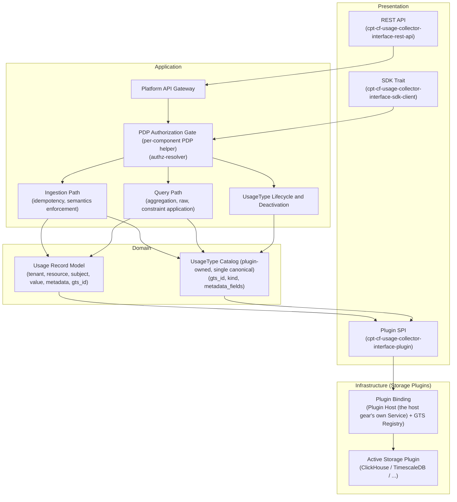
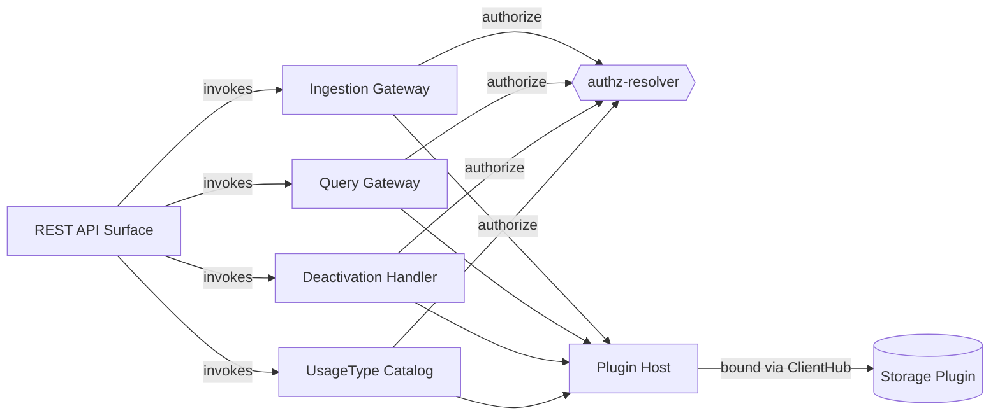
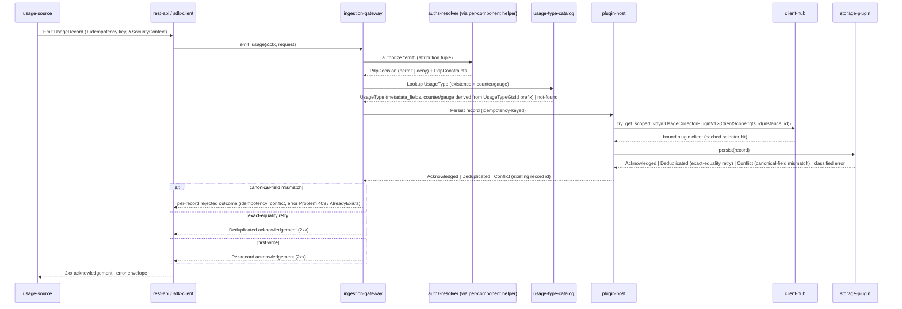
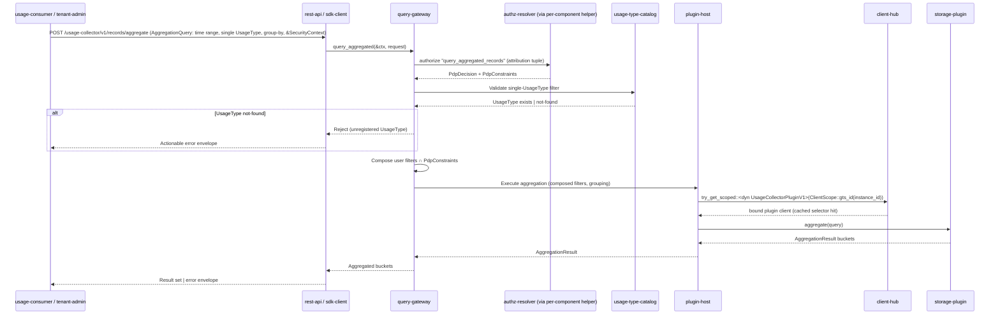
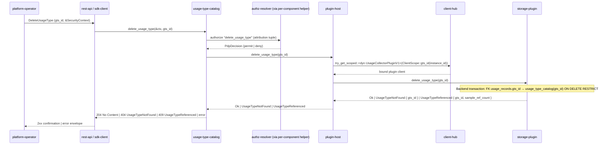
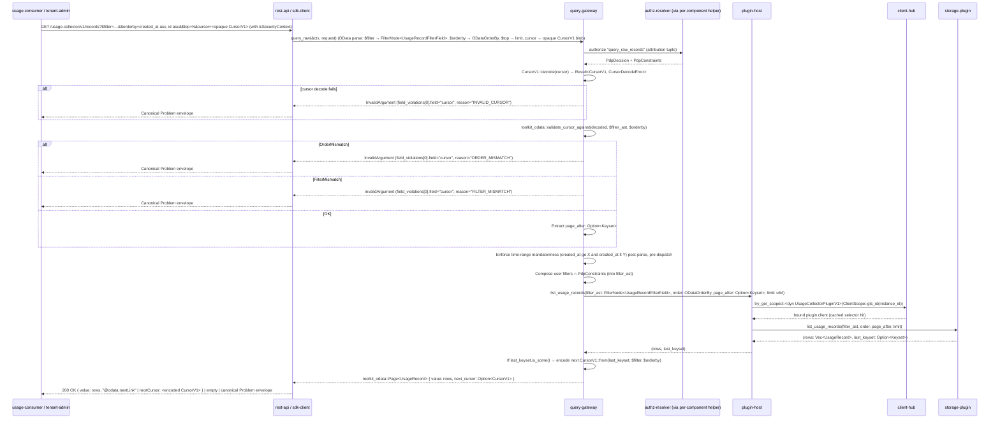
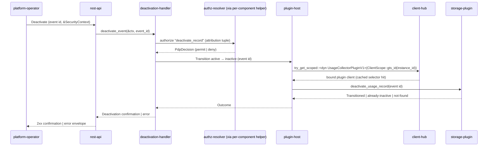

# Usage Collector — DESIGN

<!-- toc -->

- [1. Architecture Overview](#1-architecture-overview)
  - [1.1 Architectural Vision](#11-architectural-vision)
  - [1.2 Architecture Drivers](#12-architecture-drivers)
  - [1.3 Architecture Layers](#13-architecture-layers)
- [2. Principles & Constraints](#2-principles--constraints)
  - [2.1 Design Principles](#21-design-principles)
  - [2.2 Constraints](#22-constraints)
- [3. Technical Architecture](#3-technical-architecture)
  - [3.1 Domain Model](#31-domain-model)
  - [3.2 Component Model](#32-component-model)
  - [3.3 API Contracts](#33-api-contracts)
  - [3.4 Internal Dependencies](#34-internal-dependencies)
  - [3.5 External Dependencies](#35-external-dependencies)
  - [3.6 Interactions & Sequences](#36-interactions--sequences)
  - [3.7 Database schemas & tables](#37-database-schemas--tables)
  - [3.8 Deployment Topology](#38-deployment-topology)
  - [3.9 Security Architecture](#39-security-architecture)
  - [3.10 Consistency Contract](#310-consistency-contract)
  - [3.11 Performance and Operations Architecture](#311-performance-and-operations-architecture)
  - [3.12 Maintainability, Testing, UX, and Integration Architecture](#312-maintainability-testing-ux-and-integration-architecture)
- [4. Additional context](#4-additional-context)
- [5. Traceability](#5-traceability)

<!-- /toc -->

- [ ] `p3` - **ID**: `cpt-cf-usage-collector-design-usage-collector`

## 1. Architecture Overview

### 1.1 Architectural Vision

The Usage Collector is the platform's centralized metering store and query engine. It exposes three independently versioned surfaces — an in-process SDK trait for platform gears, a Plugin SPI for pluggable storage backends, and a REST API for remote callers — that converge on a single internal core enforcing ingestion semantics and idempotency before records reach the active storage plugin.

The architecture is contract-first and fail-closed: authentication is owned by the ToolKit gateway upstream; authorization is anchored at the platform PDP (`authz-resolver`); persistence is reached only through the Plugin SPI, with the active backend resolved lazily via the Plugin Host and GTS Registry. No business logic — pricing, billing, quota decisions — lives inside the collector; it is strictly a metering substrate.

### 1.2 Architecture Drivers

Requirements that significantly influence architecture decisions.

#### Functional Drivers

| Requirement | Design Response |
| --- | --- |
| `cpt-cf-usage-collector-fr-ingestion` | REST and SDK entry points funnel into a single core path; gateway authenticates and PDP authorizes the attribution tuple before plugin dispatch. |
| `cpt-cf-usage-collector-fr-idempotency` | Idempotency key is mandatory across SDK and REST. Dedup decisions are delegated to the active plugin: exact-equality retries are silently absorbed; differing canonical fields surface as a fail-closed `idempotency_conflict`. |
| `cpt-cf-usage-collector-fr-record-metadata` | Optional JSON metadata carried end-to-end. Metadata is closed-shape (`metadata_fields`-declared keys only, `String` values, undeclared keys rejected as `unknown_metadata_key` pre-dispatch). Core enforces a configurable size cap (default 8 KiB). |
| `cpt-cf-usage-collector-fr-counter-semantics` | Counter vs gauge is read from the UsageType's `kind` field. Accumulation of counter deltas into the signed `SUM` is the plugin's responsibility. |
| `cpt-cf-usage-collector-fr-gauge-semantics` | Gauges bypass monotonicity enforcement in the core and are stored as-is by the plugin; the kind lookup routes gauges directly to plugin persistence without delta accumulation. |
| `cpt-cf-usage-collector-fr-tenant-attribution` | Tenant is mandatory and caller-supplied. The gateway performs a defense-in-depth check; the PDP authorizes the caller against the supplied tenant before plugin dispatch. |
| `cpt-cf-usage-collector-fr-resource-attribution` | `resource_id` and `resource_type` are mandatory ingestion-contract fields, structurally validated by the core and authorized as part of the PDP attribution tuple. |
| `cpt-cf-usage-collector-fr-subject-attribution` | Subject is optional and caller-supplied; when present, the PDP authorizes the caller against it. The core never derives subject identity from `SecurityContext`. |
| `cpt-cf-usage-collector-fr-tenant-isolation` | Enforced exclusively through PDP authorization on every read and write; the core applies PDP-returned constraint filters to all queries before plugin dispatch. |
| `cpt-cf-usage-collector-fr-ingestion-authorization` | Single PDP check per record against the full attribution tuple plus a UsageType-existence lookup (via a `get_usage_type` SPI dispatch against the storage plugin) before any plugin write; failures fail-closed immediately. |
| `cpt-cf-usage-collector-fr-pluggable-storage` | A dedicated Plugin SPI covers persistence and query. The active backend is resolved lazily on first dispatch via Plugin Host and GTS Registry; `[usage_collector].vendor` (read at `Gear::init`) selects the plugin identity. |
| `cpt-cf-usage-collector-fr-query-aggregation` | Aggregated query is exposed on SDK and REST. The core enforces the mandatory single-UsageType and time-range filters, runs PDP authorization, and pushes server-side SUM/COUNT/MIN/MAX/AVG and grouping to the plugin. |
| `cpt-cf-usage-collector-fr-query-raw` | Raw query reuses the aggregated PDP-authorization + constraint-application pattern and returns cursor-paginated record pages. User-supplied filters can only narrow within the authorized scope. |
| `cpt-cf-usage-collector-fr-event-deactivation` | Status-only transition exposed on SDK and REST. The core authorizes via PDP, validates current status, and dispatches the one-way update to the plugin without altering any other field. |
| `cpt-cf-usage-collector-fr-usage-type-existence-and-semantics` | Single canonical catalog owned by the plugin. Counter vs gauge is read from the UsageType's `kind` field; every ingest performs the existence + `kind` + `metadata_fields` lookup via a per-record `get_usage_type` SPI dispatch against the storage plugin before plugin write dispatch. |
| `cpt-cf-usage-collector-fr-usage-type-registration` | Single ingress: REST/SDK call gated by PDP, writing to the plugin-owned catalog via the Plugin SPI. |
| `cpt-cf-usage-collector-fr-usage-type-deletion` | REST/SDK operator capability gated by PDP. |
| `cpt-cf-usage-collector-fr-data-classification` | N/A as architecture driver — realized transitively by `cpt-cf-usage-collector-constraint-pii-identity-layer` and the opaque-identifier handling of `RecordMetadata`, `UsageRecord`, and `SubjectRef`. No dedicated classification component. |

#### NFR Allocation

This table maps non-functional requirements from PRD to specific design/architecture responses, demonstrating how quality attributes are realized.

| NFR ID                                                 | NFR Summary                                                                                                                                                                        | Allocated To                              | Design Response                                                                                                                                                       | Verification Approach                                                                           |
| ------------------------------------------------------ | ---------------------------------------------------------------------------------------------------------------------------------------------------------------------------------- | ----------------------------------------- | --------------------------------------------------------------------------------------------------------------------------------------------------------------------- | ----------------------------------------------------------------------------------------------- |
| `cpt-cf-usage-collector-nfr-query-latency`             | Aggregation queries over 30-day single-tenant range p95 ≤ 500 ms                                                                                                                   | Plugin SPI + query path                   | Server-side aggregation and grouping pushed into the Plugin SPI so backends use native acceleration (materialized views, columnar indexes).                           | Load test against bound backend with 30-day single-tenant workloads.                            |
| `cpt-cf-usage-collector-nfr-availability`              | 99.95% monthly availability for ingestion                                                                                                                                          | Gateway + core ingestion path             | Stateless gateway and core behind the platform API gateway; deterministic errors enable idempotent caller retry.                                                      | Synthetic ingestion probes against 99.95% monthly budget.                                       |
| `cpt-cf-usage-collector-nfr-throughput`                | Sustained ≥ 10,000 records/sec                                                                                                                                                     | Core ingestion path + active plugin       | Plugin SPI accepts batched records to drive native bulk-write paths.                                                       | Sustained load test ≥ 10,000 records/sec against representative backends.                       |
| `cpt-cf-usage-collector-nfr-ingestion-latency`         | Ingestion p95 ≤ 200 ms under PRD §9 envelope                                                                                                                                       | Gateway + core + Plugin SPI               | PDP and catalog lookup on the synchronous hot path; plugin acknowledges durable acceptance in a single SPI call.                                                      | Latency benchmark under PRD §9 envelope, gateway entry to plugin ack.                           |
| `cpt-cf-usage-collector-nfr-workload-isolation`        | Query workloads do not degrade ingestion p95                                                                                                                                       | Core scheduling + Plugin SPI              | Ingestion and query use independent SPI methods so plugins can route them to isolated backend pools.                                                                  | Concurrent ingest+query load test confirming ingestion p95 holds.                               |
| `cpt-cf-usage-collector-nfr-query-freshness`           | Floor: ingestion ack durable and dedup-visible; Query SPI eventually consistent. Ceiling: per-plugin deployment guide.                                                             | Plugin SPI + per-plugin deployment guides | Gear publishes the floor; each plugin's deployment guide publishes its ceiling. Read-after-write uses the ingestion ack. No typed consistency-profile SPI in v1.    | Doc review for floor; per-plugin ceilings reviewed at plugin release readiness.                 |
| `cpt-cf-usage-collector-nfr-plugin-contract-stability` | SDK trait, Plugin SPI, REST API each stable within a major version                                                                                                                 | Public surface versioning                 | Each surface versions independently; additive-only within a major; at most one prior major supported concurrently.                                                    | Contract compatibility tests per release (compile-time for SDK/SPI; schema-diff for REST).      |
| `cpt-cf-usage-collector-nfr-throughput-profile`        | Sustained ≥ 10,000 records/sec; burst ≥ 30,000 records/sec for ≤ 5 min/60-min window; ≥ 100 concurrent aggregation queries; ≥ 700,000,000 accepted ingestion calls per 24-hour day | Topology + gateways + Plugin SPI          | Plugin SPI exposes batch ingestion and pushed-down aggregation for native bulk-write paths. | Load test the full envelope over ≥ 30-minute steady-state windows.                              |
| `cpt-cf-usage-collector-nfr-operational-visibility`    | 7 observable signals; correlation IDs on 100% of API operations; ≥ 30-day log retention; 5 alert categories                                                                        | All user-facing components + plugin host  | Each user-facing component emits the enumerated signals and propagates `SecurityContext.correlation_id`; alert thresholds anchored on the NFR-thresholds constraint.  | Dashboard and alert-threshold review against the 7-signal / 5-alert set on each major release. |

#### Key ADRs

| ADR ID                                                                        | Decision Summary                                                                                                                                                                                                                                                                                                                                                                                                                                                                                                                                                                                                                                                                                                                                                                                                                                                                                |
| ----------------------------------------------------------------------------- | ----------------------------------------------------------------------------------------------------------------------------------------------------------------------------------------------------------------------------------------------------------------------------------------------------------------------------------------------------------------------------------------------------------------------------------------------------------------------------------------------------------------------------------------------------------------------------------------------------------------------------------------------------------------------------------------------------------------------------------------------------------------------------------------------------------------------------------------------------------------------------------------------- |
| `cpt-cf-usage-collector-adr-pdp-centric-authorization`                        | Anchor authorization at the platform PDP (authz-resolver); the core neither caches PDP decisions nor maintains its own access table.                                                                                                                                                                                                                                                                                                                                                                                                                                                                                                                                                                                                                                                                                                                                                            |
| `cpt-cf-usage-collector-adr-pluggable-storage`                                | Reach persistence and query exclusively through the Plugin SPI for both `usage_records` and the usage-type catalog; operator configuration binds the active backend.                                                                                                                                                                                                                                                                                                                                                                                                                                                                                                                                                                                                                                                                                                                            |
| `cpt-cf-usage-collector-adr-caller-supplied-attribution`                      | Tenant, resource, and subject attribution are caller-supplied and PDP-authorized; the calling-gear identity is read from the caller's `SecurityContext`.                                                                                                                                                                                                                                                                                                                                                                                                                                                                                                                                                                                                                                                                                                                                          |
| `cpt-cf-usage-collector-adr-mandatory-idempotency`                            | The ingestion contract requires a client-provided idempotency key on every record across counter and gauge kinds.                                                                                                                                                                                                                                                                                                                                                                                                                                                                                                                                                                                                                                                                                                                                                                               |
| `cpt-cf-usage-collector-adr-monotonic-deactivation`                           | Individual event deactivation is a one-way `active → inactive` status transition; no reactivation; no other field mutation.                                                                                                                                                                                                                                                                                                                                                                                                                                                                                                                                                                                                                                                                                                                                                                     |
| `cpt-cf-usage-collector-adr-contract-stability`                               | REST API, SDK trait, and Plugin SPI each version independently under a major-version stability contract with at most one prior major supported.                                                                                                                                                                                                                                                                                                                                                                                                                                                                                                                                                                                                                                                                                                                                                 |
| `cpt-cf-usage-collector-adr-usage-compensation`                               | Usage compensation primitive: counter-only, append-only, strictly-negative `value` UsageRecord with `corrects_id` set (pointing at the ordinary usage row being offset) on the unified ingestion path; reduces `SUM` without mutating the original; no dedicated compensate endpoint / SDK method / SPI call.                                                                                                                                                                                                                                                                                                                                                                                                                                                                                                                                                                                   |
| `cpt-cf-usage-collector-adr-consistency-contract`                             | Floor-and-ceiling consistency contract: ingestion `Acknowledged` is durable and dedup-visible; the Query SPI (raw + aggregated + catalog) is eventually consistent with no upper bound at the gear floor; read-after-write flows MUST use the ingestion ack; each plugin's deployment guide MAY advertise a stronger ceiling. No typed `consistency_profile()` SPI method in v1.                                                                                                                                                                                                                                                                                                                                                                                                                                                                                                              |
| `cpt-cf-usage-collector-adr-0012-unified-plugin-catalog-and-gts-id-reference` | The plugin-DB usage-type catalog (managed via SDK/REST) is the sole catalog; usage records reference usage types by `gts_id` (all derived from the reserved base `gts.cf.core.uc.usage_record.v1~`). Catalog rows are flat: counter vs gauge lives in a `kind: UsageKind` column, and `metadata_fields: Vec<String>` declares the allowed keys (all values typed as String); no per-usage-type JSON Schema validator. |
| `cpt-cf-usage-collector-adr-deterministic-usage-record-id`                   | `UsageRecord.id` is gateway-derived, not caller-supplied: a deterministic UUIDv5 of the dedup key `(tenant_id, gts_id, idempotency_key)` under the fixed namespace `56313026-863b-4de8-b32b-1f96b67306ed` (`usage_collector_sdk::derive_usage_record_id`). The create request carries no identity field; a stray `id` is rejected `400`. Guarantees identity uniqueness by construction and eliminates false idempotency conflicts on exact retries. |

### 1.3 Architecture Layers



- [ ] `p3` - **ID**: `cpt-cf-usage-collector-tech-stack`

| Layer          | Responsibility                                                                                                  | Technology                                                                                                                            | Maintainability                                                                              |
| -------------- | --------------------------------------------------------------------------------------------------------------- | ------------------------------------------------------------------------------------------------------------------------------------- | -------------------------------------------------------------------------------------------- |
| Presentation   | REST API, SDK trait, and Plugin SPI surfaces for usage submit/query/deactivate and UsageType lifecycle.         | Axum + ToolKit `OperationBuilder` (OpenAPI in `usage-collector-v1.yaml`); Rust async traits registered in ClientHub.                   | Gear team; OpenAPI + trait diff gates.                                                     |
| Application    | PDP authorization, idempotency, semantics enforcement, orchestration of ingest / query / deactivation flows.    | ToolKit gateway (upstream AuthN + `SecurityContext`); `authz-resolver` PDP; in-process Rust orchestration.                             | Co-owned with platform identity-services team; contract-test gate on `authz-resolver`.       |
| Domain         | UsageType and UsageRecord types; counter/gauge derived from `UsageTypeGtsId` prefix at lookup.                  | In-process Rust domain types; plugin-owned catalog read per call via Plugin SPI.                                                      | Gear team; catalog SoR lives in the plugin.                                                |
| Infrastructure | Persists and queries records and catalog via the Plugin SPI; backend bound lazily via Plugin Host + GTS Registry. | Plugin Host + GTS Registry binding; pluggable backends (ClickHouse, TimescaleDB) selected by `[usage_collector].vendor` at `Gear::init`. | Co-owned by gear team (SPI) + each active plugin's team; SPI major-version policy.        |

## 2. Principles & Constraints

### 2.1 Design Principles

#### PDP-centric authorization

- [ ] `p1` - **ID**: `cpt-cf-usage-collector-principle-pdp-centric-authorization`

All read and write operations are authorized through the platform Policy Decision Point (`authz-resolver`) against the caller's SecurityContext (which carries the calling-gear identity) and the operation's full attribution tuple (tenant, resource, UsageType, and optionally subject). The Usage Collector neither caches PDP decisions nor maintains its own per-tenant or per-UsageType access table. For queries, PDP-returned constraint filters define the authorization boundary and are applied before any user-supplied filters narrow the result set. This keeps authorization policy in one place, eliminates duplicated access state inside the collector, and lets the platform evolve emit and read permissions without coordinated collector changes.

**ADRs**: `cpt-cf-usage-collector-adr-pdp-centric-authorization`, `cpt-cf-usage-collector-adr-caller-supplied-attribution`

#### Fail-closed behavior

- [ ] `p1` - **ID**: `cpt-cf-usage-collector-principle-fail-closed`

Every missing-`SecurityContext`, authorization, validation, and storage failure resolves to immediate rejection with a deterministic error. There is no anonymous bypass, no cached PDP decision, no synthesized identity (the collector never resolves credentials — authentication is owned by the ToolKit gateway upstream), no invented storage binding when the active plugin is unavailable, and no silent discard of denied emissions. Failing closed makes the metering substrate predictable for callers — retry semantics are governed by idempotency, not by recovering from ambiguous partial success — and prevents quiet data-quality regressions in billing-sensitive paths.

**ADRs**: `cpt-cf-usage-collector-adr-pdp-centric-authorization`

#### Idempotency-by-key

- [ ] `p1` - **ID**: `cpt-cf-usage-collector-principle-idempotency-by-key`

Every usage record carries a client-provided idempotency key, and a same-key submission resolves into exactly one of two outcomes. An exact-equality retry — where all caller-supplied canonical fields (`value`, `created_at`, `resource_ref`, `subject_ref`, and `metadata`) equal the stored record — is silently deduplicated and surfaced as a successful but deduplicated acknowledgement. A same-key submission with any differing canonical field (including a metadata-only difference) is a canonical-field-mismatch Conflict: it is rejected fail-closed (consistent with `cpt-cf-usage-collector-principle-fail-closed`) through the `idempotency_conflict` reason rather than silently dropped, so accidental key reuse with divergent content cannot mask data from billing and downstream consumers. This applies uniformly to counter and gauge kinds: counters cannot inflate their accumulated total on retry, and gauges cannot poison downstream rate-of-change or distinct-timestamp signals through duplicates. The idempotency window is unbounded — the key never expires, has no TTL, and is never intentionally reusable — so the `(tenant_id, gts_id, idempotency_key)` uniqueness is permanent. Idempotency-by-key makes at-least-once delivery safe end-to-end and removes the need for kind-dependent retry strategies in caller gears.

**ADRs**: `cpt-cf-usage-collector-adr-mandatory-idempotency`

#### Pluggable storage

- [ ] `p1` - **ID**: `cpt-cf-usage-collector-principle-pluggable-storage`

Persistence and query are accessed exclusively through the Plugin SPI; the active backend is resolved lazily on the first dispatch after the `types-registry` is consistent via the Plugin Host (the host gear's own Service) and GTS Registry, and the `[usage_collector].vendor` configuration value read once at `Gear::init` selects which plugin identity is materialized. The core does not directly couple to any backend SQL dialect, schema, or client library, so operators can choose the backend that fits their workload profile and meet the analytical latency and ingestion throughput thresholds via plugin-specific acceleration structures.

**ADRs**: `cpt-cf-usage-collector-adr-pluggable-storage`

#### Plugin resolution via ClientHub

- [ ] `p1` - **ID**: `cpt-cf-usage-collector-principle-plugin-resolution-via-client-hub`

Storage-plugin binding is resolved through the platform's `PluginV1<P>` GTS base type, `types-registry`, and `ClientHub` scoped registration. The Usage Collector SDK declares a unit-struct GTS spec `UsageCollectorPluginSpecV1` in `usage-collector-sdk/src/gts.rs` with `base = PluginV1` and an empty `properties = ""` (plugin instance metadata — `vendor`, `priority` — is carried by the `PluginV1<P>` base, not by usage-collector-specific spec data). Each plugin's `init()` calls `PluginV1::<UsageCollectorPluginSpecV1>::build_registration(...)`, publishes the instance payload through `TypesRegistryClient`, and registers a scoped `dyn UsageCollectorPluginV1` client in `ClientHub` under `ClientScope::gts_id(&instance_id)`. The host's `cpt-cf-usage-collector-component-plugin-host` holds a `GtsPluginSelector` that lazily resolves the bound plugin instance by querying `types-registry` with `UsageCollectorPluginSpecV1::gts_schema_id()` + configured vendor (lowest priority wins); per-request dispatch is an in-memory `ClientHub::try_get_scoped::<dyn UsageCollectorPluginV1>` lookup. Plugins are compiled in at the workspace level (static linkage), not dynamically loaded; the host crate has no compile-time dependency on any concrete plugin crate, and binding is settled at startup. See [plugin-spi.md §Host-side resolution flow](plugin-spi.md#host-side-resolution-flow) for the resolution flow code shape and [§3.6](#36-interactions-sequences) sequence diagrams for per-operation dispatch.

**ADRs**: `cpt-cf-usage-collector-adr-pluggable-storage`

#### Semantics enforcement

- [ ] `p1` - **ID**: `cpt-cf-usage-collector-principle-semantics-enforcement`

The ingestion path enforces semantics-dependent invariants before any record reaches the plugin — counter records with negative deltas are rejected, gauge records bypass monotonicity, and records referencing unknown UsageTypes are rejected outright. Counter vs gauge is read from the resolved UsageType's `kind` field (`UsageKind` enum). Centralizing enforcement in the core keeps the contract minimal while preserving the data-integrity guarantees downstream consumers depend on.

#### Monotonic deactivation

- [ ] `p1` - **ID**: `cpt-cf-usage-collector-principle-monotonic-deactivation`

Individual event deactivation is a one-way transition from active to `inactive` on the record's `status` field; the Usage Collector does not provide a reactivation operation and rejects deactivation requests against already-inactive records. No other property of the record is modified. Monotonic deactivation gives storage plugins, query consumers, and aggregation pipelines a first-class lifecycle event to reason about without re-introducing mutable-record semantics into the substrate.

**ADRs**: `cpt-cf-usage-collector-adr-monotonic-deactivation`

#### Contract stability

- [ ] `p2` - **ID**: `cpt-cf-usage-collector-principle-contract-stability`

The three public surfaces — REST API, SDK trait, and Plugin SPI — each version independently under a major-version stability contract: within a major version only additive changes are permitted, and the platform supports at most one prior major version concurrently per surface to give plugin authors, in-process consumers, and remote callers an explicit migration window. Treating contract stability as a first-class principle decouples ecosystem release schedules from the Usage Collector's own release train.

**ADRs**: `cpt-cf-usage-collector-adr-contract-stability`

#### Cursor gateway ownership

- [ ] `p1` - **ID**: `cpt-cf-usage-collector-principle-cursor-gateway-ownership`

The Query Gateway owns, issues, decodes, and validates the opaque continuation token (`toolkit_odata::CursorV1`) for raw-record reads. Plugins **MUST NOT** mint, encode, or interpret a wire cursor — they receive the structured `(filter_ast, order_keys, page_after, limit)` tuple and return `(rows, last_keyset)`. This keeps cursor versioning, signing posture, and validation rules at a single platform-owned location. See [§3.3](#33-api-contracts) Cursor & Pagination for the lifecycle and Problem mappings.

#### Canonical error envelope

- [ ] `p1` - **ID**: `cpt-cf-usage-collector-principle-canonical-errors`

The REST surface emits errors using `toolkit_canonical_errors::Problem` plus the platform's registered standard-errors set; the gear **MUST NOT** define a bespoke `Problem` schema. `Problem.context` is a GTS-typed payload whose concrete shape is selected by the discriminator named in `context.reason`. See [§3.3](#33-api-contracts) Error Envelopes for the discriminator vocabulary.

#### Canonical page envelope

- [ ] `p1` - **ID**: `cpt-cf-usage-collector-principle-canonical-page`

The Query Gateway's raw-read response uses the canonical `toolkit_odata::Page<UsageRecord>` envelope — `{ items: [UsageRecord], page_info: { next_cursor, prev_cursor, limit } }`. The gear **MUST NOT** define a bespoke paging schema for raw reads. Aggregated reads return a non-paginated typed body (see `cpt-cf-usage-collector-principle-aggregate-asymmetry`).

#### Aggregate asymmetry

- [ ] `p2` - **ID**: `cpt-cf-usage-collector-principle-aggregate-asymmetry`

The collector exposes two read shapes that intentionally differ. `GET /usage-collector/v1/records` is an OData list endpoint with cursor pagination; `POST /usage-collector/v1/records/aggregate` is a body-shaped RPC that returns a non-paginated result set. Toolkit's OData layer does not expose `$apply` (group-by / aggregate transforms), so paginating an aggregate response would add complexity without recovering safety. The asymmetry is the chosen contract.

#### OTLP push emission

- [x] `p2` - **ID**: `cpt-cf-usage-collector-principle-otlp-push-emission`

Operational telemetry is pushed via OTLP from ToolKit's global `SdkMeterProvider`. Instruments are constructed via `opentelemetry::global::meter_with_scope("usage_collector", …)` at gear bootstrap. See [§3.11.4](#3114-observability-architecture-applicability-ops-design-002) for the wiring and [§3.11.5](#3115-operational-metric-inventory-ops-design-002) for the instrument inventory.

#### Gateway HTTP server instrument reuse

- [x] `p2` - **ID**: `cpt-cf-usage-collector-principle-gateway-http-server-instrument-reuse`

The platform API gateway middleware in front of every REST handler emits a fixed set of OTel-semantic-conventions `http.server.*` instruments (request duration histogram, active requests gauge) that the gear **MUST NOT** redeclare. These instruments are exported through the same `SdkMeterProvider` and OTLP pipeline as the gear-scoped `uc_*` inventory and count as part of the gear's observability contract alongside the gear-scoped instruments.

### 2.2 Constraints

#### Plugin contract stability (major-version)

- [ ] `p2` - **ID**: `cpt-cf-usage-collector-constraint-plugin-contract-stability`

The Plugin SPI is bound by the platform's major-version stability contract: a plugin built against Plugin SPI version `N` must continue to function unchanged against every minor and patch release of `N.x`, and breaking changes must be expressed as a new major version that coexists with the prior major version for at least one migration window. This constrains the core's evolution of plugin-facing types — additive changes only within a major version — and forces breaking changes through a coordinated multi-major-version release cycle with every plugin implementation.

**ADRs**: `cpt-cf-usage-collector-adr-pluggable-storage`, `cpt-cf-usage-collector-adr-contract-stability`

#### No business logic in collector

- [ ] `p2` - **ID**: `cpt-cf-usage-collector-constraint-no-business-logic`

Pricing, rating, billing rules, invoice generation, and quota enforcement decisions are explicitly out of scope for the Usage Collector. The gear persists and serves usage data only; downstream consumers (billing, quota enforcement, dashboards) own all business logic and operate on the collector's aggregated and raw query results. This constraint shapes API surface design (no pricing fields, no quota-decision endpoints) and protects the metering substrate from coupling to product-level pricing models.

#### NFR thresholds (from PRD §6)

- [ ] `p2` - **ID**: `cpt-cf-usage-collector-constraint-nfr-thresholds`

The architecture must meet the PRD §6 thresholds simultaneously, evaluated against the PRD §9 load envelope: ingestion p95 ≤ 200 ms under the §9 load envelope (sustained ≥ 10,000 records/sec, with the §9 ±10% measurement tolerance), sustained ingestion ≥ 10,000 records/sec, aggregation queries over a 30-day single-tenant range p95 ≤ 500 ms, ingestion p95 unaffected by concurrent query workloads, and 99.95% monthly availability for ingestion endpoints. These thresholds constrain plugin selection (each backend must demonstrate it can satisfy the budget under the §9 envelope), workload isolation between ingestion and query paths, and capacity planning at every deployment.

#### PII handled by identity layer (not collector)

- [ ] `p2` - **ID**: `cpt-cf-usage-collector-constraint-pii-identity-layer`

Subject IDs stored by the Usage Collector are opaque internal platform identifiers issued and managed by the platform identity layer; PII management responsibilities belong to that layer rather than the collector. The Usage Collector treats subject and tenant identifiers as opaque strings throughout the ingestion, persistence, and query paths and does not attempt to interpret, redact, or classify them. This constrains the data model (no PII-sensitive fields in the record schema beyond opaque identifiers) and the operational posture (the Privacy by Design NFR is excluded at the gear boundary; see PRD §5.8 and §6.2).

Per-bullet applicability for downstream privacy controls:

- **Consent management**: Not applicable because handled by the platform identity layer.
- **Data-subject requests (DSR / GDPR / CCPA)**: Not applicable because handled by the platform identity layer and, for erasure specifically, by the platform legal/governance layer and the active storage plugin's purge mechanism (PRD §5.8 Data Lifecycle Delegation). Deactivation is intentionally not an erasure path: it is a status-only transition that keeps the record queryable. The Usage Collector does not host a gear-local DSR workflow.
- **Privacy Impact Assessment (PIA)**: Not applicable because handled by the platform identity layer; gear-level PIA is not required given the opaque-identifier-only data model.
- **Cross-border data transfer**: Not applicable because handled by the platform identity layer and by the active storage plugin's deployment posture (data residency follows the bound plugin's deployment region); see `cpt-cf-usage-collector-adr-pluggable-storage`.

**ADRs**: `cpt-cf-usage-collector-adr-caller-supplied-attribution`

#### Vendor and licensing pluggability

- [ ] `p2` - **ID**: `cpt-cf-usage-collector-constraint-vendor-pluggable`

Active constraint: no storage-vendor lock-in is permitted inside the gear. Persistence and query MUST be reached exclusively through `cpt-cf-usage-collector-interface-plugin` and `cpt-cf-usage-collector-contract-storage-plugin`; the core MUST NOT contain backend-specific SQL, schema, client libraries, or licensing assumptions. Active-plugin vendor (ClickHouse, TimescaleDB, …) is operator-selected at bootstrap and ships under its own license on an independent release schedule. Any gear change that would introduce a vendor-specific dependency requires a Plugin SPI major-version revision.

## 3. Technical Architecture

### 3.1 Domain Model

**Technology**: Rust types (SDK models, GTS identifiers for UsageType keys). Field-level schemas live in `domain-model.md`; wire surface is authoritative in `usage-collector-v1.yaml`.

**Core Entities**:

| Entity                                                           | Description                                                                                                                                                          | Schema            |
| ---------------------------------------------------------------- | -------------------------------------------------------------------------------------------------------------------------------------------------------------------- | ----------------- |
| UsageRecord       | A single attributed measurement of resource consumption: value, timestamp, attribution tuple, idempotency key, status, optional `corrects_id` back-reference, optional metadata. | `domain-model.md` |
| ResourceRef       | Caller-supplied composite identifying the attributed resource (`resource_id`, `resource_type`); mandatory on every UsageRecord, optional filter on queries.          | `domain-model.md` |
| SubjectRef         | Caller-supplied subject attribution (mandatory `subject_id`, optional `subject_type`); omitted for system-level consumption, optional filter on queries.             | `domain-model.md` |
| UsageType           | Platform-global UsageType definition keyed by a GTS identifier under `gts.cf.core.uc.usage_record.v1~`; carries a closed `UsageKind` enum and declared `metadata_fields`. | `domain-model.md` |
| IdempotencyKey | Caller-supplied opaque identifier that deduplicates retried submissions.                                                                                             | `domain-model.md` |
| RecordMetadata | Closed-shape JSON object carried on a UsageRecord; keys are constrained to the UsageType's declared `metadata_fields`, values typed as String.                       | `domain-model.md` |
| UsageRecordStatus | One-way lifecycle marker on a UsageRecord (`active` or `inactive`); monotonic transition only.                                                                       | `domain-model.md` |
| AggregationQuery | Aggregation request: time range, single-UsageType filter, optional attribution filters, aggregation function (SUM, COUNT, MIN, MAX, AVG), group-by dimensions.       | `domain-model.md` |
| RawQuery             | Raw-record request: time range, mandatory `gts_id`, optional attribution and declared-dimension filters, cursor-paginated.                                | `domain-model.md` |
| AggregationResult | Server-side aggregation output: grouped buckets carrying the chosen aggregation values for each dimension combination.                                               | `domain-model.md` |

**Relationships**:

- UsageRecord → UsageType: references a registered UsageType by `gts_id`.
- UsageRecord → IdempotencyKey: carries a mandatory caller-supplied dedup key.
- UsageRecord → ResourceRef: carries the mandatory resource attribution composite.
- UsageRecord → SubjectRef: optionally carries the subject attribution composite.
- UsageRecord → RecordMetadata: optionally carries a per-record JSON object whose keys match the UsageType's `metadata_fields`.
- UsageRecord → UsageRecordStatus: holds the record's lifecycle status; the deactivation transition cascades depth-1 from an ordinary row to its referencing counter compensations (see `cpt-cf-usage-collector-adr-monotonic-deactivation`).
- UsageRecord → UsageRecord: a counter compensation row references the ordinary row it offsets via `corrects_id`; depth-1 by construction.
- AggregationQuery → UsageType: targets exactly one UsageType.
- AggregationQuery → AggregationResult: produces grouped, aggregated buckets over its filter scope.
- RawQuery → UsageRecord: returns paginated raw UsageRecords matching its filters.

### 3.2 Component Model

The Usage Collector runs in a single process composed of a REST API surface, four domain components (Ingestion Gateway, Query Gateway, Deactivation Handler, UsageType Catalog), and a Plugin Host that lazily binds the active storage backend on first dispatch. Boundaries are drawn by responsibility, not by deployment artifact. Authentication and PDP enforcement are cross-cutting — see [PDP Authorization Posture](#pdp-authorization-posture-cross-cutting-no-separate-component) below.



#### Ingestion Gateway

- [ ] `p1` - **ID**: `cpt-cf-usage-collector-component-ingestion-gateway`

##### Why this component exists

Centralizes the synchronous ingestion path so every usage submission — REST or SDK, single or batched — flows through one place that validates attribution, authorizes the caller, enforces counter/gauge semantics against the UsageType Catalog, and dispatches to the active plugin. Without it, those rules would be re-implemented at every entry point.

##### Responsibility scope

Owns the ingestion contract end-to-end:

- Validates the structural attribution tuple (tenant, resource, optional subject, UsageType `gts_id`).
- Requires a caller-supplied idempotency key on every record.
- Applies counter/gauge invariants resolved against the UsageType Catalog — rejects negative counter deltas; accepts gauge values as-is. Counter vs gauge is read from the catalog row's `UsageKind` field.
- Enforces the configurable RecordMetadata size cap (default 8 KiB) and rejects oversized records with an actionable error.
- Surfaces deterministic per-record acceptance acknowledgements. Dedup-key collision handling (exact-equality on the caller-supplied canonical fields → `idempotency_conflict`, never a silent drop) is specified in [§3.3](#33-api-contracts).

##### Responsibility boundaries

Does NOT persist records directly — delegates to the Plugin Host. Does NOT register or mutate UsageTypes — Catalog lookups are read-only from this component. Does NOT interpret RecordMetadata content. Does NOT define authorization policy or authenticate callers — see [PDP Authorization Posture](#pdp-authorization-posture-cross-cutting-no-separate-component). Fails closed on any infrastructure-dependency unavailability.

##### Related components (by ID)

- `cpt-cf-usage-collector-contract-authz-resolver` — calls per-record for PDP authorization (see PDP Authorization Posture); covers `cpt-cf-usage-collector-fr-ingestion-authorization`, `cpt-cf-usage-collector-fr-tenant-attribution`, `cpt-cf-usage-collector-fr-resource-attribution`, `cpt-cf-usage-collector-fr-subject-attribution`.
- `cpt-cf-usage-collector-component-usage-type-catalog` — reads to resolve UsageType existence and counter/gauge semantics on every record; covers `cpt-cf-usage-collector-fr-counter-semantics`, `cpt-cf-usage-collector-fr-gauge-semantics`.
- `cpt-cf-usage-collector-component-plugin-host` — dispatches each accepted record (with idempotency key and metadata) to the bound storage plugin, which returns the dedup or `idempotency_conflict` outcome; covers `cpt-cf-usage-collector-fr-ingestion`, `cpt-cf-usage-collector-fr-idempotency`, `cpt-cf-usage-collector-fr-record-metadata`.

#### Query Gateway

- [ ] `p2` - **ID**: `cpt-cf-usage-collector-component-query-gateway`

##### Why this component exists

Serves the read side of the metering substrate — aggregated and raw queries — through one component that owns query authorization, filter composition, and dispatch to the active storage plugin. Centralizing the read path keeps PDP constraint application uniform across SDK and REST entry points and prevents user-supplied filters from widening the authorized scope.

##### Responsibility scope

Owns both query paths:

- **Aggregation**: mandatory time range and single-UsageType filter; optional tenant / subject / resource filters; server-side SUM / COUNT / MIN / MAX / AVG with grouping (`cpt-cf-usage-collector-fr-query-aggregation`).
- **Raw**: mandatory time range; optional UsageType / tenant / subject / resource filters; cursor-paginated (`cpt-cf-usage-collector-fr-query-raw`).

For both: validates structural filter requirements, runs PDP authorization, composes returned PdpConstraints with user-supplied filters so the result set can only narrow within the authorized scope, and dispatches the composed query through the Plugin Host. Honors tenant isolation by anchoring every read on the inbound `SecurityContext` and the PDP-returned constraints.

##### Responsibility boundaries

Does NOT execute aggregation or scan records itself — server-side aggregation and pagination are pushed into the Plugin SPI so the active backend can use native acceleration structures. Does NOT widen the PDP-authorized scope under any user-supplied filter (filters can only narrow). Does NOT cache query results. Does NOT authenticate callers or define authorization policy — see [PDP Authorization Posture](#pdp-authorization-posture-cross-cutting-no-separate-component).

##### Related components (by ID)

- `cpt-cf-usage-collector-contract-authz-resolver` — calls per query for the PDP decision and PdpConstraint set; covers `cpt-cf-usage-collector-fr-tenant-isolation`.
- `cpt-cf-usage-collector-component-plugin-host` — executes aggregation and raw-pagination queries against the bound storage plugin; covers `cpt-cf-usage-collector-fr-query-aggregation`, `cpt-cf-usage-collector-fr-query-raw`.
- `cpt-cf-usage-collector-component-usage-type-catalog` — validates the mandatory single-UsageType filter on aggregation queries before plugin dispatch; covers `cpt-cf-usage-collector-fr-usage-type-existence-and-semantics`.

#### UsageType Catalog

- [ ] `p2` - **ID**: `cpt-cf-usage-collector-component-usage-type-catalog`

##### Why this component exists

Holds the platform-global UsageType **type** definitions (GTS type id `gts_id`, declared `metadata_fields`) used to enforce counter/gauge invariants and validate declared dimensions on every ingestion call, validate UsageType existence on every aggregation query, and gate UsageType lifecycle operations. Without a single semantic owner, semantics enforcement and existence checks would have to round-trip to the storage plugin on every record, regressing ingestion latency below the NFR budget — even though the durable rows themselves live in the plugin.

##### Responsibility scope

This component is the **semantic owner** of the catalog surface; the **system of record** is the plugin's backend database. Both surfaces are bound together as follows:

- **Catalog model**: single and canonical. Durable rows live in the **plugin-owned** `usage_type_catalog` table alongside `usage_records`. No parallel gateway-side catalog.
- **Semantic ownership**: structural request validation, `gts_id` derivation check against the reserved abstract base `gts.cf.core.uc.usage_record.v1~`, `metadata_fields` well-formedness check.
- **Lifecycle**: registration, deletion, and existence-and-semantics enforcement (`cpt-cf-usage-collector-fr-usage-type-registration`, `cpt-cf-usage-collector-fr-usage-type-deletion`, `cpt-cf-usage-collector-fr-usage-type-existence-and-semantics`). On deletion the FK `usage_records.gts_id → usage_type_catalog(gts_id) ON DELETE RESTRICT` blocks unsafe deletes; this component surfaces the plugin-side rejection deterministically as `UsageTypeReferenced { gts_id, sample_ref_count }`.
- **Plugin SPI dispatch**: `create_usage_type`, `get_usage_type`, `list_usage_types`, `delete_usage_type` — dispatched via `cpt-cf-usage-collector-component-plugin-host`. Read-only `get_usage_type` is the call the Ingestion Gateway and Query Gateway make per record/query.
- **Entry-point uniformity**: both the REST handler and the SDK trait impl (`UsageCollectorClientImpl`) delegate into the same `UsageTypeCatalogService`. Counter vs gauge is read directly from the catalog row's closed `kind: UsageKind` field.

##### Responsibility boundaries

Does NOT persist any catalog row itself — durable persistence is delegated to the active storage plugin via the Plugin SPI. Does NOT enforce referential integrity on `usage_records → usage_type_catalog` itself — the FK lives in the plugin's backend transaction; this component only surfaces the `UsageTypeReferenced` error. Does NOT run a JSON-Schema validator or compile per-usage-type validators — per ADR-0012 (2026-06-02 amendment), `metadata_fields` is a closed list and admissibility is set-membership, not schema validation. Does NOT participate in any `types-registry` registration of UsageType definitions — UsageType types are NOT declared as GTS Instances of any platform base type; cross-gear discovery is served exclusively by `GET /usage-collector/v1/usage-types`. Does NOT enforce caller-gear-to-UsageType authorization — the PDP authorizes the supplied tenant/resource/subject against the caller's SecurityContext-derived gear identity (see [PDP Authorization Posture](#pdp-authorization-posture-cross-cutting-no-separate-component)). The in-plugin reference implementation of `usage_records.gts_id` (column type, index choice) is plugin-author choice and explicitly out of DESIGN scope.

##### Related components (by ID)

- `cpt-cf-usage-collector-contract-authz-resolver` — calls for PDP authorization of UsageType registration and deletion operator calls; covers `cpt-cf-usage-collector-fr-usage-type-registration`, `cpt-cf-usage-collector-fr-usage-type-deletion`.
- `cpt-cf-usage-collector-component-ingestion-gateway` — provides read-only UsageType existence and counter/gauge semantics lookups; covers `cpt-cf-usage-collector-fr-usage-type-existence-and-semantics`.
- `cpt-cf-usage-collector-component-query-gateway` — provides read-only UsageType existence checks for aggregation-query validation; covers `cpt-cf-usage-collector-fr-usage-type-existence-and-semantics`.

#### Deactivation Handler

- [ ] `p2` - **ID**: `cpt-cf-usage-collector-component-deactivation-handler`

##### Why this component exists

Owns the monotonic active→inactive status transition for individual usage records and keeps deactivation a status-only operation that does not modify any other field. Without a dedicated handler, deactivation semantics would risk leaking into the ingestion or query paths and re-introducing mutable-record patterns into the metering substrate.

##### Responsibility scope

Realizes `cpt-cf-usage-collector-fr-event-deactivation`: authorizes the operator, validates that the targeted UsageRecord is currently `active`, rejects requests against already-inactive records with an actionable error, and dispatches a status-only update to the bound storage plugin. Surfaces the one-way UsageRecordStatus transition as a first-class lifecycle event for downstream consumers without altering any other property of the record.

##### Responsibility boundaries

Does NOT modify any property of the record other than UsageRecordStatus. Does NOT provide a reactivation operation. Does NOT delete records — inactive records remain queryable through the Query Gateway. Does NOT define authorization policy — see [PDP Authorization Posture](#pdp-authorization-posture-cross-cutting-no-separate-component). Does NOT manage UsageType lifecycle.

##### Related components (by ID)

- `cpt-cf-usage-collector-contract-authz-resolver` — calls per operator request for PDP authorization; covers `cpt-cf-usage-collector-fr-event-deactivation`.
- `cpt-cf-usage-collector-component-plugin-host` — applies the status-only update against the bound storage plugin; covers `cpt-cf-usage-collector-fr-event-deactivation`.

#### Plugin Host (ClientHub-bound)

- [ ] `p2` - **ID**: `cpt-cf-usage-collector-component-plugin-host`

##### Why this component exists

Encapsulates the active storage backend behind the Plugin SPI so the Ingestion Gateway, Query Gateway, Deactivation Handler, and UsageType Catalog dispatch through one place — and so the active plugin can be swapped via operator configuration without touching any caller. Centralizing plugin dispatch is also where graceful-degradation and contract-stability guarantees are realized.

##### Responsibility scope

Owns the PluginBinding lifecycle and the in-process dispatch surface:

- **Binding**: resolves the configured GTS instance selector through the GTS Registry, materializes the binding lazily on first dispatch inside the host `Service` (no separate orchestrator), and registers the bound plugin in ClientHub with GTS instance scope.
- **Dispatch surface**: covers `usage_records` persistence (single and batched), raw and aggregated query, individual event deactivation, and the catalog SPI methods `create_usage_type`, `get_usage_type`, `list_usage_types`, `delete_usage_type` — dispatched on behalf of `cpt-cf-usage-collector-component-usage-type-catalog`.
- **Storage pluggability**: realizes `cpt-cf-usage-collector-fr-pluggable-storage` covering **both** `usage_records` and the `usage_type_catalog` table.
- **Error classification**: surfaces deterministic backend-classified errors so callers can apply retry, circuit-break, or fail-closed semantics without re-parsing backend-specific shapes — including the structured `UsageTypeReferenced { gts_id, sample_ref_count }` variant lifted from the plugin's FK-RESTRICT rejection on unsafe `delete_usage_type`.

##### Responsibility boundaries

Does NOT own any policy (semantics enforcement, attribution validation, authorization) — every call arrives already authorized and structurally validated. Does NOT serve a parallel cache or invent a binding when the GTS Registry is unreachable. Does NOT contain backend-specific SQL, schema, or client library code — the backend is reached only through the SPI. Does NOT split a logical operation across multiple backends — exactly one plugin instance is bound at a time.

##### Related components (by ID)

- `cpt-cf-usage-collector-component-ingestion-gateway` — invoked by for every persistence call; covers `cpt-cf-usage-collector-fr-pluggable-storage`.
- `cpt-cf-usage-collector-component-query-gateway` — invoked by for aggregated and raw query dispatch; covers `cpt-cf-usage-collector-fr-pluggable-storage`, `cpt-cf-usage-collector-fr-query-aggregation`, `cpt-cf-usage-collector-fr-query-raw`.
- `cpt-cf-usage-collector-component-deactivation-handler` — invoked by for status-only deactivation dispatch; covers `cpt-cf-usage-collector-fr-event-deactivation`.

#### PDP Authorization Posture (cross-cutting, no separate component)

PDP enforcement is realized per-domain-component, not by a centralized adapter. Each of `cpt-cf-usage-collector-component-ingestion-gateway`, `cpt-cf-usage-collector-component-query-gateway`, `cpt-cf-usage-collector-component-deactivation-handler`, and `cpt-cf-usage-collector-component-usage-type-catalog` calls `cpt-cf-usage-collector-contract-authz-resolver` directly through a shared, per-component PDP authorization helper (no centralized adapter) that wraps `authz-resolver-sdk`'s `PolicyEnforcer::access_scope_with(ctx, resource_type, action, resource_id, &request)`. Each per-operation call always pins `OWNER_TENANT_ID` (plus optional `RESOURCE_ID`) and selects whether PDP constraints are required by resource type: UsageType-catalog operations do not require constraints (an `allow_all` permit is a legitimate happy path), while usage-record ingestion / deactivation and raw-record list operations require the PDP to return scoping constraints and gate the returned scope against the operation's attribution (a returned constraint must pin the owning tenant, so an `allow_all` permit is denied fail-closed). Domain services pass their per-operation attribution tuple (tenant, resource, optional subject, UsageType `gts_id`) plus the inbound `&SecurityContext` (which carries the calling-gear identity for PDP evaluation) and receive `(PdpDecision, [PdpConstraint])` back. The collector NEVER consumes `authn-resolver` and NEVER synthesizes identity: the `SecurityContext` arrives already resolved either from the ToolKit gateway middleware (`OperationBuilder::authenticated()` → `Extension<SecurityContext>` on REST handlers) or directly from the in-process caller as the first argument to every `UsageCollectorClientV1` method. Fail-closed: PDP unavailability denies the operation deterministically with no cached decisions and no permissive fallback.

Actor cross-reference: `cpt-cf-usage-collector-actor-tenant-admin` actions reach the gear through the same REST + per-component PDP-helper path as every other caller — there is no tenant-admin-specific endpoint, sequence, or adapter; the role distinction is made entirely by the `cpt-cf-usage-collector-contract-authz-resolver` `PdpDecision` (permit / deny + tenant-scoped `PdpConstraint` filters) returned for the operation. The [§3.6](#36-interactions-sequences) query sequences (`cpt-cf-usage-collector-seq-query-aggregated`, `cpt-cf-usage-collector-seq-query-raw`) name `cpt-cf-usage-collector-actor-tenant-admin` in their Actors line for that reason.

### 3.3 API Contracts

The Usage Collector exposes three public surfaces: an in-process SDK trait consumed by platform gears, a Plugin SPI implemented by storage backends, and a REST API consumed by remote usage sources, operator tooling, and downstream consumers. Each surface versions independently. Detailed wire and trait specifications live in the sibling artifacts (`sdk-trait.md`, `plugin-spi.md`, `usage-collector-v1.yaml`) and are intentionally not duplicated here (per `INT-DESIGN-NO-001`, `DATA-DESIGN-NO-001`, `MAINT-DESIGN-NO-001`). `usage-collector-v1.yaml` is the authoritative machine-readable wire contract for REST; `sdk-trait.md` and `plugin-spi.md` are the reference specifications for the in-process surfaces.

#### SDK Trait — `cpt-cf-usage-collector-interface-sdk-client`

- **Contracts**: `cpt-cf-usage-collector-contract-downstream-usage-reader`
- **Technology**: In-process async Rust trait registered in ClientHub without scope
- **Location**: `sdk-trait.md`
- **Allocated To**: `cpt-cf-usage-collector-component-ingestion-gateway`, `cpt-cf-usage-collector-component-query-gateway`, `cpt-cf-usage-collector-component-deactivation-handler`, `cpt-cf-usage-collector-component-usage-type-catalog`

In-process surface covering ingestion (`cpt-cf-usage-collector-fr-ingestion`, `cpt-cf-usage-collector-fr-idempotency`, `cpt-cf-usage-collector-fr-usage-compensation`), raw query (`cpt-cf-usage-collector-fr-query-raw`), aggregated query (`cpt-cf-usage-collector-fr-query-aggregation`), individual event deactivation (`cpt-cf-usage-collector-fr-event-deactivation`), and UsageType catalog management. The operation set, method signatures, domain types, error taxonomy, and versioning policy are defined in `sdk-trait.md`.

#### Plugin SPI — `cpt-cf-usage-collector-interface-plugin`

- **Contracts**: `cpt-cf-usage-collector-contract-storage-plugin`
- **Technology**: Async Rust SPI trait registered in ClientHub with GTS instance scope
- **Location**: `plugin-spi.md`
- **Allocated To**: `cpt-cf-usage-collector-component-plugin-host`

Storage plugin SPI implemented by each backend (e.g., ClickHouse, TimescaleDB) for both `usage_records` and `usage_type_catalog` persistence (per ADR-0012). Co-locating both tables on the active plugin's backend lets the FK `usage_records.gts_id → usage_type_catalog(gts_id) ON DELETE RESTRICT` run inside a single backend transaction. The active plugin per GTS instance scope is selected by operator configuration and bound through `cpt-cf-usage-collector-contract-gts-registry`. The operation set, method contracts, domain types, error taxonomy, trace-context propagation, and versioning policy are defined in `plugin-spi.md`.

#### REST API — `cpt-cf-usage-collector-interface-rest-api`

- **Contracts**: `cpt-cf-usage-collector-contract-downstream-usage-reader`
- **Technology**: HTTP REST + OpenAPI 3 (major version reflected in the URL prefix)
- **Location**: `usage-collector-v1.yaml`
- **Allocated To**: `cpt-cf-usage-collector-component-ingestion-gateway`, `cpt-cf-usage-collector-component-query-gateway`, `cpt-cf-usage-collector-component-deactivation-handler`, `cpt-cf-usage-collector-component-usage-type-catalog`

Full HTTP REST operation surface, served behind the platform API gateway. Authentication is owned by the ToolKit gateway upstream of the collector; PDP authorization (`cpt-cf-usage-collector-contract-authz-resolver`) is on the critical path of every operation with no anonymous bypass and no cached decisions. The production OAS is emitted at runtime by `OpenApiRegistryImpl` and a CI drift-check diffs it against `usage-collector-v1.yaml` to fail the build on any divergence in paths, methods, operationIds, tags, parameters, or response schemas.

#### Aggregate Asymmetry

Per `cpt-cf-usage-collector-principle-aggregate-asymmetry` ([§2.1](#21-design-principles)), the collector exposes two read shapes that intentionally differ. `GET /usage-collector/v1/records` is an OData list endpoint (filter / order / cursor) that satisfies open-ended raw exploration with stable keyset pagination over `(created_at, id)`. `POST /usage-collector/v1/records/aggregate` is a body-shaped RPC that takes a typed aggregation request and returns a non-paginated result set. Toolkit's OData layer does not expose `$apply` (group-by / aggregate transforms), and the aggregate response is bounded by `group_by` cardinality rather than by row volume, so paginating it would add complexity without recovering safety.

#### Endpoints Overview

| Path                                          | Method   | OperationId                                | Tag                 |
| --------------------------------------------- | -------- | ------------------------------------------ | ------------------- |
| `/usage-collector/v1/records`                 | `POST`   | `usage_collector.ingest_usage_records`     | `Ingestion`         |
| `/usage-collector/v1/records`                 | `GET`    | `usage_collector.query_raw_records`        | `Query`             |
| `/usage-collector/v1/records/aggregate`       | `POST`   | `usage_collector.query_aggregated_records` | `Query`             |
| `/usage-collector/v1/records/{id}/deactivate` | `POST`   | `usage_collector.deactivate_record`        | `Deactivation`      |
| `/usage-collector/v1/usage-types`             | `GET`    | `usage_collector.list_usage_types`         | `UsageType Catalog` |
| `/usage-collector/v1/usage-types`             | `POST`   | `usage_collector.create_usage_type`        | `UsageType Catalog` |
| `/usage-collector/v1/usage-types/{gts_id}`    | `GET`    | `usage_collector.get_usage_type`           | `UsageType Catalog` |
| `/usage-collector/v1/usage-types/{gts_id}`    | `DELETE` | `usage_collector.delete_usage_type`        | `UsageType Catalog` |

All data paths are namespaced under `/usage-collector/v1/`. OperationIds follow `gear.snake_case` (`usage_collector.<verb_object>`); tags use Title Case drawn from `Ingestion`, `Query`, `Deactivation`, `UsageType Catalog`. Platform-level liveness and readiness probes are handled by the ToolKit host outside this gear; the collector does not expose gear-local health endpoints. Request/response schemas, parameters, and capacity caps are defined in `usage-collector-v1.yaml`.

**Single ingestion path for both ordinary measurements and counter compensations.** `POST /usage-collector/v1/records` is the only ingestion path. Each record carries a signed `value` plus an optional `corrects_id`; presence of `corrects_id` is the sole structural discriminator between an ordinary usage row and a counter compensation row (`cpt-cf-usage-collector-adr-usage-compensation`). No dedicated compensate endpoint, SDK method, or Plugin SPI call exists — compensation rides the existing ingestion path everywhere.

**Deactivation cascade is depth-1 by construction.** `POST /usage-collector/v1/records/{id}/deactivate` returns `204 No Content`; the cascade — targeted row plus every currently-active counter compensation referencing it — is committed atomically inside a single backend transaction. Depth-1 is structural: a `corrects_id` may not target a row whose own `corrects_id IS NOT NULL`, so no second hop is possible (`cpt-cf-usage-collector-adr-monotonic-deactivation`).

#### Cursor & Pagination

Per `cpt-cf-usage-collector-principle-cursor-gateway-ownership` ([§2.1](#21-design-principles)), the Query Gateway uses ToolKit's canonical cursor envelope, `toolkit_odata::CursorV1`, as the opaque continuation token for raw-record reads. The cursor is **owned, issued, decoded, and validated at the gateway**; the Plugin SPI never sees the wire-level token — it receives a structured `(filter_ast, order_keys, page_after, limit)` tuple and returns `(rows, last_keyset)`. Pagination is anchored on the canonical unique keyset `(created_at, id)`: the gateway appends that pair (direction-aware) as a tiebreaker suffix to whatever order the caller requests — defaulting to it outright when `$orderby` is omitted — so the effective order always ends in a globally-unique key. The monotonic-tiebreaker invariant then guarantees successive page boundaries do not skip or repeat rows within a stable filter scope, including under an explicit `$orderby` whose leading key is non-unique. Plugins MUST NOT mint, encode, or interpret a wire cursor — that keeps cursor versioning, signing posture, and validation rules at a single platform-owned location (`toolkit_odata`).

#### Canonical Page Envelope

Per `cpt-cf-usage-collector-principle-canonical-page` ([§2.1](#21-design-principles)), raw-read responses use `toolkit_odata::Page<UsageRecord>`; the gear does not define a bespoke paging schema. Aggregated reads return a non-paginated typed body.

#### Error Envelopes

Errors follow the canonical `toolkit_canonical_errors::Problem` envelope per `cpt-cf-usage-collector-principle-canonical-errors` ([§2.1](#21-design-principles)). UC does not define a private HTTP-status table — the status is a property of the AIP-193 category, owned by `toolkit_canonical_errors::CanonicalError::IntoResponse`. The variant → canonical-category lift is documented in `sdk-trait.md` "Error Taxonomy"; the `Problem.context.reason` vocabulary is additive within the major-version stability contract (`cpt-cf-usage-collector-adr-contract-stability`) and is not enumerated as a closed wire surface.

#### Startup-time plugin binding

Per `cpt-cf-usage-collector-principle-plugin-resolution-via-client-hub` ([§2.1](#21-design-principles)), the host's binding to a concrete plugin is settled once at startup via `types-registry` + ClientHub and cached for the `Service`'s lifetime; configuration changes take effect at gear restart. Resolution flow, GTS pattern, and per-request dispatch shape are defined in [plugin-spi.md §Host-side resolution flow](plugin-spi.md#host-side-resolution-flow).

### 3.4 Internal Dependencies

In-process platform gears consumed by the Usage Collector via SDK clients on ClientHub. Integration detail (driver, data, availability, compatibility) lives in [§3.5](#35-external-dependencies); call sites are visible in the [§3.6](#36-interactions-sequences) sequences.

| Dependency Gear | Interface Used | Purpose |
|---|---|---|
| `authz-resolver` | SDK client (`PolicyEnforcer`) via ClientHub, realising `cpt-cf-usage-collector-contract-authz-resolver` | PDP permit/deny + `PdpConstraint` filters for every ingestion, query, deactivation, and UsageType operation. |
| `gts-registry` | SDK client (`TypesRegistryClient`) via ClientHub, realising `cpt-cf-usage-collector-contract-gts-registry` | Resolves the configured GTS selector to the bound storage-plugin instance. |

### 3.5 External Dependencies

Integration contracts the Usage Collector consumes from the platform or provides outward. Direction, availability, and compatibility posture follow PRD §7.2. Plugin discovery and dispatch follow the standard `PluginV1<P>` + `types-registry` + `ClientHub` pattern — full code shape in [plugin-spi.md](plugin-spi.md#host-side-resolution-flow).

#### Platform PDP

- **Contract**: `cpt-cf-usage-collector-contract-authz-resolver`
- **Consumed by**: ingestion-gateway, query-gateway, deactivation-handler, usage-type-catalog (each via a shared, per-component PDP authorization helper; no centralized adapter)

| Aspect | Detail |
|--------|--------|
| Direction | Consumed (Usage Collector → PDP) |
| Driver | `PolicyEnforcer::access_scope_with(ctx, …)` from `authz-resolver-sdk` |
| Data | `SecurityContext` (carries the calling-gear identity) + attribution tuple (tenant, resource, optional subject, UsageType `gts_id`); returns permit/deny + `PdpConstraint` filters |
| Availability | Critical-path; fail-closed on unreachable. No cached decisions, no permissive fallback. |
| Compatibility | Follows platform authorization protocol; breaking changes require coordinated release |

#### GTS Registry

- **Contract**: `cpt-cf-usage-collector-contract-gts-registry`
- **Consumed by**: `cpt-cf-usage-collector-component-plugin-host`

| Aspect | Detail |
|--------|--------|
| Direction | Consumed (plugin identity resolution) |
| Driver | `TypesRegistryClient` lookup by `UsageCollectorPluginSpecV1::gts_schema_id()` + configured vendor (lowest `PluginV1.priority` wins) |
| Data | GTS instance identifiers; resolved `GtsInstanceId` cached in `GtsPluginSelector` for the `Service`'s lifetime |
| Availability | Lazy resolve on first dispatch. No matching instance ⇒ `PluginUnavailable`. Already-resolved binding tolerates transient registry unavailability. `[usage_collector].vendor` is read once at `Gear::init`; rebinding requires gear restart. |
| Compatibility | Selector identifiers and binding shape follow platform GTS Registry protocol; breaking changes require coordinated release with registry and all plugin implementations |

#### Storage Plugin SPI

- **Contract**: `cpt-cf-usage-collector-contract-storage-plugin`
- **Interface**: `cpt-cf-usage-collector-interface-plugin` (SPI offered to plugin authors; e.g. ClickHouse, TimescaleDB)
- **Dispatched by**: `cpt-cf-usage-collector-component-plugin-host` on behalf of all four domain components

| Aspect | Detail |
|--------|--------|
| Direction | Provided (library SPI); plugins ship on independent release schedules |
| Driver | Trait dispatch via `ClientHub::try_get_scoped::<dyn UsageCollectorPluginV1>` keyed by `ClientScope::gts_id(&instance_id)`, per `cpt-cf-usage-collector-fr-pluggable-storage` |
| Data | Method contracts (persistence, raw/aggregated query, deactivation, UsageType catalog CRUD, error variants) live in [plugin-spi.md §Method Contracts](plugin-spi.md#method-contracts) |
| Availability | Plugin owns its SLO; gateway dispatches per call — no parallel cache, no invented binding |
| Compatibility | `cpt-cf-usage-collector-nfr-plugin-contract-stability`: stable across minor/patch within a major; breaking changes ship as a new major coexisting with the prior major during a migration window |

#### Downstream Usage Reader

- **Contract**: `cpt-cf-usage-collector-contract-downstream-usage-reader`
- **Served by**: `cpt-cf-usage-collector-component-query-gateway` (record reads) and `cpt-cf-usage-collector-component-usage-type-catalog` (UsageType reads)

| Aspect | Detail |
|--------|--------|
| Direction | Provided (read-only). Pull-only by design — no push/subscribe surface. |
| Driver | REST `cpt-cf-usage-collector-interface-rest-api` (out-of-process) + SDK `cpt-cf-usage-collector-interface-sdk-client` (in-process). Wire contract: §3.3 + `usage-collector-v1.yaml`. |
| Data | Raw reads (`GET /records`) and aggregated reads (`POST /records/aggregate`). Business logic (pricing, rating, quota decisions) MUST NOT run inside the Usage Collector. |
| Availability | `cpt-cf-usage-collector-nfr-query-latency` + `cpt-cf-usage-collector-nfr-availability`. PDP fail-closed. Readers MUST NOT invent usage state when UC is unreachable. |
| Compatibility | At most one prior major version of REST API + SDK trait supported concurrently. Additive changes within a major do not break readers. |

**Dependency Rules** (per project conventions):

- No circular dependencies
- Always use SDK gears for inter-gear communication
- No cross-category sideways deps except through contracts
- Only integration/adapter gears talk to external systems
- `SecurityContext` must be propagated across all in-process calls

### 3.6 Interactions & Sequences

The sequences below realize every PRD §8 use case. Each enters through the
public surface (`cpt-cf-usage-collector-interface-rest-api` or
`cpt-cf-usage-collector-interface-sdk-client`) carrying a resolved
`SecurityContext` — populated upstream by the ToolKit gateway on REST, supplied
directly by the in-process caller on SDK — runs PDP authorization inline
through a per-component PDP authorization helper against `cpt-cf-usage-collector-contract-authz-resolver`,
and dispatches through the Plugin Host
(`cpt-cf-usage-collector-component-plugin-host`) to the active Storage Plugin
via `cpt-cf-usage-collector-contract-storage-plugin`. Authentication is owned
upstream and is not modeled here; authorization is fail-closed on every path.
The `PH → Hub → SP` arrow shorthand denotes a `ClientHub::try_get_scoped`
lookup against the resolved plugin instance — see
[plugin-spi.md §Host-side resolution flow](plugin-spi.md#host-side-resolution-flow)
for resolution, caching, and rebind semantics.

#### Emit Usage Record

**ID**: `cpt-cf-usage-collector-seq-emit-usage`

**Use cases**: `cpt-cf-usage-collector-usecase-emit`

**Actors**: `cpt-cf-usage-collector-actor-usage-source`

**References**: `cpt-cf-usage-collector-fr-ingestion`,
`cpt-cf-usage-collector-fr-ingestion-authorization`,
`cpt-cf-usage-collector-fr-idempotency`,
`cpt-cf-usage-collector-fr-usage-compensation`,
`cpt-cf-usage-collector-adr-usage-compensation`,
[`features/usage-emission.md`](./features/usage-emission.md)



**Description**: The Ingestion Gateway authorizes the caller against the full
attribution tuple (tenant, resource, optional subject,
UsageType `gts_id`), then enforces UsageType existence and counter/gauge
invariants through the UsageType Catalog before plugin dispatch. Compensation
ingestion rides this same path: when a record carries `corrects_id`, the L1
referential check runs pre-dispatch — the referenced row must exist, must
itself carry `corrects_id IS NULL`, must share `(tenant_id, gts_id)`,
and must be `active`. On a dedup-key collision the plugin decides by exact
equality of the caller-supplied canonical fields: an exact-equality retry is
absorbed as `Deduplicated`; a mismatch returns the conflicting record's id as
a per-record `rejected` outcome (`idempotency_conflict`). Authorization
denial, validation failure, and unknown UsageType reject before any record is
persisted.

#### Query Aggregated Usage

**ID**: `cpt-cf-usage-collector-seq-query-aggregated`

**Use cases**: `cpt-cf-usage-collector-usecase-query-aggregated`

**Actors**: `cpt-cf-usage-collector-actor-usage-consumer`, `cpt-cf-usage-collector-actor-tenant-admin`

**References**: `cpt-cf-usage-collector-fr-query-aggregation`,
`cpt-cf-usage-collector-fr-usage-type-existence-and-semantics`,
`cpt-cf-usage-collector-principle-aggregate-asymmetry`



**Description**: The Query Gateway intersects user-supplied filters with
PDP-returned constraints — the authorized scope can only narrow, never widen.
PDP denial or empty constraints fail closed. An unregistered UsageType filter
is rejected before plugin dispatch; a registered UsageType with no matching
records returns an empty result set, not an error.

#### Register UsageType

**ID**: `cpt-cf-usage-collector-seq-register-usage-type`

**Use cases**: `cpt-cf-usage-collector-usecase-register-usage-type`

**Actors**: `cpt-cf-usage-collector-actor-platform-operator`

**References**: `cpt-cf-usage-collector-fr-usage-type-registration`,
`cpt-cf-usage-collector-fr-usage-type-existence-and-semantics`,
`cpt-cf-usage-collector-adr-0012-unified-plugin-catalog-and-gts-id-reference`

```mermaid
sequenceDiagram
    participant Operator as platform-operator
    participant Surface as rest-api / sdk-client
    participant MC as usage-type-catalog
    participant PDP as authz-resolver (via per-component helper)
    participant PH as plugin-host
    participant Hub as client-hub
    participant SP as storage-plugin
    Operator ->> Surface: RegisterUsageType (gts_id, kind, metadata_fields, &SecurityContext)
    Surface ->> MC: create_usage_type(&ctx, request)
    MC ->> PDP: authorize "create_usage_type" (attribution tuple)
    PDP -->> MC: PdpDecision (permit | deny)
    MC ->> MC: Validate gts_id (UsageTypeGtsId derivation from gts.cf.core.uc.usage_record.v1~) and metadata_fields (unique non-empty strings); kind already validated as closed UsageKind enum at the UsageKind::from_str handler-boundary parse
    MC ->> PH: create_usage_type(row { gts_id, kind, metadata_fields })
    PH ->> Hub: try_get_scoped::<dyn UsageCollectorPluginV1>(ClientScope::gts_id(instance_id))
    Hub -->> PH: bound plugin client
    PH ->> SP: create_usage_type(row)
    SP -->> PH: Ok | UsageTypeAlreadyExists { gts_id }
    PH -->> MC: Ok | UsageTypeAlreadyExists { gts_id }
    MC -->> Surface: Registered UsageType | error
    Surface -->> Operator: 2xx confirmation | error envelope
```

**Description**: The UsageType Catalog authorizes the operator, validates
that `metadata_fields` is a list of unique non-empty strings, and dispatches
`create_usage_type` to the active plugin. `gts_id` well-formedness — including
derivation from the reserved abstract base `gts.cf.core.uc.usage_record.v1~`
with at least one further `~`-separated segment — is enforced upstream at the
`UsageTypeGtsId::new` boundary, not inside this service. The plugin enforces
the `gts_id` UNIQUE constraint in its backend transaction and returns
`UsageTypeAlreadyExists { gts_id }` on collision. Once acknowledged the
UsageType is immediately available for ingestion across all tenants; counter
vs gauge is derived per lookup from the `UsageTypeGtsId` prefix.

#### Delete UsageType

**ID**: `cpt-cf-usage-collector-seq-delete-usage-type`

**Use cases**: `cpt-cf-usage-collector-usecase-delete-usage-type`

**Actors**: `cpt-cf-usage-collector-actor-platform-operator`

**References**: `cpt-cf-usage-collector-fr-usage-type-deletion`,
`cpt-cf-usage-collector-adr-0012-unified-plugin-catalog-and-gts-id-reference`



**Description**: Two steps: PDP authorize, then dispatch `delete_usage_type`
to the active plugin. The plugin's backend transaction enforces the FK
`usage_records.gts_id → usage_type_catalog(gts_id) ON DELETE RESTRICT`
atomically — missing rows surface as `UsageTypeNotFound { gts_id }` and
referencing records as the structured
`UsageTypeReferenced { gts_id, sample_ref_count }`; a successful delete drops
the row inside the same transaction. A deleted `gts_id` becomes available
for re-registration.

#### Query Raw Usage Records

**ID**: `cpt-cf-usage-collector-seq-query-raw`

**Use cases**: `cpt-cf-usage-collector-usecase-query-raw`

**Actors**: `cpt-cf-usage-collector-actor-usage-consumer`, `cpt-cf-usage-collector-actor-tenant-admin`

**References**: `cpt-cf-usage-collector-fr-query-raw`,
`cpt-cf-usage-collector-principle-cursor-gateway-ownership`,
`cpt-cf-usage-collector-principle-canonical-errors`,
`cpt-cf-usage-collector-principle-canonical-page`



**Description**: The Query Gateway owns the cursor lifecycle end-to-end: it
decodes the opaque `CursorV1`, validates it against the current `$filter` /
`$orderby` (mismatches return canonical Problem envelopes), enforces the
mandatory `(created_at ge X) and (created_at lt Y)` window after OData parsing,
and re-encodes the plugin-returned `last_keyset` (over the canonical
`(created_at, id)` `Keyset`) into the next `CursorV1`. The plugin sees only
the structured tuple `(filter_ast, order, page_after, limit)` and returns
`(rows, last_keyset)` — never an encoded cursor. An empty match within the
authorized scope returns an empty `value`, not an error.

#### Deactivate Usage Event

**ID**: `cpt-cf-usage-collector-seq-deactivate-event`

**Use cases**: `cpt-cf-usage-collector-usecase-deactivate-event`

**Actors**: `cpt-cf-usage-collector-actor-platform-operator`

**References**: `cpt-cf-usage-collector-fr-event-deactivation`,
`cpt-cf-usage-collector-adr-monotonic-deactivation`,
`cpt-cf-usage-collector-adr-usage-compensation`,
`cpt-cf-usage-collector-principle-monotonic-deactivation`



**Description**: The Deactivation Handler authorizes the operator and issues
a single atomic status-only transition through the Plugin SPI's
`deactivate_usage_record`. The plugin enforces `active → inactive`
monotonicity at the storage layer: concurrent races resolve as
first-commit-wins, with the second surfacing `UsageRecordAlreadyInactive`.
**Depth-1 cascade**: when the deactivated row is an ordinary usage row
(`corrects_id IS NULL`), the same plugin step atomically flips every
currently-active counter compensation row whose `corrects_id` references it
to `inactive` inside the same backend transaction. The cascade is strictly
depth-1 by construction — L1 rejects any `corrects_id` that targets a row
with `corrects_id IS NOT NULL`, so no second hop is possible. Only the
`status` column is modified; inactive records remain queryable through the
Query Gateway.

### 3.7 Database schemas & tables

The Usage Collector gateway is **stateless**: it owns no durable tables
and opens no database connections. The two logical persistence anchors
the gateway dispatches against — the usage-type catalog and the usage
records store — are wholly plugin-owned per
[ADR-0012](./ADR/0012-unified-plugin-catalog-and-gts-id-reference.md)
and reached exclusively through `cpt-cf-usage-collector-interface-plugin`.

Concrete table shapes — column types, primary keys, indexes,
partitioning, retention, materialized views, acceleration structures —
are plugin-internal per `DATA-DESIGN-NO-001` and are owned by each
plugin's own DESIGN document.

### 3.8 Deployment Topology

- [ ] `p3` - **ID**: `cpt-cf-usage-collector-topology-gear-runtime`

Usage Collector is a stateless ToolKit gear deployed as a horizontally scalable instance set behind the ToolKit API gateway; durable state is reached exclusively through the ClientHub-bound storage plugin (`cpt-cf-usage-collector-component-plugin-host`). There is no leader election, no sharding, and no gear-owned background coordination, so any instance can serve any request — this is how the topology realizes `cpt-cf-usage-collector-nfr-availability` (99.95%), `cpt-cf-usage-collector-nfr-throughput` (≥10K records/sec), and `cpt-cf-usage-collector-nfr-workload-isolation` (ingestion/query separation is deferred to the storage tier).

**Out of scope**: concrete instance counts, autoscaling thresholds, network zoning, secret distribution, observability pipelines, and storage backend HA configuration are platform-operations-owned (per `OPS-DESIGN-NO-001`) and live in platform ops docs and the active plugin's deployment guide.

### 3.9 Security Architecture

- [ ] `p2` - **ID**: `cpt-cf-usage-collector-design-security-architecture`

The Usage Collector is a platform-internal metering substrate. Authentication, session lifecycle, MFA / SSO, credential storage, authentication timeout, TLS termination, CORS, network zoning, at-rest encryption, key management, identifier masking, record disposal, audit retention, tamper-proofing, IR runbooks, and rate limiting are owned by the surrounding platform layers (ToolKit gateway, `authn-resolver`, platform identity layer, platform API gateway, platform audit infrastructure, active storage plugin) and are NOT reproduced in this gear. The subsections below address each SEC-DESIGN check and call out only the gear-specific content underneath that ownership map.

#### 3.9.1 Authentication Architecture (SEC-DESIGN-001)

Authentication is owned by the ToolKit gateway: REST routes register with `OperationBuilder::authenticated()`, the gateway middleware resolves the caller, and the handler receives `Extension<SecurityContext>`. The SDK trait (`UsageCollectorClientV1`) takes `&SecurityContext` as the first parameter on every method; in-process callers supply it directly. The collector NEVER consumes `authn-resolver`, NEVER parses or mints tokens, NEVER synthesizes identity, and `cpt-cf-usage-collector-principle-fail-closed` rejects any operation that arrives without a resolved `SecurityContext`. Token format, session management, MFA / SSO, credential storage, and authentication timeout are platform-identity-layer concerns per the lead paragraph.

#### 3.9.2 Data Protection (SEC-DESIGN-003)

Persisted identifiers (`tenant_id`, `resource_id`, `subject_id`) are opaque platform-internal handles the gear neither interprets nor redacts. The `metadata` field is opaque caller-supplied content with a size cap (`cpt-cf-usage-collector-fr-record-metadata`, default 8 KiB). TLS-in-transit is gateway-owned (REST) and plugin-deployment-owned (Plugin SPI when out-of-process); at-rest encryption, key management, masking, and disposal are plugin-owned through `cpt-cf-usage-collector-contract-storage-plugin` and `cpt-cf-usage-collector-adr-pluggable-storage`, and each active plugin's deployment guide MUST document its at-rest encryption posture. Monotonic deactivation (`cpt-cf-usage-collector-adr-monotonic-deactivation`) does not delete records, by design.

#### 3.9.3 Security Boundaries (SEC-DESIGN-004)

REST responses are produced by the platform API gateway with the encoding declared by `usage-collector-v1.yaml`; the gear does not produce HTML or untrusted client-facing content, so XSS-shape escaping does not arise. CORS, TLS termination, and network zoning are gateway-deployment-owned per the lead paragraph and [§3.8](#38-deployment-topology) "Out of scope".

#### 3.9.4 Threat Modeling (SEC-DESIGN-005)

| Threat | Mitigation |
| --- | --- |
| **Forged attribution** — caller submits records claiming a tenant / resource / subject it does not own | Resolved `SecurityContext` plus PDP authorization on the full attribution tuple before persistence — `cpt-cf-usage-collector-adr-pdp-centric-authorization`, `cpt-cf-usage-collector-fr-tenant-attribution` |
| **PDP bypass** — request reaches plugin persistence without a permit decision | Inline gate on every read / write; no cached PDP decisions; absence ⇒ fail-closed rejection |
| **Plugin supply-chain compromise** — a malicious or compromised storage plugin is loaded into the process and matches the configured `[usage_collector].vendor` | Operator-configured `[usage_collector].vendor` read once at `Gear::init`, resolved lazily on the first dispatch after the `types-registry` is consistent. Plugin provenance, signature verification, and supply-chain attestation are platform-plugin-trust-owned |
| **Idempotency-key replay across tenants** — a caller reuses a key under a tenant it is not authorized for, or two tenants choose the same key | Dedup composite `(tenant_id, gts_id, idempotency_key)` (Plugin SPI cross-entity invariant — see [`plugin-spi.md`](./plugin-spi.md) §"Cross-entity invariants honored by the Plugin SPI") makes the boundary per-tenant; PDP attribution rejects unauthorized cross-tenant submissions before dedup; within a tenant, same-key-differing-fields surfaces as `idempotency_conflict` ([§3.3](#33-api-contracts)), not silent absorption — `cpt-cf-usage-collector-adr-mandatory-idempotency` |
| **Idempotency-key collision across caller gears under one `(tenant, UsageType)`** — two caller gears authorized to emit for the same `(tenant, UsageType)` pick the same key | Dedup boundary is intentionally per-(tenant, UsageType) — this collision is a coordination requirement, not a security boundary. Same canonical fields = exact-equality duplicate; differing fields = `idempotency_conflict`. Operators MUST coordinate key allocation across emitting gears (typically a caller-scoped key prefix — see [`features/usage-emission.md`](./features/usage-emission.md) §5 "FR: Idempotency" and `cpt-cf-usage-collector-adr-caller-supplied-attribution`) |

Security assumptions: the ToolKit gateway and `authz-resolver` are trusted platform components (gateway owns authentication; `authz-resolver` owns PDP decisions); the platform API gateway terminates TLS; the active storage plugin is operator-trusted at bootstrap. Input fuzz-resistance and DoS mitigation are gateway-owned.

#### 3.9.5 Audit Architecture (SEC-DESIGN-006)

The authoritative access trail is composed at the ToolKit API gateway (authentication boundary) and at the `authz-resolver` PDP decision point (invoked per domain component through the shared PDP authorization helper). The Usage Collector itself emits structured operational events on ingestion, query, deactivation, and UsageType-lifecycle paths, each carrying the inbound `SecurityContext.correlation_id`; a dedicated gear-local audit-emission capability is deferred per the [§4](#4-additional-context) forward-looking note. Operational metrics, thresholds, and alerting live in [§3.11.5](#3115-operational-metric-inventory-ops-design-002) and [§3.11.6](#3116-alerting-and-error-budget-architecture-ops-design-005). Retention, tamper-proofing, and IR hooks are platform-audit-infrastructure-owned per the lead paragraph.

#### 3.9.6 Authorization Architecture (SEC-DESIGN-002)

The Usage Collector's authorization model is **attribute-based access control (ABAC) anchored at the platform PDP**, with no gear-local role / permission table. Every read and write — ingestion, raw query, aggregated query, deactivation, UsageType registration, UsageType deletion, UsageType list / get — is enforced inline by the handling domain component (`cpt-cf-usage-collector-component-ingestion-gateway`, `cpt-cf-usage-collector-component-query-gateway`, `cpt-cf-usage-collector-component-deactivation-handler`, `cpt-cf-usage-collector-component-usage-type-catalog`) per [§3.6](#36-interactions-sequences) sequences via a shared, per-component PDP authorization helper; the helper returns a `PdpDecision` plus any `PdpConstraint` filters from `cpt-cf-usage-collector-contract-authz-resolver` before any plugin dispatch. Attributes evaluated are the caller's `SecurityContext` (which carries the calling-gear identity) plus the operation's attribution tuple (tenant, resource, optional subject, UsageType `gts_id`). Anchored by `cpt-cf-usage-collector-principle-pdp-centric-authorization` ([§2.1](#21-design-principles)) and the resolver contract `cpt-cf-usage-collector-contract-authz-resolver` ([§3.4](#34-internal-dependencies), [§3.5](#35-external-dependencies)). All REST endpoints in [§3.3](#33-api-contracts) and every SDK method enter the gate through the [§3.6](#36-interactions-sequences) sequences — no anonymous bypass, no PDP-skipping path.

- **Constraint composition (privilege-escalation prevention)**: `PdpConstraint` filters intersect with user filters in `cpt-cf-usage-collector-component-query-gateway` — user filters can only **narrow** within the PDP-authorized scope, never widen. Caller-supplied attribution is never derived from `SecurityContext`, eliminating "elevate via implicit attribution" as a class.
- **Plugin SPI scope**: plugins receive only the already-authorized and constraint-narrowed query; they cannot expand scope. Per `cpt-cf-usage-collector-principle-pdp-centric-authorization` the gear holds no implicit trust — no per-tenant cached permits, no constraint-default-allow path.
- **Roles, license gate, rate limiting**: roles (`cpt-cf-usage-collector-actor-usage-source`, `…-usage-consumer`, `…-tenant-admin`, `…-platform-operator`, `…-platform-developer`) are operator-configured in the platform PDP policy store, not in this gear. All REST routes register with `.no_license_required()` (D5) — usage collection runs across every licensed surface, so license gating lives in the calling product surfaces. Per-route rate limits are gateway-owned (D4); the gear declares no per-route quotas.

This subsection is the canonical gear-side answer to SEC-DESIGN-002; downstream review MUST treat the PDP and `authz-resolver` policy store as the authoritative location for any role / permission matrix change.

### 3.10 Consistency Contract

- [ ] `p1` - **ID**: `cpt-cf-usage-collector-design-consistency-contract`

This section publishes the single plugin-agnostic consistency contract SDK, REST, and feature consumers code against. It exists because `cpt-cf-usage-collector-nfr-workload-isolation` ([§1.2](#12-architecture-drivers)) routes ingestion and query to isolated backend pools (read replicas, separate executor pools), and that isolation creates queryability lag between the synchronous ingestion ack path and the subsequent Query SPI path that nothing else in DESIGN names. The architectural decision is recorded in `cpt-cf-usage-collector-adr-consistency-contract` (ADR-0011, "Consistency contract for usage-collector read/write paths" — Status: Accepted) and follows a **floor-and-ceiling split**: the floor below lives at the gear surface so consumers get one plugin-agnostic contract; per-plugin deployment guides MAY publish a stronger **ceiling** that consumers MAY opt into by coupling to that plugin (`plugin-spi.md` §"Consistency profile" carries the SPI-side floor and the plugin-author obligation).

**Floor (gear-level, normative).** The floor is the strongest guarantee every plugin on the v1 roadmap honours under default deployment posture; it is not the strongest guarantee plugins can offer.

- **Ingestion ack (`Acknowledged`)** — once `cpt-cf-usage-collector-interface-rest-api` or `cpt-cf-usage-collector-interface-sdk-client` returns `Acknowledged` for a usage record, the record is durable; the `(tenant_id, gts_id, idempotency_key)` dedup tuple is permanently visible to every subsequent ingestion attempt on the ingestion path; and a subsequent `deactivate` of that record commits atomically with its depth-1 compensation cascade in a single plugin backend transaction. These are intra-plugin invariants — see `cpt-cf-usage-collector-adr-mandatory-idempotency`, `cpt-cf-usage-collector-adr-monotonic-deactivation`, and `cpt-cf-usage-collector-adr-usage-compensation`; the floor restates them so the ingestion-side guarantee is named in one place alongside the read-side guarantee below.
- **Query SPI (raw + aggregated + catalog)** — every read through the Plugin SPI (`cpt-cf-usage-collector-interface-plugin` — `query_aggregated`, `query_raw_keyset`, `get_usage_type`, `list_usage_types`) is **eventually consistent with no upper bound** relative to a same-tenant ingestion `Acknowledged`. The same record MAY be invisible to raw, aggregated, and catalog reads for an indeterminate window after acknowledgement; the window is driven by the active plugin's replication topology and the workload-isolation routing the plugin chose, not by Usage Collector. **No monotonic-reads guarantee at the floor:** a consumer that has observed record R on one read MAY legitimately fail to observe R on a subsequent read against the same `(tenant_id, gts_id)` if the second read lands on a less-converged replica; flows that cannot tolerate observed-then-disappeared records MUST consume a plugin whose deployment guide advertises a stronger ceiling. The floor is scoped to **`usage_records` and the plugin-owned `usage_type_catalog`** reached through the Plugin SPI. **The floor is per-`(tenant_id, gts_id)`**; UC publishes no cross-tenant or cross-usage-type ordering claim.

**Consumer rules (normative consequence).**

- **Read-after-write flows MUST NOT be designed on the Query SPI.** Admission control, post-emit summary, immediate-readback dashboards, and any caller-gear flow that needs same-request outcome MUST consume the ingestion ack: the synchronous `Acknowledged` outcome carries the durable result and is the only surface the floor binds for write-derived state.
- **Near-real-time observers poll within the query-latency NFR and tolerate lag.** Consumers that watch usage in near-real-time poll the Query SPI within `cpt-cf-usage-collector-nfr-query-latency` and accept that the visible state lags the ingestion-acked state by the active plugin's profile (`plugin-spi.md` §"Consistency profile"). This is the content of the [§3.12.3](#3123-event-architecture-and-user-experience-int-design-003-ux-design-001) polling redirect.
- **Defend against observed-then-disappeared.** Consumers that iterate over Query-SPI results (e.g., cursor pagination, repeated aggregations during reporting) MUST tolerate that a record observed in one page or one window MAY be missing from a subsequent page or window read against a different replica; flows that cannot tolerate this MUST consume a plugin whose deployment guide advertises a monotonic-reads or stronger ceiling.
- **Deactivate cascade atomicity is a plugin-transaction invariant, not a cross-path guarantee.** When `deactivate` returns success, the primary row and every active referencing compensation row have been flipped together in a single backend transaction per `cpt-cf-usage-collector-adr-monotonic-deactivation` and `plugin-spi.md` §"Cross-entity invariants"; this is what the plugin commits, NOT a promise that a subsequent Query-SPI read against any replica observes the post-cascade state. Consumers that need the post-cascade state for an immediate decision MUST use the deactivate ack, not a follow-up query.

**Plugin SPI floor parity.** The Plugin SPI's floor is the same floor stated above; `plugin-spi.md` §"Consistency profile" carries it on the SPI side and obliges every active plugin's deployment guide to publish its actual profile (e.g., "sync, single-node", "bounded staleness ≤ N ms", "eventual, no bound"). A typed `consistency_profile()` SPI method is **deferred for v1**: the Plugin SPI surface does not change in this ADR, and the method MAY be added additively under `cpt-cf-usage-collector-adr-contract-stability` (ADR-0006) once a real consumer demand surfaces.

**Tie-back to the NFR.** This contract is the read-side consequence of `cpt-cf-usage-collector-nfr-workload-isolation`: the isolated-pool routing the NFR allocates is the structural source of the queryability lag the floor names. The NFR's load-test verification (ingestion p95 ≤ 200ms under concurrent query) verifies the workload-isolation posture; the floor here covers what the workload-isolation posture COSTS on the read side, and that cost is paid by consumers in the form of the rules above rather than by the gear in the form of cross-path synchronization.

**`gts_id` and `kind` are independent.** Per the ADR-0012 2026-06-08 amendment, the `gts_id` does not encode kind; `gts_id` derives structurally from the reserved abstract base `gts.cf.core.uc.usage_record.v1~`, and the closed `kind: UsageKind` enum on the catalog row carries the counter / gauge classification. The two fields are independently validated (`UsageTypeGtsId::new` boundary for `gts_id`; `UsageKind::from_str` handler-boundary parse for `kind`); there is no "wrong kind for this gts_id" failure mode because the two are orthogonal.

### 3.11 Performance and Operations Architecture

- [ ] `p2` - **ID**: `cpt-cf-usage-collector-design-performance-operations-architecture`

#### 3.11.1 Performance Patterns (PERF-DESIGN-001)

The collector holds no gear-owned cache, no merge core, and no in-process result caching: the usage-type catalog SoR is the plugin-owned `usage_type_catalog` reached per call through the Plugin SPI, and query semantics are server-side aggregation pushdown — the core never fans out per-row reads. Gear instances are async (Rust); pooling against the active plugin is plugin-host-owned. Per-request memory is bounded by the metadata size limit (`cpt-cf-usage-collector-fr-record-metadata`, default 8 KiB) and by the batch and query caps in `usage-collector-v1.yaml`, enforced at the wire boundary.

The aggregation path resolves the queried usage type (existence **and** `kind`) through a single `get_usage_type` catalog SPI read before dispatch. The per-kind aggregation-op guard (`require_op_allowed_for_kind`) reads `kind` from that same lookup, so it adds no round-trip beyond the catalog existence check already required on every aggregation query — consistent with the no-cache posture above, that read is deliberately not memoized (a `gts_id`→`kind` cache is avoided so the plugin remains the single catalog SoR). This is an accepted per-request cost within the aggregated-query p95 budget ([§3.11.2](#3112-latency-budgets-perf-design-003)); if aggregation QPS later dominates plugin load, folding `kind` into the aggregate SPI response (rather than a gateway cache) is the preferred lever.

#### 3.11.2 Latency Budgets (PERF-DESIGN-003)

Canonical NFR p95 budgets:

| Operation                               | NFR ID                                         | Total p95 |
| --------------------------------------- | ---------------------------------------------- | --------- |
| Ingestion                               | `cpt-cf-usage-collector-nfr-ingestion-latency` | 200 ms    |
| Aggregated query (30-day single-tenant) | `cpt-cf-usage-collector-nfr-query-latency`     | 500 ms    |

Aggregation pushdown is plugin-owned and dominates query latency; per-component PDP enforcement (one PDP authorization call per operation) dominates ingestion latency. Plugins MUST publish their own SPI-internal budgets in their deployment guide.

#### 3.11.3 Resource Efficiency (PERF-DESIGN-004)

- **CPU**: Gear instances are stateless and CPU-bound by per-component PDP enforcement (one PDP authorization call per operation) plus JSON encoding; authentication CPU cost is owned upstream by the ToolKit gateway. Horizontal scale-out is the canonical lever.
- **Memory**: Bounded by per-request metadata caps ([§3.11.1](#3111-performance-patterns-perf-design-001)); the gateway holds no long-lived catalog state.
- **Storage**: Not applicable as a gear-owned concern — durable storage is plugin-owned. Plugin storage sizing is operator-tuned.
- **Network**: Inbound bandwidth is gateway-shaped; egress to the active plugin is plugin-host-shaped. The gear does not introduce additional fanout.

#### 3.11.4 Observability Architecture Applicability (OPS-DESIGN-002)

Per `cpt-cf-usage-collector-principle-otlp-push-emission` ([§2.1](#21-design-principles)), operational telemetry is pushed via OTLP from ToolKit's global `SdkMeterProvider`; the gear declares instruments on a scoped `Meter` at bootstrap and does not expose a `/metrics` scrape endpoint. Downstream pipeline concerns (log shippers, trace exporters, OTLP collector and backend selection, dashboards, retention) are platform-config-owned through the `[opentelemetry]` block.

Trace context is propagated by ToolKit middleware on all three surfaces (REST, SDK, Plugin SPI); the resulting `trace_id` is recorded on every structured operational event and is the correlation key tying logs, metrics, and traces — satisfying the correlation requirement in `cpt-cf-usage-collector-nfr-operational-visibility`.

**Platform health probes** (host-provided): The Usage Collector does **not** expose gear-local liveness or readiness HTTP endpoints. Platform liveness and readiness probes are handled by the ToolKit host above the gear boundary; the collector contributes only the internal structural-readiness facts that surface as the gauges `uc_plugin_ready` and `uc_pdp_ready` in [§3.11.5](#3115-operational-metric-inventory-ops-design-002), pushed via OTLP. Operators consume those gauges (and the alert sources in [§3.11.6](#3116-alerting-and-error-budget-architecture-ops-design-005)) rather than a per-gear health URL.

#### 3.11.5 Operational Metric Inventory (OPS-DESIGN-002)

The gear emits the operational metrics inventoried below to realize the seven observable signals mandated by `cpt-cf-usage-collector-nfr-operational-visibility` plus the four architecture-derived alert sources named in [§3.11.6](#3116-alerting-and-error-budget-architecture-ops-design-005) (workload-isolation, PDP unavailability, deactivation-path health, authorization-denial anomaly). Instrument names are the **full, literal Prometheus names** under a substitutable `uc_` prefix (the leading namespace segment is fixed at adapter construction), following the account-management gear's metric-adapter naming convention. Histogram bucket layouts bracket the NFR p95 budgets in [§3.11.2](#3112-latency-budgets-perf-design-003); the instrument names, bucket layouts, and label vocabularies are part of the architectural contract.

##### Counters

| Instrument (Prometheus name)               | Kind    | Unit | Labels                                                                                                                                                                                                                                                   | Emitting component                                                                                                                                                                                                                                                       | Emitted when                                                                                                                                                                                                                                                                                                        |
| -------------------------------------- | ------- | ---- | -------------------------------------------------------------------------------------------------------------------------------------------------------------------------------------------------------------------------------------------------------- | ------------------------------------------------------------------------------------------------------------------------------------------------------------------------------------------------------------------------------------------------------------------------ | ------------------------------------------------------------------------------------------------------------------------------------------------------------------------------------------------------------------------------------------------------------------------------------------------------------------- |
| `uc_ingestion_requests_total`   | counter | —    | `outcome` (`accepted`, `partial`, `rejected`), `error_category` (`none`, `missing_security_context`, `authz`, `unknown_usage_type`, `semantics_violation`, `metadata_size`, `plugin_error`)                                                                              | `cpt-cf-usage-collector-component-ingestion-gateway`                                                                                                                                                                                                                     | Every batch-submission request completes: `accepted` maps to HTTP 200 (all records accepted or deduplicated), `partial` to HTTP 207 (at least one per-record rejection), `rejected` to a request-wide Problem; `error_category` carries the request-wide rejection reason and is `"none"` for `accepted` / `partial` — per-record reasons live on `uc_ingestion_records_total`                                                                                                                                                                                                        |
| `uc_query_requests_total`       | counter | —    | `query_kind` (`aggregated`, `raw`), `outcome` (`success`, `denied`, `error`), `error_category` (`none`, `missing_security_context`, `authz`, `unknown_usage_type`, `cursor_decode`, `order_mismatch`, `filter_mismatch`, `query_budget`, `plugin_error`) | `cpt-cf-usage-collector-component-query-gateway`                                                                                                                                                                                                                         | Every query attempt completes; `error_category="none"` is emitted only when `outcome="success"`, aligning the query path with the canonical Problem discriminators from `cpt-cf-usage-collector-principle-canonical-errors` |
| `uc_pdp_failures_total`         | counter | —    | `operation` (`ingest`, `query_raw`, `query_aggregated`, `get_record`, `deactivate`, `usage_type_create`, `usage_type_get`, `usage_type_list`, `usage_type_delete`), `cause` (`unreachable`, `timeout`)                                                                                                                                                                                                                       | any domain component performing PDP enforcement (`cpt-cf-usage-collector-component-ingestion-gateway`, `cpt-cf-usage-collector-component-query-gateway`, `cpt-cf-usage-collector-component-deactivation-handler`, `cpt-cf-usage-collector-component-usage-type-catalog`) | PDP authorization call against `authz-resolver` (via the per-component PDP helper) fails or times out; PDP denials are not failures and are surfaced via `outcome="denied"` on the ingestion / query counters. **v1 `cause` mapping:** the bootstrap-bound `PolicyEnforcer` surfaces `AuthZResolverError` (`NoPluginAvailable` / `ServiceUnavailable` / `Internal`), which carries no timeout discriminator, so every such failure maps to `cause="unreachable"`; `cause="timeout"` is **reserved** for a future host-side PDP-dispatch deadline (none exists in v1) and is not emitted until that deadline is added                                                                                                          |
| `uc_plugin_accept_errors_total` | counter | —    | `operation` (Plugin SPI method name: `create_usage_record`, `create_usage_records`, `query_aggregated_usage_records`, `list_usage_records`, `get_usage_record`, `deactivate_usage_record`, `create_usage_type`, `get_usage_type`, `list_usage_types`, `delete_usage_type`), `error_category` (`unready`, `backend_error`, `timeout`)                                                                                                                                                                           | `cpt-cf-usage-collector-component-plugin-host`                                                                                                                                                                                                                           | Active plugin returns a deterministic backend-classified error on persistence, query, deactivation, or UsageType-lifecycle dispatch                                                                                                                                                                                 |
| `uc_ingestion_records_total` | counter | — | `outcome` (`accepted`, `duplicate`, `rejected` — aligned with the wire `IngestOutcome` enum), `record_kind` (`usage`, `compensation`), `error_category` (`none`, `authz`, `unknown_usage_type`, `semantics_violation`, `metadata_size`, `idempotency_conflict`, `plugin_error`) | `cpt-cf-usage-collector-component-ingestion-gateway` | One increment per record in every batch acknowledgement. This is the instrument that carries the records/sec throughput NFR — `cpt-cf-usage-collector-nfr-throughput-profile` is stated in records, not requests — plus the compensation share (`record_kind="compensation"`, per `cpt-cf-usage-collector-adr-usage-compensation`); `error_category="none"` is emitted unless `outcome="rejected"`. **`outcome="duplicate"` is reserved:** the Method 1/2 SPI returns `Ok(UsageRecord)` indistinguishably for a fresh persist and an exact-equality idempotent replay (`cpt-cf-usage-collector-adr-mandatory-idempotency`), so the gateway cannot label the replay `duplicate` — the value stays in the wire `IngestOutcome` enum but is not emitted on this counter until the SPI exposes a dedup signal |
| `uc_deactivation_requests_total` | counter | — | `outcome` (`success`, `denied`, `error`), `error_category` (`none`, `missing_security_context`, `authz`, `not_found`, `already_inactive`, `plugin_error`) | `cpt-cf-usage-collector-component-deactivation-handler` | Every deactivation attempt completes; `error_category="none"` is emitted only when `outcome="success"`; the vocabulary mirrors the deactivate path's canonical Problem discriminators (`ALREADY_INACTIVE`, `NotFound`; `ServiceUnavailable` / `Internal` plugin faults collapse to `plugin_error`) |
| `uc_usage_type_requests_total` | counter | — | `operation` (`create`, `get`, `list`, `delete`), `outcome` (`success`, `denied`, `error`), `error_category` (`none`, `missing_security_context`, `authz`, `validation`, `conflict`, `not_found`, `referenced`, `plugin_error`) | `cpt-cf-usage-collector-component-usage-type-catalog` | Every UsageType-lifecycle attempt completes; `error_category="none"` is emitted only when `outcome="success"`; `conflict` covers duplicate registration on create (HTTP 409), `referenced` covers the referentially-unsafe delete rejection (HTTP 409) |
| `uc_authz_decisions_total` | counter | — | `operation` (same nine-value gateway set as on `uc_pdp_failures_total`), `decision` (`permit`, `deny`) | any domain component performing PDP enforcement (same four components as `uc_pdp_failures_total`) | Every completed PDP authorization records its **effective gear decision** (not merely the raw scope returned by the PDP). `permit` is recorded only when the PDP permits **and** the gear's post-permit gate admits the request — the per-record attribution gate on ingestion / deactivation and the scope→OData projection on query / list. When PDP constraints are required, the PDP returns a *permit-with-constraints* that the SDK does not auto-match, so a record attributed to a tenant outside the granted scope (or an un-projectable row scope) comes back as a permit-with-scope yet is fail-closed **denied** by the gate and recorded as `deny` — otherwise the reconnaissance signal below would be mislabeled `permit`. A hard PDP deny / uncompilable constraint records `deny` at the boundary; PDP failures and timeouts are NOT decisions and land on `uc_pdp_failures_total`. Exactly one decision (or one failure) is recorded per authorization, so the ratio can never double-count. The per-operation deny share is consumed by the deny-anomaly alert in [§3.11.6](#3116-alerting-and-error-budget-architecture-ops-design-005), which therefore observes cross-tenant attribution attempts, not only outright PDP denials |

##### Histograms

| Instrument (Prometheus name)            | Kind      | Unit             | Labels                             | Buckets                                          | Emitting component                                   | Emitted when                                                                                                                                                     |
| ----------------------------------- | --------- | ---------------- | ---------------------------------- | ------------------------------------------------ | ---------------------------------------------------- | ---------------------------------------------------------------------------------------------------------------------------------------------------------------- |
| `uc_ingestion_duration_seconds` | histogram | seconds | —                                  | 0.01, 0.025, 0.05, 0.1, 0.15, 0.2, 0.3, 0.5, 1.0 | `cpt-cf-usage-collector-component-ingestion-gateway` | Ingestion request completes; bucket layout brackets the `cpt-cf-usage-collector-nfr-ingestion-latency` 200 ms p95 budget                                         |
| `uc_query_duration_seconds`     | histogram | seconds | `query_kind` (`aggregated`, `raw`) | 0.05, 0.1, 0.25, 0.5, 0.75, 1.0, 2.0, 5.0        | `cpt-cf-usage-collector-component-query-gateway`     | Query completes; bucket layout brackets the `cpt-cf-usage-collector-nfr-query-latency` 500 ms p95 budget for the canonical 30-day single-tenant aggregated query |
| `uc_deactivation_duration_seconds` | histogram | seconds | — | 0.01, 0.025, 0.05, 0.1, 0.15, 0.2, 0.3, 0.5, 1.0 | `cpt-cf-usage-collector-component-deactivation-handler` | Deactivation request completes; single-record write with an atomic depth-1 cascade — the bucket layout mirrors the ingestion write path (no dedicated NFR budget exists for deactivation) |
| `uc_plugin_call_duration_seconds` | histogram | seconds | `operation` (Plugin SPI method name, same ten-value set as on `uc_plugin_accept_errors_total`) | 0.005, 0.01, 0.025, 0.05, 0.1, 0.25, 0.5, 1.0, 2.0, 5.0 | `cpt-cf-usage-collector-component-plugin-host` | Every Plugin SPI dispatch completes (success or error); separates plugin-owned time from gear overhead so the [§3.11.2](#3112-latency-budgets-perf-design-003) budget breaches are attributable — aggregation pushdown dominates query latency, and the persist dispatch is the SPI share of the ingestion budget |
| `uc_pdp_duration_seconds` | histogram | seconds | `operation` (same nine-value gateway set as on `uc_pdp_failures_total`) | 0.001, 0.0025, 0.005, 0.01, 0.025, 0.05, 0.1, 0.25, 0.5 | any domain component performing PDP enforcement (same four components as `uc_pdp_failures_total`) | Every per-component PDP authorization call completes; per-component PDP enforcement dominates ingestion latency per [§3.11.2](#3112-latency-budgets-perf-design-003), so this histogram attributes the PDP share of the 200 ms budget |
| `uc_ingestion_batch_size` | histogram | — (records per request) | — | 1, 2, 5, 10, 20, 50, 100 | `cpt-cf-usage-collector-component-ingestion-gateway` | Every batch submission is received; the upper bucket equals the wire batch cap (100 records per request in `usage-collector-v1.yaml`) — input for capacity and cost analysis |
| `uc_record_metadata_bytes` | histogram | bytes | — | 256, 512, 1024, 2048, 4096, 8192 | `cpt-cf-usage-collector-component-ingestion-gateway` | Recorded for every submitted record that carries metadata; the upper bucket equals the 8 KiB metadata cap (`cpt-cf-usage-collector-fr-record-metadata`) — observes the dominant plugin-storage growth driver |
| `uc_query_result_rows` | histogram | — (rows per response) | `query_kind` (`aggregated`, `raw`) | 1, 10, 50, 100, 500, 1000, 10000, 100000 | `cpt-cf-usage-collector-component-query-gateway` | Query completes successfully; records the raw page size (capped at 1000 by `$top`) or the aggregated group count (capped at 100000 per `usage-collector-v1.yaml`) — read together with `uc_query_duration_seconds`, this separates "slow because large" from "slow because degraded" |

##### Gauges

| Instrument (Prometheus name)                  | Kind  | Unit | Labels                             | Emitting component                                                                                                                                                                                                                                                       | Update trigger                                                                                                                                                                                                                                                                                                                                                                                                             |
| ----------------------------------------- | ----- | ---- | ---------------------------------- | ------------------------------------------------------------------------------------------------------------------------------------------------------------------------------------------------------------------------------------------------------------------------ | -------------------------------------------------------------------------------------------------------------------------------------------------------------------------------------------------------------------------------------------------------------------------------------------------------------------------------------------------------------------------------------------------------------------------- |
| `uc_plugin_ready`            | gauge | —    | —                                  | `cpt-cf-usage-collector-component-plugin-host`                                                                                                                                                                                                                           | Set to `1` iff the active plugin binding is resolved structurally — the host's `GtsPluginSelector` has cached an instance id AND `ClientHub::try_get_scoped::<dyn UsageCollectorPluginV1>` returns `Some` under `ClientScope::gts_id(&instance_id)`; set to `0` otherwise. This is a structural check, not a plugin-side probe (the SPI exposes no `ready()` method). |
| `uc_pdp_ready`               | gauge | —    | —                                  | any domain component performing PDP enforcement (`cpt-cf-usage-collector-component-ingestion-gateway`, `cpt-cf-usage-collector-component-query-gateway`, `cpt-cf-usage-collector-component-deactivation-handler`, `cpt-cf-usage-collector-component-usage-type-catalog`) | Set to `1` while the `authz-resolver` client is bound in the bootstrap-constructed `PolicyEnforcer`; set to `0` otherwise. A structural bootstrap-binding fact (unlike `uc_plugin_ready`, the AuthZ client is resolved once at gear bootstrap, not lazily per call), not a resolver-side probe. Because the binding is established at construction, this gauge is effectively a constant post-bootstrap readiness signal.                                                                                                                                                                                 |
| `uc_query_inflight`          | gauge | —    | `query_kind` (`aggregated`, `raw`) | `cpt-cf-usage-collector-component-query-gateway`                                                                                                                                                                                                                         | Incremented on query-gateway entry once authorization composes, decremented on query completion or failure; gives a current-state in-flight count for the workload-isolation alert in [§3.11.6](#3116-alerting-and-error-budget-architecture-ops-design-005)                                                                                                                                                               |
| `uc_usage_types` | gauge | —    | —                                  | `cpt-cf-usage-collector-component-usage-type-catalog`                                                                                                                                                                                                                    | Set to the current entry count of the plugin-owned `usage_type_catalog` table, read by a periodic gear-lifecycle task (`serve`, 60 s) that fully paginates `list_usage_types` over the Plugin SPI. Best-effort — a failed, timed-out, or partial read leaves the prior value. Populated within one interval of plugin readiness (no dependence on a create/delete). **Per-instance**: each gear replica reports the whole-catalog count independently — see the aggregation note below                                                              |

> **`uc_usage_types` aggregation.** The gauge is a whole-catalog count re-read independently by every gear replica, so all replicas converge to the same value each interval. A multi-replica dashboard or alert MUST aggregate this series with `max` or `last`, **never `sum`** — summing would multiply the catalog count by the replica count. A per-instance delta counter is deliberately not used: independent per-instance deltas cannot reconcile against the shared plugin-owned backend.

Process CPU / RAM consumption is observed through platform infrastructure metrics (Kubernetes scrape path via the OTel Collector), not through gear-emitted instruments.

##### Label cardinality

All labels are bounded to the enumerated value sets above. Unbounded identifiers — `tenant_id`, `resource_id`, `subject_id`, UsageType `gts_id`, `request_id`, `trace_id`, idempotency keys — **MUST NOT** be used as metric labels: they belong in structured logs and distributed traces, not in metric dimensions. `MetricsConfig.cardinality_limit` in the `[opentelemetry]` configuration block acts as the SDK-level safety net: the `SdkMeterProvider` caps unique attribute combinations per instrument and drops further series rather than letting an unexpected attribute explode the time-series space.

Plugins MAY expose additional backend-internal metrics under their own prefix (for example `uc_clickhouse_*` for an active ClickHouse plugin); those series are owned by the active plugin's deployment guide and are not part of this gear's contract.

#### 3.11.6 Alerting and Error-Budget Architecture (OPS-DESIGN-005)

Alerting thresholds are aligned to the NFR SLOs already in [§1.2](#12-architecture-drivers) and consume the metrics inventoried in [§3.11.5](#3115-operational-metric-inventory-ops-design-002). The first five rows are the PRD-mandated alert categories from `cpt-cf-usage-collector-nfr-operational-visibility`; the remaining four are architecture-derived alerts added to cover workload-isolation, fail-closed posture, deactivation-path health, and authorization-denial anomalies:

| Signal                                           | NFR / Principle ID                                                                               | Alert threshold                                                                                                                                                                      | Backing metric(s) from [§3.11.5](#3115-operational-metric-inventory-ops-design-002)                                                                                                   | Burn-rate window                                                     |
| ------------------------------------------------ | ------------------------------------------------------------------------------------------------ | ------------------------------------------------------------------------------------------------------------------------------------------------------------------------------------ | ------------------------------------------------------------------------------------------------------------------------------------------------------------------------------------- | -------------------------------------------------------------------- |
| Ingestion-latency breach                         | `cpt-cf-usage-collector-nfr-ingestion-latency`                                                   | p95 > 200 ms over 5 min                                                                                                                                                              | `uc_ingestion_duration_seconds`                                                                                                                                                   | n/a — latency SLO has no error budget; alert on SLO breach           |
| Throughput cliff                                 | `cpt-cf-usage-collector-nfr-throughput-profile`                                                  | sustained drop ≥ 50% from trailing 1-hour baseline                                                                                                                                   | rate(`uc_ingestion_records_total{outcome="accepted"}`) — the NFR threshold is stated in records/sec, so the per-record counter (not the batch-request counter) is the backing series                                                                                                                        | n/a — capacity-drop signal, paged when sustained                     |
| Availability-budget burn                         | `cpt-cf-usage-collector-nfr-availability`                                                        | ≥ 25% of monthly budget consumed in any 24-hour window                                                                                                                               | `uc_plugin_ready` AND rate(`uc_plugin_accept_errors_total`)                                                                                                       | 99.95% monthly availability budget — fast-burn 14.4×, slow-burn 1.0× |
| Query-latency breach                             | `cpt-cf-usage-collector-nfr-query-latency`                                                       | p95 > 500 ms over 15 min, 30-day single-tenant range                                                                                                                                 | `uc_query_duration_seconds{query_kind="aggregated"}`                                                                                                                              | n/a — latency SLO has no error budget                                |
| Plugin-unready                                   | `cpt-cf-usage-collector-nfr-availability`                                                        | host's structural readiness fact (`GtsPluginSelector` cached AND `ClientHub::try_get_scoped` returns `Some`) fails to hold for ≥ 1 minute (structural condition, not a plugin probe) | `uc_plugin_ready`                                                                                                                                                        | n/a — readiness signal                                               |
| Workload-isolation breach (architecture-derived) | `cpt-cf-usage-collector-nfr-workload-isolation`, `cpt-cf-usage-collector-nfr-throughput-profile` | ingestion p95 > 200 ms over a ≥ 5-minute window while ≥ 100 concurrent aggregation queries are active (±10% tolerance per PRD §9)                                                    | `uc_ingestion_duration_seconds` AND `uc_query_inflight{query_kind="aggregated"}`                                                                                     | n/a — isolation signal                                               |
| PDP unavailability (architecture-derived)        | `cpt-cf-usage-collector-principle-fail-closed`                                                   | > 1% PDP timeouts over 5 min                                                                                                                                                         | rate(`uc_pdp_failures_total`) over rate(`uc_ingestion_requests_total` + `uc_query_requests_total`); current-state corroboration from `uc_pdp_ready` | n/a — fail-closed signal                                             |
| Deactivation error rate (architecture-derived)   | `cpt-cf-usage-collector-adr-monotonic-deactivation`, `cpt-cf-usage-collector-nfr-availability`   | > 5% over 15 min (PDP denials carry `outcome="denied"` and are already outside the numerator; `already_inactive` completions carry `outcome="error"` and are excluded by the `error_category` predicate — both are caller-side conditions, not path faults)                                        | rate(`uc_deactivation_requests_total{outcome="error", error_category!="already_inactive"}`) over rate(`uc_deactivation_requests_total`) — numerator-only exclusion; denominator is all outcomes                                                                                   | n/a — write-path health signal                                       |
| AuthZ deny-rate anomaly (architecture-derived)    | `cpt-cf-usage-collector-principle-fail-closed`                                                   | per-operation deny share ≥ 3× its trailing 24-hour baseline, sustained over 15 min                                                                                                   | `uc_authz_decisions_total{decision="deny"}` over `uc_authz_decisions_total`, per `operation`                                                                                          | n/a — security anomaly signal (reconnaissance or misconfigured caller) |

Error-budget governance: the 99.95% monthly availability budget yields ~21.6 minutes of unavailability per month; burn-rate alerting is realized over the OTLP-exported metrics from [§3.11.5](#3115-operational-metric-inventory-ops-design-002). Threshold tuning is owned by the platform observability + on-call rotation, not by the gear itself.

### 3.12 Maintainability, Testing, UX, and Integration Architecture

- [ ] `p2` - **ID**: `cpt-cf-usage-collector-design-maintainability-testing-ux-integration`

This subsection captures the gear's testing posture, technical-debt register, and integration-versioning policy. The [§1.3](#13-architecture-layers) tech-stack table above carries a per-layer Maintainability column.

#### 3.12.1 Testing (TEST-DESIGN-001, TEST-DESIGN-002)

The Plugin SPI (`cpt-cf-usage-collector-interface-plugin`) is the canonical testability seam: the core ingestion / query / deactivation / UsageType-lifecycle paths run unchanged against an in-memory test plugin, isolating gear logic from any real storage backend. The per-component PDP-helper call (against `cpt-cf-usage-collector-contract-authz-resolver`) is a secondary seam: test doubles are injected via ClientHub, and tests construct fixture `SecurityContext` values directly (no AuthN double is required — authentication is owned upstream by the ToolKit gateway).

| Category    | Scope                                                                                                                                         | Environment / Tooling                                                                                                     |
| ----------- | --------------------------------------------------------------------------------------------------------------------------------------------- | ------------------------------------------------------------------------------------------------------------------------- |
| Unit        | Core orchestration: semantics enforcement, idempotency check, attribution validation, query-constraint application.                           | `cargo test`; mock PDP + in-memory plugin.                                                                                |
| Integration | End-to-end through REST + SDK against an in-memory plugin.                                                                                    | Integration target in the gear crate; `docs/toolkit_unified_system/12_unit_testing.md` and `13_e2e_testing.md` patterns. |
| E2E         | Cross-gear: caller-gear → ToolKit gateway → usage-collector → downstream-consumer.                                                         | `testing/e2e/`; live ToolKit gateway (supplying `SecurityContext`) + live `authz-resolver` double.                         |
| Performance | Sustained-throughput + p95-latency conformance against `cpt-cf-usage-collector-nfr-throughput`, `nfr-ingestion-latency`, `nfr-query-latency`. | Load-generator targeting the gateway; representative active plugin.                                                       |
| Security    | Negative tests for unauthenticated calls, cross-tenant attribution, forged usage-type ownership; supply-chain checks on plugin provenance.    | CI security gate + manual review against [§3.9](#39-security-architecture) Threat Modeling.                               |
| Contract    | OpenAPI diff (REST), Rust trait diff (SDK), Plugin SPI compatibility (compile-time).                                                          | Diff-on-PR gate.                                                                                                          |

Unit / Integration / Contract are owned by the gear team; E2E by platform-integration; Performance by platform-perf; Security by platform-security.

#### 3.12.2 Known Technical Debt and Runbook (MAINT-DESIGN-002, MAINT-DESIGN-003)

| Debt entry                                                                                       | Why deferred                                                                                                                                                                                                                       | Owner                       | Remediation target                                                                                                               |
| ------------------------------------------------------------------------------------------------ | ---------------------------------------------------------------------------------------------------------------------------------------------------------------------------------------------------------------------------------- | --------------------------- | -------------------------------------------------------------------------------------------------------------------------------- |
| Gear-emitted audit events for operator-write paths (UsageType register / delete / deactivate). | v1 access trail is composed at the ToolKit gateway (authentication boundary) and at the per-component PDP call. Dedicated audit-emission inside the gear is a forward-looking item per [§4](#4-additional-context).               | usage-collector gear team | Track for a follow-up release once platform audit infrastructure stabilizes contract for gear-side emission.                   |
| Multi-region deployment story.                                                                   | Not a v1 capability per [§4](#4-additional-context); depends on platform topology.                                                                                                                                                 | platform-topology team      | After platform multi-region milestone lands.                                                                                     |
| Rate limiting and watermarks.                                                                    | Caller- and operator-tuned at gateway + caller-gear layers per [§4](#4-additional-context).                                                                                                                                      | platform-edge team          | After traffic-shaping product decision.                                                                                          |
| Dedicated backfill capability (watermarks, late-data coordination, bulk-import method).          | Explicit non-goal in v1 per [§4](#4-additional-context); old event timestamps are still accepted without wall-clock validation and bulk historical import rides the normal batched ingestion path per `domain-model.md` §2.1.      | usage-collector gear team | Re-evaluate when downstream consumers require coordinated historical re-emission beyond what batched ingestion already supports. |
| Individual record amendment beyond deactivation.                                                 | Intentionally omitted.                                                                                                                                                                                                             | usage-collector gear team | Not planned — deactivation + re-emission is the canonical pattern. (Listed for traceability, not for remediation.)               |
| Gear-specific runbook at `gears/system/usage-collector/docs/RUNBOOK.md`.                     | v1 on-call procedures follow the active plugin's deployment guide; a gear-specific runbook is authored once operational signals stabilize and the active plugin's deployment guide is finalized. | usage-collector gear team | Before v1 GA.                                                                                                                    |

Owners are roles, not individuals; remediation targets are release-bound, not date-bound (avoiding stale dates per `STALE-DOC-001`). Until the gear-specific runbook lands (last row above), on-call procedures follow the active plugin's deployment guide (`<active-plugin>/deployment.md`).

#### 3.12.3 Event Architecture and User Experience (INT-DESIGN-003, UX-DESIGN-001)

Event architecture is Not applicable in v1: the gear is intentionally synchronous request/response on every public surface ([§3.6](#36-interactions-sequences) sequences confirm this end-to-end). Near-real-time consumers (admission control, live dashboards, rate-of-change alerting) poll the Query SPI within `cpt-cf-usage-collector-nfr-query-latency` — subject to the freshness floor and consumer rules carried by [§3.10](#310-consistency-contract) and `cpt-cf-usage-collector-adr-consistency-contract` (the polled Query SPI surface is eventually consistent with no upper bound at the gear floor, so read-after-write flows MUST use the ingestion ack rather than the Query SPI) — or subscribe at the caller-gear layer where the underlying event originates. The forward-looking shape if push is ever added is documented in [§4](#4-additional-context) and is additive within REST v1 / SDK v1 under `cpt-cf-usage-collector-adr-contract-stability` (ADR-0006). The gear emits operational telemetry events for observability ([§3.11.4](#3114-observability-architecture-applicability-ops-design-002)) but does not publish or subscribe to a business event bus. User experience is Not applicable: the gear is a backend service exposing REST + SDK + Plugin SPI surfaces only and has no end-user UI; UX for the platform consoles that read from this gear belongs to those consoles' own DESIGN documents.

#### 3.12.4 Versioning and Deprecation Policy (INT-DESIGN-004)

Versioning and deprecation are governed by `cpt-cf-usage-collector-adr-contract-stability` (ADR-0006): each public surface — REST API, SDK trait, Plugin SPI — versions independently under a major-version stability contract; within a major only additive changes are permitted, breaking changes require a new major, and at most one prior major is supported concurrently per surface. Deprecation flow: mark the affected element `deprecated` in OpenAPI / Rust trait docs at least one minor release before the next major bump, then remove in the next major. Compatibility tests gate every PR against the prior major per surface.

## 4. Additional context

The Usage Collector is scoped as a metering substrate. The table below names
v1 deferrals — each is anchored to a PRD-acknowledged out-of-scope item and
carries a future-additive hook so later work fits inside
`cpt-cf-usage-collector-adr-contract-stability` (ADR-0006) without a
major-version bump on REST v1 or SDK v1.

| Topic | v1 stance | Additive hook |
|---|---|---|
| **Retention policy** (lifecycle, tiering, archival) | Plugin-owned; gear persists indefinitely from its own perspective and defers physical retention to the active plugin's deployment profile (PRD §4.2, §11). | Plugin-internal — no gear-surface change. |
| **Multi-region deployment** | Not a v1 capability; cross-region durability, read locality, and conflict resolution remain a platform-topology concern. | Stateless, plugin-backed shape (`cpt-cf-usage-collector-topology-gear-runtime`) layers a future multi-region story without contract breaks. |
| **Audit events for operator-write paths** (UsageType registration / deletion, event deactivation) | Not emitted; gateway-level access logging covers the access trail. | Dedicated audit-emission capability added later, additive on the SDK and REST surfaces. |
| **Rate limiting & watermarks** (high-cardinality bursts, late-arrival coordination) | Explicit non-goal; caller- and operator-tuned at gateway / caller-gear layers. | None inside this gear. |
| **Push / subscribe surface for downstream readers** | Pull-only by design ([§3.5](#35-external-dependencies)); near-real-time consumers poll within `cpt-cf-usage-collector-nfr-query-latency` or subscribe at the caller gear. Reserved-not-built — a push surface must not couple downstream outages into ingestion, and `cpt-cf-usage-collector-adr-pluggable-storage` admits backends with no native change-feed (e.g. ClickHouse). | SSE on REST (`GET /usage-collector/v1/records/stream`) plus a `Stream`-returning SDK method, added once a concrete consumer requirement and fan-out design land together. |
| **Dedicated backfill capability** (watermarks, late-data coordination, bulk-import beyond batched ingestion) | Explicit non-goal; old event timestamps are accepted without wall-clock validation (`domain-model.md` §2.1), so historical import rides the normal batched ingestion path. | None required — existing batched ingestion is the path. |
| **Individual record amendment** of `value` / attribution / `metadata` | Intentionally omitted; within-record value mutation is out of scope. The only post-acceptance mutation is the one-way `active → inactive` UsageRecordStatus transition (`cpt-cf-usage-collector-principle-monotonic-deactivation`). Corrections use two primitives: **counter value-reversal** via compensation (`cpt-cf-usage-collector-adr-usage-compensation` / `cpt-cf-usage-collector-fr-usage-compensation`) — an append-only, strictly-negative-`value` UsageRecord with `corrects_id` set — and **cross-kind error retraction** via deactivation (`cpt-cf-usage-collector-adr-monotonic-deactivation` / `cpt-cf-usage-collector-fr-event-deactivation`) with its depth-1 cascade to active referencing compensation rows. | Future work refines compensation and downstream consumers, not stored-row mutation. |

## 5. Traceability

- **PRD**: [PRD.md](./PRD.md)
- **Authoritative REST contract**: [usage-collector-v1.yaml](./usage-collector-v1.yaml)
- **Domain model**: [domain-model.md](./domain-model.md)
- **SDK trait reference**: [sdk-trait.md](./sdk-trait.md)
- **Plugin SPI reference**: [plugin-spi.md](./plugin-spi.md)
- **ADRs**: [ADR/](./ADR/)

