<!-- Created: 2026-05-07 by Constructor Tech -->

# Technical Design — Quota Enforcement

<!-- toc -->

- [1. Architecture Overview](#1-architecture-overview)
  - [1.1 Architectural Vision](#11-architectural-vision)
  - [1.2 Architecture Drivers](#12-architecture-drivers)
  - [1.3 Architecture Layers](#13-architecture-layers)
- [2. Principles & Constraints](#2-principles--constraints)
  - [2.1 Design Principles](#21-design-principles)
  - [2.2 Constraints](#22-constraints)
- [3. Technical Architecture](#3-technical-architecture)
  - [3.1 Domain Model](#31-domain-model)
  - [3.2 Component Model](#32-component-model)
  - [3.3 API Contracts](#33-api-contracts)
  - [3.4 Internal Dependencies](#34-internal-dependencies)
  - [3.5 External Dependencies](#35-external-dependencies)
  - [3.6 Interactions & Sequences](#36-interactions--sequences)
  - [3.7 Database schemas & tables](#37-database-schemas--tables)
  - [3.8 Deployment Topology](#38-deployment-topology)
- [4. Additional context](#4-additional-context)
  - [4.1 Telemetry surface](#41-telemetry-surface)
  - [4.2 Capacity envelope](#42-capacity-envelope)
  - [4.3 Future considerations](#43-future-considerations)
  - [4.4 Risks and mitigations](#44-risks-and-mitigations)
- [5. Traceability](#5-traceability)

<!-- /toc -->

- [ ] `p1` - **ID**: `cpt-cf-quota-enforcement-design-main`

## 1. Architecture Overview

### 1.1 Architectural Vision

Quota Enforcement (QE) is the platform's authoritative budget-arbitration service: every consuming service evaluates its
operations against quota caps through QE rather than maintaining ad-hoc counters. The design realises that contract as a
stateless gateway over a pluggable storage backend, with multi-Quota arbitration logic delegated to pluggable evaluation
engines and event emission delegated to pluggable notification sinks. This factoring keeps the core minimal — identity
resolution, contract enforcement, trust boundary — while letting workload-specific arbitration (cascade, attribute-gated
selection, custom CEL policies) and deployment-specific event routing extend without core changes.

The stateless gateway plus pluggable storage shape gives QE identical operational characteristics across deployments:
horizontal scale, sweeper / dispatcher singletons coordinated via `CoordinationPluginV1`, fail-closed authorization,
two-phase PDP integration. The Storage plugin contract is the thin waist — a single Rust trait with a closed error enum
and thirteen invariants — under which each backend is free to choose its locking discipline, indexing strategy, and
partitioning approach. The P1 implementation is based on `modkit-db` backend
(`cpt-cf-quota-enforcement-adr-storage-backend`).

The two-phase lease primitive — capacity hold with bounded TTL, finalised by `commit` / `release` / TTL auto-release —
is QE's load-bearing correctness obligation. Lease semantics (lazy expiry, atomic multi-Quota acquisition, period
attribution at acquisition time, sweeper-independent correctness) are spelled out as explicit invariants on the storage
contract; the gateway never has to reason about the absence of zombie holds because the contract guarantees their
absence regardless of sweeper liveness. Two-phase admission, period attribution, and idempotent replay together
constitute the design's three correctness pillars; everything else is supporting machinery.

### 1.2 Architecture Drivers

Requirements that significantly influence architecture decisions.

#### Functional Drivers

| Requirement                                                      | Design Response                                                                                                                                                                                                                                                                                                                                                                                                          |
| ---------------------------------------------------------------- | ------------------------------------------------------------------------------------------------------------------------------------------------------------------------------------------------------------------------------------------------------------------------------------------------------------------------------------------------------------------------------------------------------------------------ |
| `cpt-cf-quota-enforcement-fr-debit`                              | Engine-mediated multi-Quota evaluation (§3.6); transactional `apply_debit_plan` storage primitive (§3.3); idempotency-key replay-safety (I2).                                                                                                                                                                                                                                                                            |
| `cpt-cf-quota-enforcement-fr-credit`                             | Single-Quota counter increment via `apply_credit`; emits `quota-counter-adjusted` via outbox same-tx (I11).                                                                                                                                                                                                                                                                                                              |
| `cpt-cf-quota-enforcement-fr-rollback`                           | Period-aware reversal keyed by original idempotency key; storage attributes mutation to original commit's period; emits `quota-rollback-applied` via outbox same-tx (I11).                                                                                                                                                                                                                                               |
| `cpt-cf-quota-enforcement-fr-lease-acquire`                      | `acquire_lease` storage primitive: atomically inserts lease + per-Quota holds, increments active-lease counter, captures `acquisition_period_id` (I7, I5).                                                                                                                                                                                                                                                               |
| `cpt-cf-quota-enforcement-fr-lease-commit`                       | `commit_lease` attributes to acquisition period regardless of wall-clock period (I5); rejects over-commit (StorageError::OverCommitNotAuthorized).                                                                                                                                                                                                                                                                       |
| `cpt-cf-quota-enforcement-fr-lease-release`                      | Symmetric inverse of acquire, idempotent under replay; returns held capacity to acquisition period.                                                                                                                                                                                                                                                                                                                      |
| `cpt-cf-quota-enforcement-fr-lease-timeout`                      | Two-tier model: lazy semantic release (gateway and storage treat expired-by-timestamp leases as released, I4) + physical reclamation by `LeaseSweeper` background task; sweeper singleton via `CoordinationPluginV1`.                                                                                                                                                                                                    |
| `cpt-cf-quota-enforcement-fr-multi-quota-evaluation`             | `EvaluationOrchestrator` resolves applicable Quotas, calls Engine, validates Debit-Plan invariants, applies via `apply_debit_plan` atomically across N Quotas.                                                                                                                                                                                                                                                           |
| `cpt-cf-quota-enforcement-fr-batch-debit`                        | Dedicated `apply_batch_debit` primitive with envelope idempotency key; per-item evaluation, all-or-nothing on the envelope.                                                                                                                                                                                                                                                                                              |
| `cpt-cf-quota-enforcement-fr-evaluate-preview`                   | Reuses `read_quota_snapshot` + Engine call; no idempotency record, no row mutation (I3).                                                                                                                                                                                                                                                                                                                                 |
| `cpt-cf-quota-enforcement-fr-quota-resolution-engine`            | `EngineRegistry` (in-process static registry with `most-restrictive-wins` and `cel` built-ins); `QuotaResolutionEngineV1` trait (§3.3); Debit-Plan invariants enforced at boundary by `EvaluationOrchestrator`.                                                                                                                                                                                                          |
| `cpt-cf-quota-enforcement-fr-quota-resolution-policy`            | `PolicyService` with scope precedence (per-metric > global); seeded `global` Policy at bootstrap.                                                                                                                                                                                                                                                                                                                        |
| `cpt-cf-quota-enforcement-fr-quota-resolution-policy-versioning` | Two-table layout (`quota_resolution_policy` + `quota_resolution_policy_version`); explicit `latest_version` pointer updated atomically with new version row insert (single tx).                                                                                                                                                                                                                                          |
| `cpt-cf-quota-enforcement-fr-quota-lifecycle`                    | `QuotaManagementService` over `create_quota` / `update_quota` / `deactivate_quota` / `read_quotas`; deactivation cascades to active leases via `DeactivateOutcome { resolved_leases }`. Use cases: `cpt-cf-quota-enforcement-usecase-create-quota` (create / validate path), `cpt-cf-quota-enforcement-seq-quota-deactivate-cascade` (deactivate path).                                                                  |
| `cpt-cf-quota-enforcement-fr-subject-resolution`                 | `EvaluationOrchestrator` iterates over the static set of `SubjectTypeResolver` trait impls (one per seeded subject type — `tenant`, `user`) to compute the applicable-subjects set from `SecurityContext`; each resolver corresponds 1:1 to a GTS instance suffix under `gts://gts.x.qe.subject-type.v1~`.                                                                                                               |
| `cpt-cf-quota-enforcement-fr-subject-type-registry`              | P1: two seeded GTS instances (`gts://gts.x.qe.subject-type.v1~x.cf.qe.subject.{tenant,user}.v1~`) loaded into platform `types-registry` at QE bootstrap via `TypesRegistryClient`; resolution rules realised as compile-time `SubjectTypeResolver` impls in the QE binary. No QE-internal "registry" struct in P1; the trait surface is the contractual boundary preserved across P2's operator-facing registration API. |
| `cpt-cf-quota-enforcement-fr-pluggable-storage`                  | `QuotaEnforcementStoragePluginV1` trait + closed `StorageError` enum + I1–I13 invariants block (§3.3).                                                                                                                                                                                                                                                                                                                   |
| `cpt-cf-quota-enforcement-fr-notification-plugin`                | In-process plugin trait + outbox same-tx invariant (I11) for durable emit; notification dispatcher drains outbox at-least-once.                                                                                                                                                                                                                                                                                          |
| `cpt-cf-quota-enforcement-fr-idempotency`                        | Single-tx upsert on `(tenant, subject, operation_type, idem_key)` inside every mutating storage primitive (I1, I2).                                                                                                                                                                                                                                                                                                             |
| `cpt-cf-quota-enforcement-fr-authorization`                      | Two-phase PDP integration: PDP call before transaction (admission); constraint filters applied inside transaction. Fail-closed on PDP unavailability.                                                                                                                                                                                                                                                                    |
| `cpt-cf-quota-enforcement-fr-tenant-isolation`                   | Defense-in-depth: gateway-level filter (PDP scope) + storage-plugin-level filter (every query bound by tenant).                                                                                                                                                                                                                                                                                                          |
| `cpt-cf-quota-enforcement-fr-period-rollover`                    | Lazy period-row creation on first evaluate in new period (I3 exception); `period-rollover` event emitted via outbox.                                                                                                                                                                                                                                                                                                     |
| `cpt-cf-quota-enforcement-fr-quota-snapshot-read`                | Realised by the unified `POST /v1/quota-enforcement/snapshot` endpoint with `subjects.len() == 1` in the request body; cursor-paginated; read-only with the sole exception of lazy period-row materialization.                                                                                                                                                                                                           |
| `cpt-cf-quota-enforcement-fr-bulk-quota-snapshot-read`           | Same `POST /v1/quota-enforcement/snapshot` endpoint with `subjects.len() >= 1`; cursor-paginated (default 100 entries / page); single and bulk are degenerate cases of one request shape.                                                                                                                                                                                                                                |
| `cpt-cf-quota-enforcement-fr-end-user-quota-snapshot-read`       | Same `POST /v1/quota-enforcement/snapshot` endpoint, invoked by Quota Manager with the forwarded end-user `SecurityContext`; PDP narrows the applicable-subjects set to `(user, tenant)` derived from that context; identical per-Quota state shape and response payload as the operator-side call.                                                                                                                      |
| `cpt-cf-quota-enforcement-fr-quota-type-allocation`              | Distinct counter shape `quota_allocation_counters(quota_id, in_flight_amount, version)`; debit/lease-acquire increment, credit/lease-commit/release decrement; no period field accepted on creation.                                                                                                                                                                                                                     |
| `cpt-cf-quota-enforcement-fr-quota-type-consumption`             | Distinct counter shape `quota_consumption_counters(quota_id, period_id, …)`; debit/lease-commit increase consumed, credit/lease-release/rollback decrease — all attributed to acquisition period (I5).                                                                                                                                                                                                                   |
| `cpt-cf-quota-enforcement-fr-period-semantics`                   | UTC calendar alignment realised at `quota_consumption_counters` row creation; `(period_start, period_end)` half-open interval persisted on the counter row; `period_id` is the rollover anchor.                                                                                                                                                                                                                          |
| `cpt-cf-quota-enforcement-fr-enforcement-mode`                   | Closed Rust enum `EnforcementMode::Hard` only in P1; future variants (`HardWithClamp`) are additive (per `cpt-cf-quota-enforcement-fr-enforcement-mode` + PRD §13 «Cap-clamp for batch-style admission (P3)» OQ).                                                                                                                                                                                                        |
| `cpt-cf-quota-enforcement-fr-hard-quota-reject`                  | `most-restrictive-wins` Engine returns `Decision::Denied { violated_quota_ids, reason }` when any applicable Quota's `remaining < amount`; `EvaluationOrchestrator` aborts mutation, no counter touched.                                                                                                                                                                                                                 |
| `cpt-cf-quota-enforcement-fr-quota-type-rate-rejection`          | `quota_type` enum reserves `Rate` but rejects on Quota create/update with the canonical `Unimplemented` error (HTTP 501, `reason = "NOT_YET_IMPLEMENTED"`); `rate_spec` JSON field migration deferred to P3 (zero-cost reservation in P1 per PRD §5.3).                                                                                                                                                                  |
| `cpt-cf-quota-enforcement-fr-metric-identity-validation`         | `QuotaManagementService` validates `metric_name` against `types-registry` at Quota create/update via `TypesRegistryClient` (ClientHub-mediated SDK trait); in-process LRU cache; fail-closed on registry unavailability; unknown metric → actionable creation-time error.                                                                                                                                                |
| `cpt-cf-quota-enforcement-fr-quota-metadata`                     | Optional JSON object on `Quota` (≤ 4 KB byte cap enforced at create/update); surfaced to active Engine via `EvaluationContext.applicable_quotas[*].metadata` (ADR-0003).                                                                                                                                                                                                                                                 |
| `cpt-cf-quota-enforcement-fr-attribute-based-quota-selection`    | Engine consumes `EvaluationContext.request.metadata` and `applicable_quotas[*].metadata`; Policy expressions filter applicable Quotas (e.g., `quota.metadata.region == request.metadata.region`). Worked example: PRD use case `cpt-cf-quota-enforcement-usecase-region-gated-via-metadata`.                                                                                                                             |
| `cpt-cf-quota-enforcement-fr-quota-cascade`                      | Realised by Engine plugins producing sparse Debit Plans (e.g., a CEL Policy that routes amount to primary Quota first, fallback to secondary); no built-in cascade-priority Engine in P1. Worked example: PRD use case `cpt-cf-quota-enforcement-usecase-cascade-via-cel`.                                                                                                                                               |
| `cpt-cf-quota-enforcement-fr-telemetry`                          | Components emit counters, histograms, gauges, and spans inline via the `tracing` crate (and OpenTelemetry export when `modkit`'s `otel` feature is enabled); bounded label cardinality (`cpt-cf-quota-enforcement-constraint-bounded-cardinality`) is a coding-discipline invariant, not a wrapper. Module-specific metrics enumerated per PRD §5.16.                                                                    |

#### NFR Allocation

This table maps non-functional requirements from PRD §6 to specific design responses.

| NFR ID                                                    | NFR Summary                              | Allocated To                               | Design Response                                                                                                                                                                                                                                                     | Verification Approach                                                                                          |
| --------------------------------------------------------- | ---------------------------------------- | ------------------------------------------ | ------------------------------------------------------------------------------------------------------------------------------------------------------------------------------------------------------------------------------------------------------------------- | -------------------------------------------------------------------------------------------------------------- |
| `cpt-cf-quota-enforcement-nfr-evaluation-latency`         | p95 ≤ 100 ms admission                   | Gateway + Storage Plugin + Engine          | Storage-plugin hot-path indexing on `(subject_type, subject_id, metric)`; single-tx counter mutation; per-Policy Engine timeout 5 ms (`cpt-cf-quota-enforcement-fr-quota-resolution-policy`); deterministic acquisition ordering with row-lock contract (ADR-0002). | Load test with synthetic mixed debit/lease traffic; histogram `lease_acquisition_wait_seconds` ≤ p95 ≤ 100 ms. |
| `cpt-cf-quota-enforcement-nfr-throughput`                 | ≥ 10 K ops/s                             | Stateless gateway, storage plugin tuning   | Horizontal scale (multi-replica gateway behind LB); storage-plugin connection pooling; bulk-read applicable Quotas; sharded counters as a P2 hook. Plugin-side tuning is plugin-internal.                                                                           | Load test sustained 10K ops/s with no SLO breach.                                                              |
| `cpt-cf-quota-enforcement-nfr-subject-scale`              | ≥ 100 M subjects                         | Storage plugin schema + indexes            | Plugin-side hot-path indexing on `(subject_type, subject_id, metric)`; partitioning strategy plugin-internal; cap of 4 KB on `metadata` keeps row width bounded.                                                                                                    | Synthetic dataset benchmark; query-plan inspection at 100 M subjects.                                          |
| `cpt-cf-quota-enforcement-nfr-quota-density`              | ≥ 10 Quotas/subject; ≥ 1 B Quotas total  | Storage plugin schema                      | Single `Quota` entity; per-period counter rows; plugin-side hot-path indexing keyed on active Quotas.                                                                                                                                                               | Capacity model in §4 + bench.                                                                                  |
| `cpt-cf-quota-enforcement-nfr-availability`               | 99.95 %                                  | Stateless gateway, K8s                     | Multi-replica gateway with rolling updates; sweeper / dispatcher singletons via `CoordinationPluginV1` lock with TTL-renew and follower-mode fallback on lock loss.                                                                                                 | SRE error-budget burn-down; chaos-test gateway pod kills.                                                      |
| `cpt-cf-quota-enforcement-nfr-authentication`             | Authenticated requests only              | api-gateway / ModKit pipeline              | Unauthenticated requests are rejected by the platform `api-gateway` before they reach a QE handler.                                                                                                                                                                 | Integration test: anonymous request → 401.                                                                     |
| `cpt-cf-quota-enforcement-nfr-authorization`              | PDP-gated, fail-closed                   | Gateway + EvaluationOrchestrator           | Two-phase PDP integration — admission decision before transaction (Gateway, with LRU cache + fail-closed), constraint filters propagated into in-transaction storage reads (EvaluationOrchestrator); PDP unavailability → fail-closed deny.                         | Chaos: PDP down → all writes denied.                                                                           |
| `cpt-cf-quota-enforcement-nfr-tenant-isolation-integrity` | No cross-tenant leakage                  | Gateway + Storage Plugin                   | Defense-in-depth: gateway PDP filter + storage plugin tenant-id binding on every query.                                                                                                                                                                             | Adversarial integration test: caller forges tenant-id in payload → server-derived identity wins.               |
| `cpt-cf-quota-enforcement-nfr-idempotency-guarantee`      | Replay-safe under at-least-once delivery | `IdempotencyCache` + transactional storage | Single-tx upsert on `(tenant, subject, operation_type, key)` (I2); mismatched payload returns `IdempotencyPayloadMismatch`.                                                                                                                                                | Replay test: duplicate request → identical Decision, no double mutation.                                       |
| `cpt-cf-quota-enforcement-nfr-fault-tolerance`            | RPO = 0                                  | Storage plugin                             | Storage plugin guarantees durable commit before acknowledgement (RPO = 0). Concrete realization (synchronous replication, consensus quorum apply, multi-AZ durability ack, …) is plugin-internal.                                                                   | DR drill: kill primary, verify zero data loss.                                                                 |
| `cpt-cf-quota-enforcement-nfr-recovery`                   | RTO ≤ 15 min                             | Gateway + sweeper                          | Auto-reconnect; lease re-claim is automatic (lazy expiry, I4); sweeper re-acquires its `CoordinationPluginV1` lock after restart.                                                                                                                                   | DR drill: full restart, verify ops resume within 15 min.                                                       |

#### Key ADRs

| ADR ID                                                  | Decision Summary                                                                                                                                                                                                                                                                                                                                                                                                                                                                                                                                                                                                                                                                                           |
| ------------------------------------------------------- | ---------------------------------------------------------------------------------------------------------------------------------------------------------------------------------------------------------------------------------------------------------------------------------------------------------------------------------------------------------------------------------------------------------------------------------------------------------------------------------------------------------------------------------------------------------------------------------------------------------------------------------------------------------------------------------------------------------- |
| `cpt-cf-quota-enforcement-adr-storage-backend`          | Storage is the `QuotaEnforcementStoragePluginV1` plugin trait — capability-based contract (§3.5 + I1–I13), no specific backend mandated by QE-core. Required capabilities: multi-statement ACID transactions, deterministic serialization of concurrent counter mutations (per ADR-0002), filterable metadata, durable RPO = 0 commit, hot-path access patterns, schema-versioned migrations. Concrete realization (mechanism, isolation level, replication strategy, metadata storage shape, storage class) is plugin-internal; backend choice is operator territory. P1 reference impl is `modkit-db`-based (PostgreSQL recommended default), shipped for default-deployment ergonomics — non-normative. |
| `cpt-cf-quota-enforcement-adr-coordination-plugin`      | Leader election and distributed locks live in a separate `CoordinationPluginV1` contract. Sweeper / dispatcher singletons consume coordination via ClientHub; the coordination backend is pluggable independently of the storage backend. Implementations are operator-deployable without touching QE-core or the storage plugin.                                                                                                                                                                                                                                                                                                                                                                          |
| `cpt-cf-quota-enforcement-adr-acquisition-ordering`     | Multi-Quota acquisition ordering = lexicographic by `quota_id` UUID. Deterministic, transaction-stable, deadlock-free; alternatives (compound key, queue-based serialisation) rejected.                                                                                                                                                                                                                                                                                                                                                                                                                                                                                                                    |
| `cpt-cf-quota-enforcement-adr-metadata-snapshot-timing` | EvaluationContext metadata snapshot taken at applicable-Quotas resolution. Resolves the Quota Metadata mutation-visibility decision — deterministic + replay-safe + simpler than evaluation-start snapshot.                                                                                                                                                                                                                                                                                                                                                                                                                                                                                                |
| `cpt-cf-quota-enforcement-adr-settlement-window-emit`   | Emit nothing during settlement window; closing-period state surfaced via `period-rollover` payload alone. Eliminates need for new event variants for cross-period commits/releases.                                                                                                                                                                                                                                                                                                                                                                                                                                                                                                                        |
| `cpt-cf-quota-enforcement-adr-evaluation-engine`        | Engines are pluggable via `QuotaResolutionEngineV1` — capability-based contract (DESIGN §3.3 + PRD §5.9), no specific engine technology mandated by QE-core. P1 reference impls (non-normative): `most-restrictive-wins` (hardcoded) and `cel` (sandboxed CEL via `cel-interpreter` crate). Operators may ship additional engines (Starlark / Lua / Wasm / custom DSL); trust boundary enforces Debit-Plan invariants regardless of engine choice.                                                                                                                                                                                                                                                         |

### 1.3 Architecture Layers

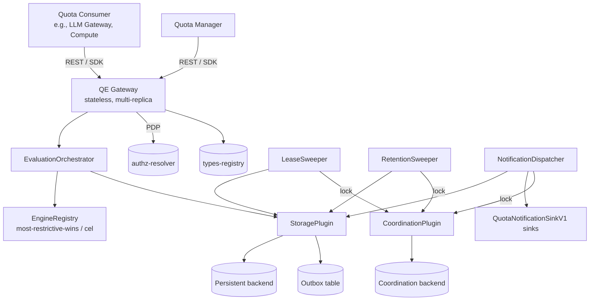

> The diagram preserves the I11 outbox-same-tx invariant: every component that emits a `NotificationOutboxEvent`
> (`EvaluationOrchestrator`, `LeaseSweeper`, `RetentionSweeper`, `QuotaManagementService`, `PolicyService`) writes it
> through `StoragePlugin` into the `notification_outbox` table in the same transaction as its state mutation.
> `NotificationDispatcher` is the **sole** caller of `QuotaNotificationSinkV1` sinks; no other component talks to the
> sinks directly. Refer to §3.2 component model for the full DAG including in-gateway services.

- [ ] `p1` - **ID**: `cpt-cf-quota-enforcement-tech-stack`

| Layer                               | Responsibility                                                                                                                                                                                                                                                                                                                                                                                                                                                                 | Technology                                                                                                                          |
| ----------------------------------- | ------------------------------------------------------------------------------------------------------------------------------------------------------------------------------------------------------------------------------------------------------------------------------------------------------------------------------------------------------------------------------------------------------------------------------------------------------------------------------ | ----------------------------------------------------------------------------------------------------------------------------------- |
| SDK (`quota-enforcement-sdk` crate) | Rust traits for Quota Consumer, Quota Manager, plugin contracts (`QuotaEnforcementStoragePluginV1`, `QuotaResolutionEngineV1`, `QuotaNotificationSinkV1`); domain types (`Quota`, `Lease`, `LeaseHold`, `DebitPlan`, `Decision`); closed error enums.                                                                                                                                                                                                                          | Rust structs + traits; `cargo` workspace member.                                                                                    |
| Gateway (`quota-enforcement` crate) | REST handler layer mounted into the platform `api-gateway` module via ModKit `RestApiCapability::register_rest`; QE does not run its own HTTP server. Owns DTO validation; phase-1 PDP integration (admission + LRU cache + fail-closed); tenant-isolation filter; delegates to `QuotaManagementService` / `QuotaEnforcementService`.                                                                                                                                          | Axum handlers + ModKit `OperationBuilder` (typed-operation registration auto-generates the OpenAPI fragment via `utoipa`); tracing. |
| Plugins (separate crates)           | `quota-enforcement-storage-plugin` (transactional persistence via `modkit-db` per `cpt-cf-quota-enforcement-adr-storage-backend`); `quota-enforcement-coordination-plugin` (leader election / distributed locks, per `cpt-cf-quota-enforcement-adr-coordination-plugin`); `quota-enforcement-engine-most-restrictive`, `quota-enforcement-engine-cel` (built-ins, in-process linkage); `quota-enforcement-notification-plugin` trait (sink implementations operator-supplied). | Rust crates; static linkage at build time per `cpt-cf-quota-enforcement-constraint-in-process-engine-registration`.                 |
| Background tasks                    | `LeaseSweeper` (physical reclamation tier of `cpt-cf-quota-enforcement-fr-lease-timeout`); `RetentionSweeper` (idempotency / operation log retention); `NotificationDispatcher` (drains outbox to registered sinks).                                                                                                                                                                                                                                                           | Same binary as gateway when bundled, or separate binary in split deployments; singleton coordination via `CoordinationPluginV1`.    |
| External                            | Persistent backend reached via the storage plugin (P1 backend choice in `cpt-cf-quota-enforcement-adr-storage-backend`); `authz-resolver` (PDP); `types-registry` (metric registration + GTS schema catalogue, including subject type schemas); platform observability stack — `tracing` plus OpenTelemetry export via `modkit`'s `otel` feature.                                                                                                                              | Existing platform components.                                                                                                       |

## 2. Principles & Constraints

### 2.1 Design Principles

#### Server-derived identity

- [ ] `p1` - **ID**: `cpt-cf-quota-enforcement-principle-server-derived-identity`

Identity for consumption-side operations (debit, credit, rollback, lease acquire / commit / release, evaluate-preview)
is bound from the server-side `SecurityContext` populated by the platform's AuthN adapter, not from request payloads.
This prevents privilege escalation through payload spoofing and is the precondition for tenant-isolation integrity
(`cpt-cf-quota-enforcement-nfr-tenant-isolation-integrity`). Enforcement is implemented through DTO design: request DTOs
for these operations omit identity fields. Management operations (Quota CRUD, Policy admin) accept identity explicitly
in the request to support hierarchical-tenancy semantics.

**ADRs**: implicit in PRD §3.4 trust-boundary model; no dedicated ADR.

#### Engine-pluggable arbitration

- [ ] `p1` - **ID**: `cpt-cf-quota-enforcement-principle-engine-pluggable`

Multi-Quota arbitration is not a property of QE-core — it is a `QuotaResolutionEngineV1` plugin. QE-core enforces only
the boundary contract (Debit-Plan invariants per `cpt-cf-quota-enforcement-fr-quota-resolution-engine`); how the Engine
produces the Decision is opaque. This lets workload-specific arbitration (cascade, attribute-gated selection, custom CEL
policies) plug in without core changes and lets future engines (Starlark, Lua, WASM-loaded) land additively.

**ADRs**: `cpt-cf-quota-enforcement-adr-evaluation-engine`.

#### Storage-pluggable backend

- [ ] `p1` - **ID**: `cpt-cf-quota-enforcement-principle-storage-pluggable`

Persistence is mediated by `QuotaEnforcementStoragePluginV1` — a single Rust trait with a closed `StorageError` enum and
thirteen invariants (I1–I13, §3.3). The trait surface is the contractual boundary of QE-core; how the backend achieves
the invariants (locking discipline, indexing strategy, partitioning, isolation level) is plugin-internal. P1 ships a
single storage-plugin implementation (backend choice per `cpt-cf-quota-enforcement-adr-storage-backend`); alternative
backends plug in unchanged.

**ADRs**: `cpt-cf-quota-enforcement-adr-storage-backend`.

#### Lazy expiry

- [ ] `p1` - **ID**: `cpt-cf-quota-enforcement-principle-lazy-expiry`

Lease correctness MUST NOT depend on background-process liveness. Every reader and every writer treats a lease with
`expiry_at <= now()` as released — regardless of physical row presence. Sweeper outage delays reclamation but never
produces zombie holds that block new operations or admit double-counted capacity. This is encoded as I4 on the storage
contract; the gateway never has to defensively check sweeper state.

**ADRs**: implicit in `cpt-cf-quota-enforcement-fr-lease-timeout`; no dedicated ADR.

#### Fail-closed

- [ ] `p1` - **ID**: `cpt-cf-quota-enforcement-principle-fail-closed`

Internal errors, unreachable PDP, unreachable storage, malformed Engine Decisions, and any other condition under which
QE cannot determine an authoritative admission outcome MUST result in operation denial, never silent allowance.
Consuming services choose their own behaviour when QE itself is unavailable (per the contract at PRD §3.4); QE itself
never emits a permissive bypass.

**ADRs**: implicit in PRD §3.4; no dedicated ADR.

#### Strict engine boundary

- [ ] `p1` - **ID**: `cpt-cf-quota-enforcement-principle-strict-engine-boundary`

Decisions returned by Engine plugins are not trusted blindly. The `EvaluationOrchestrator` validates every Decision
against the closed Debit-Plan invariant set
(`{quota_id_outside_applicable_set, negative_amount, sum_not_equal_request_amount, result_plan_inconsistency}`) before
applying any counter mutation; violations surface as the canonical `Internal` error with `reason = "INVARIANT_VIOLATION"`
(per §3.3 mapping table) and are counted in `debit_plan_invariant_violations_total`. This is the trust-boundary that
lets third-party Engines integrate without compromising counter integrity.

**ADRs**: implicit in `cpt-cf-quota-enforcement-fr-quota-resolution-engine`; no dedicated ADR.

### 2.2 Constraints

#### ModKit framework

- [ ] `p1` - **ID**: `cpt-cf-quota-enforcement-constraint-modkit`

QE is a ModKit-conformant module: it uses `SecureConn` for all DB access, `ClientHub` for cross-module calls, and the
standard ModKit lifecycle hooks (`init`, `bootstrap`, `shutdown`). It does not bypass `modkit-db` for raw connections,
does not invent its own RPC framing, and does not perform cross-module calls outside `ClientHub`.

**ADRs**: none.

#### SecurityContext propagation

- [ ] `p1` - **ID**: `cpt-cf-quota-enforcement-constraint-security-context`

`SecurityContext` is mandatory on every entry-point operation and propagates through every in-process call (Engine,
Storage, Notification, Sweeper). The sweeper uses a system-level SecurityContext for its background work. The constraint
prevents code paths that "forget" the context and run without identity scope — a precondition for tenant-isolation
integrity.

**ADRs**: none.

#### Type registry delegation

- [ ] `p1` - **ID**: `cpt-cf-quota-enforcement-constraint-types-registry-delegation`

QE does not maintain its own metric catalogue. Metric names, kind classification (counter / gauge), and enforcement-mode
classification (`QuotaGated` / `Direct`) live in the platform `types-registry`. QE validates `metric_name` references
against `types-registry` at Quota create/update; metric naming/syntax is governed entirely by the registry. The Subject
Type Registry rides on the same canonical mechanism (subject type entries are GTS instances under
`gts://gts.x.qe.subject-type.v1~`).

**ADRs**: none.

#### Single storage plugin per deployment

- [ ] `p1` - **ID**: `cpt-cf-quota-enforcement-constraint-single-storage-plugin`

Exactly one storage plugin is active at any time per deployment. Switching backends is an operator action that involves
data migration; the gateway does not federate over multiple backends, does not shard across plugins, and does not
present a multi-backend facade. P1 ships a single storage plugin (backend per
`cpt-cf-quota-enforcement-adr-storage-backend`); alternative backends are P2+ items that follow the same
one-active-at-a-time discipline.

**ADRs**: `cpt-cf-quota-enforcement-adr-storage-backend`.

#### Bounded label cardinality

- [ ] `p1` - **ID**: `cpt-cf-quota-enforcement-constraint-bounded-cardinality`

Telemetry labels are restricted to bounded enums — `metric_name` from `types-registry`, `engine_id` from the registered
Engine set, `operation` from `{debit, credit, rollback, reserve, commit, release, batch_debit}`, `invariant` from the
closed Debit-Plan-invariant set, `reason` from the closed denial-reason enum. High-cardinality identifiers (`tenant_id`,
`subject_id`, `quota_id`, `policy_id`, `idempotency_key`, `lease_token`) MUST NOT appear as labels. This prevents
per-tenant time-series explosion at 100 M-subject scale per `cpt-cf-quota-enforcement-nfr-subject-scale`.

**ADRs**: none.

#### In-process Engine registration

- [ ] `p1` - **ID**: `cpt-cf-quota-enforcement-constraint-in-process-engine-registration`

Engine plugins are registered statically in-process at module bootstrap. P1 ships `most-restrictive-wins` and `cel`;
additional engines link into the binary at build time. Runtime registration of new Engines (dynamic loading, RPC
engines) is out of P1 scope per PRD §5.9. Configuration of an Engine is done via the Quota Resolution Policy
(`engine_config` field) — the registration set is fixed at deploy time.

**ADRs**: none.

#### No business logic in gateway

- [ ] `p1` - **ID**: `cpt-cf-quota-enforcement-constraint-no-business-logic`

The gateway does no pricing, no billing, no plan-template materialisation, no SLA negotiation. Business logic that
translates licensing or commercial intent into Quota records lives in Quota Manager (a separate platform component). QE
itself only mutates counters according to declarative Quota records and pluggable arbitration policies.

**ADRs**: none.

## 3. Technical Architecture

### 3.1 Domain Model

**Technology**: Native Rust structs in `quota-enforcement-sdk` crate (per `cpt-cf-quota-enforcement-constraint-modkit`).
GTS is used only for plugin trait registration discovery and for the Subject Type Registry; domain data shape is
Rust-native.

**Location**: [`quota-enforcement-sdk/src/`](../quota-enforcement-sdk/src/) crate.

**Core Entities**:

| Entity                         | Description                                                                                                                                                                                                                                                                                                                                                                                                                                                                                                                                                    | Persistence                                                          |
| ------------------------------ | -------------------------------------------------------------------------------------------------------------------------------------------------------------------------------------------------------------------------------------------------------------------------------------------------------------------------------------------------------------------------------------------------------------------------------------------------------------------------------------------------------------------------------------------------------------- | -------------------------------------------------------------------- |
| `Quota`                        | Declarative cap assigned to a single subject for a single metric. Carries `quota_id` (server-assigned **UUIDv7** per `cpt-cf-quota-enforcement-adr-acquisition-ordering`), `tenant_id`, subject reference, metric, type, period spec (consumption only), enforcement mode, cap, notification thresholds, validity window, source, status, metadata, version. First-class stored entity — no separate template/binding concept.                                                                                                                                 | `quotas` table                                                       |
| `Counter` (allocation)         | Per-Quota in-flight counter for allocation Quotas. Mutated on debit / lease acquire (increment) and credit / lease commit/release (decrement).                                                                                                                                                                                                                                                                                                                                                                                                                 | `quota_allocation_counters` table                                    |
| `Counter` (consumption)        | Per-(Quota, period) consumed counter. New row materialised lazily on first evaluate in a new period (single I3 exception). Carries `highest_crossed_threshold_pct`.                                                                                                                                                                                                                                                                                                                                                                                            | `quota_consumption_counters` table                                   |
| `Lease`                        | Two-phase capacity hold (PRD `cpt-cf-quota-enforcement-fr-lease-acquire`). Carries token (UUID), tenant, subject, idempotency key, acquisition timestamp, expiry timestamp, state, `acquisition_period_id`. State machine: `Active` → `Committed` / `Released` / `AutoReleased` / `ResolvedByDeactivation` (closed enum, terminal states).                                                                                                                                                                                                                     | `leases` table                                                       |
| `LeaseHold`                    | Per-Quota hold record attached to a lease. One row per Quota in the lease's Debit Plan. Carries `lease_id`, `quota_id`, `held_amount`, `period_id` (consumption Quotas). Separate rows enable atomic multi-Quota acquisition without nested-array semantics.                                                                                                                                                                                                                                                                                                   | `lease_holds` table                                                  |
| `LeaseCapacityCounter`         | Per-`(tenant, metric)` count of currently active leases. Mutated atomically with lease state transitions. Enforces the per-`(tenant, metric)` active-lease cap (PRD `cpt-cf-quota-enforcement-fr-lease-timeout`, default 1000).                                                                                                                                                                                                                                                                                                                                | `lease_capacity_counters` table                                      |
| `QuotaResolutionPolicy`        | Operator-managed binding of an Engine + config to a scope (P1: `global` or per-metric). Stable identifier; `latest_version` pointer updated atomically with new version row insert.                                                                                                                                                                                                                                                                                                                                                                            | `quota_resolution_policy` table                                      |
| `QuotaResolutionPolicyVersion` | Immutable per-version record. Carries `policy_id`, `policy_version`, `engine_id`, `engine_config` (JSON), `timeout_ms`, `version_state` (`active` / `superseded` / `rolled_back` (terminal) / `deleted` (terminal — set on the previously-active version when the entire `policy_id` is soft-deleted via `delete_policy` per PRD §5.9)), `comment` (optional operator note), audit fields.                                                                                                                                                                     | `quota_resolution_policy_version` table                              |
| `IdempotencyRecord`            | Replay-safety record keyed by `(tenant_id, subject_type, subject_id, operation_type, idem_key)`. The `(subject_type, subject_id)` slot is the operation's resolved applicable-subjects set for `debit`/`reserve`/`commit`/`release`/`batch_debit` envelope, and the owning Quota's `(subject_type, subject_id)` (read under the mutation row-lock) for `credit`/`rollback` per `cpt-cf-quota-enforcement-fr-idempotency`. Carries canonical `payload_hash` (SHA-256 of sorted JSON), `decision_blob` (JSON-typed; schema-versioned with full Decision), `expires_at`. | `idempotency_records` table                                          |
| `OperationLog`                 | Operation ledger of every successful mutating operation (P1 scope; audit-grade attribution awaits platform audit infra per PRD §4.2 / §6.2, see §4.3). Carries operation kind, actor SecurityContext, target Quota IDs, request fingerprint, Decision outcome, timestamp. Partitioned by date for retention and cold-tier migration.                                                                                                                                                                                                                           | `operation_log` table                                                |
| `NotificationOutboxEvent`      | Same-tx event row enqueued by mutating storage primitives. Carries `event_id`, `event_kind`, `tenant_id`, target reference, payload, emission timestamp. Drained by `NotificationDispatcher` and dispatched at-least-once.                                                                                                                                                                                                                                                                                                                                     | `notification_outbox` table (modkit-db Outbox queue)                 |
| `SubjectTypeEntry`             | Subject-type registration metadata. Identity = chained GTS instance URI under base `gts://gts.x.qe.subject-type.v1~`; payload = `{description: String}`. P1 instances `tenant` and `user` are embedded as compile-time constants in the QE binary; resolution logic is implemented as `SubjectTypeResolver` trait impls.                                                                                                                                                                                                                                       | `types-registry` (GTS schema catalogue) — no QE-side DB table in P1. |

**In-memory entities** (passed across in-process calls; never persisted as the source of truth):

| Entity              | Description                                                                                                                                                                                                                                                                  |
| ------------------- | ---------------------------------------------------------------------------------------------------------------------------------------------------------------------------------------------------------------------------------------------------------------------------- |
| `EvaluationContext` | Engine input: resolved subjects, applicable Quota snapshots (with metadata), current usage, request (metric/amount/metadata), active Policy reference, time. Materialised at the locked-read step (`cpt-cf-quota-enforcement-adr-metadata-snapshot-timing`).                 |
| `Decision`          | Engine output: closed `result` enum (`Allowed` / `Denied { violated_quota_ids, reason }`), `debit_plan: HashMap<QuotaId, QuotaDebitPlan>`, `diagnostics: HashMap<String, JsonValue>`. Engine failures do not produce a Decision — they surface as `CanonicalError` per §3.3. |
| `QuotaDebitPlan`    | Per-Quota mutation directive in a `Decision`: `amount` (≥ 0). Extension-ready (P3 may add `clamped` marker). Validated against the closed Debit-Plan invariant set at the QE-core boundary.                                                                                  |
| `BatchItem`         | One element of an envelope batch (`apply_batch_debit`): `(SecurityContext, request_payload, optional_per_item_idem_key)`.                                                                                                                                                    |
| `MutationResult`    | Storage primitive return: post-mutation snapshot for caller telemetry, including new counter values, threshold crossings, and emitted event IDs.                                                                                                                             |

**Relationships**:

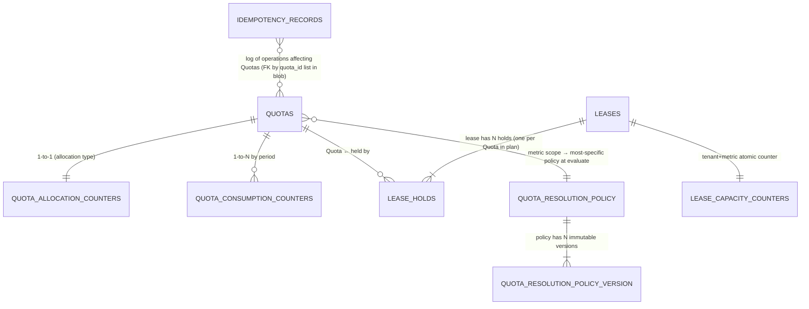

**Type-stability invariants** (`cpt-cf-quota-enforcement-constraint-modkit`):

- All enums (`QuotaType`, `EnforcementMode`, `QuotaSource`, `LeaseState`, `DecisionResult`, `NotificationEventKind`,
  `PolicyVersionState`) are closed at SDK boundary.
- Input deserialization uses `serde(deny_unknown_fields)`; output deserialization tolerates forward-compat additions for
  SDK consumers.
- `IdempotencyRecord.decision_blob` is JSON-typed and schema-versioned (top-level `__version`); additive shape changes
  do not require migration.
- `EvaluationContext` and `Decision` shapes are stable across Engines (the core boundary).

### 3.2 Component Model

QE is decomposed into a Gateway, an in-process Orchestrator and Manager set, four plugin families (Storage,
Coordination, Engine, Notification), background tasks (sweeper, dispatcher), and adapters to platform infrastructure.
Every component carries a stable `cpt-cf-quota-enforcement-component-{slug}` ID for traceability.

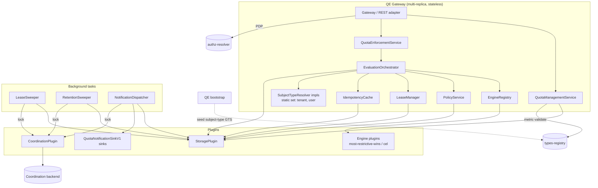

#### Gateway

- [ ] `p1` - **ID**: `cpt-cf-quota-enforcement-component-gateway`

##### Why this component exists

REST handler layer of the `quota-enforcement` crate; mounted into the platform `api-gateway` module via ModKit. QE does
not run its own HTTP server — the platform `api-gateway` module owns the Axum router and the aggregated OpenAPI
document. This is the only QE-side entry point for every external caller (Quota Consumer, Quota Manager, Quota Reader,
Monitoring System); SDK clients flow through the same operation surface for end-to-end uniformity.

##### Responsibility scope

REST handlers (Axum), request DTO validation, typed-operation registration into the platform `api-gateway`
(auto-generates the OpenAPI fragment via `utoipa`), tenant-isolation filter (defense-in-depth), correlation of trace
context. Phase-1 PDP integration (admission decision before transaction): wraps
`authz-resolver-sdk::PolicyEnforcer` (obtained from ClientHub) with an in-process LRU cache of PDP decisions keyed
by `(actor, action, resource_class)` (cache TTL operator-tunable, P1 reference default: 60 s, sized to never extend a
stale grant); fail-closed on PDP unavailability; translates the PDP constraint set to `&[Constraint]` for storage-plugin
consumption inside the evaluation transaction. Stateless across replicas (the LRU cache is process-local).

##### Responsibility boundaries

Does not contain business logic (`cpt-cf-quota-enforcement-constraint-no-business-logic`). Does not call Engine or
Storage directly — delegates to `QuotaManagementService` / `QuotaEnforcementService`, passing the translated
`&[Constraint]` slice for in-transaction filter composition (phase-2 propagation is owned by `EvaluationOrchestrator`).
Does not own any persistent state. Does not implement the PDP itself — the actual policy decision lives in the external
`authz-resolver` module.

##### Related components (by ID)

- `cpt-cf-quota-enforcement-component-quota-management-service` — delegates Quota CRUD.
- `cpt-cf-quota-enforcement-component-quota-enforcement-service` — delegates evaluations.
- `cpt-cf-quota-enforcement-component-evaluation-orchestrator` — passes `&[Constraint]` for in-transaction filter
  composition (defense-in-depth, `cpt-cf-quota-enforcement-nfr-tenant-isolation-integrity`).

#### QuotaManagementService

- [ ] `p1` - **ID**: `cpt-cf-quota-enforcement-component-quota-management-service`

##### Why this component exists

Owns Quota CRUD lifecycle (`cpt-cf-quota-enforcement-fr-quota-lifecycle`): create, update, deactivate, read. Coordinates
the deactivation cascade (mark Quota deactivated AND resolve active leases atomically). Used by Quota Manager and
platform operators.

##### Responsibility scope

Validation (cap non-negative, thresholds-require-bounded-cap, type/period combinatorics); metric existence check via
`TypesRegistryClient` (platform `types-registry-sdk`, obtained from ClientHub) — runs **outside** the storage
transaction; in-process LRU cache of metric-name lookups (kind classification `counter`/`gauge` and enforcement-mode
classification `QuotaGated`/`Direct` are reported by the registry and consumed downstream); fail-closed on
`types-registry` unavailability and «flag-but-don't-auto-deactivate» on later metric removal — both per
`cpt-cf-quota-enforcement-fr-metric-identity-validation`. Transactional `create_quota` / `update_quota` /
`deactivate_quota` / `read_quotas` calls on Storage plugin; event emission for `quota-changed`.

##### Responsibility boundaries

Does not evaluate quota usage (that is `QuotaEnforcementService`'s role). Does not perform authorization — the PDP
admission call is owned by `Gateway` (phase-1, before tx) and the in-transaction constraint application is propagated
through `EvaluationOrchestrator` into the storage plugin (phase-2). Does not own metric definitions — the
`types-registry` is authoritative; QE only consumes identity and the registry-reported classifications.

##### Related components (by ID)

- `cpt-cf-quota-enforcement-component-storage-plugin` — calls CRUD primitives.
- `cpt-cf-quota-enforcement-actor-types-registry` (external) — consulted via `TypesRegistryClient` for metric-name
  validation.

#### QuotaEnforcementService

- [ ] `p1` - **ID**: `cpt-cf-quota-enforcement-component-quota-enforcement-service`

##### Why this component exists

Public surface for the eight enforcement operations: `debit`, `credit`, `rollback`, `reserve`, `commit`, `release`,
`batch_debit`, `evaluate_preview`. Used by Quota Consumers on the hot path.

##### Responsibility scope

Per-operation entry point; constructs request shape; delegates to `EvaluationOrchestrator` for the evaluation pipeline;
returns Decision DTO.

##### Responsibility boundaries

Does not contain orchestration logic (delegated to `EvaluationOrchestrator`). Does not own storage or engine state.

##### Related components (by ID)

- `cpt-cf-quota-enforcement-component-evaluation-orchestrator` — delegates pipeline.
- `cpt-cf-quota-enforcement-component-lease-manager` — delegates lease 3-phase ops.

#### EvaluationOrchestrator

- [ ] `p1` - **ID**: `cpt-cf-quota-enforcement-component-evaluation-orchestrator`

##### Why this component exists

Implements the canonical evaluation pipeline: subject resolution → idempotency lookup → applicable-Quotas locked read →
Policy lookup → Engine evaluate → Debit-Plan invariant check → mutation → idempotency persist → outbox enqueue → COMMIT.
Encapsulates the strict-engine-boundary (`cpt-cf-quota-enforcement-principle-strict-engine-boundary`) — every Decision
is validated against the closed Debit-Plan invariant set before mutation.

##### Responsibility scope

Pipeline ordering, transaction lifecycle, EvaluationContext materialisation timing
(`cpt-cf-quota-enforcement-adr-metadata-snapshot-timing`), invariant enforcement, telemetry emission for invariant
violations. Subject resolution (`cpt-cf-quota-enforcement-fr-subject-resolution`) is realised here by iterating the
static set of `SubjectTypeResolver` trait impls — one per seeded subject type — over the request `SecurityContext` to
build the applicable-subjects set; resolvers that cannot derive a subject for the given context are skipped (PRD §5.1).
Phase-2 PDP integration: receives the `&[Constraint]` slice from `Gateway` (already translated from the PDP response)
and forwards it into Storage-plugin reads/writes for in-transaction filter composition
(`cpt-cf-quota-enforcement-nfr-tenant-isolation-integrity` defense-in-depth). EO does not call the PDP itself and does
not interpret constraint semantics — that is the storage plugin's responsibility.

##### Responsibility boundaries

Does not own arbitration logic (delegated to Engines). Does not own counter mutation mechanics (delegated to Storage
plugin). Does not pre-eval on idempotency replay — replay returns the stored `decision_blob` verbatim (satisfies the
idempotency-replay rule of `cpt-cf-quota-enforcement-fr-idempotency` by never re-invoking the Engine on replay).

Synchronization between concurrent EO instances (every gateway replica runs an EO) is delegated entirely to the storage
plugin's serialization of concurrent row mutations — the deterministic acquisition ordering of
`cpt-cf-quota-enforcement-adr-acquisition-ordering` plus the storage-capability list in §3.5. EO instances are not
singletons and do not consume `CoordinationPluginV1`; that contract is reserved for sweeper / dispatcher singletons.

##### Related components (by ID)

- `cpt-cf-quota-enforcement-component-engine-registry`, `-policy-service`, `-storage-plugin`, `-idempotency-cache`,
  `-notification-dispatcher`. `SubjectTypeResolver` is a trait surface (impls live in the gateway crate), not a
  component with its own ID.

#### PolicyService

- [ ] `p1` - **ID**: `cpt-cf-quota-enforcement-component-policy-service`

##### Why this component exists

Owns the Quota Resolution Policy lifecycle (`cpt-cf-quota-enforcement-fr-quota-resolution-policy`,
`cpt-cf-quota-enforcement-fr-quota-resolution-policy-versioning`): create, update (creates new immutable version),
rollback to a prior version, soft-delete (narrow-scope only), read latest, list versions. Resolves the most-specific
Policy at evaluation time (`global` ← per-metric).

##### Responsibility scope

CRUD on `quota_resolution_policy` and `quota_resolution_policy_version` tables via Storage plugin; in-process LRU cache
of latest active versions; `engine_config` validation (delegated to the named Engine's `validate_config`).

##### Responsibility boundaries

Does not execute Engine evaluation. Does not own `engine_config` interpretation — only forwards to Engine.

##### Related components (by ID)

- `cpt-cf-quota-enforcement-component-engine-registry` — calls `validate_config`.
- `cpt-cf-quota-enforcement-component-storage-plugin` — Policy persistence.

#### EngineRegistry

- [ ] `p1` - **ID**: `cpt-cf-quota-enforcement-component-engine-registry`

##### Why this component exists

Static, in-process registry of `QuotaResolutionEngineV1` plugin implementations. P1 ships two built-ins:
`most-restrictive-wins` (hardcoded; the fastest path) and `cel` (sandboxed CEL evaluator with sandbox + cost-cap
support). Realises `cpt-cf-quota-enforcement-constraint-in-process-engine-registration`.

##### Responsibility scope

Compile-time linkage of built-in Engines; bootstrap-time fail-fast registration (`engine_bootstrap_failures_total`
increments on failure); ID → Engine resolution at evaluation time.

##### Responsibility boundaries

No runtime registration of new Engines (PRD §5.9). No Engine deprecation lifecycle in P1 (deferred to P2; revisit when
additional Engine plugins — Wasm / Starlark / Lua — land in the deployment binary). Does not interpret Engine
configurations.

##### Related components (by ID)

- `cpt-cf-quota-enforcement-component-evaluation-orchestrator` — Engine consumer.
- `cpt-cf-quota-enforcement-component-policy-service` — `validate_config` consumer.

#### LeaseManager

- [ ] `p1` - **ID**: `cpt-cf-quota-enforcement-component-lease-manager`

##### Why this component exists

Implements the lease 3-phase protocol (`cpt-cf-quota-enforcement-fr-lease-acquire`,
`cpt-cf-quota-enforcement-fr-lease-commit`, `cpt-cf-quota-enforcement-fr-lease-release`) and enforces the lazy-expiry
semantic (`cpt-cf-quota-enforcement-principle-lazy-expiry`) on every read/write path. Encapsulates the
per-`(tenant, metric)` active-lease cap check (`lease_capacity_counters`) and the period-attribution invariant
(commit/release attribute to acquisition period, not wall- clock period).

##### Responsibility scope

Lease state machine (`Active` → terminal); cap enforcement; period attribution; storage- plugin invocation for
`acquire_lease` / `commit_lease` / `release_lease`.

##### Responsibility boundaries

Does not own physical reclamation of expired lease rows — that is the `LeaseSweeper`'s responsibility, and lease
correctness MUST NOT depend on sweeper liveness (I4 invariant). Does not enforce contention timeout itself — that is a
plugin-internal concern (I8 specifies the contract; the realisation is plugin-internal).

##### Related components (by ID)

- `cpt-cf-quota-enforcement-component-storage-plugin`, `cpt-cf-quota-enforcement-component-lease-sweeper`.

#### IdempotencyCache

- [ ] `p1` - **ID**: `cpt-cf-quota-enforcement-component-idempotency-cache`

##### Why this component exists

Pre-evaluation lookup point (`cpt-cf-quota-enforcement-fr-idempotency`). On replay, returns the stored `decision_blob`
verbatim — never re-invokes Engine. Persistence is implicit-in-storage-primitives (every mutating storage call upserts
the idempotency record same-tx with the mutation, I1+I2 invariants).

##### Responsibility scope

`lookup_idempotency` call lifecycle, payload-hash comparison (canonical SHA-256 of sorted JSON, canonical SHA-256 hash),
`IdempotencyPayloadMismatch` mapping for hash divergence, in-process LRU cache of recent records (TTL operator-tunable;
P1 reference default: 5 s) for the most contended idempotency keys.

##### Responsibility boundaries

Does not own retention policy execution (`RetentionSweeper` reclaims expired records). Does not persist new records
directly — that is owned by Storage plugin's mutating primitives.

##### Related components (by ID)

- `cpt-cf-quota-enforcement-component-storage-plugin`.

#### NotificationDispatcher

- [ ] `p1` - **ID**: `cpt-cf-quota-enforcement-component-notification-dispatcher`

##### Why this component exists

Drains the `notification_outbox` (modkit-db Outbox queue) and fans events out to all registered
`QuotaNotificationSinkV1` plugins (`cpt-cf-quota-enforcement-fr-notification-plugin`). Realises the same-tx outbox
invariant (I11): events enqueued atomically with their producing mutation are guaranteed at-least-once delivery
regardless of dispatcher liveness.

##### Responsibility scope

Single-leader execution via `CoordinationPluginV1::try_lock(LockScope::NotificationDispatcher, ttl)` with
heartbeat-renew on TTL/3; on lock loss the dispatcher drops to follower mode and re-acquires through jittered backoff.
Outbox polling (batch size, frequency configurable), per-sink fan-out via `tokio::join_all`, per-sink per-call timeout
(2 s reference default), failure isolation (one failed sink does not affect others), telemetry
(`notification_dispatch_failures_total`, `outbox_pending_rows`, `outbox_dead_letters_total`).

##### Responsibility boundaries

Does not enqueue events itself — events are enqueued by the Storage plugin's mutating primitives same-tx with the
mutation. Does not implement EventBus routing (deferred to P2 per PRD §13 EventBus OQ).

##### Related components (by ID)

- `cpt-cf-quota-enforcement-component-storage-plugin`.
- `cpt-cf-quota-enforcement-component-coordination-plugin`.

#### LeaseSweeper

- [ ] `p1` - **ID**: `cpt-cf-quota-enforcement-component-lease-sweeper`

##### Why this component exists

Physical reclamation tier of `cpt-cf-quota-enforcement-fr-lease-timeout`. Periodic background task
(operator-configurable interval, default 60 s) that picks up expired-by-TTL leases, transitions them to `AutoReleased`
state in the same tx, decrements the active-lease capacity counter, and enqueues the `lease-auto-released` event via
outbox. Optionally deletes lease rows after a grace period.

##### Responsibility scope

Single-leader execution via `CoordinationPluginV1::try_lock(LockScope::LeaseSweeper, ttl)` with heartbeat-renew on
TTL/3; on lock loss the sweeper drops to follower mode and re-acquires through jittered backoff. Batch size
operator-configurable (P1 reference default: 1000 expired leases per cycle). Surface `lease_unreclaimed_expired` gauge
(cardinality discipline: only `metric` label).

##### Responsibility boundaries

Sweeper outage MUST NOT break correctness — lazy semantic release (I4) holds unconditionally. Does not own retention of
operation log or idempotency records (that is `RetentionSweeper`'s responsibility).

##### Related components (by ID)

- `cpt-cf-quota-enforcement-component-storage-plugin`.
- `cpt-cf-quota-enforcement-component-coordination-plugin`.

#### RetentionSweeper

- [ ] `p1` - **ID**: `cpt-cf-quota-enforcement-component-retention-sweeper`

##### Why this component exists

Reclaims expired `idempotency_records` (default 24 h, configurable per-`(tenant, metric)` in
`idempotency_retention_config` table) and `operation_log` rows (default 30 days, per PRD §6.2). Counter-partition
retention is handled by storage-plugin partition reclamation operations on consumption-counter tables — a separate
concern of the Storage plugin's reclamation primitives.

##### Responsibility scope

Single-leader execution via `CoordinationPluginV1::try_lock(LockScope::RetentionSweeper, ttl)` with heartbeat-renew on
TTL/3; on lock loss the sweeper drops to follower mode and re-acquires through jittered backoff.
`reclaim_expired_idempotency` and `reclaim_operation_log` invocations on the Storage plugin; batch-size and frequency
configuration.

##### Responsibility boundaries

Does not reclaim leases (that is `LeaseSweeper`). Does not impose retention policy at the business level — only enforces
operator-configured expiry.

##### Related components (by ID)

- `cpt-cf-quota-enforcement-component-storage-plugin`.
- `cpt-cf-quota-enforcement-component-coordination-plugin`.

#### StoragePlugin

- [ ] `p1` - **ID**: `cpt-cf-quota-enforcement-component-storage-plugin`

##### Why this component exists

Pluggable persistence layer (`cpt-cf-quota-enforcement-fr-pluggable-storage`). Defines the
`QuotaEnforcementStoragePluginV1` Rust trait with closed `StorageError` enum and thirteen invariants (I1–I13). Realises
`cpt-cf-quota-enforcement-principle-storage-pluggable`.

##### Responsibility scope

Quota CRUD; multi-Quota counter mutation atomicity (apply_debit_plan, apply_batch_debit, apply_credit, apply_rollback);
lease 3-phase primitives; snapshot reads with lazy period-row materialisation (single I3 exception); Policy versioning;
idempotency lookup; sweeper hooks (lease, idempotency, op log); outbox dispatch (pull / mark delivered / mark failed);
bootstrap; health. Same-tx outbox (I11) lives **inside** this contract — events enqueued atomically with their producing
mutation.

##### Responsibility boundaries

Locking discipline, indexing strategy, isolation level, partitioning, lock-timeout mechanics, and concrete table layouts
are **plugin-internal**. The trait surface here is the contractual boundary of QE-core. Distributed leader election /
locks for sweeper / dispatcher singletons are **out of scope** — they live in
`cpt-cf-quota-enforcement-component-coordination-plugin`.

##### Related components (by ID)

- Every Service / Manager / Sweeper component above is a consumer.
- Actor: `cpt-cf-quota-enforcement-actor-storage-backend` (the persistent backend the plugin mediates; the trait IS the
  QE-side façade for this actor).

#### CoordinationPlugin

- [ ] `p1` - **ID**: `cpt-cf-quota-enforcement-component-coordination-plugin`

##### Why this component exists

Backend-agnostic distributed leader election and lock primitives, separated from the data-storage contract per
`cpt-cf-quota-enforcement-adr-coordination-plugin`. Defines the `CoordinationPluginV1` Rust trait. Sweeper and
dispatcher singletons consume this contract through ClientHub; the coordination backend is selected and deployed
independently of the storage backend.

##### Responsibility scope

TTL-bounded lock acquisition (`try_lock`), heartbeat-renew (`renew`), graceful release (`release`). Lock auto-release on
TTL expiry is an inviolable property of the contract: a lock MUST NOT outlive its TTL even if the holder process crashes
silently. Bootstrap-time reachability is validated via the `try_lock` + `release` probe on each `LockScope::*` value
(DESIGN §3.7 bootstrap); the contract has no separate health-check method.

##### Responsibility boundaries

Does not own counter / lease / outbox state — that lives in the storage plugin. Does not own evaluation pipeline
serialization — that is the storage plugin's row-locking discipline. Concrete coordination backend (its transport,
quorum semantics, internal storage of lease state) is **plugin-internal** and outside QE-core DESIGN.

##### Related components (by ID)

- `cpt-cf-quota-enforcement-component-lease-sweeper`, `cpt-cf-quota-enforcement-component-retention-sweeper`,
  `cpt-cf-quota-enforcement-component-notification-dispatcher` — the three consumers of `LockScope::*`.

### 3.3 API Contracts

QE exposes three contractual surfaces:

1. **SDK Rust traits** — in `quota-enforcement-sdk` for in-process callers and SDK consumers
   (`cpt-cf-quota-enforcement-interface-sdk-client` per PRD §7.1).
1. **Plugin traits** — Storage, Coordination, Engine, Notification — defined in the same SDK crate so plugin authors
   implement against a single dependency.
1. **Public REST API** — for cross-language callers and external consumers
   (`cpt-cf-quota-enforcement-interface-rest-api` per PRD §7.1).

**Versioning** (per PRD §7.1 / §7.2):

- The REST API is served under the `/v1/quota-enforcement/...` path prefix.
- The SDK trait ships in the `quota-enforcement-sdk` Cargo crate; semver applies.
- Plugin contracts (`cpt-cf-quota-enforcement-contract-storage-plugin`,
  `cpt-cf-quota-enforcement-contract-coordination-plugin`, `cpt-cf-quota-enforcement-contract-notification-plugin`,
  `cpt-cf-quota-enforcement-contract-quota-resolution-engine-plugin`) are versioned with the module's major version;
  backwards-compatible additive changes are allowed within a major, field removals and semantic changes are
  major-version breaks. All four plugin traits carry a matching `V<major>` suffix — `QuotaEnforcementStoragePluginV1`,
  `CoordinationPluginV1`, `QuotaResolutionEngineV1`, `QuotaNotificationSinkV1`.

#### Public REST API

- [ ] `p1` - **ID**: `cpt-cf-quota-enforcement-interface-rest`

- **Technology**: REST / OpenAPI 3 (auto-generated via `utoipa` from Axum handlers).

**Endpoints Overview**:

| Method   | Path                                           | Description                                                                                                                                                                                                                                                                                                                                 |
| -------- | ---------------------------------------------- | ------------------------------------------------------------------------------------------------------------------------------------------------------------------------------------------------------------------------------------------------------------------------------------------------------------------------------------------- |
| `POST`   | `/v1/quota-enforcement/quotas`                 | Create Quota (`cpt-cf-quota-enforcement-fr-quota-lifecycle`)                                                                                                                                                                                                                                                                                |
| `GET`    | `/v1/quota-enforcement/quotas/{id}`            | Read single Quota                                                                                                                                                                                                                                                                                                                           |
| `PATCH`  | `/v1/quota-enforcement/quotas/{id}`            | Update Quota                                                                                                                                                                                                                                                                                                                                |
| `POST`   | `/v1/quota-enforcement/quotas/{id}/deactivate` | Deactivate Quota (cascades to active leases)                                                                                                                                                                                                                                                                                                |
| `GET`    | `/v1/quota-enforcement/quotas`                 | List/filter Quotas (paginated; PDP-scoped)                                                                                                                                                                                                                                                                                                  |
| `POST`   | `/v1/quota-enforcement/operations/debit`       | Debit (`cpt-cf-quota-enforcement-fr-debit`)                                                                                                                                                                                                                                                                                                 |
| `POST`   | `/v1/quota-enforcement/operations/credit`      | Credit (Quota Manager only; `cpt-cf-quota-enforcement-fr-credit`)                                                                                                                                                                                                                                                                           |
| `POST`   | `/v1/quota-enforcement/operations/rollback`    | Rollback (`cpt-cf-quota-enforcement-fr-rollback`)                                                                                                                                                                                                                                                                                           |
| `POST`   | `/v1/quota-enforcement/operations/preview`     | Evaluate Preview (read-only; `cpt-cf-quota-enforcement-fr-evaluate-preview`)                                                                                                                                                                                                                                                                |
| `POST`   | `/v1/quota-enforcement/operations/batch-debit` | Batch Debit (`cpt-cf-quota-enforcement-fr-batch-debit`)                                                                                                                                                                                                                                                                                     |
| `POST`   | `/v1/quota-enforcement/leases`                 | Acquire Lease (`cpt-cf-quota-enforcement-fr-lease-acquire`)                                                                                                                                                                                                                                                                                 |
| `POST`   | `/v1/quota-enforcement/leases/{token}/commit`  | Commit Lease (`cpt-cf-quota-enforcement-fr-lease-commit`)                                                                                                                                                                                                                                                                                   |
| `POST`   | `/v1/quota-enforcement/leases/{token}/release` | Release Lease (`cpt-cf-quota-enforcement-fr-lease-release`)                                                                                                                                                                                                                                                                                 |
| `POST`   | `/v1/quota-enforcement/snapshot`               | Quota Snapshot read for `1..N` `(subject, metric)` filters; cursor-paginated. Realises `cpt-cf-quota-enforcement-fr-quota-snapshot-read`, `cpt-cf-quota-enforcement-fr-bulk-quota-snapshot-read`, and (when invoked by Quota Manager with forwarded end-user `SecurityContext`) `cpt-cf-quota-enforcement-fr-end-user-quota-snapshot-read`. |
| `POST`   | `/v1/quota-enforcement/policies`               | Create Policy                                                                                                                                                                                                                                                                                                                               |
| `GET`    | `/v1/quota-enforcement/policies/{id}`          | Read latest active Policy                                                                                                                                                                                                                                                                                                                   |
| `GET`    | `/v1/quota-enforcement/policies/{id}/versions` | List Policy versions (paginated)                                                                                                                                                                                                                                                                                                            |
| `PATCH`  | `/v1/quota-enforcement/policies/{id}`          | Update Policy (creates new immutable version)                                                                                                                                                                                                                                                                                               |
| `POST`   | `/v1/quota-enforcement/policies/{id}/rollback` | Rollback to a prior version                                                                                                                                                                                                                                                                                                                 |
| `DELETE` | `/v1/quota-enforcement/policies/{id}`          | Soft-delete (narrow-scope only; cannot delete seeded global). Returns **204 No Content** on success. Idempotent on retry per PRD §5.9: repeated DELETE against an already-deleted `policy_id` returns 204 (no-op). 404 only when `policy_id` was never created.                                                                             |

P2 endpoints (`bulk_create_quotas`, `bulk_update_quotas`, `bulk_deactivate_quotas`) are deferred per
`cpt-cf-quota-enforcement-fr-bulk-quota-crud` (PRD §5.2, P2).

**Error Model.**

QE conforms to the platform error contract: Canonical error model implemented by
[`cf-modkit-canonical-errors`](../../../../libs/modkit-canonical-errors/), surfaced at the REST boundary as RFC 9457
`Problem`. QE does **not** invent a private HTTP-status table — the status code is a property of the canonical category.
Fine-grained discriminators ride as `errors[].reason` tokens inside the envelope (field violations on `InvalidArgument`,
precondition violations on `FailedPrecondition`, quota violations on `ResourceExhausted`), not as private sub-enum
variants.

Layered chain: `StorageError → DomainError → CanonicalError`. The SDK error type is `CanonicalError` re-exported as
`QuotaEnforcementError` (same convention as `account_management_sdk` re-exports it as `AccountManagementError`).

- **`StorageError`** — closed enum returned by every method on `QuotaEnforcementStoragePluginV1`; storage-primitive
  outcomes (lease state, version conflicts, lookup misses, transport unavailability). Defined in `quota-enforcement-sdk`
  so plugin authors implement against it.
- **`DomainError`** — closed `#[domain_model]` enum in `quota-enforcement/src/domain/error.rs`; authoritative
  business-error surface for `QuotaManagementService` / `QuotaEnforcementService` / `PolicyService`. Pre-storage
  validation errors (`InvalidAmount`, `BulkTooLarge`, `CannotDeleteSeededGlobalPolicy`, …) have no `StorageError`
  counterpart by construction.
- **`From<StorageError> for DomainError`** — every `StorageError` variant has a 1:1 lift; defined alongside
  `DomainError` in `domain/error.rs` (no `sea_orm`/`modkit_db` imports — same Dylint discipline as AM).
- **`From<DomainError> for CanonicalError`** — boundary mapping in `quota-enforcement/src/infra/canonical_mapping.rs`
  (kept out of `domain/` because the lift may classify backend-specific failures via `cf-modkit-db` helpers, which the
  `domain/` layer is not permitted to import). Handlers return `ApiResult<T> = Result<T, Problem>` and use `?` for
  propagation; `From<CanonicalError> for Problem` is provided by the crate.

`Problem` envelope carries (per `modkit_canonical_errors::Problem`): `status` (fixed by category), `type` (GTS
resource-type tag — QE constants in `quota_enforcement_sdk::gts`: `QUOTA_RESOURCE_TYPE`, `POLICY_RESOURCE_TYPE`,
`LEASE_RESOURCE_TYPE`, `OPERATION_RESOURCE_TYPE`), `title`, `code` (snake-case category token), `detail`, `errors[]`
with `reason` tokens.

**Mapping table** (`From<DomainError> for CanonicalError`):

| `DomainError` variant family                                                                                                                                                                                                                                                                            | `CanonicalError`     | HTTP | `errors[].reason`                                                                                                                                  |
| ------------------------------------------------------------------------------------------------------------------------------------------------------------------------------------------------------------------------------------------------------------------------------------------------------- | -------------------- | ---- | -------------------------------------------------------------------------------------------------------------------------------------------------- |
| Field validation: `UnknownSubjectType`, `CapMustBeNonNegative`, `BulkTooLarge`, `InvalidAmount`                                                                                                                                                                                                         | `InvalidArgument`    | 400  | matching `UPPER_SNAKE` token (field violation)                                                                                                     |
| Semantic precondition: `ThresholdsRequireBoundedCap`, `CapBelowConsumed`, `LeaseNotActive`, `OverCommitNotAuthorized`, `PeriodClosed`, `MetricNotQuotaGated`, `MetricNotRegistered`, `QuotaDeactivated`, `UnknownEngine`, `CannotDeleteSeededGlobalPolicy`, `UnknownPolicyVersion`, `VersionRolledBack` | `FailedPrecondition` | 400  | matching `UPPER_SNAKE` token (precondition violation)                                                                                              |
| `PdpDenied`                                                                                                                                                                                                                                                                                             | `PermissionDenied`   | 403  | —                                                                                                                                                  |
| `NotFound { kind, id }`                                                                                                                                                                                                                                                                                 | `NotFound`           | 404  | `kind` selects `type`; `id` populates `resource_name`                                                                                              |
| Concurrency conflict: `IdempotencyPayloadMismatch`, `VersionConflict`, `LeaseContentionTimeout`                                                                                                                                                                                                         | `Aborted`            | 409  | matching `UPPER_SNAKE` token; safe to retry                                                                                                        |
| `LeaseInflightLimitExceeded`, `EngineCostExceeded`                                                                                                                                                                                                                                                      | `ResourceExhausted`  | 429  | `LEASE_INFLIGHT_LIMIT_EXCEEDED` (`subject = "(tenant, metric)"`); `ENGINE_COST_EXCEEDED` (`subject = "engine"`)                                    |
| `NotYetImplemented`                                                                                                                                                                                                                                                                                     | `Unimplemented`      | 501  | —                                                                                                                                                  |
| `EngineTimeout`, `BatchTimeout` (per-Policy Engine timeout; envelope tokio timeout)                                                                                                                                                                                                                     | `DeadlineExceeded`   | 504  | `BATCH_TIMEOUT` for batch envelope; bare for per-Policy                                                                                            |
| `BackendUnavailable`, `PdpUnreachableMidEvaluate`, `StorageFailureMidEvaluate`                                                                                                                                                                                                                          | `ServiceUnavailable` | 503  | —                                                                                                                                                  |
| Engine contract violations: `MalformedDebitPlan`, `InvariantViolation` ({`quota_id_outside_applicable_set`, `negative_amount`, `sum_not_equal_request_amount`, `result_plan_inconsistency`}), `EngineInternal`, `Storage(_)`, `Internal(_)`                                                             | `Internal`           | 500  | `MALFORMED_DEBIT_PLAN`, `INVARIANT_VIOLATION` (sub-token in detail) for Engine-contract violations; bare `Internal` otherwise (last-resort opaque) |

**Decision body vs `Problem` envelope.** Per PRD §3.4 the `Decision.result` is two-arm (`Allowed` / `Denied`) and is
mutually exclusive with the failure surface: every evaluation operation (`debit` / `credit` / `rollback` / `reserve` /
`commit` / `release` / `batch_debit` / `evaluate_preview`) returns either a `Decision` (HTTP 200, body) or a `Problem`
(HTTP 4xx/5xx), never both. Engine-contract failures (timeout, cost-cap exhausted, internal failure, malformed Debit
Plan, Debit-Plan invariant violation, mid-flight PDP / storage failure) surface as a `CanonicalError` per the table
above with no counter mutation. `Denied` is a verdict, not an error: counters are also unchanged, but the response is a
successful Decision in the body at HTTP 200; the calling service may translate it into 429 at its own layer per PRD
§3.4. Pure-CRUD endpoints (Quota CRUD, Policy CRUD, snapshot reads) never produce a Decision shape — every error there
is `Problem`.

**OpenAPI registration.** Each `OperationBuilder` chain registers expected `Problem` responses via
`.standard_errors(&registry)` (covers 400 / 401 / 403 / 404 / 409 / 422 / 429 / 500) or per-status
`.error_400 / 401 / 403 / 404 / 409 / 415 / 422 / 429 / 500`. ModKit exposes only those status methods; 5xx outcomes
other than 500 (i.e. 501 / 503 / 504 in this module) are registered under `error_500` for OpenAPI bookkeeping, and the
runtime HTTP status is the AIP-193 fixed status of the canonical category, surfaced via the `Problem` body's `status`
field.

#### SDK Rust Traits

- [ ] `p1` - **ID**: `cpt-cf-quota-enforcement-interface-sdk`

- **Technology**: Rust traits in `quota-enforcement-sdk` crate; async; tokio.

- **Location**: [`quota-enforcement-sdk/src/client.rs`](../quota-enforcement-sdk/src/client.rs).

Two traits split by actor role; every method is async, takes a `SecurityContext` reference as the first argument after
`&self`, and returns `Result<_, QuotaEnforcementError>`.

**`QuotaEnforcementClientV1`** — Quota Consumer surface:

| Method                                    | Returns                     | Realises                                                                                                                                                                                                                                                      |
| ----------------------------------------- | --------------------------- | ------------------------------------------------------------------------------------------------------------------------------------------------------------------------------------------------------------------------------------------------------------- |
| `debit(req: DebitRequest)`                | `Decision`                  | `cpt-cf-quota-enforcement-fr-debit`                                                                                                                                                                                                                           |
| `rollback(req: RollbackRequest)`          | `Decision`                  | `cpt-cf-quota-enforcement-fr-rollback`                                                                                                                                                                                                                        |
| `evaluate_preview(req: PreviewRequest)`   | `DecisionPreview`           | `cpt-cf-quota-enforcement-fr-evaluate-preview`                                                                                                                                                                                                                |
| `batch_debit(req: BatchDebitRequest)`     | `BatchDecision`             | `cpt-cf-quota-enforcement-fr-batch-debit`                                                                                                                                                                                                                     |
| `acquire_lease(req: AcquireLeaseRequest)` | `LeaseToken`                | `cpt-cf-quota-enforcement-fr-lease-acquire`                                                                                                                                                                                                                   |
| `commit_lease(req: CommitLeaseRequest)`   | `Decision`                  | `cpt-cf-quota-enforcement-fr-lease-commit`                                                                                                                                                                                                                    |
| `release_lease(req: ReleaseLeaseRequest)` | `Decision`                  | `cpt-cf-quota-enforcement-fr-lease-release`                                                                                                                                                                                                                   |
| `snapshot(req: SnapshotRequest)`          | `PageResult<QuotaSnapshot>` | `cpt-cf-quota-enforcement-fr-quota-snapshot-read`, `cpt-cf-quota-enforcement-fr-bulk-quota-snapshot-read`, `cpt-cf-quota-enforcement-fr-end-user-quota-snapshot-read` (single, bulk, and end-user cases via `subjects.len()` and forwarded `SecurityContext`) |

**`QuotaManagerClientV1`** — Quota Manager surface:

| Method                                      | Returns                         | Realises                                                                                                                                          |
| ------------------------------------------- | ------------------------------- | ------------------------------------------------------------------------------------------------------------------------------------------------- |
| `create_quota(q: QuotaDraft)`               | `QuotaId`                       | `cpt-cf-quota-enforcement-fr-quota-lifecycle`                                                                                                     |
| `update_quota(id, patch)`                   | `()`                            | `cpt-cf-quota-enforcement-fr-quota-lifecycle`                                                                                                     |
| `deactivate_quota(id)`                      | `DeactivateOutcome`             | `cpt-cf-quota-enforcement-fr-quota-lifecycle` (cascade resolved leases)                                                                           |
| `read_quotas(filter, page)`                 | `PageResult<Quota>`             | `cpt-cf-quota-enforcement-fr-quota-lifecycle`                                                                                                     |
| `credit(req: CreditRequest)`                | `Decision`                      | `cpt-cf-quota-enforcement-fr-credit`                                                                                                              |
| `create_policy(p: PolicyDraft)`             | `PolicyVersion`                 | `cpt-cf-quota-enforcement-fr-quota-resolution-policy-versioning`                                                                                  |
| `update_policy(scope, if_match_version, p)` | `PolicyVersion`                 | same — creates new immutable version; `if_match_version` enforces lost-update protection (PRD §5.9), rejected with `VERSION_CONFLICT` on mismatch |
| `rollback_policy(scope, target)`            | `PolicyVersion`                 | same — rollback to prior version                                                                                                                  |
| `delete_policy(scope)`                      | `()`                            | same — soft-delete, narrow-scope only                                                                                                             |
| `list_policy_versions(scope, page)`         | `PageResult<PolicyVersionMeta>` | same                                                                                                                                              |

Both traits are implemented by `quota-enforcement-sdk-rest-client` (HTTP transport) and by
`quota-enforcement-sdk-in-process` (direct in-process call when QE is bundled in the caller's binary). Cross-module
callers MUST use the SDK and MUST NOT depend on the QE gateway's internal types
(`cpt-cf-quota-enforcement-constraint-modkit`).

#### Storage Plugin Trait

- [ ] `p1` - **ID**: `cpt-cf-quota-enforcement-interface-storage-plugin`

- **Contracts**: `cpt-cf-quota-enforcement-contract-storage-plugin`

- **Technology**: Rust trait in `quota-enforcement-sdk`; async; tokio.

- **Versioning**: Major-version coupled with module per PRD §7.2.

**`QuotaEnforcementStoragePluginV1`** is async (Tokio) and exposes the methods below grouped by concern. Every mutating
method takes a `SecurityContext` plus an `events: &[Event]` slice that the plugin enqueues into the outbox same-tx with
the mutation (I11). Every method returns `Result<_, StorageError>`.

| Group                                  | Methods                                                                                                                                                                                                                                                                                                                                                                                                                                          |
| -------------------------------------- | ------------------------------------------------------------------------------------------------------------------------------------------------------------------------------------------------------------------------------------------------------------------------------------------------------------------------------------------------------------------------------------------------------------------------------------------------ |
| **Lifecycle**                          | `bootstrap(defaults: BootstrapBundle)` (idempotent: schema-version check, default Policy seed, subject-type GTS instances, default config-table rows, static built-in Engine registration).                                                                                                                                                                                                                                                      |
| **Quota CRUD**                         | `create_quota(q: Quota)` → `QuotaId`; `update_quota(quota_id, patch: QuotaPatch, events)`; `deactivate_quota(quota_id, events)` → `DeactivateOutcome { resolved_leases }` (atomic cascade resolves active leases per `cpt-cf-quota-enforcement-fr-quota-lifecycle`); `read_quotas(filter: QuotaFilter, page: Page)` → `PageResult<Quota>`.                                                                                                       |
| **Counter mutation (transactional)**   | `apply_debit_plan(applicable, plan: DebitPlan, idem_key, events)` (apply Debit Plan atomically across N Quotas, persist idempotency, enqueue events, write op-log entry — all in a single backend transaction); `apply_batch_debit(envelope_idem_key, items, events)` (envelope batch per `cpt-cf-quota-enforcement-fr-batch-debit`); `apply_credit(quota_id, amount, idem_key, events)`; `apply_rollback(original_idem_key, idem_key, events)`. |
| **Lease (two-phase)**                  | `acquire_lease(applicable, plan, ttl, idem_key)` → `LeaseToken` (atomic: lease + per-Quota holds, increment active-lease counter — I7, capture acquisition_period_id — I5); `commit_lease(token, actual_amount, idem_key, events)` (rejects `OverCommitNotAuthorized` if `actual > reserved`); `release_lease(token, idem_key, events)`.                                                                                                         |
| **Snapshot read**                      | `read_quota_snapshot(applicable, metric)` → `Vec<QuotaSnapshot>` (lazy period-row materialisation is the single I3 exception); `bulk_read_quota_snapshot(pairs, page)` → `PageResult<QuotaSnapshot>` (`cpt-cf-quota-enforcement-fr-bulk-quota-snapshot-read`).                                                                                                                                                                                   |
| **Policy CRUD (immutable versioning)** | `create_policy / update_policy / rollback_policy / delete_policy` (all events-emitting); `read_policy(scope)` returns latest active version; `read_policy_version(policy_id, version)`; `list_policy_versions(scope, page)`.                                                                                                                                                                                                                     |
| **Idempotency**                        | `lookup_idempotency(idem_key)` → `Option<IdempotencyRecord>` (gateway entry-point check; persist is implicit-in-`apply_*`).                                                                                                                                                                                                                                                                                                                      |
| **Sweeper / reclamation**              | `reclaim_expired_leases(batch_size, before)` → `Vec<ExpiredLease>` (physical reclamation tier of `cpt-cf-quota-enforcement-fr-lease-timeout`); `reclaim_expired_idempotency`; `reclaim_operation_log`.                                                                                                                                                                                                                                           |
| **Outbox dispatch**                    | `pull_outbox_events(batch_size)` → `Vec<OutboxEvent>` (notification dispatcher consumer); `mark_event_delivered(event_id)`; `mark_event_failed(event_id, reason)`.                                                                                                                                                                                                                                                                               |

**`StorageError`** — closed enum returned by every plugin method. Variants grouped by concern: lease state
(`LeaseNotActive`, `LeaseInflightLimitExceeded`, `LeaseContentionTimeout`, `OverCommitNotAuthorized`); idempotency /
versioning (`IdempotencyPayloadMismatch`, `VersionConflict`, `UnknownPolicyVersion`, `VersionRolledBack`); Quota
lifecycle (`CapBelowConsumed`, `QuotaNotFound`, `QuotaDeactivated`, `PeriodClosed`); metric / type registry
(`MetricNotRegistered`, `MetricNotQuotaGated`, `SubjectTypeNotRegistered`); post-PDP defense-in-depth
(`SubjectOutOfScope`); operational (`Unavailable`, `SchemaVersionMismatch` per I12, `Internal(String)`).

`From<StorageError> for DomainError` is a 1:1 lift for most variants (`LeaseNotActive`, `IdempotencyPayloadMismatch`,
`CapBelowConsumed`, etc.). Two special cases: `QuotaNotFound` → `NotFound { kind: "quota", id }`; `SubjectOutOfScope` →
`PdpDenied` (storage-layer defense-in-depth catches what PDP should have denied first). `SchemaVersionMismatch` is
detected at `bootstrap()` and aborts the module fail-fast (I12 invariant); per the same invariant it MUST NOT surface at
runtime, so it has no `DomainError` lift target. The full `DomainError` enum lives in
`quota-enforcement/src/domain/error.rs` and is canonicalised at the REST boundary per the mapping table in §3.3 above.

**Invariants** (every implementation MUST uphold):

- **I1. Atomicity** — every mutating call (`apply_*`, `acquire_lease` / `commit_lease` / `release_lease`,
  `deactivate_quota`) mutates counters, persists idempotency, enqueues outbox events, and writes operation-log entry
  within a single backend transaction.
- **I2. Idempotency** — replay returns the original outcome verbatim; mismatched payload under same `idem_key` returns
  `IdempotencyPayloadMismatch`.
- **I3. Read-only** — `read_*`, `list_*`, `lookup_idempotency`, `pull_outbox_events` MUST NOT write persistent state.
  **Lazy period-row creation in `read_quota_snapshot`** is the single permitted exception.
- **I4. Lease lazy expiry** — read and write paths treat any lease with `expiry_at <= now()` as released regardless of
  physical row presence.
- **I5. Period attribution** — lease `commit` / `release` (and TTL auto-release) attribute counter mutation to the
  lease's `acquisition_period_id`, not the wall-clock current period.
- **I6. Cap-vs-consumed** — `update_quota` with reduced `cap` returns `CapBelowConsumed` if any active period's
  `consumed > new_cap`; check is in-tx with row-level lock.
- **I7. Active-lease cap** — `acquire_lease` returns `LeaseInflightLimitExceeded` when the per-`(tenant, metric)`
  active-lease counter would exceed the operator-configured cap (default **1000** per PRD §5.6 /
  `cpt-cf-quota-enforcement-fr-lease-timeout`), atomically same-tx with the lease insert. The cap is sourced from
  `lease_capacity_config(tenant_id, metric, max_active_leases)` (sparse override table; `tenant_id IS NULL` and
  `metric IS NULL` row = platform default; in-process LRU cache with operator-tunable TTL (P1 reference default: 60 s),
  same pattern as the contention-timeout config in I8).
- **I8. Acquisition contention timeout** — `apply_*` and `acquire_lease` respect the operator-configured **per-metric**
  contention timeout; on timeout, return `LeaseContentionTimeout`. Mechanism is plugin-internal.
- **I9. Isolation** — backend MUST provide isolation sufficient to serialize concurrent row mutations under the
  deterministic acquisition ordering of `cpt-cf-quota-enforcement-adr-acquisition-ordering`, with no dirty reads inside
  a transaction. Concrete isolation level and mutation-serialization mechanism (pessimistic row locks, optimistic CAS,
  hybrid) are plugin-internal.
- **I10. Strong consistency within tenant scope** — after a successful commit, subsequent reads in the same tenant scope
  observe the mutation.
- **I11. Outbox same-tx invariant** — events passed via `events: &[Event]` are enqueued in the same transaction as the
  mutation. Crash between mutation and outbox enqueue is impossible by construction.
- **I12. Schema version coupling** — `bootstrap()` rejects with `SchemaVersionMismatch` if installed schema is
  incompatible with the trait's major version.
- **I13. Threshold-marker reset on period rollover** — when lazy period detection materialises a new
  `quota_consumption_counters` row (the I3 read-only exception in `read_quota_snapshot` / mutating-op paths, and the
  explicit step in `cpt-cf-quota-enforcement-seq-period-rollover`), `highest_crossed_threshold_pct` on the new row MUST
  be `NULL`. This is what allows `threshold-crossed` notifications to fire again in the new period per PRD §5.15 ("the
  marker resets at period rollover so thresholds can fire again in the new period") and the threshold-emission rule of
  `cpt-cf-quota-enforcement-fr-notification-plugin`. Carry-over of the closing-period marker into the new period would
  silently suppress legitimate transitions and is a contract violation.

The P1 storage-plugin realisation of this contract — mutation-serialization mechanism (pessimistic row locks vs.
optimistic CAS vs. hybrid), isolation-level choice, lock-timeout mechanics, indexes, partitioning, replication strategy,
metadata-storage shape (JSON / document / columnar) — is plugin-internal and lives outside QE-core DESIGN. The
deterministic acquisition ordering of `cpt-cf-quota-enforcement-adr-acquisition-ordering` is a contract-level
requirement (lexicographic by `quota_id` UUID); how the impl enforces it is its own concern. Distributed leader election
for sweeper / dispatcher singletons is **not** in this contract; it lives in `CoordinationPluginV1` below.

#### Coordination Plugin Trait

- [ ] `p1` - **ID**: `cpt-cf-quota-enforcement-interface-coordination-plugin`

- **Contracts**: `cpt-cf-quota-enforcement-contract-coordination-plugin`

- **Technology**: Rust trait in `quota-enforcement-sdk`; async; tokio.

- **Versioning**: Major-version coupled with module per PRD §7.2.

**`CoordinationPluginV1`** is a tiny lock-based contract for backend-agnostic singleton coordination of QE background
tasks. The trait is consumed by `LeaseSweeper`, `RetentionSweeper`, and `NotificationDispatcher` through ClientHub; the
coordination backend is selected and deployed independently of the storage backend per
`cpt-cf-quota-enforcement-adr-coordination-plugin`. Every method returns `Result<_, CoordinationError>`.

| Method                 | Returns | Realises                                                                                                                                                                                 |
| ---------------------- | ------- | ---------------------------------------------------------------------------------------------------------------------------------------------------------------------------------------- |
| `try_lock(scope, ttl)` | `Lock`  | Sweeper / dispatcher singleton acquisition for `cpt-cf-quota-enforcement-fr-lease-timeout` (LeaseSweeper), retention reclamation, and `cpt-cf-quota-enforcement-fr-notification-plugin`. |
| `renew(lock)`          | `()`    | TTL-extension before expiry; failure surfaces as `LockExpired` and forces follower-mode fallback.                                                                                        |
| `release(lock)`        | `()`    | Graceful handoff at shutdown / scaledown; cooperating holders can re-acquire without waiting for TTL.                                                                                    |

**Domain types** (closed; no implementation freedom on the wire):

- `LockScope` — closed enum of permitted scopes: `LeaseSweeper`, `RetentionSweeper`, `NotificationDispatcher`. The
  closed shape rules out free-form string keys and gives the impl deterministic key namespacing.
- `Lock` — opaque holder-token carrying `scope`, `holder_id` (UUIDv7 minted per process / per acquisition cycle), `ttl`,
  and `acquired_at`. Holders treat the value as opaque; only the impl interprets internal fields. Distinct from the
  domain `Lease` (a quota capacity hold managed by `StoragePluginV1`) — terminology kept separate to avoid confusion.
- `CoordinationError` — closed enum: `Conflict` (another holder owns the scope), `LockExpired` (renew/release issued on
  a lock whose TTL has elapsed), `BackendUnavailable` (transport / backend reachability failure), `Internal(String)`
  (last-resort opaque).

**Semantic guarantees of the contract**:

- TTL-bounded locks. Auto-release on TTL expiry is an inviolable contract property — a lock MUST NOT outlive its TTL
  even if the holder process crashes silently. This is the precondition for `cpt-cf-quota-enforcement-nfr-recovery` (RTO
  ≤ 15 min): a dead leader's lock becomes acquirable by any survivor within at most one TTL.
- `renew` MUST be called on or before TTL/3 of cycle elapsed. Holders that miss the renew window observe `LockExpired`
  on the next attempt and MUST drop to follower mode immediately, then re-attempt acquisition through jittered backoff.
- `release` is best-effort and never failure-mode; impls SHOULD treat it as a hint (TTL-driven release remains the
  authoritative cleanup path).

The P1 default impl piggybacks on the storage backend's own locking primitives — no additional ops dependency for
default deployments. Operators may swap to an independent coordination backend without touching QE-core or the storage
plugin; the realisation is plugin-internal.

#### Engine Plugin Trait

- [ ] `p1` - **ID**: `cpt-cf-quota-enforcement-interface-engine-plugin`

- **Contracts**: `cpt-cf-quota-enforcement-contract-quota-resolution-engine-plugin`

- **Technology**: Rust trait in `quota-enforcement-sdk`; sync (no I/O on hot path).

- **Versioning**: Major-version coupled with module.

**`QuotaResolutionEngineV1`** is a sync trait (no I/O on the hot path) with three methods:

| Method                                                                                             | Purpose                                                                                                                          |
| -------------------------------------------------------------------------------------------------- | -------------------------------------------------------------------------------------------------------------------------------- |
| `id() -> &str`                                                                                     | Stable engine identifier (matches Policy `engine_id`).                                                                           |
| `validate_config(raw: &serde_json::Value) -> Result<Box<dyn ValidatedConfig>, EngineConfigError>`  | Validates `engine_config` at Policy create / update; output is a parsed / compiled form cached by `(policy_id, policy_version)`. |
| `evaluate(ctx: &EvaluationContext, config: &dyn ValidatedConfig) -> Result<Decision, EngineError>` | Hot-path evaluation. MUST be deterministic and MUST NOT perform I/O. Cost-bounding is the implementation's responsibility.       |

`ValidatedConfig` is an opaque marker trait (`Any + Send + Sync`) — each Engine downcasts to its own concrete config
type.

**`EngineError`** closed enum: `Timeout`, `CostExceeded`, `TypeError(String)`, `InvalidConfig(String)`,
`Internal(String)`. All variants are caught by the orchestrator and lifted into `DomainError` for canonicalisation per
the §3.3 mapping table (`Timeout` → `CanonicalError::DeadlineExceeded`; `CostExceeded` →
`CanonicalError::ResourceExhausted` with `subject = "engine"`; `TypeError` / `Internal` → `CanonicalError::Internal`;
`InvalidConfig` is caught at Policy create/update and never reaches the evaluation hot path).

P1 ships two implementations:

- `most-restrictive-wins` — hardcoded; for every applicable Quota, computes `remaining = cap - consumed`; admits if
  every Quota has `remaining >= request.amount`; Debit Plan distributes the full `request.amount` to every Quota.
  Sub-millisecond hot path.
- `cel` — sandboxed, deterministic, cost-bounded CEL evaluator with pre-compiled AST cache keyed by
  `(policy_id, policy_version)`; per-Policy timeout drives the cost-cap. Pluggable-engine rationale and capability
  contract in `cpt-cf-quota-enforcement-adr-evaluation-engine` (file
  `ADR/0005-cpt-cf-quota-enforcement-adr-evaluation-engine.md`).

The Engine sees `EvaluationContext` directly (in-process), serializes only when shipping to out-of-process Engines (P2
hook). Decision validation against the closed Debit-Plan invariant set is done by `EvaluationOrchestrator`, not the
Engine (`cpt-cf-quota-enforcement-principle-strict-engine-boundary`).

#### Notification Plugin Trait

- [ ] `p1` - **ID**: `cpt-cf-quota-enforcement-interface-notification-plugin`

- **Contracts**: `cpt-cf-quota-enforcement-contract-notification-plugin`

- **Technology**: Rust async trait; tokio.

- **Versioning**: Major-version coupled with module; backwards-compatible additive changes permitted within a major
  version.

**`QuotaNotificationSinkV1`** is async (Tokio) with two methods: `id() -> &str` (stable sink identifier used in
telemetry labels) and `dispatch(event: QuotaEvent) -> Result<(), DispatchError>` (single-event delivery; multi-sink
fan-out is the dispatcher's concern).

**`DispatchError`** closed enum: `Timeout`, `Transient(String)`, `Permanent(String)`. On `Timeout` or `Transient` the
dispatcher retries per dead-letter policy; on `Permanent` the event is moved straight to the dead-letter store.

`QuotaEvent` carries the closed event-kind enum (`threshold-crossed`, `period-rollover`, `lease-auto-released`,
`lease-resolved-by-deactivation`, `quota-changed`, `quota-counter-adjusted`, `quota-rollback-applied`, `policy-changed`)
plus event-kind-specific payload, `event_id`, `tenant_id`, `quota_id` or `policy_id`, `subject` (when applicable),
`emission_timestamp`.

Discriminator fields per event kind (PRD §5.15 event catalogue):

- `quota-changed`: `change_kind: "created" | "updated" | "deactivated"`.
- `policy-changed`: `change_kind: "created" | "updated" | "deleted"`. `rollback_policy` emits `change_kind = "updated"`
  (rollback is a latest-pointer move and is reported to subscribers as a Policy update; the rolled-back-to version's
  content is reflected in the new active version row). The `rolled_back` value belongs to the `version_state` enum on
  `quota_resolution_policy_version` rows (PRD §5.9 four-state lifecycle) and is **not** a notification discriminator.

`quota-counter-adjusted` and `quota-rollback-applied` are distinct event kinds in the closed enum and require no
discriminator field — credits are always `quota-counter-adjusted`, rollbacks always `quota-rollback-applied` (PRD §5.15
event catalogue).

The `NotificationDispatcher` fans every event out to all registered sinks via `tokio::join_all` with
operator-configurable per-sink timeout (P1 reference default: 2 s); failed sinks are logged and counted
(`notification_dispatch_failures_total`) but do not affect counter mutation
(`cpt-cf-quota-enforcement-fr-notification-plugin` best-effort). Sustained failures bump events to a dead-letter store
(PRD §5.15 best-effort delivery).

In P1, sinks are responsible for tenant-scope filtering on `event.tenant_id`; a QE-side subscription primitive is
deferred to P2 alongside the EventBus migration (PRD §13 EventBus OQ).

### 3.4 Internal Dependencies

QE depends on six platform components for in-process / cross-module integration. All inter-module communication flows
through SDK clients, plugin traits, or `ClientHub` (`cpt-cf-quota-enforcement-constraint-modkit`).

| Dependency Module                                    | Interface Used                                                                                                                                                                 | Purpose                                                                                                                                                                                              |
| ---------------------------------------------------- | ------------------------------------------------------------------------------------------------------------------------------------------------------------------------------ | ---------------------------------------------------------------------------------------------------------------------------------------------------------------------------------------------------- |
| `modkit-db`                                          | `SecureConn` (DB access), Outbox queue                                                                                                                                         | Storage-plugin connectivity per `cpt-cf-quota-enforcement-constraint-modkit`; outbox queue for notification-event durability (I11). Backend-specific realisations are plugin-internal.               |
| `quota-enforcement-coordination-plugin` (impl crate) | `CoordinationPluginV1` trait via ClientHub                                                                                                                                     | Sweeper / dispatcher singleton coordination per `cpt-cf-quota-enforcement-contract-coordination-plugin`. Coordination backend is pluggable independently of the storage backend.                     |
| `types-registry`                                     | `types-registry-sdk` GTS schema lookup; metric-name validation                                                                                                                 | Metric-name validation at Quota create/update (`cpt-cf-quota-enforcement-fr-metric-identity-validation`); GTS schema catalogue host for `gts.x.qe.subject-type.v1~` Subject Type Registry instances. |
| `authz-resolver`                                     | `authz-resolver-sdk::PolicyEnforcer`                                                                                                                                           | PDP integration — admission decisions with constraint filters; admission decision before tx, constraint filters consumed inside tx. Realises `cpt-cf-quota-enforcement-fr-authorization`.            |
| `tracing` + `modkit` `otel` feature                  | `tracing` macros (info/warn/error, instrument) and metric / span emission re-exported from `modkit` core when the `otel` feature is enabled (OTLP exporter, span propagation). | Metric and trace emission per `cpt-cf-quota-enforcement-fr-telemetry`. No QE-side adapter wrapper; components emit directly from their hot paths.                                                    |
| `ClientHub`                                          | RPC primitives                                                                                                                                                                 | Cross-module SDK transport (when QE is consumed via REST from another module's binary, the SDK layers on top of the platform RPC).                                                                   |

**Dependency Rules** (per project conventions):

- No circular dependencies — QE is a leaf module from the consumer side, depending only on platform libraries and
  storage. Quota Manager depends on QE, not the reverse.
- All inter-module communication via SDK or contract; no internal-type leakage.
- No cross-category sideways deps except through contracts.
- Only the Storage plugin talks to the persistent backend; gateway never opens its own connection.
- `SecurityContext` is propagated across every in-process call including plugin traits and background tasks (sweeper /
  dispatcher use `system:quota-enforcement-sweeper` / `system:quota-enforcement-dispatcher` system identities, (PRD
  §5.13 SecurityContext propagation)).

**Subject Manager actor** (`cpt-cf-quota-enforcement-actor-subject-manager`) is **not a direct QE dependency in P1**.
Subject Managers (e.g., `account-management` for tenants/users) signal subject lifecycle events to **Quota Manager**,
which translates them into Quota Enforcement CRUD calls (`cpt-cf-quota-enforcement-contract-subject-manager`,
informational, P2). QE exposes no Subject-Manager-facing surface in P1.

### 3.5 External Dependencies

#### Persistent backend

- **Contract**: indirect — accessed exclusively through `modkit-db` and the QE Storage plugin
  (`cpt-cf-quota-enforcement-contract-storage-plugin`). QE-core does not depend on any specific backend; the choice is a
  property of the deployed storage plugin. P1 ships a single backend (per
  `cpt-cf-quota-enforcement-adr-storage-backend`) under `cpt-cf-quota-enforcement-constraint-single-storage-plugin`.

| Aspect             | P1 Configuration                                                                                                                         |
| ------------------ | ---------------------------------------------------------------------------------------------------------------------------------------- |
| Connection pooling | Provided by storage plugin; sized for `cpt-cf-quota-enforcement-nfr-throughput` (≥ 10 K ops/s).                                          |
| Replication        | Synchronous; storage plugin commits only after durable replica acknowledgement. Realises `cpt-cf-quota-enforcement-nfr-fault-tolerance`. |
| Tuning             | Plugin-internal. QE-core invariant: hot-path admission stays within the SLO under expected load.                                         |
| Partitioning       | Plugin-internal retention mechanism. QE-core invariant: operator-configurable retention windows are enforced.                            |
| Schema migration   | Versioned with the storage-plugin contract; `bootstrap()` rejects mismatched schema versions (I12).                                      |

#### Required backend capabilities

The Storage plugin contract (`cpt-cf-quota-enforcement-contract-storage-plugin`) and its invariants I1–I13 are
implementable on any backend that satisfies the capabilities below. The list is the contract-level filter for what
counts as a viable backend; it does not name any product. The specific P1 backend choice — and the rationale for
preferring it over alternatives — lives in `cpt-cf-quota-enforcement-adr-storage-backend`.

| Capability (outcome)                                                                              | Why it's required                                                                                                                                                                                         | QE invariant / NFR                                                                                                 |
| ------------------------------------------------------------------------------------------------- | --------------------------------------------------------------------------------------------------------------------------------------------------------------------------------------------------------- | ------------------------------------------------------------------------------------------------------------------ |
| Multi-statement ACID transactions with isolation sufficient to serialize concurrent row mutations | Same-tx outbox, idempotency single-tx upsert, multi-row atomicity in debit / lease-acquire / commit / release / rollback                                                                                  | I1, I2, I7, I11                                                                                                    |
| Bounded-latency row mutation under contention with deterministic acquisition ordering             | Multi-Quota acquisition with predictable wait under contention. Realization options include pessimistic row locks, optimistic CAS with retry, or hybrid schemes — concrete choice is plugin-internal.     | I7, I8, I9, `cpt-cf-quota-enforcement-adr-acquisition-ordering`, `cpt-cf-quota-enforcement-nfr-evaluation-latency` |
| Durable commit with RPO = 0                                                                       | Every committed operation persisted before acknowledgement. Realization options include synchronous replication, consensus quorum apply, or multi-AZ durability ack — concrete choice is plugin-internal. | `cpt-cf-quota-enforcement-nfr-fault-tolerance`                                                                     |
| Filterable metadata predicates                                                                    | Engine policies evaluate predicates over `quota.metadata` and `request.metadata`. Realization options (JSON columns, document fields, columnar indexes, …) are plugin-internal.                           | `cpt-cf-quota-enforcement-fr-attribute-based-quota-selection`, `cpt-cf-quota-enforcement-fr-quota-metadata`        |
| Hot-path access by `(subject_type, subject_id, metric)` and `(quota_id, period_id)`               | p95 ≤ 100 ms admission at ≥ 100 M subjects. Concrete index / sharding / denormalization strategy is plugin-internal.                                                                                      | `cpt-cf-quota-enforcement-nfr-evaluation-latency`, `cpt-cf-quota-enforcement-nfr-subject-scale`                    |
| Efficient narrowing to active-status rows                                                         | Hot-path scan limited to active Quotas at ≥ 1 B Quotas total. Realization options include partial indexes, denormalization, or equivalent.                                                                | `cpt-cf-quota-enforcement-nfr-quota-density`                                                                       |
| Schema-versioned migrations validated at `bootstrap()`                                            | Fail-fast on schema / contract drift                                                                                                                                                                      | I12                                                                                                                |

A backend that satisfies every capability above can be plugged in without QE-core DESIGN changes. A backend that
violates any one of them — transactional atomicity, mutation serialization with bounded contention latency, durable RPO
= 0 commit, metadata filtering, hot-path access pattern, or schema-versioned migrations — cannot be adopted without
renegotiating the corresponding invariant or NFR, and that renegotiation is out of QE-core DESIGN scope.

#### Monitoring backend

- **Contract**: OpenTelemetry export via `modkit`'s `otel` feature (OTLP collector); whether a Prometheus scrape
  endpoint is exposed at the deployment level is platform-infra-owned (not a QE contract).

| Aspect              | P1 Configuration                                                                                                                                                                                             |
| ------------------- | ------------------------------------------------------------------------------------------------------------------------------------------------------------------------------------------------------------ |
| Metrics emission    | `tracing` macros at instrumentation sites; export pipeline (OTLP / Prometheus exporter) configured by the platform binary via `modkit`'s `otel` feature.                                                     |
| Cardinality         | Bounded label sets per `cpt-cf-quota-enforcement-constraint-bounded-cardinality`. High-cardinality identifiers (`tenant_id`, `quota_id`, `idempotency_key`, `lease_token`) MUST NOT appear as metric labels. |
| Tracing             | OpenTelemetry; spans nested under `qe.gateway.handle_request` root.                                                                                                                                          |
| Operator dashboards | Out of DESIGN scope; maintained in the infrastructure repository.                                                                                                                                            |

**Dependency Rules** (per project conventions):

- No circular dependencies.
- The persistent backend is reached only via the Storage plugin; no other QE component opens connections.
- Only integration / adapter components talk to external systems (`StoragePlugin` → persistent backend;
  `CoordinationPluginV1` → coordination backend; `Gateway` → PDP via `authz-resolver-sdk::PolicyEnforcer`).
  Telemetry has no QE-side adapter — components emit `tracing` events directly.

### 3.6 Interactions & Sequences

The following sequences cover the load-bearing flows. Less critical flows (Quota read, Policy CRUD, snapshot read)
follow the same two-phase-PDP-and-transaction shape as the sequences below and are not separately diagrammed.

A common shorthand: every sequence implicitly enters the system through the Gateway (which performs the phase-1 PDP
admission call against `authz-resolver-sdk::PolicyEnforcer`, after the platform AuthN adapter has populated
`SecurityContext`). The diagrams elide that prefix when its specifics are not load-bearing for the sequence in question,
and render it explicitly when the timing of the PDP call vs the database transaction matters
(`cpt-cf-quota-enforcement-adr-metadata-snapshot-timing` → admission decision before tx, constraints applied inside).

#### Debit (single- or multi-Quota)

**ID**: `cpt-cf-quota-enforcement-seq-debit`

**Use cases**: `cpt-cf-quota-enforcement-usecase-debit`

**Actors**: `cpt-cf-quota-enforcement-actor-quota-consumer`

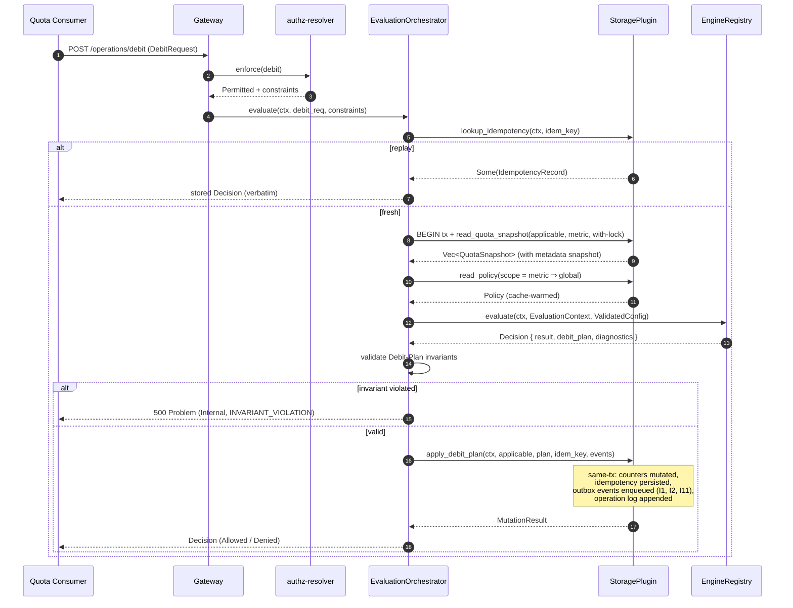

**Description.** The hot path. Subject resolution, applicable-Quotas fetch, Policy lookup, Engine evaluate, Debit-Plan
invariant check, and counter mutation all happen within a single backend transaction. The PDP call is the only network
I/O outside the transaction (two-phase PDP / transaction discipline). EvaluationContext metadata is captured at the
locked-read step (`cpt-cf-quota-enforcement-adr-metadata-snapshot-timing`) and is replay-safe because subsequent
operations on the same idempotency key short-circuit to the stored `decision_blob` (satisfies the idempotency-replay
rule of `cpt-cf-quota-enforcement-fr-idempotency` by never re-invoking the Engine on replay).

#### Credit

**ID**: `cpt-cf-quota-enforcement-seq-credit`

**FR**: `cpt-cf-quota-enforcement-fr-credit`

**Actors**: `cpt-cf-quota-enforcement-actor-quota-manager`

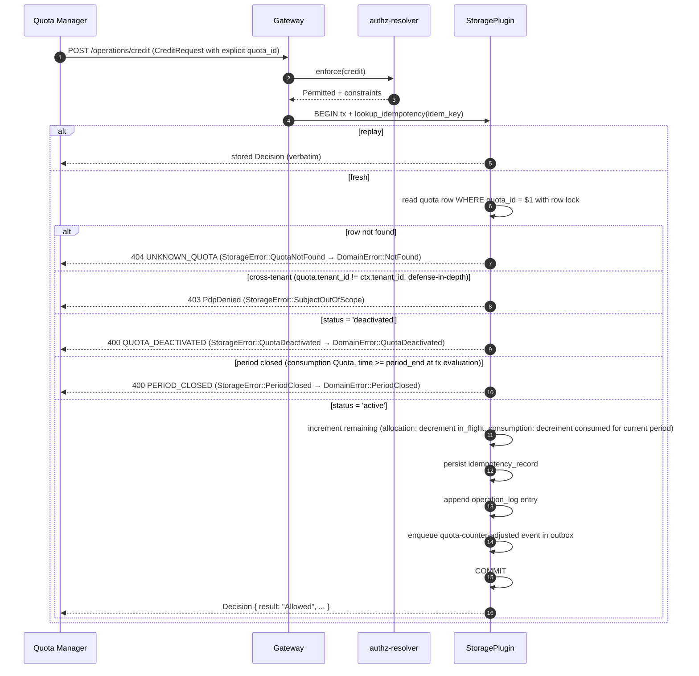

**Description.** Single-Quota counter increment scoped to the Quota Manager actor
(`cpt-cf-quota-enforcement-fr-credit`). Credit takes an **explicit `quota_id`** — there is no subject resolution and no
Engine invocation (per `cpt-cf-quota-enforcement-fr-credit`). Four rejection arms fire **before any mutation**, all
inside the transaction with a row-locked read so the check and the mutation share atomic semantics:

1. **Unknown quota.** `quota_id` does not exist → `StorageError::QuotaNotFound` →
   `DomainError::NotFound { kind: "quota", id }` → 404.
1. **Cross-tenant quota.** Row exists but `quota.tenant_id ≠ ctx.tenant_id` (the PDP layer should already have caught
   this; storage check is defense-in-depth per `cpt-cf-quota-enforcement-nfr-tenant-isolation-integrity`) →
   `StorageError::SubjectOutOfScope` → `DomainError::PdpDenied` → 403.
1. **Deactivated quota.** Row exists, tenant scope matches, but `status = 'deactivated'` →
   `StorageError::QuotaDeactivated` → `DomainError::QuotaDeactivated { id }` → 400 (per the §3.3 mapping table:
   `FailedPrecondition`; PRD §5.5 deactivated Quotas accept no new mutation).
1. **Period closed (consumption Quotas only).** Row is active but the consumption Quota's calendar window has elapsed
   (`time >= period_end` at the moment the transaction is evaluated, per PRD §5.5 calendar-keyed credit closure) →
   `StorageError::PeriodClosed` → `DomainError::PeriodClosed` → 400 (`FailedPrecondition` per §3.3). Closure is keyed on
   calendar time, not on `period-rollover` event emission — credit is rejected immediately at the calendar boundary even
   while the settlement window is still draining cross-period lease commits into the closing period's counter (rollback
   closure is intentionally asymmetric, settlement-keyed per `cpt-cf-quota-enforcement-fr-rollback`). Allocation Quotas
   have no period and are unaffected by this arm.

The `quota-counter-adjusted` notification event is emitted exclusively for credits (PRD §5.15 event catalogue); rollback
uses the dedicated `quota-rollback-applied` event surfaced from the rollback flow. Same-tx outbox enqueue (I11)
guarantees event delivery regardless of dispatcher liveness.

#### Rollback

**ID**: `cpt-cf-quota-enforcement-seq-rollback`

**FR**: `cpt-cf-quota-enforcement-fr-rollback`

**Actors**: `cpt-cf-quota-enforcement-actor-quota-consumer`

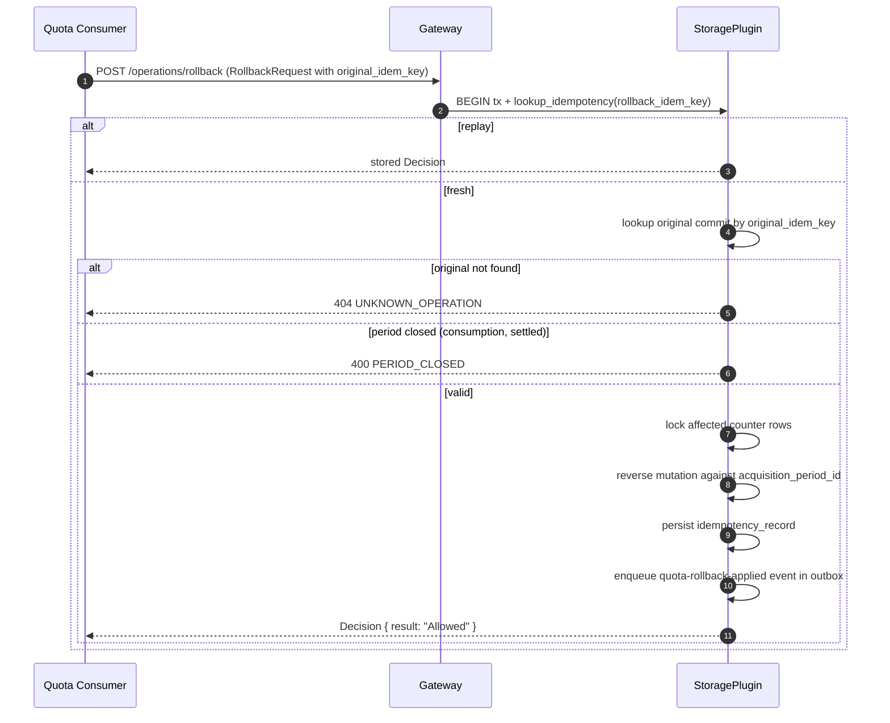

**Description.** Reversal of a previously committed debit (or lease-commit-derived debit;
`cpt-cf-quota-enforcement-fr-rollback`). Period attribution is taken from the original operation's
`acquisition_period_id`, not the wall-clock current period (I5). Backdated rollbacks against a settled period
(post-`period-rollover` emit) are rejected with `PERIOD_CLOSED` (PRD §5.5 cross-period rules). Rollback is idempotent
under its own `idem_key`; replay returns the stored Decision verbatim.

#### Lease Acquisition

**ID**: `cpt-cf-quota-enforcement-seq-lease-acquire`

**Use cases**: `cpt-cf-quota-enforcement-usecase-reserve-and-commit`

**Actors**: `cpt-cf-quota-enforcement-actor-quota-consumer`

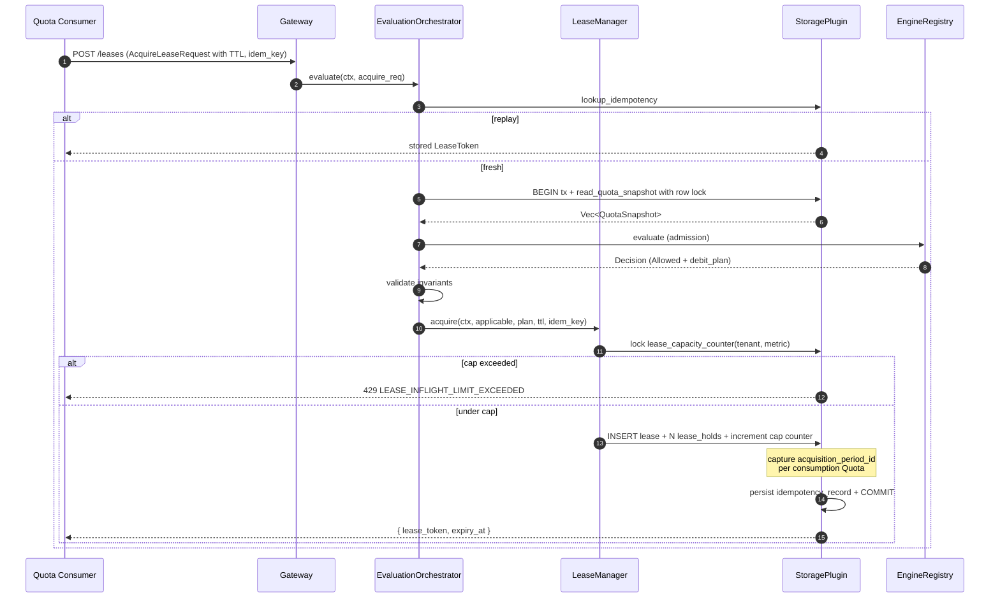

**Description.** Atomic multi-Quota acquisition (`cpt-cf-quota-enforcement-fr-lease-acquire`). The active-lease cap
(default 1000 per `(tenant, metric)`, PRD §5.6) is enforced atomically same-tx with the lease insert (I7); over-cap
requests are rejected without holding any Quota. `acquisition_period_id` is captured at this step for every consumption
Quota in the plan, locking in the period attribution for the lease's lifetime regardless of when commit / release
actually fires (I5).

#### Lease Commit (with cross-period boundary)

**ID**: `cpt-cf-quota-enforcement-seq-lease-commit`

**Use cases**: `cpt-cf-quota-enforcement-usecase-reserve-and-commit`

**Actors**: `cpt-cf-quota-enforcement-actor-quota-consumer`

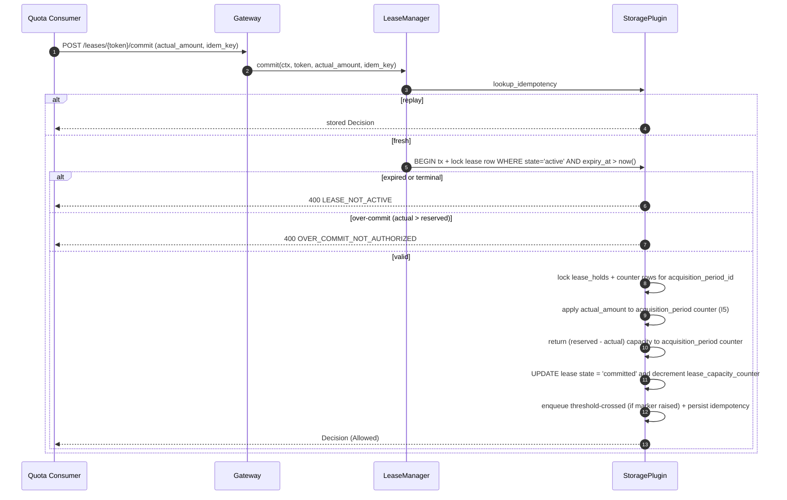

**Description.** Lease commit with the cross-period invariant front and centre: counter mutation lands on the
`acquisition_period_id`'s counter row even when wall-clock time is already in a subsequent period
(`cpt-cf-quota-enforcement-fr-lease-commit` cross-period section). The lazy-expiry guard (`expiry_at > now()` in the
WHERE clause, I4) means commit on an expired lease is rejected without depending on sweeper liveness. Over-commit
(`actual > reserved`) is rejected unconditionally (no clamping in P1 per `enforcement_mode = hard`).

#### Lease Release

**ID**: `cpt-cf-quota-enforcement-seq-lease-release`

**Use cases**: `cpt-cf-quota-enforcement-usecase-reserve-and-commit`

**Actors**: `cpt-cf-quota-enforcement-actor-quota-consumer`

Symmetric inverse of commit: full `held_amount` returned to acquisition-period counters, lease state → `Released`,
capacity counter decremented, idempotent under `idem_key`. Sequence shape identical to
`cpt-cf-quota-enforcement-seq-lease-commit` save for the counter direction; not separately diagrammed.

#### Lease TTL Auto-Release (sweeper)

**ID**: `cpt-cf-quota-enforcement-seq-lease-auto-release`

**Use cases**: `cpt-cf-quota-enforcement-usecase-reserve-and-commit` (alternative flow: TTL expired before commit)

**Actors**: implicit — `LeaseSweeper` background task with `system:quota-enforcement-sweeper` identity.

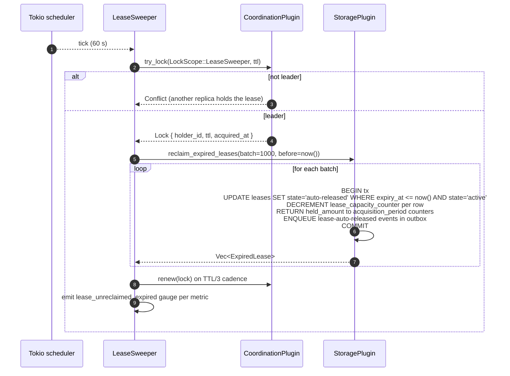

**Description.** The physical reclamation tier of `cpt-cf-quota-enforcement-fr-lease-timeout`. Lazy semantic release
(I4) means correctness does not depend on this sweeper running on schedule — even if the sweeper is paused for hours,
evaluation paths treat expired leases as released. The sweeper exists to (a) reclaim physical rows and (b) emit
`lease-auto-released` events as the canonical emission point. Single-leader execution via
`CoordinationPluginV1::try_lock(LockScope::LeaseSweeper, ttl)` with TTL-renew on TTL/3 and follower-mode fallback on
lock loss; the coordination backend is plugin-internal.

#### Batch Debit

**ID**: `cpt-cf-quota-enforcement-seq-batch-debit`

**Use cases**: `cpt-cf-quota-enforcement-usecase-batch-debit`

**Actors**: `cpt-cf-quota-enforcement-actor-quota-consumer`

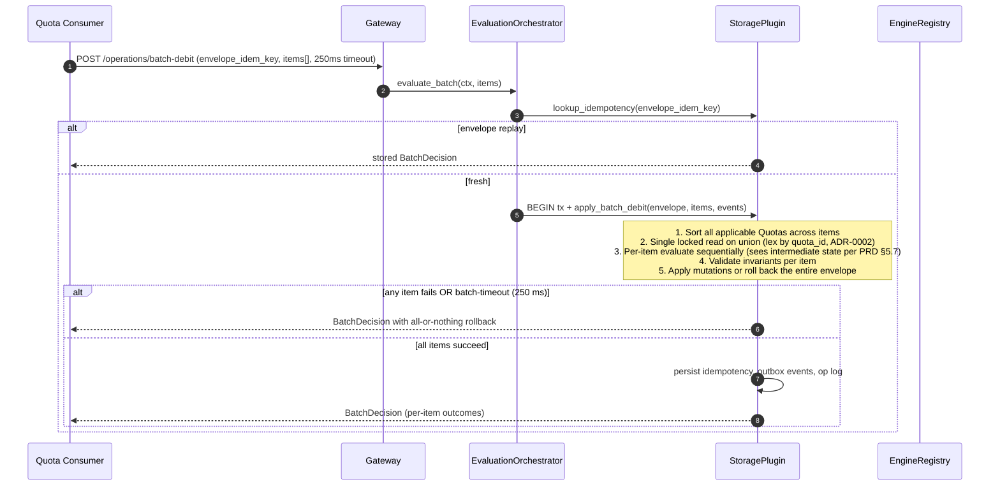

**Description.** Atomic envelope batch (`cpt-cf-quota-enforcement-fr-batch-debit`). The union of applicable Quotas
across all items is locked once up front in lexicographic `quota_id` order
(`cpt-cf-quota-enforcement-adr-acquisition-ordering`); per-item evaluation then proceeds sequentially within the held
lock set. Per-item outcomes are visible to later items (PRD §5.7 normative). Envelope failure (any item denied /
errored, or the 250 ms batch-level tokio timeout) rolls back the entire transaction.

#### Evaluate Preview (read-only)

**ID**: `cpt-cf-quota-enforcement-seq-evaluate-preview`

**FR**: `cpt-cf-quota-enforcement-fr-evaluate-preview`

**Actors**: `cpt-cf-quota-enforcement-actor-quota-consumer`, `cpt-cf-quota-enforcement-actor-quota-manager`,
`cpt-cf-quota-enforcement-actor-quota-reader`

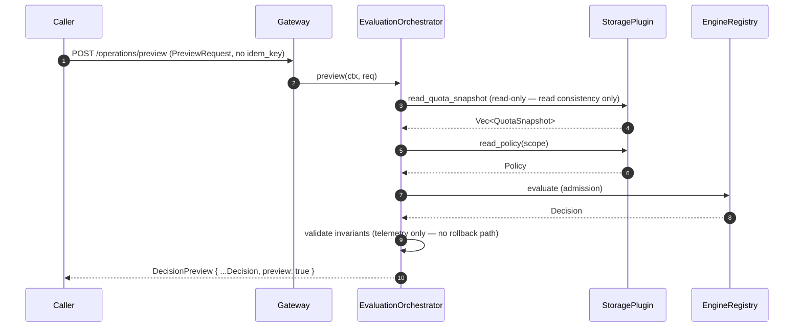

**Description.** Read-only counterpart of debit (`cpt-cf-quota-enforcement-fr-evaluate-preview`). No idempotency, no row
mutation, no outbox enqueue, no operation-log entry, no holding of capacity (I3). Verdict can be invalidated by
concurrent debits between the preview and a follow-up real debit; the response carries `preview: true` so callers cannot
conflate it with an admission. PDP scoping and tenant isolation apply identically to debit.

#### End-User Self-Service Snapshot

**ID**: `cpt-cf-quota-enforcement-seq-end-user-snapshot`

**Use cases**: `cpt-cf-quota-enforcement-usecase-end-user-quota-snapshot-read`

**FR**: `cpt-cf-quota-enforcement-fr-end-user-quota-snapshot-read`

**Actors**: `cpt-cf-quota-enforcement-actor-quota-manager` (acting on behalf of an end user; forwards the original
end-user `SecurityContext` rather than substituting the QM service-account identity).

The end-user self-service flow is the same `POST /v1/quota-enforcement/snapshot` endpoint as the operator-side snapshot
— there is no separate REST path. Quota Manager invokes it on behalf of the end user with the forwarded end-user
`SecurityContext`, and two normative differences from the operator-side call apply, both enforced server-side:

1. **Applicable-subjects filter is fixed.** When the call is made under an end-user `SecurityContext` (as opposed to an
   operator/QM service-account context), PDP narrows the applicable-subjects set to exactly
   `{(tenant, ctx.tenant_id), (user, ctx.user_id)}`; any caller-supplied `subjects` filter that broadens this scope is
   rejected. This is the precondition for tenant-isolation integrity in the Quota Manager mediation pattern (PRD §5.10
   normative): every Quota applicable to that `(user, tenant)` pair is returned, and **only** Quotas applicable to that
   pair.
1. **No Policy attribution in the response.** Unlike `evaluate_preview`, the response shape carries no `policy_id` /
   `policy_version` / Engine diagnostics. End-user surfaces consume per-Quota state (`cap`, `consumed`, `remaining`,
   period boundary, validity window, metadata) without exposing arbitration internals.

The gateway and storage pipeline are otherwise identical to the operator-side call. PDP scoping is applied against the
forwarded end-user identity (Quota Manager **MUST** propagate the original caller's identity). The end-user
authentication and rate-limit story belongs to Quota Manager — not to QE.

#### Quota Create

**ID**: `cpt-cf-quota-enforcement-seq-quota-create`

**Use cases**: `cpt-cf-quota-enforcement-usecase-create-quota`

**FR**: `cpt-cf-quota-enforcement-fr-quota-lifecycle`, `cpt-cf-quota-enforcement-fr-metric-identity-validation`

**Actors**: `cpt-cf-quota-enforcement-actor-platform-operator`, `cpt-cf-quota-enforcement-actor-quota-manager`

```mermaid
sequenceDiagram
    autonumber
    participant Op as Operator / QM
    participant GW as Gateway
    participant QMS as QuotaManagementService
    participant TR as types-registry<br/>(via TypesRegistryClient)
    participant SP as StoragePlugin

    Op ->> GW: POST /quotas (QuotaDraft)
    GW ->> QMS: create(ctx, draft)
    QMS ->> QMS: validate (cap ≥ 0, thresholds-require-bounded-cap, type/period combinatorics, source enum)
    QMS ->> TR: lookup metric_name (in-process LRU cache inside QMS)
    alt unknown metric
        TR -->> Op: 400 METRIC_NOT_REGISTERED
    else metric is registered (QuotaGated or Direct)
        QMS ->> SP: BEGIN tx + create_quota(ctx, quota)
        Note over SP: 1. INSERT into `quotas` (server-assigned UUIDv7 quota_id, status='active')<br/>2. INSERT corresponding counter row(s) — `quota_allocation_counters` for allocation type, lazy `quota_consumption_counters` row created on first evaluate for consumption<br/>3. Enqueue quota-changed (change_kind='created') in outbox<br/>4. Append operation_log entry<br/>5. COMMIT
        SP -->> QMS: QuotaId
        QMS -->> Op: 201 + Quota body
        opt metric mode is Direct
            Note over QMS: Quota is inert until the metric flips to QuotaGated (PRD §3.2);<br/>active inert Quotas are surfaced via the quota_for_direct_metric_total gauge.
        end
    end
```

**Description.** Quota creation (`cpt-cf-quota-enforcement-fr-quota-lifecycle`). `QuotaManagementService` validates the
draft against PRD §5.2 rules (cap non-negative, thresholds-require-bounded-cap, type/period exclusivity, source enum
membership), then calls `TypesRegistryClient` (platform `types-registry-sdk`, ClientHub-mediated) to confirm the metric
is **registered** (`cpt-cf-quota-enforcement-fr-metric-identity-validation`); the in-process LRU cache and fail-closed
mapping for the registry-unavailable case live inside `QuotaManagementService`. Unknown metric → `MetricNotRegistered`
(400). Metric mode (`QuotaGated` / `Direct`) is **not** a create-time rejection criterion — per PRD §3.2 a Quota MAY be
created on a `Direct` metric (forward-compat for `Direct → QuotaGated` flip); such a Quota is inert until the metric
flips and is surfaced through the `quota_for_direct_metric_total` gauge. Admission-time rejection of writes / previews
against `Direct`-metric Quotas (`MetricNotQuotaGated`) happens on the debit / credit / rollback / reserve / commit /
release / batch-debit / evaluate-preview paths, not here. Validation runs **outside** the transaction so the database
lock is held for the minimum window. The storage primitive inserts the Quota row, materialises the allocation counter
(consumption counter rows are created lazily on first evaluate per `cpt-cf-quota-enforcement-fr-period-rollover`), and
enqueues the `quota-changed (created)` event same-tx (I11). Operator-side rejection of cap reduction below current
consumed (`CAP_BELOW_CONSUMED`) is a separate update path and is covered by I6.

#### Quota Deactivation Cascade

**ID**: `cpt-cf-quota-enforcement-seq-quota-deactivate-cascade`

**FR**: `cpt-cf-quota-enforcement-fr-quota-lifecycle`

**Actors**: `cpt-cf-quota-enforcement-actor-platform-operator`, `cpt-cf-quota-enforcement-actor-quota-manager`

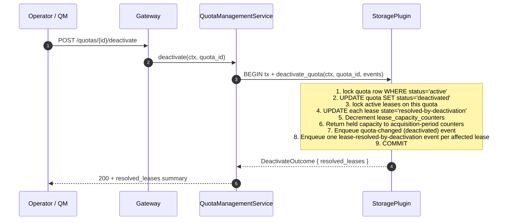

**Description.** Atomic deactivation cascade (per `cpt-cf-quota-enforcement-fr-quota-lifecycle` deactivation rule).
Deactivation never partially completes — either every active lease for the Quota is resolved or none is. The storage
primitive returns the affected lease references so the gateway can attribute telemetry, and one outbox event is emitted
per affected lease (same-tx I11) for downstream sinks. Subsequent commits / releases against any of these resolved
leases return `LEASE_NOT_ACTIVE` (the deactivation timestamp serves as the implicit lease-resolve event).

#### Period Rollover (lazy detection)

**ID**: `cpt-cf-quota-enforcement-seq-period-rollover`

**Use cases**: implicit; triggered by debit / lease-commit / lease-release whose evaluate crosses a period boundary.

**Actors**: any `cpt-cf-quota-enforcement-actor-quota-consumer` triggers; sweeper as fallback.

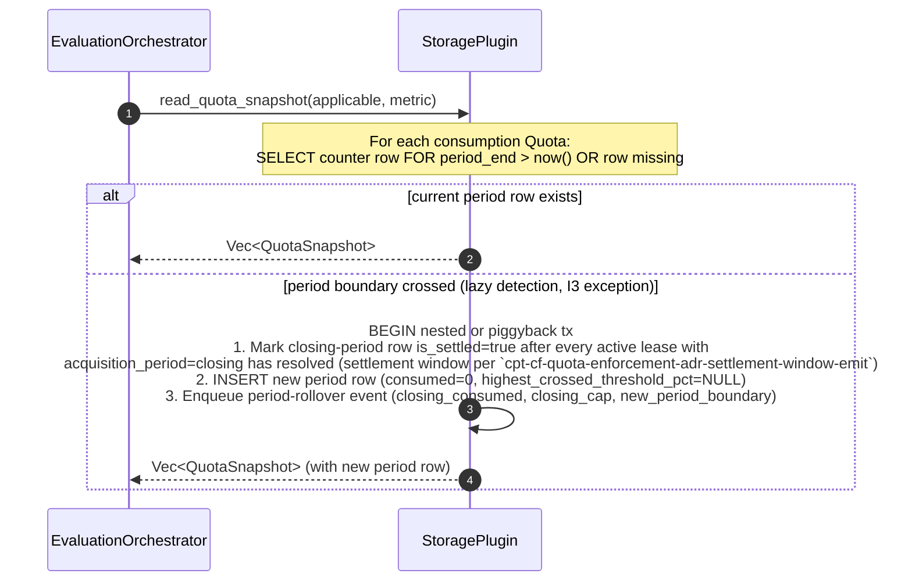

**Description.** Lazy period detection (`cpt-cf-quota-enforcement-fr-period-rollover`). On any evaluate that observes
`now() >= period_end` for a consumption Quota, the storage plugin atomically materialises the new period row, emits the
`period-rollover` event for the closing period, and resets the threshold marker. The new `quota_consumption_counters`
row MUST carry `highest_crossed_threshold_pct = NULL` per storage-plugin invariant **I13** (PRD §5.15: "the marker
resets at period rollover so thresholds can fire again in the new period"; threshold-emission rule of
`cpt-cf-quota-enforcement-fr-notification-plugin`). During the settlement window (between `period_end` and the moment
all active leases acquired in the closing period have resolved), cross-period commits/releases mutate the closing-period
counter and emit no `quota-counter-adjusted` or `threshold-crossed` events
(`cpt-cf-quota-enforcement-adr-settlement-window-emit`).

A known P1 limitation: for Quotas with no operations in the new period, the `period-rollover` event for the closing
period does not fire until the next operation arrives. P2 introduces an active rollover scheduler for batched event
emission and silent- Quota coverage.

#### Notification Outbox Dispatch

**ID**: `cpt-cf-quota-enforcement-seq-notification-dispatch`

**Use cases**: implicit; consumes events enqueued by every mutating sequence above.

**Actors**: `cpt-cf-quota-enforcement-actor-notification-sink` (consumer side); dispatcher runs with
`system:quota-enforcement-dispatcher` identity.

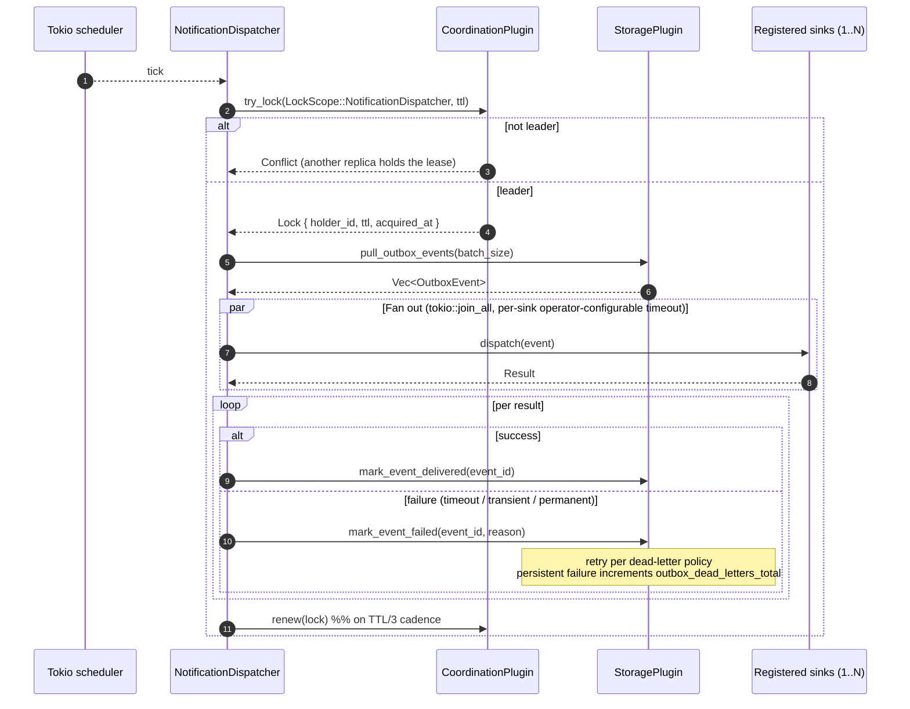

**Description.** Notification dispatcher consumes the same-tx-enqueued outbox queue and fans every event out to all
registered `QuotaNotificationSinkV1` implementations. Per-sink failure isolation (one failed sink does not affect
others) plus dead-letter accumulation Sustained failures surface via `outbox_dead_letters_total` for operator alerting;
counter mutation is unaffected (PRD §5.15 best-effort delivery normative).

#### Idempotency Replay (cross-cutting)

**ID**: `cpt-cf-quota-enforcement-seq-idempotency-replay`

Idempotency lookup is the first storage call in every mutating sequence above. Behaviour:

- **Cache hit, payload hash match** → return stored `decision_blob` verbatim. Engine is **not** re-invoked (satisfies
  the idempotency-replay rule of `cpt-cf-quota-enforcement-fr-idempotency` for time-gated CEL — `time` binding stays
  captured, never re-bound on replay).
- **Cache hit, payload hash mismatch** → return `IdempotencyPayloadMismatch` (409).
- **Cache miss** → proceed with full evaluation pipeline; persist record same-tx with the mutation (I1, I2).

The `decision_blob` is JSON-typed and schema-versioned (top-level `__version`); additive shape changes in P2/P3 do not
require migration of existing blobs.

#### Policy Versioning Update

**ID**: `cpt-cf-quota-enforcement-seq-policy-version-update`

**Use cases**: `cpt-cf-quota-enforcement-usecase-configure-policy`

**Actors**: `cpt-cf-quota-enforcement-actor-platform-operator`

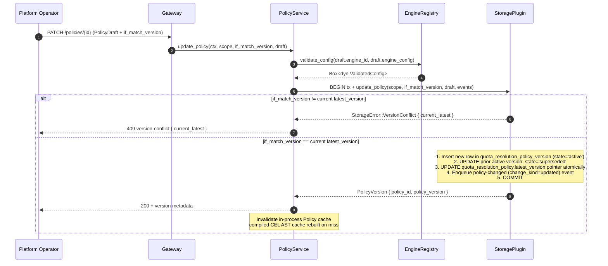

**Description.** Update creates a new immutable version row and atomically updates the explicit `latest_version` pointer
(`cpt-cf-quota-enforcement-fr-quota-resolution-policy-versioning`). Engine `validate_config` runs before the database
transaction, so invalid configs fail fast without holding a lock. Compiled CEL AST is cached by
`(policy_id, policy_version)`; on cache miss after a version change, the orchestrator rebuilds from `engine_config`
JSON.

**Policy DELETE response shape.** `DELETE /v1/quota-enforcement/policies/{id}` returns **204 No Content** on success —
consistent with the platform DELETE convention (precedent: `resource-group` types-registry
`cpt-cf-resource-group-...delete-type`, `account-management` tenant-metadata DELETE). The operation is idempotent per
`cpt-cf-quota-enforcement-fr-quota-resolution-policy-versioning` ("A subsequent `delete_policy` against an
already-deleted `policy_id` is a no-op"): repeat DELETE against the same `policy_id` after a successful soft-delete also
returns 204; the second call performs no state change and emits no second `policy-changed (deleted)` event. **404** is
returned only when `policy_id` was never created — distinct from the deleted-then-replayed case to avoid masking
misconfigured clients. Attempting DELETE against the seeded `global` Policy surfaces a canonical `FailedPrecondition`
error (HTTP 400, `reason = "CANNOT_DELETE_SEEDED_GLOBAL_POLICY"`) per the §3.3 mapping table.

**Policy CREATE / UPDATE / ROLLBACK response shape.** `POST /policies` returns **201 Created** with the new
`PolicyVersion` body; `PATCH /policies/{id}` and `POST /policies/{id}/rollback` return **200 OK** with the new
`PolicyVersion` body (both produce a new immutable version row whose metadata the caller needs).

### 3.7 Database schemas & tables

- [ ] `p1` - **ID**: `cpt-cf-quota-enforcement-db-schema`

> **Scope discipline.** Concrete table layouts (column types, primary keys, indexes, constraints, partitioning rules,
> isolation level, lock-timeout configuration) are **plugin-internal** and live in the storage-plugin DESIGN document.
> The list below is the contract-level table inventory: which logical entities the storage plugin must persist, what
> foreign-key invariants hold across them, and the retention boundaries. The P1 storage-plugin realisation — schema DDL,
> migrations, indexes — is authored in the storage-plugin DESIGN doc once authored (precedent: a sibling module
> pattern).

#### Table inventory

QE-core requires the storage plugin to persist the following entities. Names below are the canonical logical names; the
plugin chooses physical layout.

| Logical table                     | Purpose                                                                                                                                                                                               | Retention                                                                                                                                                  |
| --------------------------------- | ----------------------------------------------------------------------------------------------------------------------------------------------------------------------------------------------------- | ---------------------------------------------------------------------------------------------------------------------------------------------------------- |
| `quotas`                          | Quota records (declarative caps)                                                                                                                                                                      | Indefinite for active; deactivated retained until P2 audit-aware purge (`cpt-cf-quota-enforcement-fr-quota-lifecycle`)                                     |
| `quota_allocation_counters`       | Per-Quota in-flight counter (allocation type)                                                                                                                                                         | Co-terminus with the Quota                                                                                                                                 |
| `quota_consumption_counters`      | Per-(Quota, period) consumed counter; carries `highest_crossed_threshold_pct`                                                                                                                         | Active period + operator-configurable historical window (default 13 months); reclaimed via partition drop                                                  |
| `leases`                          | Lease rows with state, expiry, acquisition_period_id                                                                                                                                                  | Active until terminal; retained as ledger entries within operation-log retention                                                                           |
| `lease_holds`                     | Per-Quota lease hold rows                                                                                                                                                                             | Co-terminus with the lease row                                                                                                                             |
| `lease_capacity_counters`         | Per-(tenant, metric) active-lease counter                                                                                                                                                             | Co-terminus with QE deployment                                                                                                                             |
| `quota_resolution_policy`         | Policy entity + `latest_version` pointer                                                                                                                                                              | Indefinite (seeded `global` cannot be deleted)                                                                                                             |
| `quota_resolution_policy_version` | Immutable version rows (`active` / `superseded` / `rolled_back` / `deleted` per PRD §5.9 four-state enum)                                                                                             | Operator-configured retention (default 90 days for `superseded` / `rolled_back` / `deleted` terminals); seeded `global` Policy versions kept indefinitely. |
| `idempotency_records`             | Replay-safety records keyed by `(tenant_id, subject_type, subject_id, operation_type, idem_key)` per `cpt-cf-quota-enforcement-fr-idempotency`                                                               | Operator-configurable per-`(tenant, metric)` (default 24 h); reclaimed by `RetentionSweeper`                                                               |
| `operation_log`                   | Operation ledger (P1; audit-grade attribution deferred to P2)                                                                                                                                         | Operator-configurable (default 30 days); partitioned by date for `DROP PARTITION` retention                                                                |
| `notification_outbox`             | Same-tx event queue (modkit-db Outbox)                                                                                                                                                                | Co-terminus with successful delivery; dead-letter rows retained per operator config                                                                        |
| `contention_timeout_config`       | Per-metric contention timeout configuration                                                                                                                                                           | Indefinite                                                                                                                                                 |
| `lease_capacity_config`           | Per-`(tenant, metric)` active-lease cap overrides; `tenant_id IS NULL` and `metric IS NULL` row = platform default (1000 per PRD §5.6 / `cpt-cf-quota-enforcement-fr-lease-timeout`); enforced by I7. | Indefinite                                                                                                                                                 |
| `idempotency_retention_config`    | Per-`(tenant, metric)` idempotency retention overrides                                                                                                                                                | Indefinite                                                                                                                                                 |

**Cross-table invariants** (enforced by the storage plugin under I1):

- Every `lease_holds.lease_id` references an existing `leases.lease_id` (FK, ON DELETE CASCADE).
- Every `lease_holds.quota_id` references an existing `quotas.quota_id` (FK, ON DELETE RESTRICT — Quota cannot be
  hard-deleted while leases hold it).
- Every `lease_holds.period_id` (consumption Quotas) references the lease's `acquisition_period_id` on a
  `quota_consumption_counters` row.
- `quota_resolution_policy.latest_version` always references an existing version row.
- Outbox events for a mutation are inserted in the same transaction as the mutation; no partial enqueue is observable.
- Idempotency record `payload_hash` is the canonical SHA-256 of the sorted-JSON payload ; the plugin stores it as
  fixed-width binary for index efficiency.

#### Bootstrap seeded state

`bootstrap()` is responsible (idempotently) for:

1. Verifying schema is at the trait's major version (returns `SchemaVersionMismatch` otherwise).
1. Seeding the `global` Quota Resolution Policy with the `most-restrictive-wins` Engine if it does not exist (cannot be
   deleted thereafter per `cpt-cf-quota-enforcement-fr-quota-resolution-policy`).
1. Loading the embedded subject type GTS instances (`tenant`, `user`) into types-registry — via `TypesRegistryClient`
   (platform `types-registry-sdk`, ClientHub-mediated) — if not already present, and asserting the bidirectional
   correspondence between the Rust `SubjectTypeResolver` impls compiled into the QE binary and the GTS instances under
   `gts://gts.x.qe.subject-type.v1~` (every resolver matches an instance and vice-versa); a mismatch fails bootstrap.
1. Seeding default rows for `contention_timeout_config(metric=NULL, timeout_ms=0)`,
   `lease_capacity_config(tenant_id=NULL, metric=NULL, max_active_leases=1000)`, and
   `idempotency_retention_config(tenant=NULL, metric=NULL, retention_seconds=86400)` when missing.
1. Verifying `CoordinationPluginV1` reachability — a single `try_lock` + `release` roundtrip on a probe key for each
   `LockScope::*` value to validate the coordination backend; failure aborts bootstrap fail-fast.

### 3.8 Deployment Topology

- [ ] `p1` - **ID**: `cpt-cf-quota-enforcement-topology`

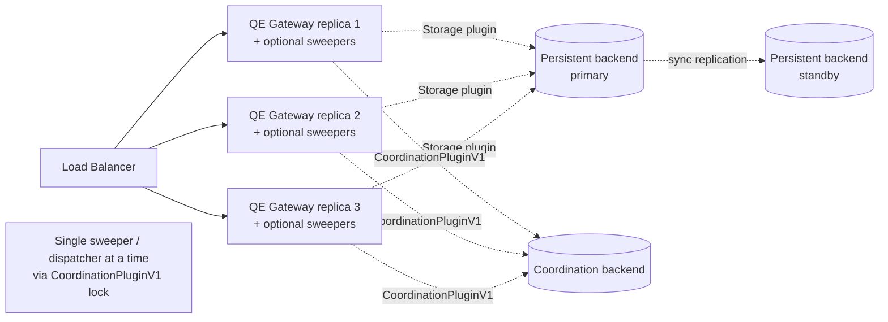

**P1 deployment shape.**

- **Single region.** Multi-region is out of P1 scope; the platform's standard region-pair active-passive pattern applies
  and `cpt-cf-quota-enforcement-nfr-fault-tolerance` (RPO=0) is delivered by the storage plugin's durable-commit
  guarantee (concrete realization is plugin-internal).
- **Stateless gateway.** Multi-replica behind a platform load balancer; rolling-update safe. Realises
  `cpt-cf-quota-enforcement-nfr-availability` (99.95 %).
- **Sweeper coordination.** `LeaseSweeper`, `RetentionSweeper`, and `NotificationDispatcher` each acquire a distinct
  TTL-bounded lock via `CoordinationPluginV1::try_lock(LockScope::*, ttl)` at startup. The replica that wins the lock
  runs the background loop; others remain in follower mode and serve only request traffic. Holders renew at TTL/3; on
  lock loss (renew failure) they drop to follower mode and re-acquire through jittered backoff. RTO ≤ 15 min per
  `cpt-cf-quota-enforcement-nfr-recovery` is bounded by the lock TTL. The coordination backend is pluggable
  independently of the storage backend; the realisation is plugin-internal.
- **Bundling.** Sweepers + dispatcher run in the same binary as the gateway by default (single deployment artefact).
  Operators MAY split them into a dedicated binary by feature-flag if their workload warrants — e.g., a sweeper-only
  replica with reduced HTTP concurrency. The `CoordinationPluginV1` lock semantics work identically across both layouts.
- **Connection pooling.** Provided by the storage plugin; sized to satisfy `cpt-cf-quota-enforcement-nfr-throughput` (≥
  10 K ops/s). Concrete pooler choice is plugin-internal.
- **Schema migration.** Operator-runnable; the storage plugin's `bootstrap()` rejects mismatched schema versions before
  serving traffic (I12). Migration tooling itself is plugin-internal.

## 4. Additional context

### 4.1 Telemetry surface

The complete QE-specific metric catalogue exposed alongside the framework baseline
(`cpt-cf-quota-enforcement-fr-telemetry`):

| Metric                                     | Type      | Labels                   | Notes                                                                                                                                                                                                                       |
| ------------------------------------------ | --------- | ------------------------ | --------------------------------------------------------------------------------------------------------------------------------------------------------------------------------------------------------------------------- |
| `denial_total`                             | Counter   | `metric`, `reason`       | Closed `reason` enum (`cpt-cf-quota-enforcement-constraint-bounded-cardinality`)                                                                                                                                            |
| `lease_contention_rejected_total`          | Counter   | `metric`                 | Increments on `LEASE_CONTENTION_TIMEOUT` (I8)                                                                                                                                                                               |
| `lease_acquisition_wait_seconds`           | Histogram | `metric`                 | Wait time during lease acquisition (successful or rejected); buckets sized for the SLO of `cpt-cf-quota-enforcement-nfr-evaluation-latency` (p95 ≤ 100 ms) — exact bucket configuration is operator-tunable per deployment. |
| `lease_inflight_limit_exceeded_total`      | Counter   | `metric`                 | Per-(tenant, metric) cap (I7)                                                                                                                                                                                               |
| `lease_unreclaimed_expired`                | Gauge     | `metric`                 | Sweeper visibility                                                                                                                                                                                                          |
| `engine_bootstrap_failures_total`          | Counter   | `engine_id`              | Module-bootstrap fail-fast                                                                                                                                                                                                  |
| `engine_evaluation_seconds`                | Histogram | `engine_id`              | Engine `evaluate()` latency; bucket sizing aligns with the per-Policy timeout (default 5 ms) — exact bucket configuration is operator-tunable.                                                                              |
| `debit_plan_invariant_violations_total`    | Counter   | `engine_id`, `invariant` | `invariant` ∈ closed set of 4 (PRD §5.16)                                                                                                                                                                                   |
| `quota_cap_zero_total`                     | Gauge     | —                        | Active `cap = 0` Quotas (config drift surface)                                                                                                                                                                              |
| `quota_cap_unbounded_total`                | Gauge     | —                        | Active `cap = null` Quotas                                                                                                                                                                                                  |
| `quota_for_direct_metric_total`            | Gauge     | —                        | Quotas declared on non-gated metrics (PRD §3.2 inertness signal)                                                                                                                                                            |
| `notification_dispatch_failures_total`     | Counter   | `sink_id`, `event_kind`  | Per-sink dispatch failures (PRD §5.15 best-effort delivery)                                                                                                                                                                 |
| `outbox_pending_rows`                      | Gauge     | `queue`                  | Outbox backlog visibility                                                                                                                                                                                                   |
| `outbox_dead_letters_total`                | Counter   | `queue`                  | Sustained delivery-failure surface                                                                                                                                                                                          |
| `policy_version_transitions_total`         | Counter   | `transition_kind`        | `{create, update, rollback, delete}`                                                                                                                                                                                        |
| `policy_version_conflict_rejections_total` | Counter   | —                        | Policy versioning concurrency rejections                                                                                                                                                                                    |

Label cardinality is bounded at compile time (`cpt-cf-quota-enforcement-constraint-bounded-cardinality`);
high-cardinality identifiers (`tenant_id`, `subject_id`, `quota_id`, `policy_id`, `idempotency_key`, `lease_token`)
appear only on traces and structured log fields, never on metric labels.

**Tracing.** OpenTelemetry traces propagate from the `qe.gateway.handle_request` root. Stage spans:
`subject_resolution`, `applicable_quotas_fetch`, `policy_lookup`, `engine_evaluate`, `invariant_check`,
`storage.apply_debit_plan`, `notification.enqueue`. Attribute keys: `qe.tenant_id`, `qe.metric`, `qe.engine_id`,
`qe.policy_id`, `qe.policy_version`, `qe.result`.

**Structured logging.** Tracing crate. The system never logs metric values, metadata content, or subject identifiers
verbatim at INFO level.

### 4.2 Capacity envelope

Estimated steady-state at the P1 NFR floor (`cpt-cf-quota-enforcement-nfr-throughput` ≥ 10 K ops/s,
`cpt-cf-quota-enforcement-nfr-subject-scale` ≥ 100 M subjects, `cpt-cf-quota-enforcement-nfr-quota-density` ≥ 1 B
Quotas):

| Data class                        | Estimate                              | Notes                                                                                                                   |
| --------------------------------- | ------------------------------------- | ----------------------------------------------------------------------------------------------------------------------- |
| `quotas`                          | ≈ 250 GB at 1 B rows × ~250 B         | Hot index on `(subject_type, subject_id, metric)` partial-where-active sized to fit the storage-plugin in-memory cache. |
| `quota_consumption_counters`      | ≈ 1.5 GB / month / metric at peak     | 13-month retention via partition drop.                                                                                  |
| `leases` (active + ledger window) | ≤ 1 GB                                | Ledger entries kept within operation-log retention.                                                                     |
| `idempotency_records`             | ≈ 432 GB at 24 h × 10 K ops/s × 500 B | **Significant** — operator may split to a dedicated storage tier.                                                       |
| `operation_log`                   | ≈ 1 TB at 30 days                     | **Significant** — partitioned by date; cold-tier migration to a longer-term store is a P2 candidate.                    |
| `notification_outbox`             | bounded by dispatch lag               | Operator alert on `outbox_pending_rows` > threshold.                                                                    |

Capacity / cost budgets at the deployment level are managed by SRE, not at the QE module level —
`cpt-cf-quota-enforcement-nfr-...` allocations identify the mechanism; absolute infrastructure sizing is governed in the
platform infrastructure repo. Capacity / cost budgets are managed at deployment level by SRE — `Not applicable` at QE
module level.

**Storage-plugin tuning** is plugin-internal (connection pooling, buffer sizing, replication knobs, vacuum strategy,
partitioning). QE-core's contract over the storage plugin is: hot-path admission stays within the SLO of
`cpt-cf-quota-enforcement-nfr-evaluation-latency`, throughput sustains `cpt-cf-quota-enforcement-nfr-throughput`, and
durability satisfies `cpt-cf-quota-enforcement-nfr-fault-tolerance` (RPO = 0).

**Performance verification.** A Criterion benchmark suite in `quota-enforcement/benches/` covers single-Quota debit @ 10
K ops/s, 10-Quota cascade @ 5 K ops/s, lease 3-phase cycle, and 100 M-subject load. CI gates p95 ≤ 100 ms before merge
(`cpt-cf-quota-enforcement-nfr-evaluation-latency`).

### 4.3 Future considerations

The following deferred work has explicit hooks in the P1 design; each entry names the hook so future authors can extend
additively without breaking existing callers.

| Topic                                                                            | Phase | Hook in P1 design                                                                                                                                                                                                                                                                                                                 |
| -------------------------------------------------------------------------------- | ----- | --------------------------------------------------------------------------------------------------------------------------------------------------------------------------------------------------------------------------------------------------------------------------------------------------------------------------------- |
| Sharded counters                                                                 | P2    | Counter tables additive `shard_id` column; acquisition ordering grows to `(quota_id, shard_id)`; queries aggregate via `SUM`.                                                                                                                                                                                                     |
| Bulk Quota CRUD endpoints                                                        | P2    | REST surface adds `/v1/quota-enforcement/quotas/bulk-*`; Storage plugin already exposes transactional batch primitives via `apply_batch_debit` precedent.                                                                                                                                                                         |
| Operator-facing Subject Type registration API                                    | P2    | GTS schema for `gts.x.qe.subject-type.v1~` is published in P1; P2 grows the schema additively (resolver palette or schema-embedded rule) and persists instances in DB instead of embedded JSON.                                                                                                                                   |
| Resource-group traversal subject types (`cost-center` etc.)                      | P3    | Adds a new variant to the resolution-rule discriminator or a new resolver template; existing P1/P2 instances stay valid.                                                                                                                                                                                                          |
| Rate Quota type (`Rate`)                                                         | P3    | `quota_type` enum reserves `Rate`; runtime currently rejects with the canonical `Unimplemented` error (reason `"NOT_YET_IMPLEMENTED"`) per `cpt-cf-quota-enforcement-fr-quota-type-rate-rejection`. Schema migration adds optional `rate_spec` JSON field at activation time per PRD §5.3 (zero-cost reservation in P1).          |
| Cap-clamp admission (`hard-with-clamp`)                                          | P3    | `EnforcementMode` is the closed enum of `cpt-cf-quota-enforcement-fr-enforcement-mode` and admits additive variants in P3; `Decision::AllowedWithClamp` is an additive arm.                                                                                                                                                       |
| EventBus integration replacing in-process notification dispatch                  | P2    | `QuotaNotificationSinkV1` trait remains; an `EventBus`-backed sink implementation plugs in alongside operator-supplied sinks (PRD §13 EventBus OQ).                                                                                                                                                                               |
| QM tenant-scoped subscription primitive                                          | P2    | P1: subscriber-side filtering on `event.tenant_id`. P2 introduces a QE-side primitive without breaking P1 sinks.                                                                                                                                                                                                                  |
| Active period-rollover scheduler (silent-Quota coverage)                         | P2    | P1 lazy detection has the known limitation that Quotas with no operations after a period boundary do not emit `period-rollover` until the next op. P2 adds a scheduled scan keyed off `period_end`.                                                                                                                               |
| Cold-tier migration of `operation_log` and `idempotency_records`                 | P2    | Both have partition-by-date layouts in the storage plugin; cold-tier migration is a standard data-platform extension point.                                                                                                                                                                                                       |
| Composable Policy patterns / Shadow evaluation / CEL-based notification policies | P2    | All sit on top of the existing Engine and Notification plugin contracts; each is a new Engine or new Policy semantic, not a contract change.                                                                                                                                                                                      |
| Quota Metadata GTS schema validation (per-tenant / per-metric)                   | P3    | Hooks in `cpt-cf-quota-enforcement-fr-quota-metadata`; depends on platform-wide GTS availability.                                                                                                                                                                                                                                 |
| Engine deprecation lifecycle                                                     | P2    | Kept open; relevant when additional Engine plugins (Wasm / Starlark / Lua) land in the deployment binary. P1 fail-fast on bootstrap-time registration failures (`cpt-cf-quota-enforcement-fr-quota-resolution-engine`) covers built-in Engine outages but not intentional removals — the latter await the P2 deprecation roadmap. |
| Audit-grade retention + audit infrastructure                                     | P2    | Operation-log retention covers the ledger; audit-grade attribution awaits the platform audit infra.                                                                                                                                                                                                                               |

### 4.4 Risks and mitigations

| Risk                                                                               | Mitigation                                                                                                                                                                                                                                                                                                 |
| ---------------------------------------------------------------------------------- | ---------------------------------------------------------------------------------------------------------------------------------------------------------------------------------------------------------------------------------------------------------------------------------------------------------- |
| Hot-key contention on a popular metric (single-row write hotspot per PRD §12 risk) | Per-metric acquisition contention timeout (`cpt-cf-quota-enforcement-fr-lease-acquire`, I8) makes contention behaviour observable and operator-tunable; `lease_contention_rejected_total` plus `lease_acquisition_wait_seconds` histogram drive operator action. Sharded counters are the P2 escape hatch. |
| Sweeper outage allowing lease rows to accumulate                                   | Lazy expiry (I4) preserves correctness regardless of sweeper liveness. The active-lease cap (I7) bounds row growth; `lease_unreclaimed_expired` gauge surfaces the backlog.                                                                                                                                |
| Notification delivery storms or sustained sink failure                             | Outbox-based delivery (I11) decouples mutation from dispatch. Per-sink failure isolation + dead-letter queue + `notification_dispatch_failures_total` per-`(sink_id, event_kind)` localise the operational impact.                                                                                         |
| Engine misconfiguration producing invalid Decision shapes                          | Strict-engine-boundary discipline at `EvaluationOrchestrator` (`cpt-cf-quota-enforcement-principle-strict-engine-boundary`) enforces the closed Debit-Plan invariant set; `debit_plan_invariant_violations_total` per-`(engine_id, invariant)` identifies the failing Engine.                              |
| PDP unavailability disabling all writes                                            | Fail-closed by design (`cpt-cf-quota-enforcement-principle-fail-closed`). In-process LRU cache keeps PDP under regular load and minimises hit-rate impact.                                                                                                                                                 |
| Idempotency storage size growth                                                    | Operator-configurable retention per `(tenant, metric)`; storage-plugin retention sweeper; partitioning; cold-tier P2 hook.                                                                                                                                                                                 |
| Cross-period commit / rollback ambiguity                                           | Period attribution at acquisition time (I5) is the load-bearing invariant; settlement-window emit policy (`cpt-cf-quota-enforcement-adr-settlement-window-emit`) closes the cross-period emit ambiguity.                                                                                                   |

## 5. Traceability

- **PRD**: [PRD.md](./PRD.md)
- **ADRs**: [ADR/](./ADR/) —
  [0001 Pluggable storage backend](./ADR/0001-cpt-cf-quota-enforcement-adr-storage-backend.md),
  [0002 Acquisition ordering](./ADR/0002-cpt-cf-quota-enforcement-adr-acquisition-ordering.md),
  [0003 Metadata snapshot timing](./ADR/0003-cpt-cf-quota-enforcement-adr-metadata-snapshot-timing.md),
  [0004 Settlement window emit](./ADR/0004-cpt-cf-quota-enforcement-adr-settlement-window-emit.md),
  [0005 Pluggable evaluation engine](./ADR/0005-cpt-cf-quota-enforcement-adr-evaluation-engine.md),
  [0006 Coordination plugin](./ADR/0006-cpt-cf-quota-enforcement-adr-coordination-plugin.md)
- **Storage plugin DESIGN**: authored separately by the plugin owner once the plugin crate is created
- **Features**: `features/` (per-feature implementation guides — to be authored as P1 development progresses)
